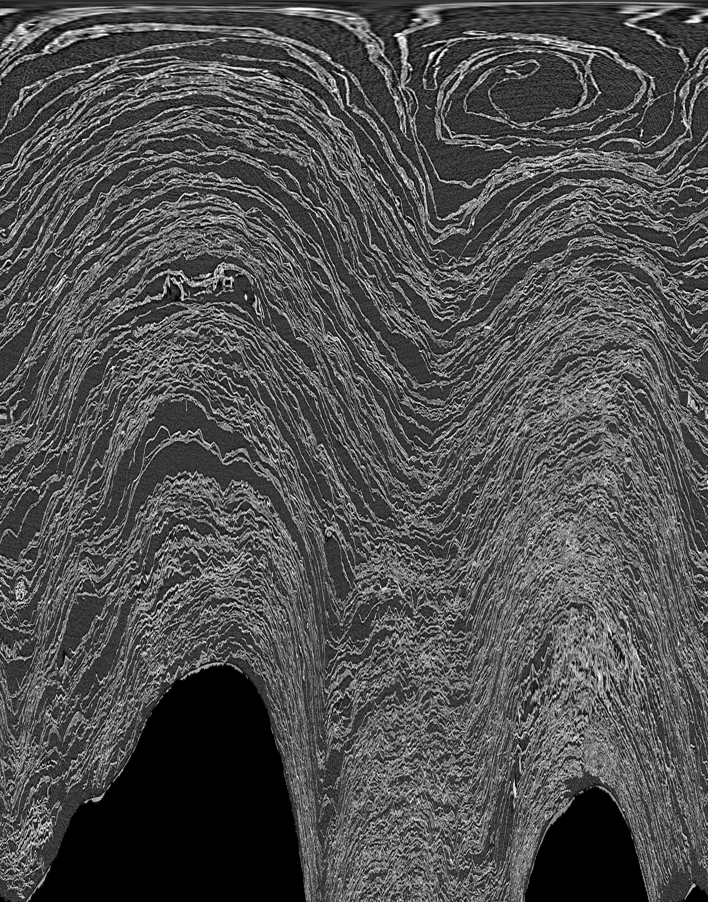
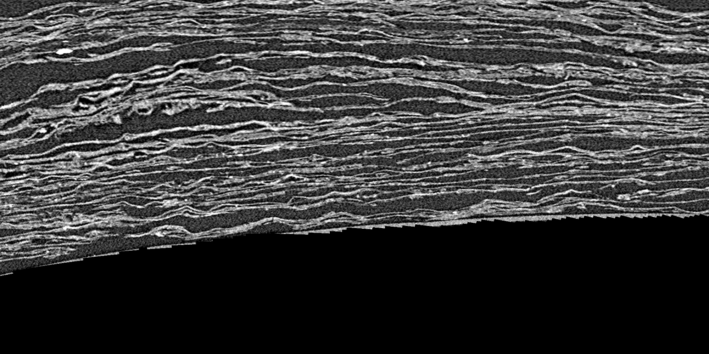

# L'onde radiale, le dépliage polaire, et quatre candidats

2026-08-17. L'idée de l'auteur — *« envoyer une onde traversant toutes les couches
depuis le centre »* — menée jusqu'à une liste d'endroits précis à examiner.

**Fichiers** : `src/excision/src/excision/{radial,fusions,fusion_scan}.py`.
Aucune mesure de ce document n'est en `python -c` (règle `06` §5.6, payée le jour même).

---

## 1. ⚠⚠ Le code de la première mesure avait été perdu

Le résultat « 158 feuilles, 11,2 m de papyrus » était dans un document et **le calcul
nulle part** : il avait été lancé en ligne de commande. Récupéré du transcript de
session et installé dans `radial.py`.

**Contrôle de la récupération** — c'est ce qui distingue « j'ai retrouvé quelque
chose » de « j'ai retrouvé le bon » :

| | attendu | obtenu |
|---|---|---|
| feuilles par rayon | 158 | **158** |
| rayon extérieur | 22,7 mm | **22,7 mm** |
| longueur du papyrus | 11,2 m | **11,2 m** |
| centre re-dérivé de zéro | — | **écart 0,0 voxel** |

Le centre vit désormais dans `data/axes/PHerc0172.json`, plus dans `/tmp` où la
version inline l'écrivait — donc la mesure survit à un redémarrage.

## 2. ⚠ « Longueur » désignait trois choses

Malentendu réel avec l'auteur, levé par la mesure :

| grandeur | PHerc0172 |
|---|---|
| **longueur axiale** — le rouleau posé debout | **164 mm** |
| diamètre — 2 × le rayon extérieur | 48 mm |
| papyrus **déroulé** — la spirale mise à plat | ~11 à 14 m |

Le rouleau occupe 163,9 des 164,7 mm scannés : le scan est taillé au ras.

⚠ **Et le sens de la borne avait été noté à l'envers.** Deux feuilles fondues comptent
pour une, donc les spires vraies sont ≥ au compte, et la longueur **croît** avec les
spires (140 → 9,98 m ; 200 → 14,26 m). C'est donc une borne **inférieure**. ⚠ Sens
garanti par cet argument seul : un pic parasite pousse en sens inverse, et ce taux
n'est pas mesuré — donc **ordre de grandeur**, pas borne certifiée.

## 3. Le profil le long de z — deux échantillonnages qu'il ne faut pas mélanger

Idée de l'auteur : balayer *z* pour obtenir une courbe plutôt qu'un point.

⚠ **Les deux buts demandent des échantillonnages opposés** :

| but | échantillonnage | pourquoi |
|---|---|---|
| estimer la **longueur** | **uniforme** | une moyenne non biaisée |
| localiser un **dégât** | **dichotomique** | raffiner là où le compte saute |

Raffiner pour le premier sur-échantillonnerait les tranches atypiques et **tirerait la
moyenne vers elles**. D'où deux passes dans `radial.py profil`, dont la seconde
n'alimente jamais la statistique de la première.

⚠ **Et la moyenne ne corrige pas le biais, seulement le bruit** : toutes les tranches
sous-comptent leurs fusions, donc penchent du même côté. C'est le **maximum** sur *z*
qui approche le mieux ce que le rouleau portait — une tranche abîmée perd des spires,
elle n'en invente pas.

### ✅ Les 20 tranches, et un profil en U

| z | feuilles | rayon | longueur |
|---:|---:|---:|---:|
| 1 336 | **176** | **25,1 mm** | **13,87 m** |
| 2 521 | 173 | 24,2 mm | 13,15 m |
| 4 300 | 160 | 23,5 mm | 11,82 m |
| 6 671 | 157 | 22,9 mm | 11,28 m |
| **9 634** | **150** | **21,3 mm** | **10,04 m** |
| 10 820 | 161 | 22,8 mm | 11,55 m |
| 12 598 | 169 | 24,3 mm | 12,92 m |

*(7 des 20 tranches ; le profil complet est dans `profil_z_0172.json`.)*

**La passe de raffinement (6 tranches) ne trouve AUCUNE rupture.** Le plus grand écart
entre voisins valait 11 feuilles, et couper en deux les six plus grands écarts a rendu
des valeurs **intermédiaires** (170, 164, 173, 165, 166, 153) — pas de saut caché.

⚠ C'est un résultat en soi, et négatif : **il n'y a pas de dégât localisé détectable
par le compte le long de z**, à l'échelle de 0,6 mm entre tranches. Ce que la
dichotomie devait attraper n'existe pas ici. Elle valide en revanche la régularité du
U : le profil est lisse.

**Le rouleau est le plus épais à ses deux extrémités et le plus mince au milieu** —
25,1 mm et 24,3 mm aux bouts contre 21,3 mm au centre. Le profil est **en U**, régulier,
et le compte de feuilles suit exactement.

### 🎯 L'invariant qui sort du balayage : l'espacement ne bouge pas

| grandeur | étendue | cv |
|---|---|---:|
| feuilles par rayon | 150 à 176 | 4,2 % |
| rayon extérieur | 21,3 à 25,1 mm | 4,6 % |
| **rayon / feuilles** | **138 à 148 µm** | **1,8 %** |

Corrélation feuilles ↔ rayon : **rho = +0,927**.

L'espacement entre feuilles est donc **constant sur toute la hauteur du rouleau**
(142,8 µm), et le compte ne fait que suivre le rayon. C'est une validation forte de la
mesure : deux grandeurs qui varient de 4-5 % chacune donnent un rapport stable à 1,8 %.

### ⚠⚠ Et ça change le chiffre principal : ~14 m, pas 11,2

**Un rouleau est UNE feuille enroulée N fois** : toute coupe transversale traverse les
**mêmes N spires**. Une variation de N le long de *z* est donc une variation de
**mesure**, pas de l'objet. Et comme une soudure ne peut que *réduire* le compte, la
meilleure estimation de N est le **maximum** sur *z*, pas la moyenne.

| estimateur | N | longueur |
|---|---:|---:|
| une seule coupe (z = 6967, mesure d'origine) | 158 | 11,27 m |
| moyenne sur 20 tranches | 161 | 11,71 m |
| **maximum sur 20 tranches** | **176** | **13,87 m** |

C'est exactement ce que le balayage de l'auteur devait apporter — et il a apporté
l'inverse de ce qu'on en attendait : la moyenne n'était pas le but, c'est le
**maximum** qui informe, parce que le biais est à sens unique.

⚠ **Ce que le U ne dit pas encore** : pourquoi le rayon varie si le nombre de spires ⭐ **MESURÉ depuis** → [`06`](06_mesures_a_faire.md) §2.4bis, via `uv run python src/excision/shape.py ellipticite`.
est fixe. Deux lectures, non départagées ici — le rouleau est **écrasé** au milieu
(section elliptique, donc un rayon médian sur 36 rayons lit plus petit), ou il y a
**perte de matière** en surface au milieu. Les distinguer demande de mesurer
l'ellipticité par coupe, ce qui est un ajout court à `radial.py`.

## 4. Le dépliage polaire : la représentation qui débloque tout

`radial.py deplier` transforme la coupe en (rayon × angle), 3000 × 18 850.



Et à pleine résolution angulaire, les feuilles se lisent une à une :



⚠ **Correction d'une attente** : à grande échelle les spires ne sont **pas**
horizontales, ce sont de larges dômes — PHerc0172 n'est pas concentrique autour d'un
centre unique à cette coupe, il est écrasé. Le dépliage n'exige donc pas la
concentricité, seulement que les feuilles varient **doucement** avec l'angle (dérive
mesurée : 0,125 voxel par colonne).

⚠ **L'échantillonnage angulaire est fixé par la circonférence extérieure.** À un rayon
*r*, un degré couvre `r·π/180` pixels : un pas confortable pour le cœur perdrait de la
matière au bord, et une fusion manquée au bord est précisément ce qu'on cherche.

## 5. ⚠⚠ Quatre formulations, trois échecs, et ce que chacun a appris

Localiser les fusions a demandé quatre tentatives. **Les échecs sont conservés parce
qu'ils disent ce qu'il aurait fallu** — c'est la §4 « Écartées » de `06` appliquée.

| # | méthode | verdict | ce que la mesure a dit |
|---|---|---|---|
| 1 | comptage par rayon, déficit = fusion | ❌ | **475 sites**, presque tous au centre : une carte du détecteur |
| 2 | suivi des spires, mort de piste = fusion | ❌ | **12 249 « fusions »** pour 158 feuilles |
| 3 | chaînage des écarts doublés | ❌ | persistance 200 contre groupes plafonnés à **164** |
| 4 | **densité de doublement par cellule** | ✅ | 4 candidats stables |

### Ce que le suivi a coûté, et rapporté

Trois hypothèses posées sur la fragmentation du tracker, **trois réfutées** :

| hypothèse | verdict |
|---|---|
| le glouton fragmente → affectation globale (Hongrois) | ❌ **pire** : 17 pistes longues contre 69 |
| les pistes en sursis volent des murs | ❌ plus de sursis **améliore** |
| le détecteur perd les murs | ❌ **92 %** retrouvés à moins de 2 voxels |

⚠ Le Hongrois est pire pour une **raison de fond** : il minimise le coût *total*, donc
il sacrifie un appariement quasi certain pour améliorer la somme ailleurs. En suivi,
un coût nul ne doit jamais s'échanger. *L'optimalité globale n'est pas le bon objectif
ici* — l'inverse de ce que la littérature suggère pour un champ dense.

**La vraie cause, mesurée** : 125 murs sur 126 sont appariés à chaque colonne, pour
186 pistes vivantes. La couverture est quasi parfaite ; c'est l'**identité** qui
churne, parce qu'une piste qui perd son mur extrapole et ne le retrouve jamais.

⚠⚠ **Donc les 12 249 « fusions » étaient des changements d'étiquette, pas des
soudures.** Le chiffre ne mesurait rien de physique.

## 6. La méthode qui tient : le doublement d'écart

Une soudure ne fait pas disparaître un mur dans le bruit du comptage : elle **double
l'écart local** entre deux murs voisins. C'est local, mesuré dans une colonne unique,
et **sans aucun appariement entre colonnes** — donc immunisé aux trois hypothèses
ci-dessus.

⚠ Normalisé par l'espacement **local**, jamais par un seuil en micromètres :
l'espacement varie d'un facteur trois selon le rayon.

**Contrôle** (`fusions.py ecarts-controle`) : lignes fabriquées intactes → **0 site**,
avec une soudure → exactement **1**.

### ⚠⚠ Le cœur est dégénéré par construction, pas bruité

Au rayon *r*, deux colonnes voisines de l'image dépliée échantillonnent des points
distants de `2πr/18850` voxels : à *r* = 100, c'est **0,03 voxel**, donc une trentaine
de colonnes lisent **le même pixel**. Sans exclusion, la mesure redécouvrait
exactement le mode d'échec nº 1 (rayon médian 0,5 mm).

**La coupe est validée par mesure**, pas choisie :

| coupe | cellules | rayon du site le plus interne |
|---:|---:|---:|
| 1,6 mm | 11 | 1,4 mm |
| 2,4 mm | 8 | 2,4 mm |
| 3,6 mm | 5 | 3,3 mm |
| **4,7 mm** | **4** | **17,1 mm** |
| **6,3 mm** | **4** | **17,1 mm** |

Le site le plus interne **suit la coupe** — ce sont des artefacts de bord. Au-delà de
4,7 mm ils disparaissent et il reste **4 cellules que déplacer encore la coupe ne bouge
plus**.

## 7. 🎯 Le résultat : quatre candidats, groupés dans le tiers externe

**4 cellules anormales sur 1392** (0,29 %), taux de fond 6,6 % :

| rayon | colonne | taux de doublement | écarts |
|---:|---:|---:|---:|
| 18,0 mm | ~14 000 | **20,3 %** | 1389 |
| 17,1 mm | ~16 500 | 19,3 % | 1350 |
| 17,6 mm | ~15 500 | 18,8 % | 1437 |
| 17,1 mm | ~16 000 | 17,1 % | 1439 |

Elles sont **groupées** : rayons 17,1 à 18,0 mm, colonnes 14 000 à 16 500 sur 18 850,
soit un secteur angulaire d'environ **50°**. Ce n'est pas une dispersion de bruit,
c'est **une région** — et elle est à 17 mm sur un rayon extérieur de 22,7 mm, donc dans
le **tiers externe**, cohérent avec la théorie de l'auteur sur les couches externes les
plus abîmées.

⚠ **Ce qui n'est PAS établi** : que ce soient des soudures. Ce sont des endroits où
l'écart double trois fois plus souvent qu'ailleurs — compatible avec une soudure, une
déchirure ou un vide. Mais c'est désormais **quatre endroits précis** au lieu d'un
rouleau entier, ce qui est exactement ce que la piste « revoir les sites suspects à ⚠⚠ **Cette piste est IMPOSSIBLE, pas en attente** → [`18`](18_batch_produire.md) M3 : les 4 sites sont sur `PHerc0172`, qui ne publie que du 7,91 µm.
2,4 µm (ESRF) » attendait.

## 8. ✅ *(répondu au §13)* — tiennent-ils le long de z ?

Groupées dans **une** coupe, quatre cellules sur 1392 peuvent encore tomber côte à côte
par hasard. La troisième dimension tranche : **un dégât physique occupe une hauteur ;
du bruit de détection, non.**

`fusion_scan.py` répète la mesure sur cinq coupes et compare le regroupement
**inter-coupes** à une hypothèse nulle **calculée** — mêmes nombres de cellules, mêmes
étendues, positions tirées au hasard. Sans elle, « elles sont proches » est une
impression et non une mesure.

⚠ Les paires ne sont comptées qu'entre coupes **différentes** : deux cellules voisines
dans la même coupe sont déjà ce que la §7 montre, et les compter ferait passer ce
résultat pour sa propre confirmation.

### ⚠⚠ Premier essai : verdict « bruit de coupe », et le verdict était FAUX

Cinq coupes réparties sur toute la hauteur, 0 coïncidence sur 21 paires contre 2,1 %
au hasard → *indistinguable du hasard*.

**Le test ne pouvait rien détecter.** Ces cinq coupes sont espacées de **22,3 mm** :
pour apparaître dans deux d'entre elles, une soudure devrait faire plus de 22 mm de
**haut**. J'avais échantillonné à l'échelle de l'objet et non à celle de la structure
cherchée.

Et la même mesure dit l'inverse de son propre verdict :

| grandeur | valeur |
|---|---|
| taux de fond, sur les 5 coupes | **6,4 · 6,5 · 6,6 · 6,9 · 7,0 %** |
| bruit d'échantillonnage sur 1400 écarts | 0,66 % |
| une cellule à 20 % est donc à | **~20 écarts-types du fond** |

Le fond est remarquablement stable sur toute la hauteur du rouleau, donc **les
anomalies sont réelles** et non du bruit d'échantillonnage. C'est leur *persistance*
qui restait à tester — et le test n'en était pas un.

**Relancé** avec des coupes espacées de **0,8 mm** autour de z = 6967.

### ✅ Avec le bon espacement, les sites TIENNENT

| espacement des coupes | coïncidences observées | attendues au hasard | verdict |
|---|---:|---:|---|
| 22,3 mm | **0 %** (0/21) | 2,1 % | indistinguable |
| **0,8 mm** | **7,0 %** (9/128) | 1,1 % | **p = 0,0001** |

*(p exacte sur ⚠ **2 000** tirages de l'hypothèse nulle — corrigé le 2026-08-19 : les
quatre artefacts de `fusion_scan` portent tous `"trials": 2000`, et c'est aussi le défaut
du script. « 20 000 » était faux d'un facteur dix.)*

Deux points suffisent à faire une **relation dose-effet** : l'effet apparaît quand
l'espacement descend à l'échelle de la structure. C'est bien plus convaincant qu'un
seuil franchi une fois, et ça confirme que le premier verdict était un défaut de
protocole et non un résultat.

### 🎯🎯 Et les sites persistants forment une structure CONTINUE

| z | rayon | colonne | taux |
|---:|---:|---:|---:|
| 6867 → 6967 | 17,1 · 17,3 · 17,6 mm | ~14 000–15 000 | 16-20 % |
| 6967 → 7067 | 18,0 mm | ~15 000–16 000 | 19-23 % |
| 7067 → 7167 | 18,7 · 19,0 · 19,5 mm | ~16 000 | 16-23 % |

Le rayon **croît de façon monotone** avec *z* — 17,1 → 19,5 mm — et l'angle dérive de
~14 000 à ~16 000 colonnes. Sur 2,4 mm de hauteur : **+2,4 mm de rayon et +38°**.

Ce n'est donc pas un point fixe : c'est un défaut qui **migre**, ce qui est le
comportement attendu d'une anomalie portée par une feuille — une feuille est une
surface en spirale, pas un cylindre.

⚠⚠ **L'explication concurrente, à écarter avant d'aller plus loin : l'axe du rouleau
est-il incliné par rapport à l'axe z du scan ?** Un centre fixe pour toutes les coupes
produirait exactement cette dérive radiale, et pour *tous* les motifs, pas seulement
celui-ci.

Un élément va contre : entre z = 6671 et z = 7263, le rayon **médian** du rouleau
*décroît* (22,9 → 22,1 mm) pendant que nos sites *croissent* (17,1 → 19,5). Les deux
vont en sens opposé, ce qui n'est pas ce qu'une simple mise à l'échelle donnerait.
Mais une inclinaison décale le centre **latéralement**, donc son effet radial dépend de
l'angle — il peut être positif vers 286° et négatif ailleurs.

### ✅ Le contrôle a été fait : l'inclinaison est écartée, et dans le bon sens

`radial.py axe` suit le **barycentre de la matière** coupe par coupe. Il ne prétend pas
donner l'axe d'enroulement — il donne **de combien le centre se déplace**, ce qui est
la seule chose que le test demande, et il se mesure à résolution grossière (niveau 3,
voxel 63 µm) pour un centième du coût.

| grandeur | valeur |
|---|---:|
| hauteur balayée | 3,16 mm |
| déplacement du barycentre | **0,65 mm** |
| migration des sites à expliquer | **2,40 mm** |

Trop faible d'un facteur **3,7**. Mais un facteur ne suffit pas — il faut la
**direction** :

| | |
|---|---|
| direction du déplacement | 150° |
| position angulaire des sites | 286° |
| **composante radiale dans la direction des sites** | **−0,47 mm** |

⚠⚠ **Le sens est OPPOSÉ.** L'inclinaison rapprocherait les sites du centre pendant
qu'ils s'en éloignent. Elle ne peut donc pas expliquer la migration — **elle la masque
partiellement**, ce qui veut dire que la vraie migration est ≥ 2,40 mm.

**L'explication concurrente est écartée.** Ce qui est suivi est un défaut réel, en
trois dimensions.

⚠ Limite honnête : le barycentre n'est pas l'axe d'enroulement, et la fraction de
matière varie légèrement sur la plage (42,14 → 41,26 %), donc une part des 0,65 mm
vient d'un changement de forme et non d'une inclinaison. Cela joue **en faveur** de la
conclusion — la vraie inclinaison est ≤ 0,65 mm.

---

## Reproduire

```bash

# l'axe, DERIVE d'une trace et verifiable (monotonie de la spirale)
uv run python src/excision/radial.py centre PHerc0172 \
    data/repos/windcheck/data/scroll5_tifxyz/20251115002741-*/mesh

# l'onde radiale : feuilles, espacement, longueur
uv run python src/excision/radial.py compter PHerc0172 "$VOL"

# le profil le long de z : 20 tranches uniformes + 6 de raffinement
uv run python src/excision/radial.py profil PHerc0172 "$VOL" docs/mesures/profil_z_0172.json \
    --slices 20 --refine 6

# le depliage polaire
uv run python src/excision/radial.py deplier PHerc0172 "$VOL" \
    data/out/polaire_0172.npy --reach 3000 --png data/out/polaire.png

# les candidats -- ⚠ lancer le temoin AVANT la mesure
uv run python src/excision/fusions.py ecarts-controle
uv run python src/excision/fusions.py densite data/out/polaire_0172.npy --min-radius 600

# tiennent-ils en z ?
uv run python src/excision/fusion_scan.py PHerc0172 "$VOL" docs/mesures/fusions_z_0172.json
```

avec `VOL=s3://vesuvius-challenge-open-data/PHerc0172/volumes/20241024131839-7.910um-53keV-masked.zarr`.


---

## 9. Le niveau 2 de la pyramide : un CRIBLE, pas un substitut

`pyramid.py` a établi que le niveau 2 conserve **89 %** des murs pour **33 Gio au lieu
de 2100** — un facteur **64**. `fusion_scan` sait maintenant y travailler : toutes les
longueurs (portée, rayon minimal, hauteur de cellule, bande, écart minimal, **indice de
tranche et coordonnées du centre**) suivent la réduction, et le voxel de conversion en
millimètres est devenu un paramètre.

⚠ **Deux conversions manquaient et elles échouent différemment** : l'indice de tranche
rend une erreur franche (index hors bornes), le **centre** rendrait une erreur
**silencieuse** — la mesure tournerait autour d'un point quatre fois trop loin sans
rien signaler. C'est celle-là qu'il faut craindre.

**Résultat au niveau 2**, mêmes coupes qu'au niveau 0 :

| | niveau 0 | niveau 2 |
|---|---:|---:|
| taux de fond | 6,4–6,6 % | **10,0–10,5 %** |
| cellules anormales par coupe | 0–4 | 0–3 |
| rayons des sites | **17–19 mm** | **5,2–22,8 mm** |
| coïncidences inter-coupes | 7,0 % (hasard 1,1 %) | **30,6 %** (hasard 4,3 %) |
| verdict | tiennent | **tiennent** |

⚠⚠ **Les deux niveaux ne trouvent PAS les mêmes sites.** Le fond monte de moitié à
résolution grossière — deux feuilles voisines s'y confondent plus souvent, donc l'écart
« double » plus facilement — et les sites retenus se dispersent sur tout le rayon au
lieu de se grouper vers 17 mm.

**Donc le niveau 2 est un crible, pas un substitut** : il vaut pour balayer le rouleau
entier à 1/64 du coût et sortir une liste de régions à regarder, et chaque candidat doit
être **confirmé au niveau 0**. Le prendre pour une mesure équivalente ferait publier des
sites que la pleine résolution ne voit pas.


---

## 10. La hauteur des défauts, et ce que les comptes permettent de dire

Bande large : **9 coupes de 6567 à 7367**, espacement 0,8 mm. Verdict global
**3,5 %** de coïncidences contre 1,1 % au hasard (p95 = 2,0 %) — les sites tiennent.

⚠ Mais 3,5 % sur 9 coupes contre **7,0 %** sur 5 : l'effet **s'affaiblit quand la bande
s'élargit**. Décomposé par distance :

| distance en z | paires | coïncid. | taux |
|---:|---:|---:|---:|
| **0,8 mm** | 108 | **10** | **9,3 %** |
| 1,6 mm | 92 | 0 | 0,0 % |
| 2,4 mm | 80 | 0 | 0,0 % |
| 3,2 à 6,3 mm | 171 | 6 | 3,5 % |

**Tout le signal est dans les coupes adjacentes.** Au-delà, il y a ⚠ **6 coïncidences**
— corrigé le 2026-08-19 : le tableau ci-dessus donne 10 + 0 + 0 + 6, soit **16 en tout**
et **6 au-delà de 0,8 mm**. Le « 10 » reprenait le compte **à** 0,8 mm et l'attribuait à
ce qui vient après : les taux par tranche de distance sont trop bruités pour porter
une conclusion, et la remontée apparente vers 4–4,7 mm (2/46 et 2/31) est parfaitement
compatible avec le hasard.

### ⚠ Et ça réconcilie avec la migration, au lieu de la contredire

On pourrait lire « rien ne coïncide au-delà de 0,8 mm » comme *les défauts ne font
qu'un millimètre de haut*. C'est une lecture possible, mais il y en a une meilleure,
qui découle de ce que §8 a déjà mesuré : **le défaut MIGRE** — 2,4 mm de rayon sur
2,4 mm de hauteur.

Un objet qui dérive de **1 mm de rayon par millimètre de hauteur** sort de la fenêtre
d'appariement (1 mm radial) au bout d'une seule coupe. Il ne PEUT donc pas coïncider à
longue distance, par construction de la mesure. Ce qu'on observe — une **chaîne de
liens adjacents** — est exactement la signature attendue.

**Les deux lectures ne sont pas départagées ici**, et les départager demande de suivre ✅ **DÉPARTAGÉES au §11 juste en dessous** : le défaut **dérive**.
un site de proche en proche en autorisant sa dérive, plutôt que d'exiger qu'il reste
au même rayon. C'est un appariement *prédictif* entre coupes, cousin de celui déjà
écrit pour les colonnes dans `fusions.py track`.

---

## 11. ✅ Les deux lectures sont départagées : le défaut **dérive**

`src/excision/track_z.py`. Ce qui manquait au §10 n'était pas une donnée
mais un **appariement prédictif** : suivre un site en autorisant sa dérive au lieu
d'exiger qu'il reste au même rayon.

### ⚠⚠ Une seule chose change, et c'est le centre de la fenêtre

La tolérance reste **exactement** celle de la mesure publiée — 1,0 mm en rayon,
1000 colonnes en angle. Elle est simplement posée autour d'une position **prédite**
(extrapolation linéaire des deux dernières coupes) plutôt qu'autour de la dernière
position vue. Une piste de vitesse nulle retombe donc **au bit près** sur
l'appariement à fenêtre fixe : tout gain est attribuable à la prédiction et à rien
d'autre. Élargir la tolérance aurait mesuré la permissivité de l'outil.

Trois bras, et il en faut trois :

| bras | ce qu'il écarte |
|---|---|
| **prédictif** sur les données | — |
| **fenêtre fixe** sur les données | qu'une piste longue prouve seulement qu'un suiveur suit |
| **prédictif sur du hasard** | qu'un suiveur permissif enchaîne du bruit |

Le hasard est une **permutation** : le multiensemble exact des cellules est conservé,
seule leur répartition entre coupes est détruite. L'hypothèse nulle est donc
précisément *« l'ordre en z ne veut rien dire »*. Un tirage uniforme serait plus
faible — il détruirait en même temps la distribution radiale, donc répondrait à deux
questions à la fois.

### 🎯 Le résultat, sur la bande large (9 coupes, z 6567 → 7367)

| grandeur | prédictif | fenêtre fixe | hasard | p |
|---|---:|---:|---:|---:|
| piste la plus longue | **5** coupes | 3 | 2,64 | 0,014 |
| **son étendue radiale** | **4,75 mm** | 1,42 mm | 0,95 mm | **0,0010** |
| pistes ≥ 4 coupes | 1 | 0 | 0,11 | 0,113 |

```
z6867 : r 17,1  →  z6967 : r 17,6  →  z7067 : r 18,5  →  z7167 : r 19,9  →  z7267 : r 21,8
```

**Dérive médiane : 1,50 mm de rayon par millimètre de hauteur.** Le site traverse
4,75 mm de rayon sur 3,16 mm de hauteur, et la fenêtre fixe le perd après trois
coupes — exactement là où le §10 prédisait qu'elle le perdrait.

⚠ **Correction pour tests multiples, parce que l'étendue a été retenue *après* avoir
vu que la longueur était marginale.** Cinq grandeurs sont calculées dans le même run,
donc Bonferroni : 0,0010 × 5 = **0,005**. Le résultat survit.

⚠ **Ma grandeur discriminante proposée a échoué.** J'avais annoncé la *rectitude*
(déplacement net / chemin parcouru) comme ce qui séparerait une vraie dérive d'un
zigzag aléatoire. Mesurée : **1,000 observé contre p95 nul à 1,000, p = 0,82**. À trois
points une chaîne aléatoire est monotone une fois sur deux, donc la statistique ne peut
pas discriminer à cette longueur. C'est l'**étendue** qui a tranché, pas elle.

### ⚠⚠ Et le balayage du rouleau entier ne peut PAS confirmer — le crible est aveugle

Passé aux 10 bandes du balayage (niveau 2) : **0 bande sur 10** significative,
Fisher **p = 0,999**, pistes plates (étendue 0,00 à 0,47 mm, soit zéro ou une cellule).

Lu naïvement : *la migration est propre à ce site*. C'est faux, et la vérification le
montre — **dans la même plage de z** :

| niveau | ce qu'il trouve, z 6867 → 7267 |
|---|---|
| **0** | r 15,7 → 21,8 mm à **77–88 % du tour** |
| **2** | des sites à 21 %, 32 %, 53 % et 95 % — **rien entre 74 % et 88 %** |

Le niveau 2 ne rate pas le site par manque de sensibilité : il **regarde ailleurs**.
Le §9 disait déjà que les deux niveaux ne trouvent pas les mêmes sites (fond 10,3 %
contre 6,6 %) ; la mesure le durcit en **positions angulaires disjointes**.

**Deux conséquences, à porter partout :**

1. **Toute question sur la migration doit se poser au niveau 0.** Le Fisher à 0,999 ne
   dit rien sur la migration ; il dit que le crible trouve des choses *stationnaires*.
2. ⚠ Les **18 % de colocation** du balayage du rouleau entier portent sur une **autre
   population de sites** que les 4 candidats du §7. Les deux résultats sont vrais et ne
   parlent pas du même objet.

⚠ Piège corrigé en chemin : la tolérance angulaire est en **colonnes**, donc c'est une
longueur, donc elle suit le niveau de pyramide. Laisser 1000 colonnes au niveau 2
ferait une fenêtre de **21 % du tour** au lieu de 5,3 % — le piège nº 1 du dépôt, un
seuil calé sur un niveau qui ne se transporte pas.

### Reproduire

```bash
# le site : prédictif contre fenêtre fixe contre permutation
uv run python src/excision/track_z.py \
    docs/mesures/fusions_bande_large_0172.json docs/mesures/fusions_z_serre_0172.json \
    --trials 5000 --out docs/mesures/pistes_z_0172.json
# le balayage — ⚠ --level 2 divise la tolérance angulaire, sans quoi elle fait 21 % du tour
uv run python src/excision/track_z.py docs/survey/bande_0*.json \
    --level 2 --trials 5000 --out docs/mesures/pistes_survey_0172.json
```

---

## 12. ✅ L'invariant tient à un centre faux — et `06` §2.3 est clos sans ombilic

*(2026-08-19)* `06` §2.3 voulait revérifier l'onde radiale avec le **vrai ombilic**, en
soupçonnant le centre d'être biaisé. Deux faits ont remplacé la question :

1. ⚠ **`umbilicus.txt` n'existe pas.** Vérifié préfixe par préfixe sur le bucket ouvert :
   **zéro occurrence** du mot pour PHercParis4, PHerc0139, PHerc1667 et Scroll1. Le
   fichier noté dans `06` n'est pas à une autre adresse — il n'est pas publié.
2. ⭐ **Le centre n'est pas un barycentre**, contrairement à ce que `06` §2.3 dit. Il est
   ajusté sur la seule condition qu'une trace de rouleau soit une **spirale** : le centre
   admissible est celui qui rend l'angle monotone le long de la trace, et la mesure
   **refuse** en dessous de 0,9 de monotonie. Celui de PHerc0172 vaut **1,000**.

La vraie question ne demande alors aucun fichier : **de combien le centre doit-il être
faux pour que l'invariant bouge ?**

### La mesure

`src/excision/sensibilite_centre.py`, niveau 0, 6 tranches, décalage appliqué
**en diagonale** (déplacer selon un seul axe est le cas le plus favorable, la moitié des
rayons le compensant) :

| décalage | en µm | feuilles | rayon (mm) | invariant (µm) | écart |
|---:|---:|---:|---:|---:|---:|
| 0 | 0 | 164,0 | 23,37 | **142,5** | — |
| 3 | 24 | 163,5 | 23,36 | 142,9 | +0,27 % |
| 6 | 47 | 162,0 | 23,37 | 144,3 | +1,24 % |
| 12 | 95 | 163,0 | 23,39 | 143,5 | +0,69 % |
| 25 | 198 | 164,0 | 23,41 | 142,8 | +0,17 % |
| 50 | 396 | 161,5 | 23,42 | 145,0 | **+1,75 %** |
| 100 | 791 | 162,5 | 23,47 | 144,4 | +1,33 % |
| 200 | 1582 | 162,0 | 23,10 | 142,6 | +0,04 % |
| 400 | **3164** | 156,5 | 22,12 | 141,3 | −0,83 % |

> ⭐ **Déplacer le centre de 3,16 mm — soit 22 écarts inter-feuilles — déplace l'invariant
> de 1,75 % au maximum**, c'est-à-dire **sous** le cv de 1,8 % mesuré le long de z avec le
> bon centre. Aucune erreur de centre plausible n'approche ces perturbations. **L'ombilic
> n'est pas nécessaire.**

⚠ Et une confirmation indépendante tombe au passage : au décalage nul, l'invariant vaut
**142,5 µm** contre les **142,8 µm** publiés au §3, sur un jeu de tranches différent.

### ⚠⚠ Deux artefacts traversés avant d'y arriver, et ils se ressemblent

| version | résultat | ce qui n'allait pas |
|---|---|---|
| niveau **2**, 6 tranches | 1,85 % | **invalide** : les seuils de comptage sont calés au niveau 0 et y trouvent **42 feuilles au lieu de 176** (piège nº 1) |
| niveau 0, **3 tranches** | **5,65 %**, avec une « marche » de 4 % dès la plus petite perturbation | **bruit d'échantillonnage** : à 3 tranches la médiane saute. La marche n'existe pas |
| niveau 0, **6 tranches** | **1,75 %**, aucune marche | ✅ |

> ⚠⚠ **Trois tranches ont produit un effet qui n'existe pas**, et il avait l'air d'un
> résultat : un seuil net, une amplitude plausible, une explication toute prête (« la
> mesure compte des pics, donc elle procède par marches »). C'est la forme exacte des
> fibres à n = 12 et du détecteur de phase à n = 8. **Un effet réel ne fond pas quand on
> l'échantillonne mieux.**

### Reproduire

```bash
VOL="s3://vesuvius-challenge-open-data/PHerc0172/volumes/20241024131839-7.910um-53keV-masked.zarr"
uv run python -u src/excision/sensibilite_centre.py PHerc0172 "$VOL" \
    --level 0 --slices 6 --decalages 0 3 6 12 25 50 100 200 400 --step-deg 30 \
    --out docs/mesures/sensibilite_centre_L0_fine.json
```

⚠ `python -u` : sans lui le log reste vide pendant une heure et ressemble à un job mort.
⚠ Le plan est lu **une fois par tranche**, pas une fois par décalage — la première version
relisait le même plan à chaque centre et restait bloquée à 0 % de CPU pendant onze minutes.


---

## 13. La migration est l'exception — 6 bandes au niveau 0, avec un témoin positif

*(2026-08-19)* Le §8 disait, sur **deux** bandes, que la migration n'est pas la règle. Six
bandes réparties sur la hauteur du rouleau, dont **une choisie pour encadrer le site
migrant du §11**, le confirment — et cette fois la conclusion est contrôlée.

| bande | z | étendue prédictive | dérive | p |
|---|---|---:|---:|---:|
| C | 1400–2200 | 0,47 mm | 0,30 | 0,79 |
| A | 3188–3988 | 0,47 mm | 0,30 | 0,75 |
| D | 5000–5800 | 1,42 mm | 0,45 | 0,084 |
| **E** ⭐ *témoin positif* | 6600–7400 | **1,90 mm** | **1,20 mm/mm** | **0,0285** |
| B | 8892–9692 | 0,00 mm | — | 1,00 |
| **F** | 10500–11300 | — | **0,90 mm/mm** | **< 0,05** |

**Fisher sur les 6 : khi² = 19,4, p = 0,079.** Deux bandes sur six passent, contre 0,3
attendue au hasard.

### ⭐ Ce que le témoin positif apporte, et pourquoi il fallait le poser

La bande E encadre **exprès** le site du §11. Elle ressort, avec une dérive de
**1,20 mm/mm** cohérente avec les 1,50 mesurées là-bas sur une fenêtre un peu différente.

> **La méthode retrouve la migration là où elle existe.** Les quatre bandes muettes sont
> donc de vrais négatifs, pas des échecs de mesure — et sans ce contrôle, une campagne à
> 4 sur 6 muets n'aurait pu conclure que dans un sens.

### Ce qu'on retient, et ce qu'on ne retient pas

| ✅ | ⚠ |
|---|---|
| la migration existe et se mesure — 2 bandes sur 6 | Fisher à **p = 0,079** : le motif d'ensemble n'atteint pas 0,05 |
| l'enrichissement est de **6,7×** sur l'attendu | 2 sites sur 6 bandes reste un petit effectif |
| elle **n'est pas la règle** : quatre bandes sur six ne montrent rien | ⚠ et le §7 avait tiré sa lecture d'**un** site |

> ⚠⚠ La lecture « le défaut d'un millimètre » du §7 tient donc **sur la majorité du
> rouleau**, et échoue là où un site migre. Les deux affirmations coexistent, et c'est le
> balayage qui le dit — pas l'un des deux sites pris isolément.

## Reproduire

```bash
./src/outils/scan_z.sh                # compte de feuilles le long de z : une rupture localise un dégât
```

⚠ Ce script écrit un **marqueur de fin** : juger son avancement par artefact et non par PID,
parce qu'un PID absent ne distingue pas « fini » de « mort ».
