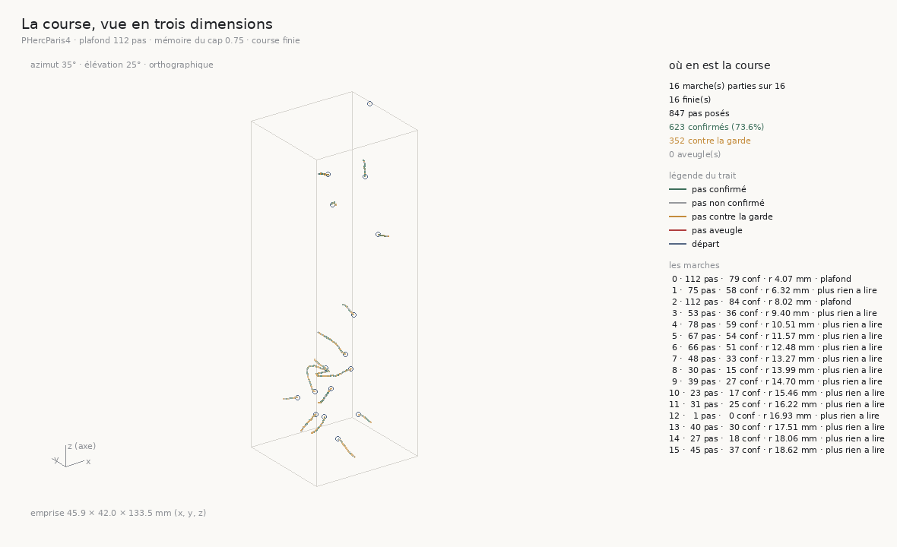
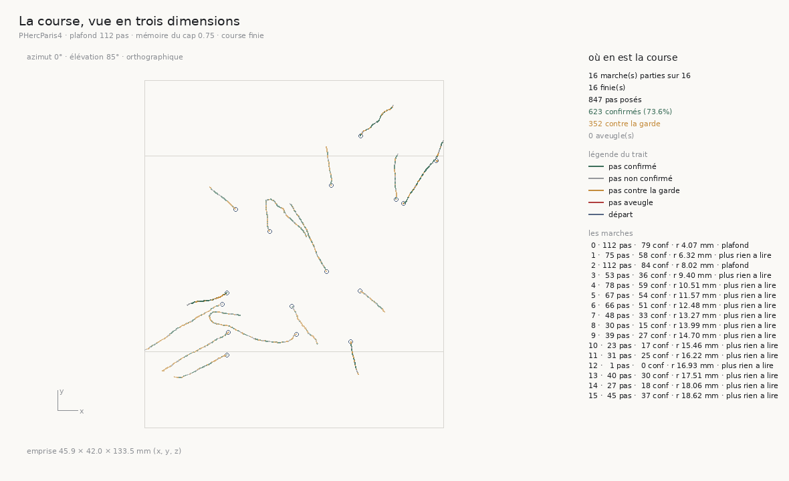

# 133 — La course se regarde pendant qu'elle dure, et le cap redresse la marche en la raccourcissant

> ⭐⭐⭐⭐ **LE LECTEUR ÉTAIT VINGT-CINQ FOIS TROP LENT, ET RIEN NE LE DÉSIGNAIT.** Le pool de
> `voxel_distant.lire` était mappé sur les **chunks** ; un cube de lecture de 41 voxels tombe dans
> **un** chunk de 128 qui demande **41 plages**, donc le pool avait une tâche pour quarante-et-une
> requêtes en file. Tout accusait le réseau — le débit ne bougeait pas avec le nombre de fils, le
> processus était presque oisif — et c'était la latence, payée une fois par plage, **en séquence**.
> Mesuré sur le cube du marcheur, à un départ réel : **15,276 s** à un fil, **0,574 s** à
> soixante-quatre, valeurs **identiques au bit**, facteur **26,6**.
>
> ⭐⭐⭐⭐ **DONC `131` PUBLIE UN COÛT PÉRIMÉ, ET IL N'AVAIT PAS DE PRODUCTEUR.** « Une bande coûte
> environ soixante-dix minutes, quatre-vingts bandes font plusieurs jours » venait d'une division
> faite à la main. Chaque course publie désormais `secondes_par_pas` : **144,05 s** pour la course
> de `131` (borne haute, elle porte du sommeil de machine), **2,34 s** pour celle-ci. Seize bandes
> au plafond de 112 ont coûté **1983,4 s** — trente-trois minutes, pas seize heures.
>
> ⭐⭐⭐⭐ **ET LE CAP, COURU, REDRESSE LA MARCHE EN LA RACCOURCISSANT.** Mêmes seize départs que
> `131`, mémoire du cap **0,75** : **15 marches sur 16** sont plus droites (rectitude médiane
> **0,8563 → 0,9715**, p **0,00269**), et **2 sur 16** vont plus loin (pas voyants médians
> **58,5 → 46,5**, p **0,04392**). Deux marches au plafond au lieu de quatre, **14** arrêts « plus
> rien à lire » au lieu de 11. Le cap supprime le retour sur soi ; il ne supprime pas ce qui arrête
> les marches, et il le rencontre plus tôt.
>
> ⭐⭐⭐ **ET LA COURSE SE REGARDE ENFIN PENDANT QU'ELLE TOURNE.** `--trace` dit chaque pas en JSONL
> vidangé ; `figure_la_course_en_3d.py` relit la trace et dessine les trajectoires dans le repère
> du volume sous une caméra qu'on tourne — un rendu pur d'un instantané, incapable de perturber la
> course.

## 1. Pourquoi ce fichier

`132` a construit un cap et mesuré, par relecture, qu'il devrait marcher — et dit qu'il ne
pouvait être jugé que par une course qui l'emploie, parce que changer la direction change ce que
le marcheur lit au pas suivant. `131` chiffrait une telle course à seize heures. La question posée
en ouvrant cette tranche était de planification : les bandes peuvent-elles être parallélisées, ou
le réseau est-il la limite ? La réponse est venue d'une mesure, et ce n'était ni le réseau ni le
CPU. Une fois le lecteur réparé, la course a coûté une demi-heure, et elle a été regardée.

## 2. ⭐⭐⭐⭐ Le lecteur lisait ses plages en file

`lire` regroupe les points demandés par chunk, puis par plages d'octets contiguës (`RECOLLEMENT`
4096) à l'intérieur de chaque chunk. Le `ThreadPoolExecutor` était mappé **sur les chunks**. Or le
cube que lit le marcheur fait 41 voxels de côté (`demi` = 20) et les chunks en font 128 : le cube
tombe presque toujours dans un seul chunk, qui demande une plage par rangée recollée, soit
**41 plages**. Une tâche, quarante-et-une requêtes HTTP en séquence — quinze secondes.

Ce qui l'a caché : le débit ne bougeait pas avec le nombre de fils, ce qui est la signature d'un
lien saturé ; le processus était presque oisif, ce qui est la signature d'un travail borné par le
réseau. Les deux signatures étaient vraies et la conclusion fausse : un pool qui n'a qu'une tâche
ne peut pas aller plus vite avec plus de fils.

Le pool est mappé sur les **plages** depuis le commit `c5725ba`. Cette tranche donne au facteur
son **producteur** — `voxel_distant.py --chronometrer` lit le cube du marcheur à un fil puis à
plusieurs, sur le vrai volume, au premier départ de la course de `131`, et vérifie que chaque
lecture rend les **mêmes octets** que la lecture à un fil :

| fils | secondes | points / s | identique au premier |
|---:|---:|---:|:---:|
| 1 | **15,276** | 4511,7 | — |
| 32 | 0,938 | 73493,7 | oui |
| 64 | **0,574** | 120121,5 | oui |

Facteur du plus rapide : **26,6**. ⚠ Une seule lecture par compte de fils : c'est le producteur
d'un **ordre de grandeur**, pas un banc de mesure. ⚠ `time.monotonic()`, pas l'horloge murale — la
raison est au §4.

⭐⭐ **La parallélisation des bandes rapporterait encore, et elle n'est pas construite.** Le même
producteur lit **4** cubes distincts **en même temps**, chacun à 64 fils : mur **1,201 s** contre
**0,574 s** pour un cube seul, rapport **2,09** — quatre fois le travail pour deux fois le temps,
donc la ressource partagée n'est pas saturée à 64 fils et un pool par bande doublerait environ le
débit d'une course. Il n'est pas construit, parce qu'une course de seize bandes coûte désormais
trente-trois minutes et que ce n'est plus elle qui borne une tranche ; le jour où il le sera, les
bandes sont indépendantes et déterministes, et il faudra **trier** `lignes` pour que le fichier
reste identique à celui d'une course séquentielle, et l'asserter.

## 3. ⭐⭐⭐ La course se regarde pendant qu'elle dure

`marcher` ne rend ses étapes qu'à la fin d'une marche, et la course n'écrit son brouillon qu'à la
fin d'une **bande** — entre les deux il n'existait rien à lire. Trois pièces, chacune la plus
petite qui réponde :

- **`marcher(..., mouchard=)`** appelle une fonction à chaque pas qui a avancé, avec l'étape et la
  **position exacte**. ⚠ La position est passée en argument et non écrite dans l'étape : écrire
  `position_zyx` pour tracer changerait le JSON de la course, donc une course tracée et une course
  muette ne rendraient plus le même fichier. Le mouchard est un canal latéral. La batterie asserte
  qu'une marche avec et sans mouchard est **identique** (88 contrôles, +4).
- **`jusquou_va_t_il_si_on_le_laisse.py --trace <fichier>`** écrit une ligne JSON par pas —
  `course`, `depart`, `pas`, `fin` — et la **vidange** à chaque ligne : un tampon de 8 Kio garderait
  une dizaine de pas pour lui, exactement le retard qu'un visualiseur temps réel ne peut pas avoir.
  ⚠⚠ Et une trace qui casse **se tait au lieu de tuer la course** : une sonde a trouvé qu'un
  descripteur fermé lève `ValueError` et non `OSError`, donc la seule panne que la batterie savait
  provoquer traversait la garde. Corrigé, asserté (59 contrôles, +12). La fin d'une marche est dite
  par l'**appelant**, qui seul connaît le verdict — un pas qui sort du volume n'a pas de position à
  montrer. `--memoire-du-cap` est exposé par la même occasion, et il entre dans le refus de
  reprise : reprendre des bandes marchées sans cap dans une course qui en veut un rendrait un fichier
  à deux marcheurs.
- **`figure_la_course_en_3d.py`** relit la trace et dessine les marches dans le repère du volume,
  sous une caméra **orthographique** (azimut, élévation) — pas la projection de `119`, qui aplatit
  chaque marche dans son plan le plus défavorable pour juger sa rectitude et perd toute géométrie
  relative. Le trait porte les états que `115` et `129` ont nommés : confirmé, non confirmé,
  **contre la garde** (`oriente` faux), **aveugle** (`rien_lu`). `--suivre N` re-rend toutes les N
  secondes, `--tourner D` ajoute D degrés d'azimut à chaque rendu. Une ligne coupée en cours
  d'écriture est **ignorée et comptée**, jamais refusée : c'est ce qui autorise à lire pendant que
  la course écrit (33 contrôles, dont : deux rendus d'une même vue sont identiques au bit).





Vue de dessus, la course est ce qu'elle doit être : seize marches qui traversent radialement la
section du rouleau, presque toutes droites. Les deux qui vont au plafond (4,07 et 8,02 mm) sont les
deux qui se recourbent — le §5 y revient.

⚠ Trois défauts du premier rendu, attrapés par la batterie et par le premier rendu réel : la
caméra fondait le trait le plus **proche** au lieu du plus lointain (le contrôle « le point le plus
haut est le plus proche » fixe le sens de la profondeur) ; la boîte englobante était cadrée sur les
points et **sortait du panneau** pour rayer le texte de droite (cadrer sur les huit coins projetés) ;
et la taille du voxel était reçue **à la main** — 7,91 µm pour 2,4. Elle vient désormais de
l'en-tête de la trace, écrit par la course.

## 4. ⭐⭐⭐⭐ Le coût d'un pas a un producteur, et celui de `131` était périmé

`131` §2 : *« une bande coûte environ soixante-dix minutes de lecture. Mesurer la fréquence du
recul sur vingt marches demanderait donc quatre-vingts bandes, soit plusieurs jours de lecture
continue. »* Le compte de bandes — quatre par marche utile — est mesuré et tient. Le coût était une
division faite hors de l'arbre, et il est devenu faux quarante minutes après avoir été publié.

`agreger` publie désormais `secondes_par_pas` dans le résumé de toute course, et le dénominateur
ne compte que les pas **de cette course** : les bandes reprises viennent en tête de `lignes`
(`bandes_a_reprendre` les rend d'abord), donc le dénominateur est le nombre de pas des bandes qui
les suivent. Diviser par tous les pas ferait paraître une course reprise deux fois moins chère
qu'elle n'est. Asserté.

| course | pas marchés | secondes | s / pas |
|---|---:|---:|---:|
| `la_re_course_large` (`131`, λ = 0, 8 bandes marchées) | 419 | 60355,1 | **144,05** |
| `la_course_a_cap` (λ = 0,75, 16 bandes) | 847 | 1983,4 | **2,34** |

Rapport des deux nombres publiés : **61,6**. ⚠⚠ **Le premier est une borne haute.** `secondes` y a
été pris à l'horloge murale, et `R4_deroulement` note qu'il porte ~9 h 30 de sommeil de la
machine — la course a précédé le passage à `maintenant()` (monotone, `2f3fbde`). Retirer ce sommeil
ramène le rapport vers le facteur du lecteur lui-même (**26,6**) : le pas ne fait rien d'autre que
lire. Une marche de 112 pas coûtait plus de quatre heures ; elle coûte moins de cinq minutes.

⚠ L'archive ne se modifie pas : `131` garde sa phrase, cette tranche la corrige — comme `126` a
corrigé `124`. La note de `R4-F62` dans le registre pointe ici.

## 5. ⭐⭐⭐⭐ La course à cap : plus droite, plus courte

Seize bandes, les départs de `131`, plafond 112, arrêt sur vide, mémoire du cap 0,75 — le seul
paramètre qui change est celui que `132` a construit. `un_cap_change_t_il_la_course.py` apparie les
deux courses **bande par bande** : chaque bande a une marche dans chaque course, partie du même
point, donc la différence est un effet du cap et de rien d'autre.

| bande (rayon) | sans cap | avec cap |
|---:|---|---|
| 4,07 mm | 112 pas, rectitude 0,183, plafond | 112 pas, rectitude **0,438**, plafond |
| 6,32 | 70, 0,932, plus rien à lire | 75, 0,973, plus rien à lire |
| 8,02 | **1**, 1,000, sortie du volume | **112**, 0,501, plafond |
| 9,4 | 112, **0,078**, plafond | 53, 0,969, plus rien à lire |
| 10,51 | 100, 0,641, plus rien à lire | 78, 0,946, plus rien à lire |
| 11,57 | 112, 0,665, plafond | 67, 0,932, plus rien à lire |
| 12,48 | 66, 0,923, plus rien à lire | 66, 0,974, plus rien à lire |
| 13,27 | 51, 0,855, plus rien à lire | 48, 0,975, plus rien à lire |
| 13,99 | 35, 0,929, plus rien à lire | 30, 0,974, plus rien à lire |
| 14,7 | 41, 0,912, plus rien à lire | 39, 0,958, plus rien à lire |
| 15,46 | 112, 0,239, plafond | 23, **0,992**, plus rien à lire |
| 16,22 | 103, 0,355, plus rien à lire | 31, 0,971, plus rien à lire |
| 16,93 | 3, 0,734, plus rien à lire | 1, 1,000, plus rien à lire |
| 17,51 | 43, 0,908, plus rien à lire | 40, 0,977, plus rien à lire |
| 18,06 | 32, 0,945, plus rien à lire | 27, 0,993, plus rien à lire |
| 18,62 | 50, 0,858, plus rien à lire | 45, 0,939, plus rien à lire |

Les deux verdicts, séparés exprès parce qu'ils répondent en sens contraire :

| | sans cap | avec cap | apparié |
|---|---:|---:|---|
| rectitude médiane | 0,8563 | **0,9715** | **15/16** plus droites, p **0,00269** |
| pas voyants médians | 58,5 | **46,5** | 2/16 plus longues, p **0,04392** |
| au plafond | 4 | 2 | |
| plus rien à lire | 11 | 14 | |
| taux de confirmation | 0,7526 | 0,7355 | |

⭐⭐⭐⭐ **Le cap redresse.** Quinze marches sur seize sont plus droites, et les trois marches que
`130` et `131` montraient revenant sur elles-mêmes (rectitudes 0,078, 0,239, 0,355) rendent
0,969, 0,992 et 0,971. Le virage par pas mesuré par `le_marcheur_derive_t_il` tombe de
**15,9°** / **13,3°** (premier et dernier tiers, sans cap) à **4,9°** / **5,1°** : c'est exactement
la moyenne d'un bruit qui alterne, ce que `132` avait prédit.

⭐⭐⭐⭐ **Et il raccourcit.** Les marches qui allaient droit s'arrêtent presque toutes un peu plus
tôt, et deux des quatre qui touchaient le plafond ne le touchent plus : le marcheur, qui ne revient
plus sur ses pas, rencontre plus vite ce qui arrête toutes les marches — le volume qui cesse de
répondre (`131`, `R4-F62`). **La portée n'a pas bougé** : le net des deux marches au plafond
culmine **avant** le plafond (au pas **79** en médiane, 11696,9 µm, contre 9245,8 au plafond),
2 sur 2, comme les 2 sur 4 de `131`.

⚠⚠ **Deux lectures à ne pas faire.** La première : « le cap fait perdre des marches ». Les quatorze
arrêts « plus rien à lire » ne sont pas des échecs du cap, ce sont les mêmes bords de matière que
sans cap, atteints par un chemin plus court. La seconde : « la rectitude est meilleure parce que
les marches sont plus courtes ». Non — la comparaison est appariée, et la marche de 8,02 mm passe de
**1 pas** à **112** avec le cap ; ce qui rend une marche plus droite ici est le cap, mesuré à
départ égal.

⚠ Ce que la course change dans les instruments de `119` : la rectitude **décroît encore à
longueur égale** avec cap (rho **−0,6988**, p **0,0079** sur 13 marches tronquées à 28 pas), là où
sans cap l'effet disparaissait (rho −0,3511, p 0,2183). Et le témoin « mêmes virages, directions
tirées au hasard » ne trouve plus rien à compenser : réel **0,971** contre simulé **0,982**, 3
marches sur 15, p **0,06372** — quand les virages sont petits, les re-tirer au hasard ne fait plus
tourner en rond. Le témoin mesurait une propriété du bruit ; le cap a enlevé le bruit.

## 6. Ce que ça change pour le graal

- ⭐⭐⭐⭐ **Le cap est la première proposition de cette campagne qui, courue, fait ce que sa mesure
  disait** : 15/16 marches plus droites, p 0,00269, virage divisé par trois. Le retour sur soi que
  `130` mesurait n'est plus le problème.
- ⭐⭐⭐⭐ **Mais la portée reste bornée par la même chose** : le volume qui cesse de répondre. Le
  cap ne lève pas cette borne, il y arrive plus vite. La question du graal se déplace donc
  franchement de « pourquoi le marcheur tourne » à « pourquoi la matière cesse de se lire », ce qui
  est `R4-F62` pris au sérieux — et une question sur le **volume**, pas sur le marcheur.
- ⭐⭐⭐ **Le coût d'une course a changé d'ordre de grandeur**, et chaque course publie le sien.
  Tout plan qui reposait sur « une bande coûte une heure » — dont celui de `131` — est à refaire ;
  le prochain relevé de `R4-P26` (deux marches au même rayon) est désormais bon marché.
- ⭐⭐ **On peut regarder.** Une course se relit pendant qu'elle tourne, en trois dimensions, et
  l'image de la section vue de dessus est celle que le graal demande : des traversées radiales
  droites. Ce qui manque se voit maintenant en direct au lieu de se déduire d'un tableau.

## 7. Les registres

Faits `R4-F67` (le lecteur lisait ses plages en file : ×26,6, valeurs identiques au bit, et quatre
cubes concurrents pour un rapport de 2,09), `R4-F68` (le cap redresse la marche : 15/16, p 0,00269,
et il la raccourcit : 2/16, p 0,04392), `R4-F69` (le coût d'un pas est publié par sa course :
2,34 s, contre 144,05 s en borne haute pour `131`). La note de `R4-F62` dit que son coût est périmé
et pointe ici. `R4-P27` est mise à jour : le cap a été couru, la fixture à feuilles non parallèles
manque toujours, et la grandeur sur laquelle la calibrer existe dans chaque course gardée — le
désaccord des deux moitiés du cube, que les piles planes et la spirale rendent nul.

## Reproduire

```bash
uv run python src/commun/voxel_distant.py --chronometrer \
    --zarr PHercParis4/volumes/20260411134726-2.400um-0.2m-78keV-masked.zarr \
    --centre 25354.613 12887.972 15298.736 --concurrents 4 \
    --json docs/mesures/le_lecteur_par_plage.json        # le premier départ de `131`
uv run python src/nappe/jusquou_va_t_il_si_on_le_laisse.py \
    --pas 112 --bandes 16 --arret-sur-vide --memoire-du-cap 0.75 --fils 64 \
    --json docs/mesures/la_course_a_cap.json --trace docs/mesures/la_course_a_cap.jsonl
uv run python src/figures/figure_la_course_en_3d.py \
    --trace docs/mesures/la_course_a_cap.jsonl --sortie docs/images/133_la_course_en_3d.png
uv run python src/figures/figure_la_course_en_3d.py \
    --trace docs/mesures/la_course_a_cap.jsonl --azimut 0 --elevation 85 \
    --sortie docs/images/133_la_course_vue_de_dessus.png
uv run python src/figures/figure_la_course_en_3d.py --trace docs/mesures/la_course_a_cap.jsonl \
    --sortie /tmp/course.png --suivre 15 --tourner 2      # pendant une course
uv run python src/nappe/le_marcheur_derive_t_il.py \
    --course docs/mesures/la_course_a_cap.json \
    --json docs/mesures/le_marcheur_derive_sur_la_course_a_cap.json
uv run python src/nappe/un_cap_change_t_il_la_course.py \
    --json docs/mesures/un_cap_change_t_il_la_course.json
uv run python src/nappe/jusquou_va_t_il_si_on_le_laisse.py --reagreger \
    --json docs/mesures/la_re_course_large.json           # gagne `secondes_par_pas`
uv run python src/commun/voxel_distant.py --verifier                          # 27 contrôles
uv run python src/nappe/jusquou_va_t_il_si_on_le_laisse.py --verifier         # 59
uv run python src/nappe/combien_de_pas_la_matiere_porte.py --verifier         # 88
uv run python src/figures/figure_la_course_en_3d.py --verifier                # 33
uv run python src/nappe/un_cap_change_t_il_la_course.py --verifier            # 14
```

⚠ La course a tourné sous `systemd-run --user --scope -p MemoryMax=30G -p MemorySwapMax=0`, et son
processus a été suivi par PID, jamais par motif. ⚠ Le JSON de la course a été réagrégé après coup :
le processus avait chargé `agreger` avant que `secondes_par_pas` n'y soit écrit.
