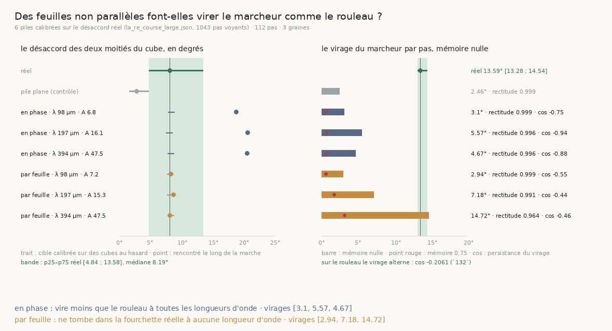

# 134 — Des feuilles non parallèles font virer le marcheur sans le faire dériver

> ⭐⭐⭐⭐ **LA FIXTURE QUE `132` A NOMMÉE EXISTE, ET ELLE EST CALIBRÉE SANS REGARDER CE QU'ON LUI
> DEMANDE.** Chaque pas d'une course garde le **désaccord des deux moitiés du cube** — l'angle
> entre les directions lues sur ses deux moitiés disjointes. Sur le rouleau il vaut **8,19°** en
> médiane [4,84 ; 13,58] sur 1043 pas voyants ; sur la pile plane **2,81°**. Une pile **froissée**
> reçoit, par bissection, l'amplitude qui rend cette médiane, à trois longueurs d'onde dérivées du
> cube — puis seulement on demande si le marcheur y vire.
>
> ⭐⭐⭐⭐ **UN FROISSEMENT PARTAGÉ PAR TOUTES LES FEUILLES NE FAIT PAS VIRER.** Désaccord reproduit
> (8,44 / 8,13 / 8,4°), virage **3,1 / 5,57 / 4,67°** par pas pour **13,59°** [13,28 ; 14,54] sur
> le rouleau, rectitude ≥ 0,9963. L'hypothèse simple de `132` — des orientations qui se disputent
> dans le cube — est réfutée.
>
> ⭐⭐⭐⭐ **UN FROISSEMENT PROPRE À CHAQUE FEUILLE, À QUATRE CUBES, FAIT VIRER AUTANT QUE LE
> ROULEAU — ET NE DÉRIVE PAS.** Virage **14,72°** par pas (0,18° au-dessus du p75 réel), mais les
> virages alternent deux fois plus (cosinus **−0,4624** contre **−0,2061**) et la rectitude reste à
> **0,9642** contre 0,8563. Ce qui fait **virer** est une orientation qui change d'une feuille à la
> suivante ; ce qui fait **dériver** est la **persistance** de ce changement, qu'aucune fixture n'a
> encore.
>
> ⭐⭐⭐ **ET LE CAP Y A UN COÛT QUE `confirme` NE VOIT PAS.** Mémoire 0,75 sur cette pile : virage
> 14,72 → **3,2°**, rectitude → 0,9931, erreur à la normale **vraie** **2,788 → 10,929°**, taux de
> confirmation **1,0 → 1,0**. Sur les piles en phase, la mémoire ne coûte rien.

## 1. Pourquoi ce fichier

`132` a éliminé l'enroulement et le bruit d'intensité comme causes du virage de 14° par pas, nommé
l'hypothèse restante — des feuilles non parallèles — et dit que la fixture manquait. `133` a couru
le cap sur le rouleau et mesuré qu'il redresse ; il ne pouvait pas dire **pourquoi** le marcheur
virait, parce que sur le vrai volume la normale vraie est inconnue. Ici elle l'est.

La règle qui commande tout le reste : **la fixture est calibrée sur une grandeur que le rouleau
mesure déjà et qui n'est pas la dérive.** Régler une pile sur la rectitude qu'elle doit reproduire
serait la faute numéro un du dépôt.

## 2. ⭐⭐⭐ La pile froissée, et ses deux variantes

`VolumeFabriqueOndulee` (dans `combien_de_pas_la_matiere_porte.py`, 101 contrôles, +13) déplace
chaque feuille le long de sa normale par une somme de trois sinusoïdes dont les vecteurs d'onde
sont **dans le plan de la feuille** : une pile froissée, dont la normale locale est le **gradient**
de la projection — connu analytiquement, vérifié par différences finies à 0,0000°. Elle ne
redéfinit que `_projection_um`, le seam prévu pour ça, et **à amplitude nulle elle est la pile
plane au bit près** — la batterie l'asserte, c'est ce qui protège tout ce que le dépôt a mesuré
sur la pile plane. ⚠ Ma première version recalculait la projection en micromètres et différait au
dernier bit : une pile « identique » qui ne l'est pas est exactement ce que ce contrôle traque.

Deux variantes, parce que la première a répondu non et que la raison se lisait dans la fixture :

- **en phase** — toutes les feuilles portent le même froissement. L'inclinaison ne change **pas**
  le long de la normale moyenne (asserté : 8,54·10⁻⁷°), donc la matière reste une fonction de la
  phase seule, et `128` s'y applique : une faille d'une feuille n'y existe pas.
- **par feuille** — chaque feuille tire ses propres phases d'onde, interpolées en douceur (raccord
  3t² − 2t³) entre deux feuilles voisines. L'inclinaison change le long de la normale (asserté :
  30,15° sur dix feuilles), et la matière cesse d'être une fonction de la phase seule : c'est la
  **première matière fabriquée du dépôt qui distingue la feuille n de la feuille n+1**.

⚠ **Un raisonnement à moi, corrigé par la mesure.** J'avais écrit que la variante en phase ne
pouvait pas faire virer un marcheur, parce qu'un marcheur qui suit la normale garde sa position
dans le plan des feuilles et voit donc une inclinaison constante — et j'avais encodé cette
conclusion dans la batterie (« par feuille vire davantage »). C'est vrai du marcheur **idéal** ;
le réel suit la normale **locale** et glisse dès que l'inclinaison est forte : à 20 µm
d'amplitude pour 197 de longueur d'onde, il vire de **29,71°** par pas en phase contre **9,2°**
par feuille. Le contrôle a été réécrit pour ne demander que ce qui est sûr — les deux piles ne
rendent pas la même marche — et c'est la calibration qui tranche.

## 3. ⭐⭐⭐⭐ La calibration : le désaccord des moitiés

| | désaccord médian | p25 | p75 | p90 |
|---|---:|---:|---:|---:|
| rouleau, `la_re_course_large` (1043 pas voyants) | **8,19°** | 4,84 | 13,58 | 23,23 |
| rouleau, `la_course_a_cap` | 7,44° | 4,2 | 12,32 | 21,75 |
| pile plane, bruit 8 (contrôle, 40 cubes) | **2,81°** | 1,67 | 4,79 | 6,6 |

La médiane réelle dépasse le **p90** de la pile plane : la calibration a quelque chose à faire.
Les longueurs d'onde sont **dérivées** du cube de lecture — 41 voxels de 2,4 µm, soit 98,4 µm —
une, deux et quatre fois son côté ; la longueur d'onde n'est pas calibrable par la même cible,
donc elle est balayée et le verdict rendu pour chacune. La bissection borne l'amplitude à
l'inclinaison de 60° et s'arrête à 0,25° de la cible :

| variante | λ (µm) | amplitude calibrée | inclinaison max | désaccord obtenu | itérations |
|---|---:|---:|---:|---:|---:|
| en phase | 98,4 | 6,781 µm | 23,41° | 8,44° | 2 |
| en phase | 196,8 | 16,106 | 27,21° | 8,13° | 6 |
| en phase | 393,6 | 47,469 | 37,15° | 8,4° | 4 |
| par feuille | 98,4 | 7,205 | 24,71° | 8,28° | 6 |
| par feuille | 196,8 | 15,258 | 25,97° | 8,25° | 5 |
| par feuille | 393,6 | 47,469 | 37,15° | 8,34° | 4 |

Six cibles atteintes, aucune au bord de la recherche. ⚠ Une cible inatteignable est **dite**
(`atteint` faux) et la figure l'écrit ; la batterie le sonde.

## 4. ⭐⭐⭐⭐ Ce que le marcheur fait alors

Trois graines, 112 pas, arrêt sur vide, les barres de `_outils` — le marcheur de `133`, sans rien
de changé. L'erreur est mesurée contre la **normale vraie**, comme `132` §5 le fait sur la
spirale, et le désaccord **rencontré** le long de la marche est publié à côté : c'est le contrôle
que la calibration tient là où le marcheur passe, pas seulement sur des cubes au hasard.



| variante | λ | virage / pas | cos des virages | rectitude | erreur à la normale vraie | désaccord rencontré | taux |
|---|---:|---:|---:|---:|---:|---:|---:|
| rouleau (`131`) | | **13,59°** [13,28 ; 14,54] | **−0,2061** | 0,8563 | inconnue | 8,19° | 0,7526 |
| pile plane | | 2,46° | | 0,9994 | | 2,81° | |
| en phase | 98,4 | 3,1° | −0,7532 | 0,999 | 4,079° | **19,0°** | 1,0 |
| en phase | 196,8 | 5,57° | −0,9352 | 0,9964 | 2,119° | **20,82°** | 1,0 |
| en phase | 393,6 | 4,67° | −0,8788 | 0,9963 | 1,836° | **20,71°** | 1,0 |
| par feuille | 98,4 | 2,94° | −0,5528 | 0,9989 | 7,713° | 8,37° | 0,9911 |
| par feuille | 196,8 | 7,18° | −0,4374 | 0,9909 | 3,961° | 8,75° | 1,0 |
| par feuille | 393,6 | **14,72°** | **−0,4624** | **0,9642** | 2,788° | 8,2° | 1,0 |

⭐⭐⭐⭐ **En phase : réfuté.** Trois piles dont les moitiés se disputent comme celles du rouleau,
et un marcheur qui vire trois fois moins et va droit à 0,996. ⚠ Le désaccord **rencontré** y vaut
19 à 21°, deux fois et demie la cible calibrée sur des cubes au hasard : le marcheur se pose là où
les moitiés se disputent le plus — il suit l'inclinaison, donc il longe les crêtes du froissement.
Cela n'aide pas l'hypothèse : même à 20° de désaccord, il ne vire pas.

⭐⭐⭐⭐ **Par feuille : le virage est reproduit à quatre cubes, la dérive non.** À λ = 98,4 le
marcheur ne voit rien (le cube moyenne le froissement) ; à 196,8 il vire à moitié ; à **393,6** il
vire de **14,72°** par pas — 1,13° au-dessus de la médiane réelle, **0,18° au-dessus du p75**.
Le verdict déclaré à l'avance dit donc « vire plus », et la règle n'a pas été déplacée pour le
faire entrer. Mais la rectitude reste à **0,9642** là où le rouleau rend **0,8563** : la pile
tourne autant et **revient** — parce que ses virages **alternent deux fois plus** que ceux du
rouleau, cosinus **−0,4624** contre **−0,2061**. Un virage qui alterne se compense ; un virage qui
persiste fait dériver. Le rouleau a les deux ; la pile n'a que le premier.

**Donc :** ce qui fait **virer** le marcheur est une orientation qui change **d'une feuille à la
suivante**, à une échelle plus grande que le cube de lecture ; ce qui le fait **dériver** est que
ce changement **persiste sur plusieurs pas**. La fixture qui manque encore est une pile dont
l'inclinaison dérive lentement sur plusieurs feuilles — un vrillage — calibrée sur le cosinus réel
des virages et jamais sur la rectitude.

## 5. ⭐⭐⭐ Le cap, là où les feuilles diffèrent

Mémoire 0 → 0,75, sur chacune des six piles :

| pile | virage | cos des virages | rectitude | erreur à la normale vraie | désaccord rencontré | taux |
|---|---:|---:|---:|---:|---:|---:|
| en phase, 98,4 | 3,1 → 0,55° | −0,7532 → −0,1516 | 0,999 → 0,9997 | 4,079 → 4,622° | 19,0 → 9,48° | 1,0 → 1,0 |
| en phase, 196,8 | 5,57 → 0,69° | −0,9352 → +0,0946 | 0,9964 → 0,999 | 2,119 → **1,825°** | 20,82 → 22,34° | 1,0 → 1,0 |
| en phase, 393,6 | 4,67 → 0,65° | −0,8788 → +0,2419 | 0,9963 → 0,9983 | 1,836 → **1,248°** | 20,71 → 20,82° | 1,0 → 1,0 |
| par feuille, 98,4 | 2,94 → 0,58° | −0,5528 → +0,1716 | 0,9989 → 0,9998 | 7,713 → 7,92° | 8,37 → 8,41° | 0,9911 → 1,0 |
| par feuille, 196,8 | 7,18 → 1,75° | −0,4374 → +0,2083 | 0,9909 → 0,9983 | 3,961 → **7,889°** | 8,75 → 7,54° | 1,0 → 1,0 |
| par feuille, 393,6 | **14,72 → 3,2°** | −0,4624 → **+0,3526** | 0,9642 → 0,9931 | **2,788 → 10,929°** | 8,2 → 6,71° | **1,0 → 1,0** |

Sur les piles **en phase**, la mémoire ne coûte rien — l'erreur à la normale vraie baisse même —
parce qu'il n'y a rien à combattre : `132` l'avait mesuré sur la spirale. Sur la pile qui
**distingue ses feuilles**, elle redresse le marcheur en l'écartant de la normale vraie de
**onze degrés**, en confirmant **chaque pas**. Le taux de confirmation ne voit rien : `confirme`
demande qu'un interstice soit franchi et que l'accord dépasse le bruit, et un pas à onze degrés
de la normale franchit l'interstice. Et le virage, de bruit qui alternait, devient un virage qui
**persiste** (cos +0,3526) — le cap fabrique la persistance que la matière n'avait pas.

⚠ Ce coût n'est pas celui que `133` mesure sur le rouleau (des marches plus courtes) : sur le
rouleau on ne peut pas mesurer l'erreur à une normale vraie qu'on ne connaît pas. Ce que `134`
montre est ce qu'un taux constant peut cacher. ⚠ Observation, pas un fait : sous mémoire 0,75 la
course réelle vire de **3,46°** [2,67 ; 4,84] par pas, la pile par feuille à quatre cubes de 3,2°.

## 6. Ce que ça change pour le graal

- ⭐⭐⭐⭐ **`R4-P27` a sa moitié.** Le virage du marcheur sur le rouleau est celui d'une matière
  dont l'orientation change d'une feuille à la suivante, à une échelle de quatre cubes : c'est
  mesuré, et ce n'est ni l'enroulement, ni le bruit, ni des orientations qui se disputent
  simplement dans le cube. La dérive demande en plus une persistance que la fixture n'a pas encore.
- ⭐⭐⭐ **`R4-P26` a enfin une matière où se poser.** Une pile dont chaque feuille a son
  froissement n'est plus une fonction de la phase seule : la faille d'une feuille y existe, et
  deux marches au même rayon peuvent y être comparées **avant** de l'être sur le rouleau.
- ⚠⚠ **Le cap n'est pas gratuit, et `confirme` est aveugle à son coût.** Onze degrés d'écart à la
  normale vraie pour un taux qui ne bouge pas : c'est la mesure la plus nette à ce jour que le
  taux de confirmation ne juge pas la direction — la quatrième fois que le dépôt le constate, et
  la première où l'écart est chiffré contre une vérité.
- ⭐ **Le programme des fixtures est ordonné** : la suivante est un vrillage lent, calibré sur le
  cosinus réel des virages (−0,2061), jamais sur la rectitude.

## 7. Les registres

Faits `R4-F70` (le froissement partagé reproduit le désaccord et ne fait pas virer), `R4-F71`
(le froissement par feuille à quatre cubes fait virer autant que le rouleau, alterne deux fois plus
et ne dérive pas), `R4-F72` (le cap écarte de la normale vraie de 10,929° à taux constant).
`R4-P27` mise à jour : le virage est expliqué, la dérive non, et la fixture suivante est nommée.
`R4-P26` mise à jour : la première matière fabriquée qui distingue ses feuilles.

## Reproduire

```bash
uv run python src/nappe/une_pile_a_feuilles_non_paralleles.py \
    --json docs/mesures/une_pile_a_feuilles_non_paralleles.json          # 228,9 s, analytique
uv run python src/figures/figure_une_pile_a_feuilles_non_paralleles.py \
    --json docs/mesures/une_pile_a_feuilles_non_paralleles.json \
    --sortie docs/images/134_des_feuilles_non_paralleles.png
uv run python src/nappe/une_pile_a_feuilles_non_paralleles.py --verifier   # 24 contrôles
uv run python src/figures/figure_une_pile_a_feuilles_non_paralleles.py --verifier   # 17
uv run python src/nappe/combien_de_pas_la_matiere_porte.py --verifier      # 101
```

⚠ Tout est analytique sauf la lecture du désaccord réel, prise dans les courses gardées de `131`
et `133` — zéro lecture distante. La fixture vit dans le module qui porte le marcheur, à côté de la
pile plane, de la faille et de la spirale : un second module de fixtures serait deux définitions
de « une pile », libres de ne pas s'accorder.
