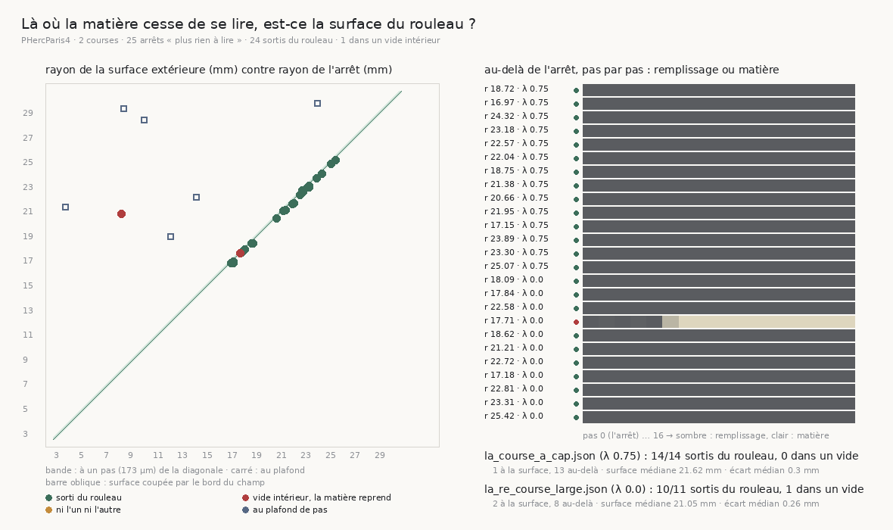

# 135 — Là où la matière cesse de se lire, c'est la surface du rouleau : une marche arrêtée est une marche arrivée

> ⭐⭐⭐⭐ **PERSONNE N'ÉTAIT ALLÉ REGARDER L'ENDROIT.** `131` a lu « plus rien à lire » comme *le
> volume qui cesse de répondre* ; `133` a déplacé la question du graal vers « pourquoi la matière
> cesse de se lire ». Or `rien_lu` a une définition exacte : le cube de lecture est **constant**,
> donc entièrement au remplissage du volume masqué — et un volume masqué est au remplissage là où il
> n'y a **pas de rouleau**. La question était géométrique.
>
> ⭐⭐⭐⭐ **LES ARRÊTS SONT LA SURFACE EXTÉRIEURE DU ROULEAU.** Course à cap : **14 arrêts sur 14**
> sortis du rouleau, écart médian à la surface **0,3 mm**, remplissage sur les seize pas suivants.
> Course sans cap : **10 sur 11**, écart médian **0,26 mm** ; le onzième est à **0,11 mm** de la
> surface avec 2,8 % de matière dans le cube suivant. Deux mesures sans hypothèse commune, sur
> vingt-cinq arrêts, et elles disent la même chose.
>
> ⭐⭐⭐⭐ **DONC UNE MARCHE « ARRÊTÉE » EST UNE MARCHE ARRIVÉE.** Elle a traversé le rouleau de son
> départ à l'extérieur. Et les marches au plafond sont exactement celles qui **n'ont pas** atteint la
> surface : sept marches revenues sur elles-mêmes **5,79 à 21,06 mm** avant elle. La portée n'est
> bornée ni par le budget ni par le volume — par le retour sur soi, que le cap supprime :
> **14 sorties sur 16** avec cap, **11** sans.
>
> ⚠⚠ **`R4-F62` se relit à l'envers, et le second verdict de `133` se retourne.** « Le cap
> raccourcit la marche » veut dire « le cap arrive plus tôt à la surface ». Il ne coûte pas de
> portée ; il traverse le rouleau en moins de pas.

## 1. Pourquoi ce fichier

Trois tranches ont mesuré que ce qui arrête la plupart des marches longues est « plus rien à lire »,
et l'ont lu comme une borne du **volume** — une région qui ne répond plus, un défaut de matière ou
de chargement (`R4-P22`). Aucune n'avait relu l'endroit. Le coût d'une lecture ayant été divisé par
vingt-six (`133`), relire vingt-cinq arrêts et lancer vingt-cinq rayons vers l'extérieur coûte vingt
minutes.

## 2. ⭐⭐⭐ Deux mesures qui ne partagent aucune hypothèse

`ou_la_matiere_cesse_de_se_lire.py` (15 contrôles) reprend chaque marche des deux courses à plafond
112 — `la_re_course_large` (λ = 0) et `la_course_a_cap` (λ = 0,75) — avec sa position d'arrêt (la
trace de `133` quand elle existe, sinon reconstruite depuis les étapes), la direction de son dernier
pas, et l'axe de sa bande tel que `107` l'a posé : le départ moins le radial fois le rayon.

- **Au-delà** : dix-sept cubes de lecture le long de la dernière direction, du pas 0 (l'arrêt) au
  pas 16 (2,8 mm). La part de voxels au remplissage est publiée à chaque pas ; « la matière reprend »
  est le premier cube qui n'est pas entièrement au remplissage. Un vide intérieur d'un rouleau fait
  quelques centaines de micromètres ; seize pas de remplissage ne sont plus un vide.
- **La surface** : un rayon lancé depuis l'axe de la bande **à travers le point d'arrêt**, sondé par
  un cube de 5 voxels tous les 50 µm jusqu'à 45 mm ou au bord du champ. La surface extérieure est le
  **dernier** échantillon qui porte de la matière — « dernier » et non « premier vide », sinon un
  vide intérieur passerait pour la surface, alors que le remplissage extérieur, lui, persiste jusqu'au
  bord. Une matière qui va jusqu'au bord du champ est **dite coupée** : c'est le scan qui finit, pas
  le rouleau (aucun des 32 rayons ne l'a été).

Le verdict, déclaré avant la mesure : un arrêt à **un pas** (173 µm) de la surface lue sur son propre
rayon, sans matière au-delà, est **sorti du rouleau** ; plus loin que la surface, sans matière, il est
sorti aussi ; de la matière qui reprend est un **vide intérieur**. La tolérance n'est pas un réglage,
c'est la résolution de la marche elle-même. La batterie construit un rouleau à rayon connu, avec et
sans coquille de vide, et sonde les deux issues ; un rouleau qui remplit le champ est dit coupé par le
bord, un rayon sans matière est indécidable.

## 3. ⭐⭐⭐⭐ Les arrêts sont la surface



| course | arrêts « plus rien à lire » | sortis du rouleau | à la surface | au-delà | vide intérieur | écart médian | surface médiane | arrêt médian |
|---|---:|---:|---:|---:|---:|---:|---:|---:|
| `la_course_a_cap` (λ = 0,75) | 14 | **14** | 1 | 13 | 0 | **0,3 mm** | 21,62 mm | 21,99 mm |
| `la_re_course_large` (λ = 0) | 11 | **10** | 2 | 8 | 1 | **0,26 mm** | 21,05 mm | 21,21 mm |

Vingt-quatre arrêts sur vingt-cinq. Treize des quatorze arrêts à cap sont « au-delà » plutôt qu'« à la
surface », et l'écart le dit : **0,22 à 0,39 mm**, soit un à deux pas — la position d'arrêt est celle
d'**après** le dernier pas confirmé, le cube suivant tombe entièrement dehors. Le rayon lancé, lui,
rend le dernier échantillon avec matière : les deux mesures s'accordent à un pas près, ce qui est
exactement ce qu'elles peuvent faire de mieux.

Le vingt-cinquième — course λ = 0, départ à 13,27 mm — s'arrête à **0,11 mm** de la surface et la
matière « reprend » au pas 1 : les parts au remplissage sur les six premiers pas valent
1,0 / 0,972 / 1,0 / 0,967 / 1,0 / 0,269. C'est une surface **effleurée**, pas un vide : la dernière
direction rase un bord irrégulier et le cube suivant en attrape 2,8 %. Le verdict déclaré le range
dans « vide intérieur » ; la règle n'a pas été déplacée pour le faire entrer, et le lecteur voit ce
qu'il en est.

⚠ **La surface n'est pas à un rayon** : sur les rayons des vingt-cinq arrêts elle va de **16,8** à
**29,75 mm**. C'est le rouleau écrasé de `90`, et c'est exactement pourquoi `116` réfutait une
frontière **radiale** : il cherchait la surface à un rayon fixe, et elle n'y est pas.

## 4. ⭐⭐⭐⭐ Les marches au plafond sont celles qui ne sont pas arrivées

| course | départ | fin | arrêt | surface sur son rayon | écart |
|---|---:|---|---:|---:|---:|
| cap | 4,07 mm | plafond | 12,05 mm | 18,95 mm | **−6,9** |
| cap | 8,02 | plafond | 9,92 | 28,4 | **−18,48** |
| λ = 0 | 4,07 | plafond | 3,51 | 21,3 | **−17,79** |
| λ = 0 | 8,02 | sortie du volume | 8,09 | 20,75 | −12,66 |
| λ = 0 | 9,4 | plafond | 8,24 | 29,3 | **−21,06** |
| λ = 0 | 11,57 | plafond | 23,96 | 29,75 | **−5,79** |
| λ = 0 | 15,46 | plafond | 14,16 | 22,1 | **−7,94** |

Sept marches, et aucune n'est près de la surface. Ce sont les marches que `130` a décrites : le net
culmine puis retombe, la marche revient sur elle-même. Le plafond de 112 pas avait été **dérivé** pour
traverser l'étendue radiale de la campagne ; une marche qui le touche à 12 mm de l'axe a fait le chemin
sans faire la route.

## 5. Ce que ça retourne

- ⭐⭐⭐⭐ **`R4-F62` se relit à l'envers.** « Ce qui arrête onze marches sur seize n'est pas le plafond
  mais le volume qui cesse de répondre » — c'est le rouleau qui **finit**. Le budget de bandes n'achète
  pas des marches au plafond parce que les marches qui vont droit **sortent avant**. Le compte de `131`
  est juste ; sa lecture était inversée.
- ⭐⭐⭐⭐ **Le second verdict de `133` se retourne.** « Le cap raccourcit la marche » : il la fait
  **arriver plus tôt** — 14 sorties sur 16 contre 11, en 46,5 pas médians contre 58,5. Ce que `133`
  comptait comme le coût du cap est sa réussite. Le premier verdict tient, et le troisième — le net
  des deux marches au plafond culmine avant le plafond — tient aussi : ces deux marches sont
  précisément celles qui ne sont pas arrivées.
- ⭐⭐⭐ **`R4-P22` a sa réponse pour les courses longues** : le vide est le rouleau, son extérieur, et
  la frontière n'est pas radiale parce que le rouleau n'est pas rond. ⚠ Les 178 pas aveugles de `115`
  — vingt pas, sans arrêt sur vide, à tous les rayons — n'ont pas été relus ; ce que cette tranche
  établit porte sur les arrêts des courses à plafond 112.
- ⭐⭐⭐ **La portée change de sens.** Elle n'est bornée ni par le budget ni par le volume, mais par le
  **retour sur soi** (`R4-F74`) — et le cap le supprime. Ce qui reste à juger d'une traversée n'est
  plus « jusqu'où » mais **quoi** : le taux de confirmation le long du chemin (0,7355 avec cap), et
  l'identité des feuilles traversées (`R4-P26`).
- ⚠ **Ce que ça ne dit pas** : qu'une traversée est *juste*. Un marcheur qui traverse jusqu'à
  l'extérieur en confirmant trois pas sur quatre a franchi les feuilles ; il n'a pas prouvé qu'il a
  compté les bonnes.

## 6. Les registres

Faits `R4-F73` (les arrêts sont la surface extérieure : 24/25, écarts médians 0,3 et 0,26 mm) et
`R4-F74` (les marches au plafond sont celles qui ne sont pas arrivées : 5,79 à 21,06 mm sous la
surface). Notes de `R4-F62` et `R4-F68` retournées. Portes `R4-P22` (répondue pour les courses
longues) et `R4-P20` (la portée est bornée par le retour sur soi) mises à jour.

## Reproduire

```bash
uv run python src/nappe/ou_la_matiere_cesse_de_se_lire.py \
    --json docs/mesures/ou_la_matiere_cesse_de_se_lire.json     # 1209,0 s, 25 arrêts + 7 marches
uv run python src/figures/figure_ou_la_matiere_cesse_de_se_lire.py \
    --json docs/mesures/ou_la_matiere_cesse_de_se_lire.json \
    --sortie docs/images/135_la_surface_du_rouleau.png
uv run python src/nappe/ou_la_matiere_cesse_de_se_lire.py --verifier        # 15 contrôles
uv run python src/figures/figure_ou_la_matiere_cesse_de_se_lire.py --verifier   # 17
```

⚠ Les positions d'arrêt de la course à cap viennent de sa **trace** (`133`) ; celles de la course
λ = 0 sont reconstruites depuis les étapes, à l'arrondi près que `le_marcheur_derive_t_il` borne à
quelques micromètres. L'axe d'une bande est un point, pas la courbe de `90` : assez pour un rayon à un
pas près, pas pour une carte.
