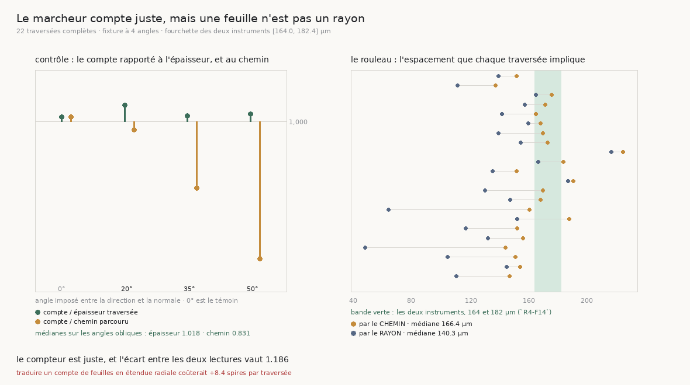

# 136 — Le marcheur compte juste, mais une feuille n'est pas un rayon

> ⭐⭐⭐⭐ **LA QUESTION DU GRAAL, ENFIN POSABLE.** Transférer de spire à spire demande de compter
> les spires ; un dérouleur qui se trompe de compte se décale d'autant. Personne n'avait mesuré ce
> compte, parce qu'il fallait d'abord savoir **où** une marche finit — ce que `135` a établi : une
> marche traverse de son rayon de départ à la surface extérieure. L'étendue traversée est donc
> connue, l'espacement des feuilles de ce rouleau est mesuré par **deux instruments indépendants**
> (`R4-F14` : **164 µm** par les transferts humains, **182,4** par l'atlas), et le marcheur publie
> son compte à chaque pas.
>
> ⭐⭐⭐⭐ **LE COMPTEUR EST JUSTE, ET C'EST UNE FIXTURE QUI LE DIT.** Sur une pile dont la normale
> est connue, direction **imposée** à 0, 20, 35 et 50° : le compte rend l'**épaisseur** traversée
> (1,011 / 1,041 / 1,014 / **1,018**) et non la distance parcourue (1,011 / 0,978 / 0,831 /
> **0,654**). Et un chemin qui **alterne** ne le fait pas recompter : écart médian **−0,009**,
> témoin à angle nul exactement zéro.
>
> ⭐⭐⭐⭐ **SUR LE ROULEAU, SON COMPTE S'ACCORDE À L'ESPACEMENT HUMAIN — LE LONG DE SON CHEMIN.**
> Vingt-deux traversées : l'espacement impliqué par le **chemin** vaut **166,4 µm**, dans la
> fourchette [164 ; 182,4]. Celui impliqué par le **rayon** vaut **140,3 µm**, sous la fourchette.
> Le rapport des deux est **1,186** — et `la_normale_nest_pas_le_rayon` publie un 1/cos médian de
> **1,184** entre la normale de la matière et le rayon.
>
> ⚠⚠ **DONC LE MARCHEUR NE SE TROMPE PAS DE COMPTE : IL COMPTE DES FEUILLES, ET UNE FEUILLE N'EST
> PAS UN RAYON.** Traduire son compte en étendue radiale coûterait **+8,4 spires** médianes par
> traversée (+13,0 à 182,4 µm). C'est l'erreur qu'un dérouleur ferait en confondant les deux, pas
> une erreur de l'instrument.

## 1. Pourquoi ce fichier, et ce qu'il a fallu retourner trois fois

Ce document a changé de conclusion trois fois, et chaque fois c'est une mesure qui l'a fait — pas
une relecture. Les trois sont écrites ici parce que chacune est une façon de se tromper que le
dépôt peut repayer.

1. **« Le marcheur sur-compte de 8,4 spires. »** Vrai comme arithmétique, faux comme lecture : le
   compte n'est comparable à une étendue radiale que si les feuilles sont perpendiculaires au rayon.
2. **« Le marcheur compte le long de son chemin au lieu de l'épaisseur. »** C'était un mécanisme
   plausible et bien étayé : le sur-comptage médian vaut **1,169** pour une obliquité médiane de
   **1,154**, les deux varient ensemble à rho **+0,8952** (p 2·10⁻⁸) et leur écart apparié est
   indiscernable de zéro (**−0,0161**, Wilcoxon p **0,6556**) ; le marcheur compte **0,9857**
   feuille par 164 µm de chemin. La fixture l'a pourtant réfuté : à 50° d'obliquité le compte suit
   l'épaisseur à 1,8 % près. ⚠ Deux grandeurs peuvent être numériquement égales sans que l'une soit
   la cause de l'autre, et aucune quantité de p ne remplace un contrôle sur une matière connue.
3. **« Une fréquence est positive, donc un aller-retour compte double. »** Structurellement
   séduisant — `feuilles_franchies` ajuste une fréquence, qui ne peut pas être négative. Le zigzag
   l'a réfuté : écart **−0,009**.

Ce qui reste après les trois est plus solide que ce qui les a précédées, et plus intéressant.

## 2. ⭐⭐⭐ Le compte n'est pas une division

`feuilles_franchies` (de `98`) ajuste une famille de cosinus au **profil d'intensité lu** sur le
segment et rend la fréquence qui colle. Aucun espacement n'y entre : la comparaison à 164 µm n'est
donc pas tautologique. La fraction est **refusée** sous un tiers de période et **dite en butée**
au-delà de la fenêtre, donc la somme d'une marche est une **borne inférieure** — et l'espacement
qu'elle implique une borne **supérieure**. Un compte jugé trop grand l'est d'autant plus sûrement.

## 3. ⭐⭐⭐⭐ La fixture : le compteur est juste

Une pile plane, normale connue, **direction imposée** à un angle connu d'elle. L'épaisseur vraie
traversée est la projection du déplacement sur la normale — un nombre exact.

| angle à la normale | pas | chemin | épaisseur | comptées | compte / épaisseur | compte / chemin |
|---:|---:|---:|---:|---:|---:|---:|


| 0° (témoin) | 20 | 3693,5 µm | 3693,5 | 21,58 | **1,011** | 1,011 |
| 20° | 20 | 3727,6 | 3502,8 | 21,07 | **1,041** | 0,978 |
| 35° | 19 | 5804,3 | 4754,6 | 27,87 | **1,014** | 0,831 |
| 50° | 20 | 5440,9 | 3497,3 | 20,57 | **1,018** | **0,654** |

Le compte suit l'épaisseur jusqu'à cinquante degrés ; s'il suivait le chemin, la dernière colonne
vaudrait un et l'avant-dernière 1,56. ⚠⚠ **Et il a fallu une mesure pour rendre ce contrôle
capable d'échouer** : ma première version lançait le marcheur sur un axe fixe en croyant que
l'obliquité de la pile ferait l'angle — or `marcher` **lit** sa direction à chaque pas et se remet
aussitôt sur la normale. Chemin et épaisseur sortaient égaux à 0,1 % pour une pile à 35°, et le
contrôle ne distinguait rien. Il faut `interroge_la_matiere=False` — la direction du témoin naïf
de `102` — pour que la direction imposée soit effective.

**Et le zigzag**, parce qu'un compte qui serait juste en ligne droite pourrait ne pas l'être quand
la direction alterne, ce que le vrai marcheur fait (`132` : cos des virages −0,2061) :

| angle | droit | zigzag symétrique | écart |
|---:|---:|---:|---:|
| 0° (témoin) | 1,011 | 1,011 | **+0,0** |
| 20° | 1,04 | 1,022 | −0,018 |
| 35° | 1,039 | 1,038 | −0,001 |

Écart médian sur les angles obliques : **−0,009**. Le témoin à angle nul vaut exactement zéro, donc
ce qui est mesuré est bien l'alternance et pas autre chose.

## 4. ⭐⭐⭐⭐ Sur le rouleau : deux espacements, un seul accord

Vingt-deux traversées complètes — les marches des deux courses de `133` que `135` déclare sorties du
rouleau — coupées à leur premier pas aveugle. **20 sur 22 sont monotones en rayon** (retour maximal
1,836, les deux exceptions étant les marches sans cap que `133` montrait revenant sur elles-mêmes).

| | espacement impliqué | fourchette [164 ; 182,4] |
|---|---:|---|
| par le **chemin** parcouru | **166,4 µm** [137,1 ; 225,1] | **dedans** |
| par l'**étendue radiale** | **140,3 µm** [46,8 ; 217,0] | **dessous** |

Le compte du marcheur s'accorde donc à ce que les transferts humains mesurent — **à 1,5 %** — quand
on le rapporte à la distance qu'il a réellement parcourue. Rapporté à l'étendue radiale, il implique
un espacement 18,6 % trop petit, ce qui se lit comme **+8,4 spires** d'erreur médiane par traversée
(**+13,0** à 182,4 µm). Ces deux lectures sont le même nombre, et une seule est une erreur.

⚠ Le rapport des deux espacements vaut **1,186**. `la_normale_nest_pas_le_rayon` mesure que la
normale de la matière est à **34,6°** du rayon (`R4-F16`) et publie un 1/cos médian de **1,184**.
Les deux se rencontrent au millième — ce qui est exactement le genre de coïncidence que `94` a payée
avec la sagitta, donc elle est **ouverte comme une porte** (`R4-P28`) et non rangée comme un fait :
le même module a **réfuté** que cette obliquité explique le pas, en le mesurant localement (pas
normal / pas radial = **1,018**, corrélation au 1/cos **0,153**). Une mesure locale et un cumul sur
cinquante feuilles ne disent pas la même chose, et ce document ne tranche pas laquelle a le dernier
mot.

## 5. ⭐⭐⭐ Le cap, troisième effet

Apparié bande par bande, sur les neuf bandes communes aux deux courses :

| | sans cap | avec cap |
|---|---:|---:|
| écart au compte radial (à 164 µm) | 11,6 spires | **5,3** |
| espacement impliqué par le rayon | 116,4 µm | **154,4** |
| espacement impliqué par le chemin | 154,1 µm (dessous) | **169,7 µm (dedans)** |

**7 bandes sur 9**, p **0,03906**. `133` avait mesuré que le cap redresse et fait arriver plus tôt ;
il rapproche aussi le chemin de la normale, donc le compte du marcheur d'un compte radial. Et sans
cap, l'espacement impliqué par le chemin tombe **sous** la fourchette : une marche qui serpente
franchit plus de feuilles que sa distance n'en contient, ce qui est la signature d'un chemin qui
n'est plus perpendiculaire à la matière.

## 6. Ce que ça change pour le graal

- ⭐⭐⭐⭐ **Le compteur de feuilles n'est pas ce qu'il faut remplacer.** Il est juste à 1,8 % près
  jusqu'à cinquante degrés, en ligne droite comme en zigzag. Ce qui manquait au dérouleur n'est pas
  un meilleur compteur.
- ⭐⭐⭐⭐ **Ce qu'il faut, c'est la conversion feuilles → rayons**, et elle vaut **1,186** sur ces
  traversées au lieu de un. Un dérouleur qui poserait ses spires en divisant une étendue radiale par
  un espacement se décalerait de huit spires par traversée. C'est la première fois que la campagne
  chiffre ce que l'humain corrige, et ce n'est pas ce qu'on croyait qu'il corrigeait.
- ⭐⭐ **Le cap gagne un troisième effet** : il ramène ce facteur de 1,41 à 1,06.
- ⚠⚠ **Et une porte s'ouvre sur un fait réfuté** (`R4-P28`) : l'obliquité de la normale est
  invisible sur une cellule et visible sur une traversée. Ce qui la trancherait est une matière dont
  l'obliquité est connue **et cumulative** — la spirale du dépôt a la sienne à 0,09° du rayon, donc
  elle ne peut pas servir.

## 7. Les registres

Faits `R4-F75` (le compteur est juste : épaisseur et non chemin, jusqu'à 50°, zigzag compris),
`R4-F76` (le compte s'accorde à l'espacement humain le long du chemin, 166,4 µm, et pas le long du
rayon, 140,3) et `R4-F77` (le cap divise par deux l'écart, 7/9, p 0,03906). Porte neuve `R4-P28` :
pourquoi l'obliquité se voit-elle sur une traversée et pas sur une cellule ?

## Reproduire

```bash
uv run python src/nappe/combien_de_feuilles_le_marcheur_croit_franchir.py \
    --json docs/mesures/combien_de_feuilles_le_marcheur_croit_franchir.json
uv run python src/figures/figure_combien_de_feuilles_le_marcheur_croit_franchir.py \
    --json docs/mesures/combien_de_feuilles_le_marcheur_croit_franchir.json \
    --sortie docs/images/136_une_feuille_nest_pas_un_rayon.png
uv run python src/nappe/combien_de_feuilles_le_marcheur_croit_franchir.py --verifier  # 30 contrôles
uv run python src/figures/figure_combien_de_feuilles_le_marcheur_croit_franchir.py --verifier  # 15
```

⚠ Zéro lecture distante : tout vient des deux courses de `133`, du verdict de `135` et de deux piles
fabriquées. ⚠ Les deux espacements de `R4-F14` voyagent toujours ensemble : ils diffèrent de 11 %,
c'est-à-dire de l'ordre de l'effet cherché, et un verdict qui ne tiendrait que pour l'un ne serait
pas un verdict.
