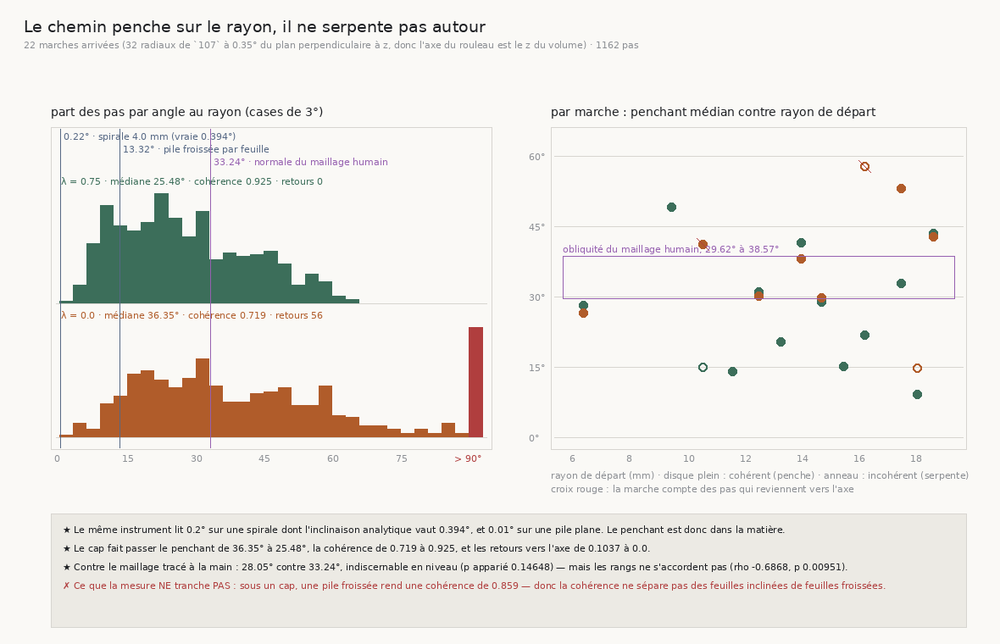

# 137 — Le chemin penche sur le rayon, il ne serpente pas autour

> ⭐⭐⭐⭐ **CE QUE `136` A LAISSÉ SANS RÉPONSE, ET QUI NE COÛTE PAS UNE LECTURE DE PLUS.** `136`
> mesure que ce qui manque au dérouleur n'est pas un meilleur compteur mais la conversion
> feuilles → rayons, qui vaut **1,186**. Ce nombre est un **cumul** : le chemin parcouru divisé par
> l'étendue radiale traversée, sur une cinquantaine de feuilles. Personne n'était allé voir de quoi
> il est fait. Or les deux courses de `133` portent, pas par pas, la direction que le marcheur a
> prise — donc l'angle entre ce pas et le rayon se lit sans rouvrir le volume.
>
> ⭐⭐⭐⭐ **LE CHEMIN PENCHE DE 25,48° SUR LE RAYON, ET C'EST DANS LA MATIÈRE.** Sur les treize
> marches arrivées de la course à cap, **622 pas** : médiane **25,48°**, quartiles
> [**16,23** ; **38,08**], p90 **48,36°**. Le **même instrument** lit **0,22°** sur une spirale
> dont l'inclinaison analytique vaut **0,394°**, **0,08°** à dix-huit millimètres pour **0,088°**
> analytiques, et **0,01°** sur une pile plane. Il ne fabrique donc pas le penchant qu'il mesure :
> il le lit.
>
> ⭐⭐⭐⭐ **ET IL PENCHE, IL NE SERPENTE PAS.** La cohérence tangentielle — le déplacement non
> radial **net** divisé par le chemin non radial **parcouru** — vaut **0,925** avec cap et
> **0,719** sans. Deux marches de même angle médian peuvent rendre 1 et 0 ; le rouleau rend 0,925.
> Le marcheur glisse toujours du même côté en traversant.
>
> ⭐⭐⭐ **ET IL GLISSE LE LONG DU ROULEAU PLUS QU'AUTOUR.** Part axiale **0,334** contre part
> azimutale **0,193** (avec cap), et le sens **n'est pas préféré** : **6 bandes sur 13** vers les
> z croissants, p **1,0**. Ce n'est donc pas un biais de l'instrument — chaque bande choisit son
> côté.
>
> ⭐⭐⭐⭐ **LE CAP SUPPRIME ENTIÈREMENT LES RETOURS VERS L'AXE** : **0 pas sur 622** avec cap,
> **56 sur 540** (10,37 %) sans. C'est la lecture géométrique de « le cap redresse la marche »
> (`133`) : il n'empêche pas de pencher, il empêche de **reculer**.
>
> ⚠⚠ **CE QUE LA MESURE NE TRANCHE PAS, ET IL FAUT LE DIRE.** Sous un cap, une pile **froissée**
> calibrée par `134` sur le désaccord réel rend une cohérence de **0,859** contre **0,925** pour le
> rouleau. La cohérence dit donc qu'un chemin penche à l'échelle d'une marche ; elle ne dit **pas**
> si c'est parce que les feuilles sont inclinées ou parce qu'elles sont froissées. C'est exactement
> la fixture que `R4-P28` demande et qui n'existe toujours pas.

## 1. Pourquoi ce fichier

`136` a déplacé la question du graal : le compteur de feuilles du marcheur est juste, et ce qui
manque au dérouleur est la **conversion feuilles → rayons**. Le facteur mesuré, **1,186**, est le
rapport du chemin à l'étendue radiale sur une traversée entière. Un tel rapport a deux lectures que
le cumul ne sépare pas :

- le chemin **penche** — chaque pas est oblique du même côté, le marcheur glisse le long de la
  feuille en la traversant. Un penchant se corrige par une rotation connue ;
- le chemin **serpente** — les pas sont obliques de part et d'autre et s'annulent. Un serpentement
  est du bruit, et un bruit ne se transporte pas d'un rouleau à l'autre.

Les deux rendent exactement le même 1,186. Distinguer coûte zéro lecture : les courses gardées
portent `direction` et `avance_um` à chaque pas.

⚠⚠ **Ce qui serait tautologique, et qui n'est donc pas un verdict ici.** `chemin / étendue` et la
moyenne de `1/cos(θ)` sur les pas sont la **même quantité écrite deux fois**. Les publier côte à
côte et constater qu'elles s'accordent ne mesurerait rien. Ce qui se mesure est la **forme** de la
distribution, la **cohérence** de la part non radiale, et sa répartition entre l'azimut et l'axe.

## 2. Le repère, et pourquoi il n'est pas celui de `135` et `136`

`135` et `136` mesurent le rayon comme la distance à un **point** — l'axe d'une bande au sens de
`107`, le départ moins le radial fois le rayon. Sur une traversée franche c'est suffisant ; pour
décomposer un pas, ça ne l'est pas : **un pas qui glisse le long de l'axe du rouleau éloigne de ce
point sans rien traverser**, donc il serait compté comme du rayon.

Le repère est donc cylindrique : `rho` est la distance à la **droite** passant par l'axe de la
bande et parallèle à l'axe du rouleau. Reste à savoir où est cet axe — et c'est **mesuré** plutôt
que supposé. Les radiaux que `107` a posés viennent de la courbe de l'ombilic (`90`), transportée
dans le volume fin ; ils tombent à **0,35°** du plan perpendiculaire au z du volume (max
**0,404°**) sur les **32** radiaux des deux courses. L'axe du rouleau est donc le z du volume dans
ce repère, et la batterie fait échouer ce contrôle sur un repère où ce n'est pas vrai.

L'écart entre les deux lectures est publié plutôt que tu : la lecture sphérique **surestime**
l'étendue radiale d'un facteur **1,0098** médian, **1,1922** au plus. La correction va dans le sens
qui **renforce** `136` — une étendue plus petite rend l'espacement impliqué par le rayon plus petit
encore, donc encore plus loin sous la fourchette des instruments.

## 3. ⭐⭐⭐⭐ La distribution, et ce que la fixture lui donne comme échelle



| course | marches arrivées | pas | penchant médian | [q1 ; q3] | p90 | retours vers l'axe | cohérence |
|---|---:|---:|---:|---|---:|---:|---:|
| `la_course_a_cap` (λ = 0,75) | 13 | 622 | **25,48°** | [16,23 ; 38,08] | 48,36° | **0** (0,0) | **0,925** |
| `la_re_course_large` (λ = 0) | 9 | 540 | **36,35°** | [23,11 ; 57,09] | 92,72° | **56** (0,1037) | **0,719** |

Un angle seul ne dit rien tant qu'on ne sait pas ce que l'instrument rend sur une matière connue.
Le même marcheur, sur les fixtures du dépôt :

| matière | inclinaison vraie, départ → arrivée | lu (λ = 0 / 0,75) | cohérence |
|---|---:|---:|---:|
| spirale, r = 4 mm | **0,394°** → 0,144° | 0,22 / 0,20° | 1,0 |
| spirale, r = 10 mm | **0,158°** → 0,093° | 0,12 / 0,11° | 1,0 |
| spirale, r = 18 mm | **0,088°** → 0,067° | 0,08 / 0,07° | 1,0 |
| pile plane | 0 | 0,01 / 0,01° | 1,0 |
| pile froissée par feuille (`134`) | — | 13,32 / 13,29° | 0,647 / **0,859** |

⚠ L'inclinaison d'une spirale **décroît en 1/ρ**, donc une marche qui s'éloigne de huit millimètres
ne rencontre pas *une* inclinaison mais un intervalle : c'est pourquoi le tableau porte les deux
bouts. La borne que la batterie tient est celle-là et elle est **dérivée** : l'angle lu ne peut pas
dépasser celui du **départ**, puisque tout ce que la marche rencontre ensuite est plus petit. Six
marches sur six la respectent.

L'instrument reste sous le dixième de degré là où la matière est plane, **suit la loi du rayon** de
la spirale (0,22 → 0,12 → 0,08 quand l'analytique fait 0,394 → 0,158 → 0,088), et rend **25,48°**
sur le rouleau. Le penchant est dans la matière.

⚠⚠ **Une borne que j'avais d'abord écrite plus forte, et que la mesure a refusée.** J'avais posé
« la lecture tombe dans l'intervalle [arrivée ; départ] ». À quarante pas elle y tombe (0,22 pour
[0,144 ; 0,394]) ; à huit pas elle tombe **dessous** (0,25 pour [0,293 ; 0,394] — ces deux nombres
sont ceux que la batterie imprime, elle tourne la fixture à huit pas pour rester rapide). Le contrôle
n'était donc satisfait que par la **largeur** de sa borne, c'est-à-dire par la longueur de la
marche — et un contrôle satisfait par la largeur de sa borne ne contrôle rien. Ce qui reste est ce
qui mord : jamais au-dessus du départ, jamais négatif, et la décroissance suivie.

⚠ Reste que l'instrument lit systématiquement **moins** que la moyenne de l'intervalle. Ce n'est
pas une correction appliquée : c'est ce que rend un marcheur dont chaque pas est la direction lue
dans un cube, sur une matière dont l'inclinaison vaut une fraction de la barre de son propre
détecteur d'accord. Ce qui compte pour l'échelle est l'ordre de grandeur — **un facteur cent**
entre la spirale et le rouleau — et le fait que la loi du rayon soit suivie.

## 4. ⭐⭐⭐⭐ Penchant ou serpentement : la cohérence

La cohérence tangentielle vaut le déplacement non radial **net** divisé par le chemin non radial
**parcouru**. Elle ne dépend pas de l'angle : deux marches de même angle médian rendent **1,0** si
elles penchent toujours du même côté et **0,008** si elles alternent — ce que la batterie vérifie
sur deux marches fabriquées plutôt que de l'affirmer.

Le rouleau rend **0,925** avec cap (minimum 0,469 sur treize marches) et **0,719** sans (minimum
0,179). Le chemin penche.

⚠⚠ **Et c'est là que la mesure s'arrête.** Sous un cap, la pile froissée de `134` — dont les
feuilles ne sont *pas* inclinées, seulement ondulées, et dont l'amplitude a été calibrée sur le
désaccord des moitiés **réel** — rend une cohérence de **0,859**. Une ride est plus longue qu'un
pas, donc le cap la lisse en un penchant apparent. « Le chemin penche » est donc établi ; « les
feuilles sont inclinées » ne l'est pas par cette mesure. La batterie **fige** cette limite : elle
asserte que la cohérence ne sépare **pas** les deux, pour qu'un document ne puisse pas affirmer le
contraire un jour.

## 5. ⭐⭐⭐ De quel côté : l'axe plutôt que l'azimut

| course | part axiale &#124;d·ẑ&#124; | part azimutale &#124;d·φ̂&#124; | glissement axial par pas | sens axial préféré |
|---|---:|---:|---:|---|
| λ = 0,75 | **0,334** | 0,193 | **43,2 µm** | 6/13, p **1,0** |
| λ = 0 | 0,348 | 0,405 | 57,5 µm | 6/9, p 0,5078 |

Avec cap, la part non radiale du pas est **plus axiale qu'azimutale** : le marcheur glisse le long
de la **longueur** du rouleau en traversant, davantage qu'autour. Et le sens n'est pas préféré —
six bandes sur treize vers les z croissants, p **1,0** — donc ce n'est pas une anisotropie du
volume ni un biais du chercheur de direction, qui donneraient le même signe partout. Chaque bande
choisit son côté.

⭐ Le maillage humain dit la même chose en proportion inverse : `la_normale_nest_pas_le_rayon`
publie **14,62°** d'angle dû à z et **24,04°** dans le plan. Les deux instruments s'accordent sur
le fait qu'il y a une composante axiale franche, et pas sur son poids.

## 6. ⭐⭐⭐ Contre le maillage tracé à la main

Deux instruments qui ne partagent aucune hypothèse : l'un lit l'intensité du volume et rend une
direction de pas, l'autre est la normale d'une surface **segmentée à la main**, mesurée bande par
bande par `la_normale_nest_pas_le_rayon`.

| course | penchant médian | maillage médian | écart | p apparié | rho des rangs | p |
|---|---:|---:|---:|---:|---:|---:|
| λ = 0,75, 13 bandes | 28,05° | 33,24° | **−4,44°** | **0,14648** | **−0,6868** | **0,00951** |
| λ = 0, 9 bandes | 38,05° | 33,01° | +5,62° | 0,42578 | +0,0 | 1,0 |

⭐ **Le NIVEAU est indiscernable** : avec cap, 28,05° contre 33,24°, p apparié 0,14648. Le penchant
que le marcheur lit dans l'intensité vaut l'obliquité que des humains ont tracée.

⚠⚠ **La PLACE ne l'est pas** : bande par bande, les rangs sont **anti-corrélés** (rho −0,6868,
p 0,00951). C'est un accord de niveau, pas un accord local, et les confondre serait le piège que
`136` a payé avec un rho de 0,8952 qui ne prouvait pas la cause qu'on lui prêtait. ⚠ La portée de
ce test des rangs est faible et c'est dit : les angles du maillage tiennent dans **neuf degrés**
(29,62 à 38,57) quand ceux du marcheur en couvrent **quarante** (9,22 à 49,05). Un rang comparé sur
des étendues aussi inégales se mène surtout par le bruit.

## 7. ⭐⭐⭐⭐ Le cap, quatrième effet mesuré

| | sans cap | avec cap |
|---|---:|---:|
| penchant médian | 36,35° | **25,48°** |
| cohérence | 0,719 | **0,925** |
| part des pas au-delà de 90° | **0,1037** | **0,0** |

Les trois effets déjà mesurés du cap étaient : la marche est plus droite (`133`), elle arrive plus
tôt (`135`), son compte se rapproche d'un compte radial (`136`). Celui-ci les explique
géométriquement, et le plus net des trois chiffres est le dernier : **aucun des 622 pas** d'une
marche arrivée à cap ne revient vers l'axe, quand **56 des 540** pas sans cap le font. Le cap
n'empêche pas de pencher — il empêche de **reculer**.

## 8. Ce que ça change pour le graal

- ⭐⭐⭐⭐ **Le 1,186 de `136` n'est pas un artefact de trajectoire.** Il est porté par **toutes**
  les marches arrivées, pas par quelques-unes, et par un penchant **cohérent** : le chemin est
  systématiquement oblique au rayon, dans un sens que chaque marche garde. Un dérouleur peut donc
  espérer une correction, pas un bruit à moyenner.
- ⭐⭐⭐ **La correction est en partie AXIALE.** C'est la conséquence la plus coûteuse à ignorer :
  un dérouleur qui travaille tranche par tranche transfère entre des z différents sans le savoir.
  Le glissement axial **mesuré** vaut **43,2 µm** par pas avec cap, **57,5** sans. ⚠⚠ Il est
  mesuré et non dérivé, et l'écart le justifie : le produire à la main depuis la part axiale et le
  pas nominal (0,334 × 173) donne **58 µm**, faux de 34 % — la médiane d'un produit n'est pas le
  produit des médianes, et les avances réelles ne valent pas le pas nominal.
- ⚠⚠ **Ce que ça ne dit pas, et c'est `R4-P28`** : que les feuilles soient *inclinées*. Une pile
  froissée rend le même genre de cohérence sous un cap. Il faut une matière dont la normale soit à
  un angle **fixe** du rayon, et `VolumeFabriqueEnSpirale` ne sait pas la faire — la sienne est à
  0,09°, ce que cette tranche vient de re-mesurer de l'intérieur (0,08° lu à dix-huit millimètres).
- ⚠ **Ce que ça corrige de `135` et `136`** : leur rayon est sphérique, donc il surestime l'étendue
  radiale de 1,0098 en médiane (1,1922 au plus). Aucun de leurs verdicts ne bouge, et celui de
  `136` se renforce.

## 9. Les registres

Faits `R4-F78` (le chemin penche de 25,48° et la fixture donne l'échelle), `R4-F79` (le penchant
est plus axial qu'azimutal, sans sens préféré) et `R4-F80` (le cap supprime entièrement les retours
vers l'axe). Porte `R4-P28` mise à jour : sa prise immédiate est prise, et la fixture qu'elle
réclame est désormais réclamée par une **mesure** — la cohérence ne sépare pas une pile froissée
d'une pile inclinée.

## Reproduire

```bash
uv run python src/nappe/le_chemin_penche_t_il_ou_serpente_t_il.py \
    --json docs/mesures/le_chemin_penche_t_il_ou_serpente_t_il.json      # aucune lecture du volume
uv run python src/figures/figure_le_chemin_penche_t_il_ou_serpente_t_il.py \
    --json docs/mesures/le_chemin_penche_t_il_ou_serpente_t_il.json \
    --sortie docs/images/137_le_chemin_penche_sur_le_rayon.png
uv run python src/nappe/le_chemin_penche_t_il_ou_serpente_t_il.py --verifier        # 36 contrôles
uv run python src/figures/figure_le_chemin_penche_t_il_ou_serpente_t_il.py --verifier   # 21
```

⚠ La mesure ne lit **pas** le volume : elle relit les deux courses de `133`, la mesure de `135`
(pour savoir quelles marches sont arrivées) et celle de `la_normale_nest_pas_le_rayon`. Seule la
fixture fait marcher le marcheur, sur une matière analytique. C'est pourquoi elle coûte une minute
là où `135` en coûtait vingt.
