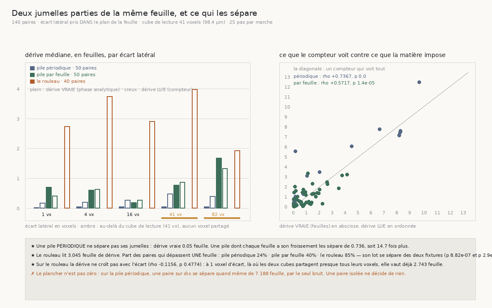

# 138 — Deux jumelles ne restent pas sur la même feuille, et ce n'est pas la matière qui les sépare

> ⭐⭐⭐⭐ **C'EST LA QUESTION DE `R4-P26`, ET C'EST AUSSI LE TRAVAIL DE L'HUMAIN.** Le graal demande
> de transférer de spire à spire ; ce que l'humain corrige, `68` et `84` le disent, c'est ce
> transfert. Autrement dit : deux points voisins d'une même feuille restent-ils sur une même feuille
> quand on les suit ? `128` a établi qu'une pile **périodique** ne porte aucune identité de feuille
> (`R4-F56`), et `134` a fabriqué la première matière qui en porte une.
>
> ⭐⭐⭐⭐ **LES DEUX FIXTURES RÉPONDENT COMME ELLES DOIVENT.** Pile périodique : dérive vraie
> **0,05** feuille sur vingt-cinq traversées — les jumelles ne se séparent pas. Pile dont chaque
> feuille a son froissement : **0,736**, soit **14,7 fois plus**. La matière qui distingue ses
> feuilles sépare bien les sondes, et celle qui ne les distingue pas ne les sépare pas.
>
> ⭐⭐⭐⭐ **LE ROULEAU SÉPARE SES JUMELLES BIEN PLUS QUE L'UNE ET L'AUTRE : 3,045 feuilles.**
> **85 %** de ses paires se séparent de plus d'**une** feuille, contre 24 % sur la pile périodique et
> 40 % sur la pile par feuille. Son lot se distingue des deux (rang, p **8,82e-07** et **2,9e-09**).
>
> ⭐⭐⭐⭐ **ET CE N'EST PAS LA MATIÈRE QUI LES SÉPARE.** À **un voxel** d'écart — deux micromètres et
> demi, là où les deux cubes de lecture partagent quarante colonnes sur quarante et une — la dérive
> vaut **déjà 2,743 feuilles**, et elle ne croît pas avec l'écart latéral (rho **−0,1156**, p
> **0,4774**). Une séparation qui ne dépend pas de la distance entre les sondes n'est pas une
> propriété de ce qu'il y a entre elles. **Le marcheur amplifie une différence de 2,4 µm en presque
> trois feuilles.**
>
> ⚠⚠ **DONC `R4-P26` NE SE DÉCIDE PAS PAR UNE PAIRE DE MARCHEURS LIBRES**, et la mesure dit
> pourquoi : la dispersion propre de la paire (3,045 feuilles) est plus grande que la quantité à
> trancher (une feuille). Ce que le graal doit contraindre n'est pas le compteur — `136` l'a mesuré
> juste — c'est la liberté qu'ont deux sondes voisines de partir chacune de son côté.

## 1. Pourquoi ce fichier

`R4-P26` demande si la matière porte l'identité d'une feuille. La forme opérationnelle de cette
question est le métier de l'humain que le graal doit remplacer : **deux sondes posées sur une même
feuille y sont-elles encore après la traversée ?** Si oui, une paire peut arbitrer un transfert ; si
non, personne ne peut se servir d'une paire pour dire *laquelle* des feuilles on tient.

La mesure est deux marches **jumelles** — écartées dans le plan de la feuille — et la **différence
de leurs comptes de feuilles**. Sur une fixture, la phase est analytique, donc la dérive **vraie**
est connue en plus de la dérive **lue**. Sur le rouleau il n'y a pas d'oracle : les deux piles sont
l'échelle sur laquelle sa dérive se lit.

⚠ **L'écart est pris dans le PLAN de la feuille**, perpendiculairement à la normale lue au départ —
jamais sur le rayon, qui en est à vingt-cinq degrés (`137`). Un écart pris sur le rayon poserait les
deux jumelles sur deux feuilles différentes avant le premier pas. Sur les fixtures le décalage de
phase au départ est **mesuré** : **0,0003** feuille à un voxel, **0,0243** à quatre-vingt-deux sur
la pile périodique.

⚠⚠ **Le contrôle doit porter du bruit, sinon il est incapable d'échouer.** Sur une pile périodique
sans bruit, deux jumelles parties de la même phase lisent une matière **littéralement identique** :
leurs marches le sont aussi et la dérive vaut zéro par construction. Le bruit est porté par le
**voxel** (`126`), donc deux jumelles écartées lisent des voxels différents et **peuvent** diverger.
C'est seulement alors que « elles ne se séparent pas » dit quelque chose. Ma première version de ce
contrôle était à bruit nul.

## 2. ⭐⭐⭐⭐ Les deux fixtures, et ce qu'elles valent comme échelle



| matière | paires | dérive **vraie** | dérive **lue** | erreur de comptage | traversée |
|---|---:|---:|---:|---:|---:|
| pile **périodique** (amplitude 0) | 50 | **0,05** | 0,255 | 0,927 | 24,95 feuilles |
| pile **par feuille** (amplitude 47,469 µm) | 50 | **0,736** | 0,705 | 0,785 | 26,8 |
| **le rouleau** | 40 | — | **3,045** (p90 **7,137**) | — | — |

Les deux fixtures font ce qu'on leur demande, et c'est ce qui autorise à lire le rouleau :

- ⭐ **une pile périodique ne sépare pas ses jumelles** (0,05 feuille sur vingt-cinq traversées),
  ce que `R4-F56` prédit : une matière fonction de la phase seule est invariante par un décalage
  entier, donc rien n'y distingue la feuille *n* de la feuille *n+1* ;
- ⭐ **une pile dont chaque feuille a son propre froissement les sépare**, **14,7 fois** plus.

⭐⭐ **Et l'erreur de comptage s'annule entre jumelles.** Chaque marche compte les feuilles à
**0,927** près sur vingt-cinq (`136` mesure la même chose autrement) ; sur la pile périodique cette
erreur est la **même** pour les deux, donc leur **différence** vaut 0,05 là où chaque compte se
trompe de presque une feuille. Une paire est donc un instrument plus fin qu'une marche seule — c'est
exactement l'argument de la **pince**.

## 3. ⭐⭐⭐ Le compteur voit-il ce que la matière impose ?

| pile | rho de Spearman | p du rang | vraie | lue | p apparié |
|---|---:|---:|---:|---:|---:|
| périodique | **+0,7367** | 0,0 | 0,05 | 0,255 | **0,0001** |
| par feuille | **+0,5717** | 1,4e-05 | 0,736 | 0,705 | **0,51481** |

Sur la pile **par feuille**, le compteur voit à la fois l'**ordre** des séparations et leur
**niveau** : 0,705 lu pour 0,736 vrai, indiscernable (p apparié 0,51481). Sur la pile **périodique**
il voit l'ordre mais **sur-lit** le niveau — 0,255 pour 0,05, p 0,0001. C'est son **plancher** : ce
qu'il annonce quand la matière n'impose rien.

⚠ Ce plancher n'est pas seulement un biais, il a une **queue lourde** : sur la pile périodique, une
paire sur dix se sépare de **7,188** feuilles par le seul bruit. Une paire isolée ne décide donc de
rien ; c'est une distribution qui décide, et c'est pourquoi le p90 voyage à côté de la médiane
partout dans ce document.

## 4. ⭐⭐⭐⭐ Le rouleau, et le point qui tranche

| écart latéral | périodique | par feuille | **le rouleau** |
|---|---:|---:|---:|
| **1 vx** (2,4 µm) | 0,17 | 0,405 | **2,743** |
| 4 vx (9,6 µm) | 0,2 | 0,63 | 3,75 |
| 16 vx (38,4 µm) | 0,27 | 0,275 | 2,907 |
| 41 vx (98,4 µm, hors du cube) | 0,487 | 0,875 | 3,987 |
| 82 vx (196,8 µm, hors du cube) | 0,398 | 1,335 | 1,935 |

Le rouleau est au-dessus des deux fixtures **à chaque écart**, et son lot s'en sépare : rang p
**8,82e-07** contre la pile périodique, **2,9e-09** contre la pile par feuille. ⚠ Les deux piles,
elles, ne se séparent pas l'une de l'autre par la dérive **lue** (p **0,0634**) : c'est la mesure de
la grossièreté du compteur, et elle rend l'écart du rouleau d'autant plus net. La forme qui compte
pour un dérouleur n'est pas la médiane mais la **part** : **85 %** des paires du rouleau finissent à
plus d'**une** feuille l'une de l'autre, contre **24 %** et **40 %** sur les fixtures.

⭐⭐⭐⭐ **Et la dérive ne croît pas avec l'écart** (rho **−0,1156**, p **0,4774**). À **un voxel** —
là où les deux cubes de lecture partagent quarante colonnes sur quarante et une, donc là où il n'y a
presque rien entre les deux sondes — elle vaut **déjà 2,743 feuilles**, et la plus petite des huit
paires s'y sépare de **0,600**. Une séparation qui ne dépend pas de la distance entre deux sondes
n'est pas une propriété de ce qu'il y a entre elles.

⚠ **Et ce n'est pas un départ mal lu.** Le désaccord des deux moitiés du cube au départ est publié
par paire, sans jamais servir à refuser — écarter les départs douteux reviendrait à choisir les
paires qui se comportent bien. La dérive ne le suit pas (rho **−0,2743**, p **0,08676**), et le cas
le montre : la paire partie à **1,45°** de désaccord, très en deçà de la barre calibrée, se sépare de
**4,465** feuilles, quand celle partie à **43,44°** ne se sépare que de **1,450**.

⚠ **La divergence n'est pas une dérive régulière.** L'écart maximal le long de la marche vaut
**1,33** fois l'écart final sur le rouleau, contre **1,01** sur la pile périodique : les deux
jumelles se croisent en chemin au lieu de s'éloigner franchement.

## 5. Ce que ça change pour le graal

- ⭐⭐⭐⭐ **`R4-P26` ne se décide pas par une paire de marcheurs libres.** La question — la matière
  porte-t-elle l'identité d'une feuille ? — demande de distinguer une feuille de sa voisine ; la
  dispersion propre de la paire vaut **trois** feuilles. L'instrument est plus grossier que la
  question de trois ordres.
- ⭐⭐⭐⭐ **Ce qu'il faut contraindre n'est pas le compteur, c'est la liberté.** `136` a mesuré que
  le compteur est juste ; `137` que le chemin penche de vingt-cinq degrés d'un penchant cohérent
  dont la direction varie d'une marche à l'autre. Deux sondes libres partent donc chacune selon le
  penchant que sa matière locale lui dicte, et arrivent ailleurs. **La pince** — deux sondes qui
  tiennent une feuille par ses deux interstices — est précisément le mécanisme qui leur retire cette
  liberté : elle ne mesure pas mieux, elle **interdit** de diverger.
- ⭐⭐ **Une paire reste l'instrument le plus fin qu'on ait**, et c'est mesuré : sur une matière sans
  identité de feuille, l'erreur de comptage de chaque marche (0,927) s'annule dans leur différence
  (0,05). La paire n'est pas à jeter — elle est à contraindre.
- ⚠ **Ce que ce document ne sépare pas** : si les deux jumelles comptent différemment parce
  qu'elles ont marché ailleurs, ou parce qu'elles ont compté autrement le même chemin. Les positions
  d'arrivée ne sont pas gardées. `137` rend la première lecture probable — le penchant varie de 9 à
  49° d'une marche à l'autre, ce qui suffit à dix pour cent d'écart sur l'étendue radiale — mais
  cette tranche ne le mesure pas.

## 6. Une piste abandonnée, et pourquoi

`R4-P26` demandait littéralement la **reproductibilité** de l'espacement local : deux jumelles
lisent-elles le même espacement au même pas ? La mesure est **confondue**, et la fixture le dit :
sur une pile **périodique**, dont l'espacement vrai est constant, les deux jumelles corrèlent quand
même (r **+0,14** à **+0,33**) à des écarts où elles ne partagent **aucun** voxel. La cause est que
les deux sont comparées au même **rang de pas**, et que l'estimateur d'espacement dépend de la phase
où le pas tombe. Une corrélation qui survit sur une matière sans identité de feuille ne peut pas
servir à prouver qu'il y en a une.

## 7. Les registres

Faits `R4-F81` (les deux fixtures répondent comme elles doivent et l'erreur de comptage s'annule
entre jumelles), `R4-F82` (le rouleau sépare ses jumelles trois fois plus que la matière qui
distingue ses feuilles, et 85 % de ses paires dépassent une feuille) et `R4-F83` (à un voxel d'écart
la dérive vaut déjà 2,743 feuilles et ne croît pas avec l'écart : ce n'est pas la matière qui
sépare). Portes `R4-P26` (résserrée : la question ne se décide pas par une paire libre) et `R4-P25`
(la valeur de l'humain se déplace vers la contrainte) mises à jour.

## Reproduire

```bash
uv run python src/nappe/deux_marches_jumelles_lisent_elles_la_meme_feuille.py \
    --bandes 8 --par-bande 1 --pas-max 25 --positions 10 --fils 64 \
    --json docs/mesures/deux_marches_jumelles.json      # 84 min, 40 paires sur le rouleau
uv run python src/nappe/deux_marches_jumelles_lisent_elles_la_meme_feuille.py \
    --reagreger docs/mesures/deux_marches_jumelles.json \
    --json docs/mesures/deux_marches_jumelles.json      # recalcule les verdicts sans remarcher
uv run python src/figures/figure_deux_marches_jumelles.py \
    --json docs/mesures/deux_marches_jumelles.json \
    --sortie docs/images/138_deux_jumelles_sur_la_meme_feuille.png
uv run python src/nappe/deux_marches_jumelles_lisent_elles_la_meme_feuille.py --verifier   # 44
uv run python src/figures/figure_deux_marches_jumelles.py --verifier                       # 19
```

⚠ `--reagreger` existe parce qu'une campagne coûte quatre-vingts minutes de lecture : ajouter une
question aux **mêmes** paires ne demande pas de remarcher, et remarcher pour ça donnerait d'autres
marches, donc une autre mesure et non la même enrichie. C'est le `--reagreger` de `133`.
