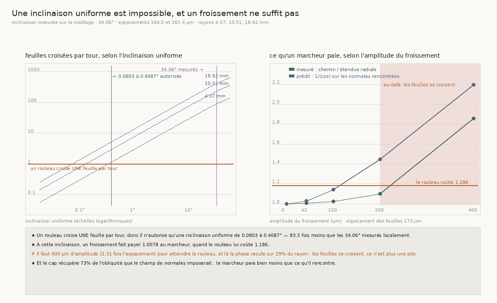

# 139 — Une inclinaison uniforme est impossible, et un froissement ne suffit pas

> ⭐⭐⭐⭐ **LA PORTE DEMANDAIT L'IMPOSSIBLE, ET C'EST DE LA GÉOMÉTRIE.** `R4-P28` réclame « une
> spirale dont la normale soit à un angle **fixe** du rayon » pour expliquer le **1,186** que `136`
> mesure entre le chemin d'une traversée et son étendue radiale. Cette matière n'existe pas : un
> rouleau croise **une** feuille par tour, or une inclinaison uniforme `α` en fait croiser
> `2πρ·sin(α)/s`. Aux rayons de la campagne et pour les deux espacements de `R4-F14`, les
> **34,06°** mesurés localement feraient croiser **78,52 à 399,53** feuilles par tour. L'inclinaison
> uniforme qu'un enroulement autorise vaut **0,0803 à 0,4087°** — **83,3 fois** moins.
>
> ⭐⭐⭐⭐ **DONC LES TRENTE-QUATRE DEGRÉS SONT UN VAGABONDAGE, ET LE VAGABONDAGE NE SUFFIT PAS.**
> La fixture qui répond est une spirale **froissée** dont la normale est analytique, donc dont le
> coût se **prédit**. À l'amplitude qui reproduit exactement les 34,09° mesurés, le marcheur paie
> **1,0078**. Le rouleau lui coûte **1,186**.
>
> ⭐⭐⭐⭐ **ET L'AMPLITUDE QU'IL FAUDRAIT REPLIE LES FEUILLES.** Pour atteindre 1,186 il faut
> **400 µm** d'amplitude, soit **2,31 fois** l'espacement, et là la phase **recule** sur **29 %** du
> rayon : deux feuilles voisines se croisent. Un empilement dont les feuilles se traversent n'est
> plus un empilement. Le plus haut rapport atteignable **sans** replier les feuilles est **1,0228**.
>
> ⭐⭐ **AU PASSAGE, CE QUE LE CAP COÛTE ET RAPPORTE : il récupère 73 %** de l'obliquité que le champ
> de normales imposerait. Un marcheur à cap ne suit pas la normale, il la moyenne — donc il paie
> bien moins que ce qu'il rencontre, et personne ne l'avait chiffré.
>
> ⚠⚠ **CE QUI RESTE, AVEC DES PREUVES DÉJÀ DANS L'ARBRE : le rouleau est ÉCRASÉ.** `90` le mesure et
> `135` le confirme — la surface extérieure va de **16,8** à **29,75 mm** selon le rayon. Sur un
> rouleau écrasé, la normale d'une feuille fait avec la direction du centre un angle **grand et
> cohérent**, ce qui est exactement ce que `137` mesure (25,48°, cohérence 0,925) et ce qu'aucune
> des deux explications tombées ici ne produit.

## 1. Pourquoi ce fichier, et pourquoi il commence par refuser

`136` mesure que le compte de feuilles du marcheur est juste et que ce qui manque au dérouleur est
la conversion feuilles → rayons, qui vaut **1,186**. `137` mesure que le chemin penche de **25,48°**
sur le rayon, d'un penchant cohérent. `R4-P28` demandait une fixture à inclinaison **fixe** pour
trancher si ce 1,186 est une obliquité.

La fixture demandée n'existe pas, et la démonstration tient en trois lignes. Les feuilles sont les
lignes de niveau d'une fonction `ψ` ; en polaire, un **espacement constant** impose
`ψ_ρ = cos(α)/s` constante, donc `ψ = ρ·cos(α)/s + f(θ)` ; une **inclinaison fixe** impose alors
`f'(θ) = ρ·sin(α)/s`, qui dépend de `ρ`. Une fonction d'un angle ne dépend pas d'un rayon.
Contradiction, sauf `sin(α) = 0`.

Sa forme physique se mesure, et c'est celle que ce fichier publie : un rouleau croise **une** feuille
par tour — c'est ce que « enroulé » veut dire — et une inclinaison uniforme `α` en fait croiser
`2πρ·sin(α)/s`.

## 2. ⭐⭐⭐⭐ Ce qu'un enroulement autorise



| rayon | espacement | feuilles par tour à 34,06° | inclinaison autorisée |
|---:|---:|---:|---:|
| 4,07 mm | 164,0 µm | **87,33** | 0,3674° |
| 4,07 mm | 182,4 µm | 78,52 | **0,4087°** |
| 10,51 mm | 164,0 µm | 225,51 | 0,1423° |
| 10,51 mm | 182,4 µm | 202,76 | 0,1583° |
| 18,62 mm | 164,0 µm | **399,53** | **0,0803°** |
| 18,62 mm | 182,4 µm | 359,23 | 0,0893° |

⚠ L'espacement voyage en **paire**, comme `136` l'impose : 164 µm par les transferts humains, 182,4
par l'atlas. Un verdict qui ne tiendrait que pour l'un des deux n'en serait pas un — ici il tient
pour les deux, à tous les rayons, et avec une marge de deux ordres de grandeur.

⭐ L'inclinaison autorisée, **0,0803 à 0,4087°**, est exactement celle de la spirale d'Archimède que
`R4-F16` publie à **0,09°** et que `137` a re-mesurée de l'intérieur à 0,08° à dix-huit millimètres.
Ce n'est pas une coïncidence : c'est la même contrainte, écrite deux fois.

## 3. ⭐⭐⭐⭐ La fixture : un froissement d'amplitude connue

`VolumeFabriqueEnSpiraleFroissee` est une spirale d'Archimède dont la feuille est déplacée le long
de sa normale par une somme de sinusoïdes. Deux propriétés la rendent utilisable :

- ⚠ **à amplitude nulle elle EST la spirale d'Archimède, au bit près** — la batterie l'asserte, et
  c'est ce qui protège tout ce que le dépôt a mesuré sur celle-ci ;
- ⚠⚠ **sa normale analytique EST le gradient de sa phase**, vérifié aux différences finies à
  **1,1·10⁻⁵ degré**. Une fixture qui mentirait sur sa normale rendrait fausse toute prédiction
  bâtie dessus.

⚠ Le froissement est une fonction de la position **dans l'espace**, pas des coordonnées de la
feuille, et c'est voulu : une coordonnée « le long de la feuille » vaut `ρθ`, qui **saute** de `2πρ`
à la coupure angulaire, donc un froissement bâti dessus serait discontinu sur un demi-plan entier.
Des vecteurs d'onde fixes dans l'espace sont continus partout. Ils ne sont pas exactement dans le
plan de la feuille, qui tourne — mais la fixture n'a pas besoin d'un froissement **réaliste**, elle
a besoin d'un froissement **connu**.

| amplitude | A/espacement | inclinaison max | inclinaison médiane | **mesuré** | prédit | phase qui recule |
|---:|---:|---:|---:|---:|---:|---:|
| 0 µm | 0,0 | 0,0° | 0,12° | **1,0** | 1,0 | 0 % |
| **42,4 µm** | 0,25 | **34,09°** | 11,09° | **1,0078** | 1,0256 | 0 % |
| 100 µm | 0,58 | 57,94° | 22,48° | **1,0228** | 1,1412 | 0 % |
| 200 µm | 1,16 | 72,61° | 38,98° | 1,1013 | 1,445 | **9 %** ✗ |
| 400 µm | 2,31 | 81,1° | 60,47° | **1,8577** | 2,1967 | **29,2 %** ✗ |

Le **mesuré** est le chemin de la marche divisé par son étendue radiale — la même quantité que
`136` mesure sur le rouleau. Le **prédit** est `1/⟨cos θ⟩` sur les normales que la marche a
rencontrées : ce qu'un marcheur qui suivrait la normale **exactement** paierait.

⭐ **À l'inclinaison mesurée, le marcheur paie 1,0078 quand le rouleau lui coûte 1,186.** L'excès est
vingt-quatre fois trop petit.

## 4. ⭐⭐⭐⭐ Le contrôle qui tranche : la matière cesse d'être une pile

Le long d'un rayon, la phase d'un empilement doit **croître** — chaque pas vers l'extérieur franchit
de la feuille. Si elle **recule** quelque part, deux feuilles voisines s'y sont croisées.

Jusqu'à **100 µm** d'amplitude (0,58 fois l'espacement) la phase ne recule nulle part. À **200 µm**
elle recule sur 9 % du rayon, à **400 µm** sur **29,2 %**. Or c'est à 400 µm qu'on atteint enfin le
1,186 du rouleau.

⭐⭐⭐⭐ **Donc le froissement n'explique pas le rouleau sans cesser d'être un empilement.** Le plus
haut rapport atteignable sur une matière encore empilée est **1,0228**.

⚠ Ce contrôle ne demande **aucune marche** : il se lit dans la phase analytique. C'est ce qui le rend
indépendant du marcheur, dont on sait depuis `138` qu'il amplifie tout ce qu'on lui donne.

## 5. ⭐⭐ Ce que le cap récupère

Le prédit et le mesuré ne coïncident jamais : à 400 µm, 2,1967 contre 1,8577 ; à 200, 1,445 contre
1,1013. Le marcheur paie **moins** que ce que son champ de normales impose, et la part qu'il
récupère vaut **73 %**.

C'est la contrepartie mesurée du cap : il ne suit pas la normale, il la **moyenne**, donc il coupe
au plus court à travers un froissement. Aucune tranche ne l'avait chiffré — `133` mesurait que le
cap redresse, `135` qu'il arrive plus tôt, `136` qu'il rapproche le compte du radial, `137` qu'il
supprime les retours vers l'axe. Celui-ci dit **combien** de l'obliquité il enlève.

⚠ Et il retourne un peu le §3 : puisque le marcheur récupère les trois quarts de l'obliquité, le
champ de normales du **rouleau** doit être encore plus oblique que les 25,48° que `137` lit sur le
chemin. Ce qui rend l'explication par le froissement d'autant plus intenable.

## 6. Ce que ça change pour le graal

- ⭐⭐⭐⭐ **`R4-P28` change de question.** Elle demandait une fixture à inclinaison fixe ; la réponse
  est que cette matière n'est pas un rouleau. La question devient : **d'où vient une obliquité de
  chemin de 25° sur un objet dont l'enroulement n'autorise que 0,1° d'inclinaison uniforme, et que
  le froissement ne peut produire sans replier ses feuilles ?**
- ⚠⚠ **Le candidat qui reste est déjà mesuré ailleurs : le rouleau est ÉCRASÉ.** `90` le mesure,
  `135` le retrouve en lisant la surface extérieure de **16,8 à 29,75 mm** sur les rayons des
  arrêts, et c'est précisément pourquoi `116` avait échoué à trouver une frontière **radiale**. Sur
  une section écrasée, la direction du centre n'est pas la normale de la feuille, et l'écart entre
  les deux est grand, lentement variable, donc **cohérent** sur une marche — ce que `137` mesure
  (cohérence 0,925) et ce qu'un froissement, qui alterne, ne produit pas.
- ⭐⭐ **Et le 1,186 n'est pas une erreur du marcheur.** Il récupère déjà 73 % de l'obliquité qu'il
  rencontre ; ce qui reste est dans la matière. Un dérouleur devra donc l'appliquer, pas l'éliminer.
- ⚠ **Ce que ce document ne mesure pas** : la fixture est une spirale **ronde**. Fabriquer une
  spirale écrasée, et mesurer ce qu'un marcheur y paie, est la tranche suivante — et elle est
  maintenant nommée par une mesure et non par une intuition.

## 7. Les registres

Faits `R4-F84` (un enroulement n'autorise qu'une inclinaison uniforme de 0,0803 à 0,4087°, donc les
34,06° mesurés localement sont nécessairement un vagabondage) et `R4-F85` (un froissement à cette
inclinaison fait payer 1,0078 au marcheur, et l'amplitude qui atteindrait 1,186 replie les feuilles
les unes sur les autres). Porte `R4-P28` reformulée : sa fixture n'existe pas, et ce qui reste est
l'écrasement.

## Reproduire

```bash
uv run python src/nappe/une_inclinaison_uniforme_est_elle_possible.py \
    --json docs/mesures/une_inclinaison_uniforme_est_elle_possible.json   # aucune lecture distante
uv run python src/figures/figure_une_inclinaison_uniforme_est_elle_possible.py \
    --json docs/mesures/une_inclinaison_uniforme_est_elle_possible.json \
    --sortie docs/images/139_une_inclinaison_uniforme_est_impossible.png
uv run python src/nappe/une_inclinaison_uniforme_est_elle_possible.py --verifier        # 27
uv run python src/figures/figure_une_inclinaison_uniforme_est_elle_possible.py --verifier  # 20
uv run python src/nappe/combien_de_pas_la_matiere_porte.py --verifier                   # 104
```

⚠ La mesure ne lit **pas** le volume : la moitié géométrique est un calcul, et la fixture est une
matière analytique. Le contrat de `VolumeFabriqueEnSpiraleFroissee` — identité au bit avec sa
parente à amplitude nulle, et normale égale au gradient de sa phase — est vérifié par la batterie du
module qui la **porte**, pas par celle qui l'emploie : deux endroits où la même propriété peut se
contredire en feraient deux propriétés.
