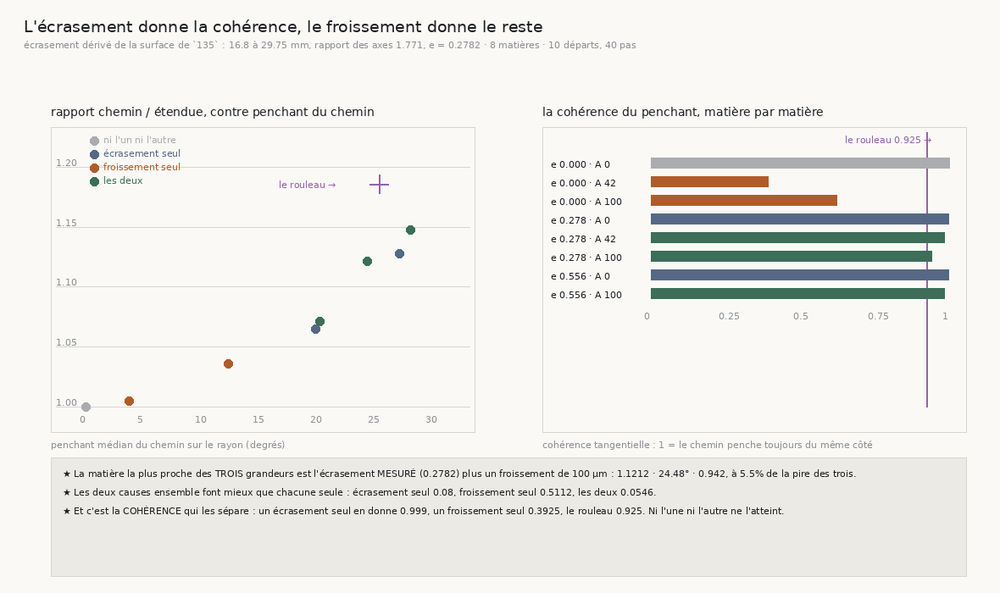

# 140 — L'écrasement donne la cohérence, le froissement donne le reste

> ⭐⭐⭐⭐ **LE DERNIER CANDIDAT, ET IL TIENT — À CONDITION D'ÊTRE DEUX.** `136` mesure que le chemin
> d'une traversée vaut **1,186** fois son étendue radiale ; `137` que ce chemin penche de **25,48°**
> sur le rayon, d'un penchant **cohérent** (0,925). `139` a éliminé les deux explications évidentes.
> Ce qui restait est déjà mesuré ailleurs : le rouleau est **écrasé** — `135` lit une surface
> extérieure de **16,8 à 29,75 mm**, soit un rapport des axes de **1,771** et un aplatissement de
> **0,2782**, qui n'est donc pas un réglage mais une lecture.
>
> ⭐⭐⭐⭐ **À L'ÉCRASEMENT MESURÉ, PLUS UN FROISSEMENT, LES TROIS GRANDEURS TOMBENT ENSEMBLE :**
> rapport **1,1212**, penchant **24,48°**, cohérence **0,942** — contre 1,186 · 25,48° · 0,925 sur
> le rouleau. La pire des trois est à **5,5 %**. Aucune des deux causes prise seule n'y arrive :
> écrasement seul **0,08** (et seulement en DOUBLANT l'aplatissement mesuré), froissement seul
> **0,5112**.
>
> ⭐⭐⭐⭐ **ET C'EST LA COHÉRENCE QUI LES SÉPARE, PAS LE RAPPORT.** Un écrasement seul rend une
> cohérence de **0,999** — trop. Un froissement seul, **0,3925** — pas assez. Le rouleau vaut
> **0,925**, et seule leur composition l'atteint. C'est la grandeur que `137` avait mesurée sans
> savoir ce qu'elle départageait.
>
> ⚠ **Ce que ça ne prouve pas** : que ce soient exactement ces deux causes-là. Une fixture à deux
> paramètres qui approche trois grandeurs mesurées à 5,5 % près est un argument, pas une preuve. Ce
> qui est établi est plus étroit et plus solide : **aucune cause seule n'y arrive, et la cohérence
> est ce qui les distingue.**

## 1. Pourquoi ce fichier

`139` a fermé deux portes : une inclinaison **uniforme** est impossible sur un objet qui croise une
feuille par tour (elle ne peut valoir que 0,0803 à 0,4087°), et un **froissement** de l'amplitude
mesurée ne fait payer que 1,0078 — celle qu'il faudrait replierait les feuilles les unes sur les
autres. Le candidat restant était nommé par des mesures déjà au dossier : `90` mesure que le rouleau
est écrasé, `135` le retrouve en lisant une surface extérieure qui va de **16,8 à 29,75 mm** selon
le rayon, et c'est précisément pourquoi `116` ne trouvait pas de frontière **radiale**.

⚠ **L'aplatissement n'est pas ajusté.** Il se dérive des deux rayons que `135` publie :
`e = (max − min)/(max + min) = 0,2782`, soit un rapport des axes de **1,771**. Ce qui est balayé
autour de lui sert à voir la pente, jamais à choisir la réponse.

## 2. ⭐⭐⭐ La fixture, et pourquoi elle peut mentir

`VolumeFabriqueEnSpiraleEcrasee` est une spirale d'Archimède lue dans des coordonnées **elliptiques**
— le rayon et l'angle après division des deux axes par `1 + e` et `1 − e`. Trois propriétés la
rendent utilisable, et la batterie du module qui la porte les assert :

- ⚠ **elle croise toujours UNE feuille par tour**, donc c'est un rouleau : un tour fait croître
  l'angle elliptique de `2π`, donc la phase d'exactement une feuille ;
- ⚠ **à écrasement nul elle EST la spirale d'Archimède, au bit près** ;
- ⚠⚠ **sa normale analytique EST le gradient de sa phase**, vérifié aux différences finies à
  **10⁻⁶ degré**.

⭐⭐ Et `VolumeFabriqueEnSpiraleFroissee` en **hérite** désormais : une seule fixture peut donc être
écrasée **et** froissée, et la batterie vérifie que sa phase est exactement la somme des deux écarts
à la spirale ronde. ⚠ Ce qui a rendu la composition possible est une correction : la norme du
gradient, que le froissement empruntait à sa base sous la forme d'une formule **circulaire**, est
devenue une **méthode** — elle était fausse dès que la section cesse d'être ronde. Les nombres de
`139` sont inchangés au bit après ce changement, ce qui était la condition pour le faire.

## 3. ⭐⭐⭐⭐ Les trois grandeurs, ensemble



| écrasement | amplitude | axes | rapport | prédit | penchant | cohérence | pire des trois |
|---:|---:|---:|---:|---:|---:|---:|---:|
| 0 | 0 | 1,0 | 1,0 | 1,0 | 0,12° | 1,0 | 0,9953 |
| **0,2782** | 0 | 1,771 | 1,0646 | 1,0672 | 19,995° | **0,999** | 0,2153 |
| 0,5564 | 0 | 3,509 | 1,1278 | 1,1303 | 27,305° | 0,999 | **0,08** |
| 0 | 42,4 | 1,0 | 1,0046 | 1,0231 | 3,845° | **0,3925** | 0,8491 |
| 0 | 100 | 1,0 | 1,036 | 1,1306 | 12,455° | 0,624 | 0,5112 |
| **0,2782** | 42,4 | 1,771 | 1,0713 | 1,0835 | 20,39° | 0,9855 | 0,1998 |
| **0,2782** | **100** | 1,771 | **1,1212** | 1,1874 | **24,48°** | **0,942** | **0,0546** |
| 0,5564 | 100 | 3,509 | 1,1479 | 1,1651 | 28,22° | 0,9845 | 0,1075 |

Le rouleau vaut **1,186 · 25,48° · 0,925**.

⚠⚠ **La distance publiée est la PIRE des trois écarts relatifs, jamais leur moyenne.** Une moyenne
pardonnerait à une matière qui reproduit deux grandeurs et rate la troisième — et la batterie
vérifie exactement ce cas : une matière juste sur le rapport et le penchant mais à 0,30 de cohérence
est classée **plus loin** qu'une matière qui approche les trois. C'est ce qui rend le verdict
réfutable.

⭐ **Le meilleur est l'écrasement mesuré plus un froissement de 100 µm**, à **5,5 %** sur la pire des
trois. ⚠ L'écrasement seul y arrive presque (0,08) — mais à **0,5564** d'aplatissement, soit un
rapport des axes de **3,509** que `90` ne mesure pas. Doubler une quantité mesurée pour faire
tomber une autre n'est pas une explication.

## 4. ⭐⭐⭐⭐ La cohérence est ce qui départage

| matière | cohérence |
|---|---:|
| écrasement seul | **0,999** |
| froissement seul | **0,3925** |
| les deux, à l'écrasement mesuré | **0,942** |
| **le rouleau** | **0,925** |

Un écrasement produit un penchant **parfaitement** cohérent : sur une section elliptique, l'angle
entre la normale d'une feuille et la direction du centre tourne avec l'angle polaire, de période
`π` — donc il est constant à l'échelle d'une marche. Un froissement, lui, **alterne**, et sa
cohérence s'effondre.

⭐⭐ Ni l'une ni l'autre n'atteint les 0,925 du rouleau, et leur composition si. C'est le seul des
trois nombres qu'aucune des deux causes ne peut approcher en changeant son amplitude : un
écrasement plus fort reste à 0,999, un froissement plus fort descend encore.

⚠ Et ça éclaire `139` : le cap y récupérait **73 %** de l'obliquité d'un froissement. Ici, sur un
écrasement, le mesuré et le prédit coïncident presque (1,0646 contre 1,0672). **Le cap enlève
l'obliquité qui ALTERNE, pas celle qui PERSISTE** — ce qui est exactement ce qu'une moyenne fait, et
ce qui explique pourquoi un dérouleur ne peut pas se débarrasser du 1,186 en lissant davantage.

## 5. Ce que ça change pour le graal

- ⭐⭐⭐⭐ **La conversion feuilles → rayons est irréductible.** Elle ne vient pas d'un défaut du
  marcheur — `136` a mesuré son compteur juste, `139` que son cap récupère déjà tout ce qui alterne.
  Elle vient de la forme de l'objet : un rouleau **écrasé** dont les feuilles sont **froissées**. Un
  dérouleur devra donc l'**appliquer**, pas l'éliminer.
- ⭐⭐⭐ **Et elle est prévisible depuis une mesure que le dépôt sait déjà faire.** L'aplatissement
  se lit sur la surface extérieure (`135`), et c'est lui qui fixe la part cohérente du penchant. Un
  dérouleur qui mesure l'écrasement d'un rouleau sait donc quelle correction appliquer avant
  d'avoir marché.
- ⚠⚠ **Ce qui reste non expliqué est la queue.** Le rapport du rouleau (1,186) dépasse encore de
  **5,5 %** ce que la meilleure matière rend, et le p90 de son penchant (48,36°, `137`) dépasse
  largement celui de la fixture. La distribution des angles du rouleau a une **queue plus lourde**
  que ce que deux causes régulières produisent — il y reste du local que ni l'ellipse ni la
  sinusoïde ne fabriquent.
- ⚠ **Ce que ce document ne prouve pas** : que ce soient exactement ces deux causes. Une fixture à
  deux paramètres qui approche trois grandeurs à 5,5 % est un argument. Ce qui est établi est plus
  étroit : aucune cause seule n'y arrive, et la cohérence est ce qui les distingue.

## 6. Les registres

Faits `R4-F86` (une spirale écrasée au rapport des axes que `135` mesure rend un penchant de 20° à
cohérence 0,999, là où un froissement rend 0,3925 : la cohérence sépare les deux causes) et
`R4-F87` (l'écrasement mesuré plus un froissement approche les trois grandeurs du rouleau à 5,5 %,
et aucune cause seule n'y arrive). Porte `R4-P28` : sa question se ferme sur une explication à deux
causes dont l'une est déjà mesurée, et sa part non expliquée est nommée — la queue de la
distribution.

## Reproduire

```bash
uv run python src/nappe/lecrasement_explique_t_il_lobliquite.py \
    --json docs/mesures/lecrasement_explique_t_il_lobliquite.json    # aucune lecture distante
uv run python src/figures/figure_lecrasement_explique_t_il_lobliquite.py \
    --json docs/mesures/lecrasement_explique_t_il_lobliquite.json \
    --sortie docs/images/140_lecrasement_et_le_froissement.png
uv run python src/nappe/lecrasement_explique_t_il_lobliquite.py --verifier        # 19
uv run python src/figures/figure_lecrasement_explique_t_il_lobliquite.py --verifier   # 17
uv run python src/nappe/combien_de_pas_la_matiere_porte.py --verifier             # 112
```

⚠ Le contrat des deux fixtures — identité au bit avec la spirale ronde à paramètre nul, normale
égale au gradient de la phase, et phase de la composition égale à la somme des deux écarts — est
vérifié par la batterie du module qui les **porte**, pas par celle qui les emploie.

⚠⚠ **Et un piège payé sur ce document même** : les nombres du tableau du §3 ont d'abord été recopiés
depuis l'**affichage**, qui met en forme à deux ou trois décimales — 20,00° là où le producteur écrit
**19,995**, 0,986 là où il écrit **0,9855**. Une mise en forme de terminal n'est pas un producteur.
C'est `verifier_chiffres` qui l'a dit, en ne trouvant pas les deux premiers.
