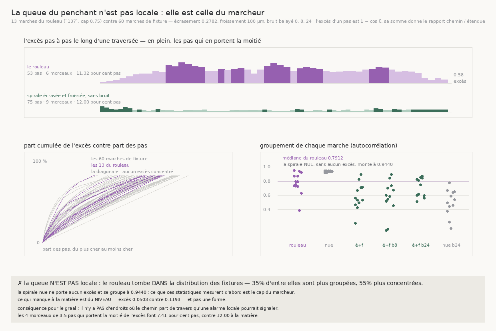

# 141 — La queue du penchant n'est pas locale : elle est celle du marcheur

> ⭐⭐⭐⭐ **LA PORTE QUE `140` LAISSAIT OUVERTE SE FERME, ET ELLE SE FERME PAR NON.** `140`
> reproduit les trois grandeurs du rouleau à 5,5 % avec l'écrasement mesuré plus un froissement, et
> nomme ce qui reste : le p90 du penchant du rouleau (**48,36°**, `137`) dépasse largement celui de
> la fixture, donc « sa distribution d'angles a une queue plus lourde que ce que deux causes
> régulières produisent ». Mesuré à armes égales, **c'est faux**.
>
> ⭐⭐⭐⭐ **LE ROULEAU TOMBE DANS LA DISTRIBUTION DES FIXTURES, PAS AU-DESSUS.** Sur soixante
> marches de fixture, **35 %** sont plus groupées que lui, **55 %** plus concentrées, **45 %** ont
> un gini plus élevé. Il ne dépasse aucune des trois. Son autocorrélation médiane vaut **0,7912**
> quand la pire fixture monte à **0,944** ; sa part du sommet **0,3652** contre **0,7275**.
>
> ⭐⭐⭐⭐ **ET LE TÉMOIN DIT POURQUOI : LA SPIRALE NUE EST LA PLUS GROUPÉE DE TOUTES.** Sans
> écrasement, sans froissement, sans bruit — donc sans aucun excès à porter (**0,0**) — elle se
> groupe à **0,9347**, au-dessus du rouleau. Ce que ces statistiques mesurent d'abord est le **cap
> du marcheur**, pas la matière. Un test de groupement sur le rouleau seul aurait été incapable
> d'échouer.
>
> ⭐⭐⭐ **CE QUI MANQUE À LA MATIÈRE EST DU NIVEAU, PAS UNE FORME.** L'excès moyen par pas vaut
> **0,0503** sur la meilleure matière contre **0,1193** sur le rouleau — un facteur deux et demi —
> pendant que les **formes** se recouvrent. Les 5,5 % que `140` laissait sont un déficit d'excès,
> pas une queue.
>
> ⚠ **Conséquence pour le graal, et elle est négative :** il n'y a **pas** d'endroits où le chemin
> part de travers qu'une alarme locale pourrait signaler. Les **4** morceaux de **3,5** pas qui
> portent la moitié de l'excès d'une traversée font **7,41** morceaux pour cent pas, contre
> **12,0** à la matière régulière. La correction de spire à spire ne se fera pas en surveillant des
> endroits.

## 1. Pourquoi ce fichier

Le graal demande ce qui remplace l'humain qui corrige le transfert de spire à spire. Un humain
corrige **là où le chemin part de travers** : si l'excès de chemin tenait dans quelques morceaux
contigus, une machine aurait besoin d'une alarme locale, et son taux se mesurerait. C'est pour ça
que la part non expliquée par `140` n'était pas une curiosité de statisticien — c'était la forme que
prendrait, ou non, la pièce manquante.

⚠ **Et la grandeur évidente ne convient pas** — ce que ce fichier **mesure** au lieu de l'affirmer.
Le rapport p90/médiane du penchant vaut **1,3125** en médiane sur les marches du rouleau, et
**1,4** sur la spirale **nue**, qui ne porte aucun excès (**0,0**) ; la même bruitée monte à
**1,8061**. Un rapport de quantiles ne dit rien quand le dénominateur ne porte rien : il monte dès
que la médiane frôle zéro, indépendamment de ce que le chemin paie réellement. C'est pourquoi la
grandeur retenue ci-dessous est reliée au nombre publié, et pas à deux quantiles.

## 2. ⭐⭐⭐ La grandeur : le progrès radial qu'un pas abandonne

L'étendue radiale d'une marche est la somme des `cos θ`, son chemin la somme des avances. À longueur
de pas égale, le rapport chemin/étendue que `136` publie vaut donc `1 / (1 − ⟨e⟩)` avec

    e = 1 − cos θ

La somme des `e` **est** l'excès de chemin. Demander où il se trouve est alors une question sur la
matière, et pas sur un quantile. Deux questions, et elles se séparent proprement :

- la **concentration** — quelle part de la somme tient dans peu de pas. Elle survit à un mélange ;
- le **groupement** — ces pas sont-ils **contigus**. Un mélange le détruit.

⚠ On n'utilise pas `1/cos − 1`, qui diverge à 90° et change de signe au-delà : `137` compte des pas
au-delà de 90°, et une grandeur qui explose sur eux ferait dire à une poignée de pas tout ce que la
mesure raconte.

⚠ **Les pas sont comptés à longueur égale.** `137` publie les angles pas à pas, pas les avances pas
à pas. Le rapport que cet estimateur rend sur le rouleau vaut **1,1354** en médiane sur les marches,
à comparer au **1,186** de `136` : c'est un autre estimateur de la même quantité, pas le même
nombre.

## 3. ⚠⚠ Les deux confonds, et ce qui les neutralise

**Le cap.** Le marcheur porte une mémoire de cap de 0,75, donc ses directions successives sont
corrélées **par construction**. Un test de permutation sur le rouleau seul rendrait un `z` médian de
**5,81**, franchement significatif, et ne prouverait rien du tout : il mesurerait le marcheur. Ce sont les fixtures,
marchées **avec le même cap**, qui rendent la question capable d'échouer — et la spirale **nue**,
qui n'a ni cause ni bruit, est le plancher que le rouleau devait dépasser.

**Le bruit.** Les fixtures de `140` sont **sans bruit**, le rouleau non. « La queue du rouleau est
plus lourde » pourrait donc vouloir dire « le rouleau est bruité ». Le bruit est donc **balayé** —
0, 8, 24 — et jamais posé : ce qu'on regarde est la pente, pas un niveau choisi.

⚠ **Et une troisième chose a dû être corrigée en route : la longueur.** Un `z` de permutation croît
comme la racine du nombre de pas à corrélation égale, et un compte de morceaux croît avec la
longueur. Or les marches du rouleau font **45** pas en médiane quand celles des fixtures en font
**75** : juger sur le `z` aurait désavantagé le rouleau pour une raison qui n'est pas la matière. Le
verdict porte donc sur l'**autocorrélation** et sur la **part du sommet**, qui ne portent pas de
longueur, et les morceaux sont rapportés à cent pas. Le `z` reste publié, parce qu'il dit si le
groupement est réel — pas s'il est plus fort qu'ailleurs.

⚠ **La boîte des fixtures est élargie.** Dans celle de `140`, une marche partie vers les `y` ou `x`
bas quitte le volume avant d'avoir fait la moitié de ses pas, et `une_marche` la déclare alors
indécidable. Comparer une marche de rouleau de soixante-quinze pas à une fixture tronquée aurait
comparé deux longueurs, pas deux matières ; la batterie vérifie que les soixante-quinze pas tiennent
désormais à tout angle de départ.

## 4. ⭐⭐⭐⭐ La mesure



Treize marches du rouleau (`137`, cap 0,75) contre soixante marches de fixture, à écrasement
**0,2782** et froissement **100** µm, douze départs et soixante-quinze pas.

| matière | excès moyen | p90/médiane | gini | part du sommet 20 % | autocorrélation | z | morceaux / 100 pas |
|---|---|---|---|---|---|---|---|
| **le rouleau** | **0,1193** | **1,3125** | **0,3205** | **0,3652** | **0,7912** | **5,81** | **7,41** |
| spirale nue, sans bruit | 0,0 | 1,4 | 0,2704 | 0,3645 | **0,9347** | 8,305 | 1,33 |
| écrasée et froissée, sans bruit | 0,0503 | 1,2173 | 0,2112 | 0,3213 | 0,5473 | 5,3 | 12,0 |
| écrasée et froissée, bruit 8 | 0,0485 | 1,3051 | 0,2294 | 0,3337 | 0,5902 | 5,575 | 16,0 |
| écrasée et froissée, bruit 24 | 0,0588 | 1,3713 | 0,31 | 0,3786 | 0,6825 | 6,23 | 9,33 |
| spirale nue, bruit 24 | 0,0094 | 1,8061 | 0,4837 | 0,5041 | 0,5171 | 4,68 | 10,0 |

Et le rouleau contre la **pire** marche de fixture, avec la part des soixante qui le dépassent :

| | rouleau | pire fixture | fixtures au-dessus |
|---|---|---|---|
| autocorrélation | 0,7912 | 0,944 | **35 %** |
| part du sommet 20 % | 0,3652 | 0,7275 | **55 %** |
| gini | 0,3205 | 0,6629 | **45 %** |
| z | 5,81 | 8,54 | **53,33 %** |

Le rouleau ne dépasse **aucune** des quatre. Il s'étale de 0,3874 à 0,9535 en autocorrélation, ce
qui recouvre l'intervalle entier des fixtures. Et la grandeur évidente le range au même endroit :
**1,3125** contre **1,4** à la spirale nue.

⚠ La ligne qui compte dans ce tableau est la **deuxième**. La spirale nue ne porte **aucun** excès —
son excès moyen par pas est **0,0** — et elle est pourtant la plus groupée de toutes, à **0,9347**.
Une matière qui ne fabrique rien ne peut pas fabriquer une queue : ce que cette colonne mesure est
donc le marcheur.

⚠ **La pente du bruit ne mène nulle part non plus** : sur la même matière, monter le bruit de 0 à 8
puis à 24 fait passer l'autocorrélation de **0,5473** à **0,5902** puis **0,6825**. Elle monte, donc
le bruit groupe un peu — et même à vingt-quatre elle reste sous le rouleau, tandis que la spirale
**nue et sans bruit** le dépasse. Le groupement n'est donc ni la cause ni le bruit.

## 5. ⭐⭐ Ce que ça change pour le graal

**La porte se ferme par non, et c'est une information.** `140` laissait deux lectures possibles du
résidu de 5,5 % : un reste **local** — des accidents que le marcheur traverse et qu'un détecteur
pourrait signaler — ou un reste **diffus**. C'est le second. Il n'existe pas d'endroits à surveiller
au-delà de ce qu'une ellipse et une sinusoïde produisent déjà.

**Donc la correction de spire à spire n'aura pas la forme d'une alarme.** Elle ne peut pas être
« repérer les endroits où ça part de travers et corriger là » : ces endroits n'existent pas comme
classe distincte. Elle doit être ce que `140` a nommé — une conversion **prévue** depuis
l'écrasement, que le dépôt sait lire, et appliquée partout plutôt que déclenchée quelque part.

**Et la contrainte de `138` se renforce.** `138` a montré que deux sondes libres divergent de 2,743
feuilles à un voxel d'écart, donc qu'il faut contraindre le marcheur et non son compteur. `141`
ajoute que ce qui reste à expliquer ne se tient pas dans des endroits : une pince qui tiendrait la
feuille n'aurait pas à détecter quoi que ce soit, seulement à ne jamais lâcher.

⚠ **Ce que ça ne dit pas.** Que le rouleau et la fixture soient la même matière : leurs **niveaux**
diffèrent d'un facteur deux et demi en excès moyen, ce qui est exactement le résidu de `140` vu sous
un autre angle. Ce qui est établi est plus étroit : **la forme de la distribution du rouleau n'est
pas particulière**, donc le résidu n'est pas une queue.

## 6. ⚠ Ce que la mesure a corrigé d'elle-même

- **Un couplage dans `140`.** `une_marche` lisait le centre de l'enroulement dans une constante de
  module au lieu du volume. Les deux s'accordent pour les fixtures de `140`, donc rien n'y change —
  vérifié en relançant la mesure et en comparant : **identique au bit**, hors la clé `angles_deg`
  qui est ajoutée. Mais un appelant qui pose sa spirale ailleurs mesurait son étendue autour d'un axe
  qui n'était pas le sien, et la marche devenait indécidable **sans rien dire**.
- **Deux attendus écrits en dur, faux tous les deux.** Ma batterie affirmait que deux blocs séparés
  font deux morceaux et qu'un peigne en fait autant que de dents. Avec deux blocs **égaux**, la
  moitié de l'excès tient par définition dans **un seul** : le compte de morceaux suit la part
  demandée, il ne décrit pas le paysage. Les attendus se dérivent maintenant de la part.
- **Une fixture de contrôle monotone croissante**, donc d'autocorrélation proche de un : elle était
  *plus* groupée que le bloc dont elle devait être le plancher, et le contrôle disait non pour une
  raison qui n'avait rien à voir avec ce qu'il testait.
- **Des nombres publiés non reproductibles depuis les angles publiés.** Les statistiques étaient
  calculées sur les angles pleins et les angles rangés arrondis à deux décimales. On arrondit
  désormais **d'abord**. Les deux sources donnent déjà deux décimales, donc rien ne bouge — mais
  l'invariant cesse de dépendre de cette coïncidence, et `--rejuger` rend exactement le même verdict
  sans remarcher.

## 7. Les registres

Faits `R4-F88` (le rouleau tombe dans la distribution des fixtures sur les quatre grandeurs de forme),
`R4-F89` (la spirale nue, sans aucun excès, est la plus groupée de toutes — le groupement est celui
du marcheur) et `R4-F90` (ce qui manque à la matière est du niveau d'excès, pas une forme). Porte
`R4-P28` : la part non expliquée qu'elle nommait n'est pas une queue.

## Reproduire

```bash
uv run python src/nappe/la_queue_du_penchant_est_elle_locale.py \
    --json docs/mesures/la_queue_du_penchant_est_elle_locale.json    # aucune lecture distante
uv run python src/figures/figure_la_queue_du_penchant_est_elle_locale.py \
    --json docs/mesures/la_queue_du_penchant_est_elle_locale.json \
    --sortie docs/images/141_la_queue_du_penchant.png
uv run python src/nappe/la_queue_du_penchant_est_elle_locale.py --verifier            # 56
uv run python src/figures/figure_la_queue_du_penchant_est_elle_locale.py --verifier   # 21
uv run python src/nappe/lecrasement_explique_t_il_lobliquite.py --verifier            # 19
```

⚠ Le rouleau n'est **pas remarché** : les angles pas à pas sont déjà dans la mesure de `137`. Ce
fichier relit ce qu'une marche a rendu, et ne marche que les fixtures.

⚠ `--rejuger <json>` recalcule tout ce qui se dérive des angles rangés — une règle de jugement qui
change ne doit pas coûter une marche de plus. C'est le `--reagreger` de `138` sous un autre nom.
