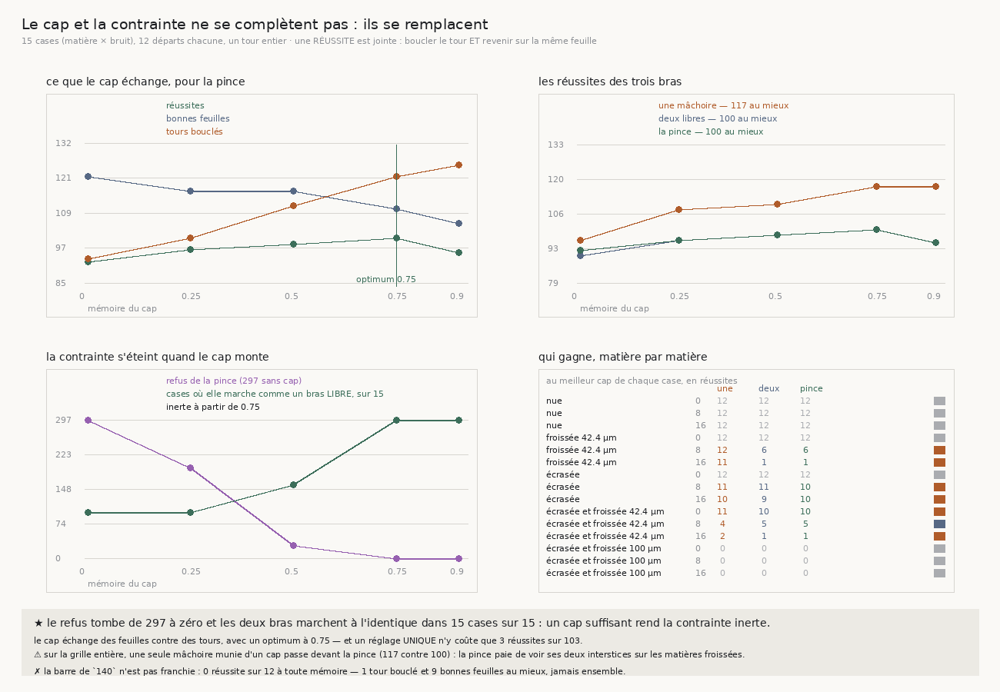

# 143 — Le cap et la contrainte ne se complètent pas : ils se remplacent

> ⭐⭐⭐⭐ **CETTE TRANCHE CORRIGE MA PROPRE PRÉDICTION, ET C'EST CE QU'ELLE APPORTE.** `139` mesure
> que le cap récupère 73 % de l'obliquité d'un froissement et `140` qu'il enlève ce qui **alterne** ;
> `142` que la pince tient contre l'**écrasement**, la cause qui persiste. J'attendais donc deux
> instruments **complémentaires**, chacun sur sa cause. La mesure dit l'inverse : ils font le même
> travail, et jamais en même temps.
>
> ⭐⭐⭐⭐ **LE REFUS DE LA PINCE TOMBE DE 297 À ZÉRO QUAND LE CAP MONTE.** Sur les quinze cases, la
> contrainte tire **297** fois sans cap, **194** à mémoire 0,25, **28** à 0,50, puis **zéro** à 0,75
> et à 0,90. Et dès 0,75 la pince marche **exactement** comme un bras libre dans **15 cases sur 15**,
> pas à pas. Un cap suffisant empêche la situation même que le refus existe pour attraper.
>
> ⭐⭐⭐ **CE QUE LE CAP ÉCHANGE EST MESURABLE, ET IL Y A UN OPTIMUM.** Pour la pince, monter la
> mémoire de 0 à 0,90 fait passer les bonnes feuilles de **121 à 105** et les tours bouclés de **93 à
> 125** : il achète de la distance avec de la fidélité. Les **réussites** — boucler le tour **et**
> revenir sur la même feuille — passent par un maximum : 92, 96, 98, **100**, 95. L'optimum est
> **0,75**, la même valeur pour les trois bras, et un **réglage unique** n'y coûte que **3** réussites
> sur **103**.
>
> ⚠⚠ **ET SUR LA GRILLE ENTIÈRE, UNE SEULE MÂCHOIRE MUNIE D'UN CAP PASSE DEVANT LA PINCE** : **117**
> réussites contre **100**. Une pince paie de devoir voir ses **deux** interstices, et neuf des
> quinze cases portent un froissement qui lui en cache un. Sur l'écrasement seul à bruit 16 — la
> cause que `140` nomme — elle garde l'avantage qu'elle avait, **10** contre **1**.
>
> ⚠⚠ **La barre de `140` n'est pas franchie.** Sur la matière qu'elle retient — écrasée **et**
> froissée à 100 µm — **aucun** bras ne réussit un seul transfert, à **aucune** mémoire : au mieux
> **1** tour bouclé et **9** bonnes feuilles, **jamais ensemble**.

## 1. Pourquoi ce fichier

Le dépôt tenait deux instruments et aucun ne passait seul la matière du rouleau. La question suivante
n'était donc pas « lequel » mais leur **composition** — et c'est la mesure qui l'a nommée, pas une
intention.

⭐⭐ **Le cap agit sur la normale, et il ne peut pas agir ailleurs.** Dans le plan du tour, la
direction perpendiculaire à la normale est **unique au signe près** : une mémoire posée sur la
tangente serait reprojetée sur la normale courante et n'aurait aucun effet. Ce qu'un cap peut retenir
est l'**orientation** — ce qui est aussi ce que fait le rouleau physique dont vient l'idée : il a de
l'inertie, il ne colle pas à chaque ondulation de la feuille.

⚠ **La mémoire est balayée, jamais posée.** `137` a marché à 0,75 ; recopier ce nombre ici aurait été
choisir le réglage d'une autre mesure parce qu'il était là. Le balayage porte de 0 — le suiveur de
`142`, **au bit** — à 0,90, et c'est la pente qu'on regarde. Que l'optimum retombe sur 0,75 est une
**convergence**, pas une justification.

## 2. ⚠⚠ Une réussite est jointe, et ma première barre ne l'était pas

`142` comptait séparément les départs qui finissent sur la **bonne feuille** et ceux qui **bouclent**
leur tour. La mesure a montré ce que ça laisse passer : ma première version de la barre a été
déclarée **franchie** par une marche qui bouclait son tour en revenant sur une **autre** feuille —
une seule bonne feuille sur douze. Un contrôle satisfait par autre chose que ce qu'il demande ne
contrôle rien.

Une **réussite** est donc jointe : **boucler le tour et revenir sur la même feuille**, par départ. Le
compte joint est aussi la garde anti-tautologie que le couple assurait — un bras qui refuse tout n'a
aucune réussite, puisqu'il ne boucle rien.

⚠ Lu ainsi, le résultat de `142` est plus net encore : sur sa case de tête, une mâchoire réussit **1**
transfert sur 12 et la pince **10**.

## 3. ⭐⭐⭐⭐ La mesure



Quinze cases — cinq matières × trois niveaux de bruit — douze départs chacune, un tour entier, cinq
mémoires de cap, les trois bras à chaque fois.

**La pente de la mémoire**, sommée sur les quinze cases (réussites · bonnes feuilles · tours) :

| mémoire | une mâchoire | deux mâchoires libres | la pince |
|---|---|---|---|
| 0 | 96 · 110 · 111 | 90 · 109 · 95 | 92 · 121 · 93 |
| 0,25 | 108 · 116 · 129 | 96 · 113 · 99 | 96 · 116 · 100 |
| 0,50 | 110 · 117 · 134 | 98 · 116 · 111 | 98 · 116 · 111 |
| **0,75** | **117** · 125 · 128 | **100** · 110 · 121 | **100** · 110 · 121 |
| 0,90 | 117 · 124 · 134 | 95 · 105 · 125 | 95 · 105 · 125 |

⭐ **Le meilleur réglage unique est 0,75 pour les trois bras**, et il ne coûte presque rien : **4**
réussites sur 121 pour une mâchoire, **3** sur 103 pour les deux autres. Un dérouleur ne règle pas sa
mémoire feuille par feuille ; il lui faut une valeur, et il en existe une.

**La contrainte s'éteint** — refus de la pince, et cases où elle marche **exactement** comme un bras
libre, pas à pas :

| mémoire | refus | cases à l'identique |
|---|---|---|
| 0 | 297 | 5 / 15 |
| 0,25 | 194 | 5 / 15 |
| 0,50 | 28 | 8 / 15 |
| 0,75 | **0** | **15 / 15** |
| 0,90 | **0** | **15 / 15** |

⚠ « À l'identique » se mesure sur les **suivis pas à pas**, pas sur les totaux : deux bras peuvent
rendre les mêmes comptes par des chemins différents. Le seul champ écarté de la comparaison est celui
que la pince publie et que le bras libre ne calcule jamais.

**Là où le cap change le plus la pince** : spirale froissée de 42,4 µm à bruit 8, où elle passe de
**1** réussite sur 12 sans cap à **6** sur 12 à mémoire 0,90 — **+5**.

⚠ **Et le cap sert moins à la pince qu'aux autres** : il améliore le couple dans **6** cases sur 15
pour la pince, **7** pour une mâchoire, **9** pour deux mâchoires libres.

## 4. ⭐⭐ Ce que ça change pour le graal

**Deux instruments qui se remplacent, ce n'est pas deux instruments.** L'extinction du refus est le
fait dur de cette tranche : à partir de 0,75, la pince **est** un bras libre — elle ne refuse plus
rien, et son suivi est identique pas à pas dans les quinze cases. Ce que la contrainte interdisait,
le cap l'a rendu impossible en amont. Donc un dérouleur n'a pas besoin des deux : il a besoin de
savoir **lequel** sa matière réclame.

**Et `140` dit lequel.** La contrainte paie sans cap sur l'écrasement — 10 réussites contre 1 pour une
mâchoire à bruit 16 — et le cap paie sur le froissement, où une mâchoire munie d'un cap mène. Or `140`
mesure que la cohérence du rouleau (0,925) tombe **entre** l'écrasement seul (0,999) et le froissement
seul (0,3925) : les deux causes y sont présentes, donc aucun des deux réglages n'est le bon partout.

**Ce qui reste à construire est nommé par là**, et ce n'est plus « composer les deux » : c'est un
instrument qui **lit** laquelle des deux causes domine là où il se trouve, et règle sa mémoire en
conséquence. `140` rend cette lecture possible — la cohérence du penchant sépare les deux causes, et
elle se mesure sur une marche.

⚠ **Ce que ça ne dit pas.** Que la pince soit inutile : sans cap elle reste le meilleur bras sur
l'écrasement, et c'est la cause que `140` juge dominante pour la cohérence. Ce qui est établi est plus
étroit : **un cap assez fort rend la contrainte inerte, et sur une grille majoritairement froissée une
seule mâchoire lui passe devant.**

## 5. ⚠ Ce que la mesure a corrigé d'elle-même

- ⚠⚠ **Ma barre était satisfaite pour la mauvaise raison** — franchie par une marche qui bouclait son
  tour sur une autre feuille. Corrigée en compte **joint**, elle rend le verdict honnête : non
  franchie.
- ⚠⚠ **Ma prédiction était fausse.** J'attendais une composition ; la mesure montre une substitution,
  et l'extinction du refus la rend indiscutable.
- **Le cap ne pouvait pas agir sur la tangente**, ce que la géométrie du plan impose et que j'ai dû
  établir avant d'écrire une ligne : la perpendiculaire à une normale y est unique au signe près.
- **Une case sans suivis rangés est sautée et comptée**, jamais lue comme « zéro refus » — un compte
  qui vaudrait zéro faute de donnée serait un contrôle incapable d'échouer.

## 6. Les registres

Faits `R4-F94` (un cap suffisant rend la contrainte inerte : 297 refus à zéro, 15 cases sur 15 à
l'identique dès 0,75), `R4-F95` (le cap échange des bonnes feuilles contre des tours, avec un optimum
à 0,75 et un réglage unique qui coûte 3 réussites sur 103) et `R4-F96` (sur la grille entière une
seule mâchoire munie d'un cap passe devant la pince, 117 contre 100, et la barre de `140` n'est
franchie par personne). Porte `R4-P26` : la demande qu'elle portait — composer les deux instruments —
est remplacée par une autre, mesurée : **lire quelle cause domine**.

## Reproduire

```bash
uv run python src/nappe/la_pince_garde_t_elle_son_cap.py \
    --json docs/mesures/la_pince_garde_t_elle_son_cap.json   # aucune lecture distante
uv run python src/figures/figure_la_pince_garde_t_elle_son_cap.py \
    --json docs/mesures/la_pince_garde_t_elle_son_cap.json \
    --sortie docs/images/143_la_pince_et_son_cap.png
uv run python src/nappe/la_pince_garde_t_elle_son_cap.py --verifier            # 28
uv run python src/figures/figure_la_pince_garde_t_elle_son_cap.py --verifier   # 16
uv run python src/nappe/la_pince_tient_elle_la_feuille.py --verifier           # 37
```

⚠ Une mémoire **nulle** rend exactement le suiveur de `142`, **au bit** : le chemin du mélange n'est
pris que si la mémoire est non nulle, et la batterie l'asserte plutôt que de s'y fier. Les nombres
publiés par `142` sont inchangés, vérifié en relançant sa mesure et en la comparant.

⚠ `--reagreger <json>` recalcule les résumés et le verdict depuis les suivis rangés, sans remarcher.
C'est ce qui a permis de corriger la barre sans repayer une heure de marche.
