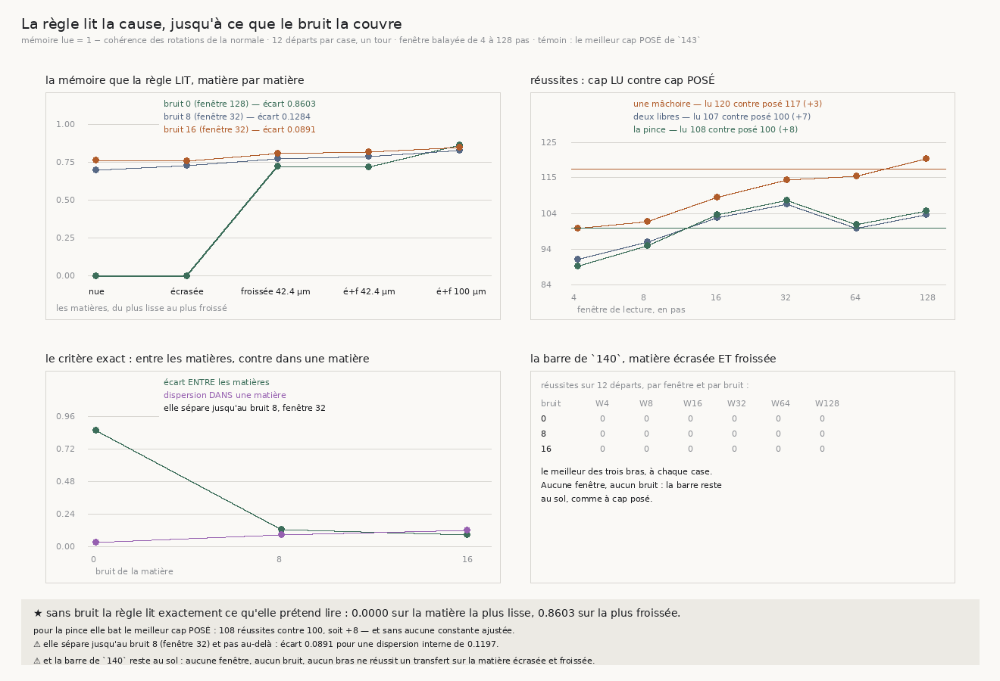

# 144 — La règle lit la cause, jusqu'à ce que le bruit la couvre

> ⭐⭐⭐⭐ **UNE MÉMOIRE DE CAP PEUT SE LIRE AU LIEU DE SE POSER, ET ELLE FAIT MIEUX.** `143` mesure
> que le bon réglage dépend de la cause, et qu'un réglage unique — 0,75 — coûte. Une règle sans
> aucune constante ajustée fait mieux que lui **sur les trois bras** : la pince passe de **100** à
> **108** réussites (**+8**), deux mâchoires libres de 100 à **107** (+7), une mâchoire de 117 à
> **120** (+3).
>
> ⭐⭐⭐⭐ **ET SANS BRUIT, LA RÈGLE LIT EXACTEMENT CE QU'ELLE PRÉTEND LIRE.** La mémoire qu'elle
> dérive vaut **0,0000** sur la spirale nue **et** sur la spirale écrasée — deux matières dont la
> normale tourne franchement — puis **0,7204** sur un froissement de 42,4 µm, **0,7180** sur la
> composition des deux, et **0,8603** sur un froissement de 100 µm. Elle n'a jamais vu ces matières ;
> elle lit la rotation de sa propre normale.
>
> ⭐⭐⭐ **LA RÈGLE EST UN ÉNONCÉ.** La normale tourne franchement quand la cause **persiste** — un
> écrasement a une période d'un demi-tour — et elle alterne quand la cause **alterne**, un
> froissement se renversant en quelques pas. La cohérence des incréments de rotation vaut donc un
> dans le premier cas et tombe vers zéro dans le second, et la mémoire vaut **`m = 1 − c`** : ce qui
> tourne franchement est lisible et le cap ne sert à rien, ce qui alterne ne l'est pas et le cap doit
> tenir. Aucune constante n'y est réglée.
>
> ⚠⚠ **ELLE S'ARRÊTE OÙ LE BRUIT COUVRE LA ROTATION, ET C'EST MESURÉ EXACTEMENT.** La lecture sépare
> les causes tant que l'écart **entre** matières dépasse la dispersion **dans** une matière : à bruit
> nul **0,8603 contre 0,0292** et toutes les fenêtres y arrivent, à bruit 8 **0,1284 contre 0,0881**
> et seule la fenêtre 32 y arrive, à bruit 16 **0,0891 contre 0,1197** et plus aucune. ⚠ L'**ordre**
> des matières, lui, survit à tous les bruits — c'est la séparation qui se perd, pas le classement.
>
> ⚠⚠ **La barre de `140` reste au sol.** Sur la matière écrasée **et** froissée à 100 µm, **aucune**
> fenêtre, **aucun** bruit, **aucun** bras ne réussit un transfert — exactement comme à cap posé.

## 1. Pourquoi ce fichier

`143` a montré que le cap et la contrainte se remplacent, et que le bon réglage dépend de la cause :
sans cap la pince gagne sur l'écrasement, avec cap une mâchoire gagne sur le froissement. Un réglage
unique existe (0,75) mais il coûte 3 réussites sur 103, et il ne franchit pas la barre. La question
qui restait était donc si un suiveur peut **lire**, sur son propre chemin, laquelle des deux causes
domine.

⭐ `140` rend cette lecture concevable : la **cohérence** sépare les deux causes (0,999 pour un
écrasement, 0,3925 pour un froissement). Ce fichier la transpose sur la grandeur qu'un suiveur
tangentiel a sous la main — la rotation de sa propre normale.

## 2. ⭐⭐⭐ La règle, et pourquoi elle n'a aucune constante

La normale d'un suiveur tourne pour deux raisons, et une seule est lisible :

- **l'enroulement** la fait tourner franchement et toujours dans le même sens, sur toute matière ;
- **la cause locale** s'y ajoute — un écrasement, dont la période est d'un demi-tour, tourne
  franchement lui aussi ; un froissement se renverse en quelques pas.

La cohérence des incréments, `c = |somme| / somme des valeurs absolues`, vaut donc **un** sur une
spirale nue comme sur un écrasement, et tombe vers **zéro** sur un froissement. D'où

    m = 1 − c

⚠⚠ **Ma première version retirait la moyenne des incréments, et elle était fausse.** L'intention
était d'ôter l'enroulement, qui est le même partout ; mais une dérive lente a par construction un
résidu de moyenne nulle, donc une cohérence proche de zéro — l'écrasement recevait la mémoire
**maximale**, exactement l'inverse de ce que la règle veut dire. **La batterie l'a dit avant la
mesure.** L'enroulement se garde : un cap ne doit pas combattre une rotation franche, et c'est
précisément ce que la cohérence des incréments bruts exprime.

⚠ **La borne est dérivée, pas choisie** : `m ≤ 1 − 1/fenêtre`. On ne peut pas revendiquer une mémoire
plus longue que ce qu'on vient de mesurer, et une mémoire de un figerait l'orientation — la batterie
de `143` montre qu'un suiveur cesse alors de suivre. Seule la **longueur** de la fenêtre reste un
paramètre, et elle est balayée.

## 3. ⭐⭐⭐⭐ La mesure



Quinze cases — cinq matières × trois niveaux de bruit — douze départs chacune, un tour entier, six
fenêtres de lecture, les trois bras à chaque fois. Le témoin n'est pas remarché : `143` publie le
meilleur cap **posé** et son score.

**Réussites par fenêtre**, sommées sur les quinze cases :

| fenêtre | une mâchoire | deux mâchoires libres | la pince |
|---|---|---|---|
| 4 | 100 | 91 | 89 |
| 8 | 102 | 96 | 95 |
| 16 | 109 | 103 | 104 |
| **32** | 114 | **107** | **108** |
| 64 | 115 | 100 | 101 |
| **128** | **120** | 104 | 105 |

⚠ **Le balayage va au-delà de son optimum, et c'est délibéré** : ma première version s'arrêtait à 32,
qui se trouvait être la meilleure — un optimum au **bord** d'un balayage n'est pas un optimum, c'est
une borne du balayage. Étendu, il montre que les deux bras à deux mâchoires ont un optimum
**intérieur** à 32, tandis qu'une seule mâchoire continue de monter jusqu'à 128 : à fenêtre très
longue la lecture devient une constante, c'est-à-dire un cap posé.

**Contre le meilleur cap posé de `143`** :

| bras | cap lu | cap posé | écart |
|---|---|---|---|
| une mâchoire | **120** (fenêtre 128) | 117 (mémoire 0,75) | **+3** |
| deux mâchoires libres | **107** (fenêtre 32) | 100 | **+7** |
| la pince | **108** (fenêtre 32) | 100 | **+8** |

**Ce que la règle lit, matière par matière** — et c'est le cœur du fichier :

| matière | bruit 0 | bruit 8 | bruit 16 |
|---|---|---|---|
| spirale nue | **0,0000** | 0,6999 | 0,7615 |
| spirale écrasée | **0,0000** | 0,7253 | 0,7593 |
| froissée 42,4 µm | 0,7204 | 0,7731 | 0,8055 |
| écrasée et froissée 42,4 µm | 0,7180 | 0,7877 | 0,8190 |
| écrasée et froissée 100 µm | **0,8603** | 0,8283 | 0,8484 |

Sans bruit, la règle rend **exactement zéro** sur les deux matières dont la normale tourne
franchement, et monte avec l'amplitude du froissement. Elle n'a jamais vu ces matières.

⚠⚠ **Le critère de séparation est exact, sans aucune constante** : la lecture sépare les causes quand
l'écart **entre** matières dépasse la dispersion **dans** une matière.

| bruit | écart entre matières | dispersion dans une | sépare | fenêtres qui y arrivent |
|---|---|---|---|---|
| 0 | **0,8603** | 0,0292 | oui | toutes les six |
| 8 | **0,1284** | 0,0881 | oui | la 32 seule |
| 16 | 0,0891 | **0,1197** | **non** | aucune |

⚠ **Mais l'ordre survit** : à tous les bruits, la mémoire lue croît de la spirale nue au froissement
le plus fort. Ce que le bruit détruit est la **séparation**, pas le **classement** — et c'est ce qui
nomme la suite : la lecture doit se faire là où le bruit s'annule, c'est-à-dire sur davantage de pas,
ou en retranchant le plancher qu'il impose.

⚠ **La barre de `140`** : sur la matière écrasée et froissée à 100 µm, le meilleur des trois bras
réussit **zéro** transfert, à chacune des six fenêtres et à chacun des trois bruits.

## 4. ⭐⭐ Ce que ça change pour le graal

**Le réglage cesse d'être un réglage.** C'est le premier instrument de cette série dont le paramètre
qui comptait — la mémoire du cap — n'est plus posé : il se dérive de ce que le suiveur lit, par une
règle qui n'a pas de constante et qui n'a pas été ajustée sur la grille. Et il fait mieux que le
meilleur réglage fixe, sur les trois bras.

**Mais il ne franchit pas la barre**, et le pourquoi est maintenant nommé : la grandeur qui porte la
cause est noyée par le bruit dès qu'il atteint le niveau où la séparation tombe sous la dispersion
interne. La lecture est bonne ; c'est son rapport signal sur bruit qui est insuffisant, et ça se
répare en lisant sur plus de matière, pas en changeant de règle.

⚠ **Ce que ça ne dit pas.** Que la règle soit la bonne. Elle est **une** règle sans constante qui bat
un réglage fixe ; une autre pourrait faire mieux. Ce qui est établi est plus étroit et plus solide :
**la cause est lisible sur le chemin du suiveur lui-même, et la lire vaut mieux que la deviner.**

## 5. ⚠ Ce que la mesure a corrigé d'elle-même

- ⚠⚠ **La règle a été fausse avant d'être juste** : retirer la moyenne des incréments détruisait
  exactement la persistance qu'elle devait détecter. **La batterie l'a dit avant la mesure**, ce qui
  est l'ordre qu'on cherche.
- ⚠⚠ **Un optimum au bord d'un balayage n'est pas un optimum.** Le balayage a été étendu de 32 à 128,
  et il a montré un optimum intérieur pour les bras à deux mâchoires.
- ⚠⚠ **Un verdict qui choisit une fenêtre pour raconter est déjà un choix de trop.** Ma première
  version retenait « la fenêtre qui sépare le mieux sans bruit », et rendait une lecture pessimiste :
  celle qui sépare le mieux à bruit nul n'est pas celle qui résiste le mieux au bruit. Le résumé dit
  maintenant, pour chaque bruit, **quelles** fenêtres séparent.
- **Un `min` qui portait sur des listes** au lieu des fenêtres, et qui rendait `[4, 8]` là où la
  réponse est 4.
- **Un attendu posé dans ma batterie** (« la plus courte fenêtre est 8 ») alors que la fixture en
  faisait séparer deux ; dérivé depuis.
- **Un contrôle de figure au seuil posé** (« plus de 40 points »), tombé à 39 ; dérivé de ce que la
  mesure implique de dessiner.

## 6. Les registres

Faits `R4-F97` (une mémoire de cap lue bat le meilleur réglage posé sur les trois bras, sans aucune
constante ajustée), `R4-F98` (sans bruit la règle rend exactement zéro sur les matières dont la
normale tourne franchement et croît avec l'amplitude du froissement) et `R4-F99` (la lecture sépare
les causes jusqu'à un niveau de bruit mesuré et pas au-delà, tandis que l'ordre des matières survit).
Porte `R4-P26` : ce qu'elle demandait — lire quelle cause domine — reçoit une réponse mesurée, et une
limite mesurée.

## Reproduire

```bash
uv run python src/nappe/un_cap_qui_lit_la_cause.py \
    --json docs/mesures/un_cap_qui_lit_la_cause.json    # aucune lecture distante
uv run python src/figures/figure_un_cap_qui_lit_la_cause.py \
    --json docs/mesures/un_cap_qui_lit_la_cause.json \
    --sortie docs/images/144_un_cap_qui_lit_la_cause.png
uv run python src/nappe/un_cap_qui_lit_la_cause.py --verifier            # 20
uv run python src/figures/figure_un_cap_qui_lit_la_cause.py --verifier   # 16
uv run python src/nappe/la_pince_tient_elle_la_feuille.py --verifier     # 47
```

⚠ Une fenêtre **nulle** rend exactement le suiveur de `143`, **au bit** : les deux modes s'excluent,
et les nombres publiés par `143` sont inchangés, vérifié en relançant sa mesure et en la comparant.

⚠ `--reagreger <json>` recalcule les résumés et le verdict depuis les suivis rangés, sans remarcher.
C'est ce qui a permis de corriger le résumé sans repayer la marche.
