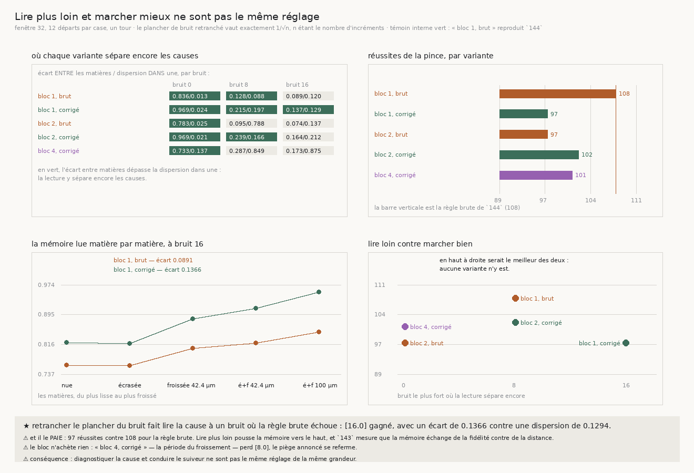

# 145 — Lire plus loin et marcher mieux ne sont pas le même réglage

> ⭐⭐⭐⭐ **RETRANCHER LE PLANCHER DU BRUIT FAIT LIRE LA CAUSE UN CRAN PLUS LOIN, ET LE FAIT PAYER.**
> `144` laissait la lecture s'arrêter à bruit 8. En retranchant une quantité qui se calcule
> **exactement** — pour `n` incréments indépendants de moyenne nulle, la cohérence attendue d'un bruit
> pur vaut `1/√n` — la lecture sépare encore les causes à bruit **16** : écart entre matières
> **0,1366** contre une dispersion dans une matière de **0,1294**. ⚠⚠ Mais la pince tombe de **108**
> réussites à **97**.
>
> ⭐⭐⭐ **ET C'EST UN COMPROMIS, PAS UN RÉGLAGE À TROUVER.** Une lecture corrigée rend une mémoire
> plus haute partout — à bruit 16 elle relève la spirale nue de 0,7615 à **0,8206** et le froissement
> fort de 0,8484 à **0,9547** — et `143` mesure que la mémoire échange de la fidélité contre de la
> distance. Lire plus loin pousse donc le suiveur dans le régime qui lui coûte des réussites. Aucune
> des cinq variantes n'est à la fois la meilleure lectrice et la meilleure marcheuse.
>
> ⭐⭐ **LE BLOC N'ACHÈTE RIEN, ET SON PIÈGE SE REFERME COMME ANNONCÉ.** Sommer les incréments par
> paquets élève le signal comme `√k` — mais un froissement de période `p` pas s'annule dans un bloc de
> `p`. Ici la période vaut **393,6 / 98,4 = 4 pas** : le bloc de 4 perd le bruit 8 que la règle brute
> tenait, et le bloc de 2 sans correction le perd aussi. La borne était annoncée avant la mesure ; la
> mesure la confirme.
>
> ⚠ **Le témoin interne est vert** : la variante « bloc 1, brut » **est** la règle de `144`, et elle
> la reproduit exactement — 114, 107, **108**. Sans ça, une différence de protocole serait passée pour
> un effet de la correction.

## 1. Pourquoi ce fichier

`144` établit que la règle `m = 1 − c` lit exactement ce qu'elle prétend lire, et qu'elle cesse de
séparer les causes dès que le bruit couvre la rotation. Mais l'**ordre** des matières survit à tous
les bruits : la règle est bonne, c'est son rapport signal sur bruit qui manque. Deux mécanismes le
réparent en principe, et un seul est exact.

**Le bloc** somme les incréments par paquets de `k`. Un bruit indépendant y croît comme `√k`, une
cause cohérente comme `k`, donc le rapport s'améliore. ⚠⚠ Mais il est borné **par la cause
elle-même** : un froissement de période `p` pas s'annule dans un bloc de `p`, et il ne reste alors que
l'enroulement, qui est cohérent — la règle lirait « persistant » sur une matière froissée.

**La correction du plancher** retranche une quantité qui se calcule exactement. Pour `n` incréments
indépendants de moyenne nulle, `E|Σr| = σ√(2n/π)` et `E[Σ|r|] = nσ√(2/π)`, donc

    cohérence attendue d'un bruit pur = 1/√n

Une cohérence qui vaut ce plancher ne dit rien ; la retrancher et renormaliser rend une lecture qui
vaut **zéro** sur du bruit pur et **un** sur une rotation parfaite. Aucune constante n'y est ajustée.

⚠ C'est le rapport des **espérances**, pas l'espérance du rapport — les deux se rejoignent quand `n`
grandit, et c'est dit plutôt que tu. La batterie le mesure : sur 200 tirages de 64 incréments
gaussiens, la cohérence moyenne vaut bien `1/√64`.

## 2. ⚠⚠ Le témoin interne, et pourquoi il vient en premier

La variante « bloc 1, sans correction » **est** la règle de `144`. Si la mesure ne la reproduit pas,
c'est le protocole qui a bougé et aucune comparaison ne vaut. Elle la reproduit :

| bras | ici | dans `144` |
|---|---|---|
| une mâchoire | 114 | 114 |
| deux mâchoires libres | 107 | 107 |
| la pince | **108** | **108** |

⚠ La fenêtre est fixée à **32** — la seule que `144` mesure comme séparant encore à bruit 8. Elle est
donc choisie par une mesure antérieure, pas par moi.

## 3. ⭐⭐⭐⭐ La mesure



Cinq matières × trois niveaux de bruit × cinq variantes, douze départs par case, un tour entier.

**Où chaque variante sépare encore les causes** — écart entre matières / dispersion dans une :

| variante | bruit 0 | bruit 8 | bruit 16 | sépare aux bruits |
|---|---|---|---|---|
| bloc 1, brut | 0,8357 / 0,0134 | 0,1284 / 0,0881 | 0,0891 / 0,1197 | 0 et 8 |
| **bloc 1, plancher retranché** | 0,9688 / 0,0242 | 0,2151 / 0,1971 | **0,1366 / 0,1294** | **0, 8 et 16** |
| bloc 2, brut | 0,7826 / 0,0245 | 0,0954 / 0,7880 | 0,0736 / 0,1369 | 0 |
| bloc 2, plancher retranché | 0,9688 / 0,0207 | 0,2388 / 0,1663 | 0,1636 / 0,2119 | 0 et 8 |
| bloc 4, plancher retranché | 0,7330 / 0,1369 | 0,2871 / 0,8485 | 0,1728 / 0,8754 | 0 |

**Ce que chaque variante fait marcher** — réussites de la pince sur les quinze cases :

| variante | réussites |
|---|---|
| **bloc 1, brut** | **108** |
| bloc 1, plancher retranché | 97 |
| bloc 2, brut | 97 |
| bloc 2, plancher retranché | 102 |
| bloc 4, plancher retranché | 101 |

⭐⭐ **Les deux tableaux ne désignent pas la même variante**, et c'est le fait de cette tranche. Celle
qui lit le plus loin est celle qui marche le moins bien.

**Le mécanisme**, à bruit 16, mémoire lue matière par matière :

| matière | brute | plancher retranché |
|---|---|---|
| spirale nue | 0,7615 | 0,8206 |
| spirale écrasée | 0,7593 | 0,8181 |
| froissée 42,4 µm | 0,8055 | 0,8833 |
| écrasée et froissée 42,4 µm | 0,8190 | 0,9121 |
| écrasée et froissée 100 µm | 0,8484 | 0,9547 |

La correction relève **tout le monde** et rouvre l'éventail : l'écart passe de **0,0891** à
**0,1366**. C'est exactement ce qu'elle doit faire — et c'est aussi pourquoi elle coûte, puisque la
mémoire employée monte partout.

⚠ **Le piège du bloc, annoncé avant la mesure et confirmé par elle** : « bloc 4, plancher retranché »
perd le bruit **8** que la règle brute tenait. La période du froissement vaut quatre pas, et un bloc
de quatre annule la cause qu'il devait révéler.

## 4. ⭐⭐ Ce que ça change pour le graal

**Diagnostiquer et conduire ne sont pas le même usage de la même grandeur.** Une lecture corrigée est
le bon instrument pour **savoir** quelle cause domine — elle tient jusqu'à bruit 16. La lecture brute
est le bon instrument pour **conduire** le suiveur — elle rend onze réussites de plus. Les employer
l'un pour l'autre coûte, et la mesure dit combien.

**Ce qui reste à construire est donc à deux étages** : lire la cause avec la correction, et conduire
avec la mémoire que ce diagnostic désigne — au lieu d'employer directement la lecture corrigée comme
mémoire. Ce fichier ne l'a pas construit ; il montre que les deux étages sont nécessaires et pourquoi.

⚠ **Ce que ça ne dit pas.** Que la correction soit la meilleure façon de lire sous le bruit. Elle est
**une** correction exacte qui gagne un cran ; une autre pourrait gagner davantage. Ce qui est établi
est plus étroit : **le plancher de bruit se calcule exactement, le retrancher étend la lecture d'un
cran de bruit, et ce gain se paie en réussites.**

## 5. ⚠ Ce que la mesure a corrigé d'elle-même

- ⚠⚠ **Une fixture assise exactement sur l'égalité.** Mon contrôle posait un écart entre matières
  rigoureusement égal à la dispersion interne : il ne testait plus la règle mais l'ordre des dernières
  décimales flottantes, et il répondait au hasard. Une fixture se tient **franchement** de part et
  d'autre d'une limite.
- ⚠⚠ **Et elle a révélé un vrai défaut dans `144`** : l'écart entre matières s'y calculait sur des
  médianes **arrondies** et la dispersion dans une matière sur des valeurs **brutes**. Sur les vraies
  données le producteur arrondit déjà des deux côtés — vérifié, la mesure de `144` est inchangée — mais
  s'appuyer sur cette coïncidence est ce que ce dépôt proscrit. Les deux côtés sont arrondis
  explicitement.
- **Le calcul de « sépare » n'est pas réécrit** : c'est celui de `144`, appelé avec un filtre sur la
  variante au lieu d'un filtre sur la fenêtre. Deux écritures de « l'écart entre dépasse la dispersion
  dans » seraient deux réponses à une même question.
- **Une étiquette posée à droite d'un point déjà à droite** sortait de son panneau ; la garde des
  cadres l'a dit.

## 6. Les registres

Faits `R4-F100` (le plancher de bruit de la cohérence vaut exactement `1/√n`, et le retrancher étend
la lecture d'un cran de bruit), `R4-F101` (ce gain de lecture se paie en réussites, parce qu'une
lecture corrigée relève la mémoire partout) et `R4-F102` (sommer par blocs n'achète rien et son piège
se referme à la période de la cause). Porte `R4-P26` : la demande devient un instrument à **deux
étages**, diagnostiquer puis conduire.

## Reproduire

```bash
uv run python src/nappe/lire_la_cause_sous_le_bruit.py \
    --json docs/mesures/lire_la_cause_sous_le_bruit.json   # aucune lecture distante
uv run python src/figures/figure_lire_la_cause_sous_le_bruit.py \
    --json docs/mesures/lire_la_cause_sous_le_bruit.json \
    --sortie docs/images/145_lire_la_cause_sous_le_bruit.png
uv run python src/nappe/lire_la_cause_sous_le_bruit.py --verifier            # 18
uv run python src/figures/figure_lire_la_cause_sous_le_bruit.py --verifier   # 17
uv run python src/nappe/la_pince_tient_elle_la_feuille.py --verifier         # 55
uv run python src/nappe/un_cap_qui_lit_la_cause.py --verifier                # 20
```

⚠ Un bloc de **un** sans correction rend exactement la règle de `144`, et le témoin interne le
vérifie plutôt que de s'y fier.

⚠ `--reagreger <json>` recalcule les résumés et le verdict depuis les suivis rangés, sans remarcher.
