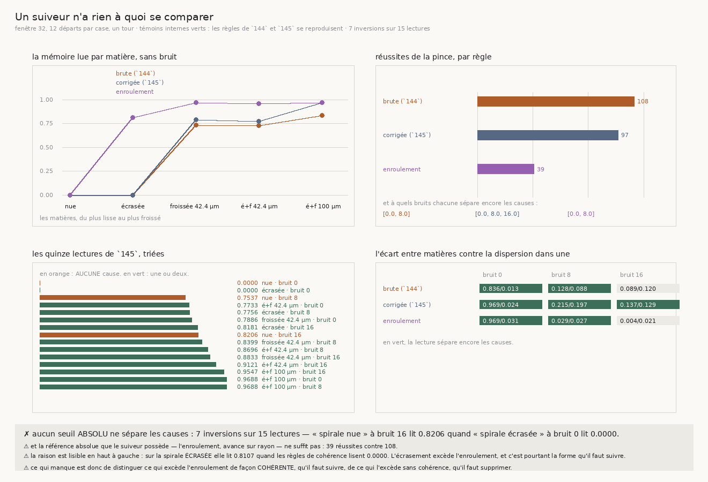

# 146 — Un suiveur n'a rien à quoi se comparer

> ⭐⭐⭐⭐ **L'OBSTACLE EST MESURÉ, ET IL EST DANS LES DONNÉES DE `145` ELLES-MÊMES.** L'instrument à
> deux étages que `145` demande suppose un premier étage qui **classe** la matière. Or les quinze
> lectures que `145` publie **se recouvrent** : sur 15 lectures, **7 inversions** — une matière qui ne
> porte AUCUNE cause lit plus haut qu'une matière qui en porte deux. La pire : la **spirale nue** à
> bruit 16 lit **0,8206** quand la **spirale écrasée** sans bruit lit **0,0000**. Aucun seuil absolu
> ne sépare les causes, et un suiveur ne voit qu'un seul de ces nombres.
>
> ⭐⭐⭐ **LA SEULE RÉFÉRENCE ABSOLUE QUE LE SUIVEUR POSSÈDE NE SUPPLÉE PAS, ET C'EST MESURÉ.**
> L'enroulement — `avance / rayon`, que le suiveur calcule seul, sans voir aucune autre matière — est
> une rotation qu'il sait devoir subir. Lire l'**excès** au-dessus d'elle donne une mémoire sans aucune
> comparaison. ⚠⚠ Elle échoue franchement : **39** réussites de la pince contre **108** pour la règle
> brute de `144` et **97** pour la corrigée de `145`, et elle ne lit pas plus loin non plus — elle
> cesse de séparer à bruit 16 (écart **0,0043** pour une dispersion de **0,0207**).
>
> ⭐⭐⭐⭐ **ET LA MESURE CORRIGE MON ÉNONCÉ, EXACTEMENT.** J'avais posé que ce qui excède l'enroulement
> n'est ni lisible ni voulu. Sur la spirale **écrasée**, sans bruit, la règle de l'enroulement lit
> **0,8107** là où les deux règles de cohérence lisent **0,0000**. L'écrasement excède l'enroulement —
> et c'est pourtant la forme qu'il faut **suivre**, pas supprimer. Supprimer tout l'excès, c'est
> supprimer la matière.
>
> ⚠ **Les deux témoins internes sont verts** : les règles de `144` et de `145` se reproduisent au
> nombre près (114 · 107 · **108** et 115 · 98 · **97**). Sans eux, un changement de protocole serait
> passé pour un effet de la règle nouvelle.

## 1. Pourquoi ce fichier

`145` laisse une demande précise : un instrument à **deux étages**, le premier qui diagnostique la
cause avec la lecture corrigée, le second qui conduit avec la mémoire que ce diagnostic désigne. Le
premier étage suppose quelque chose qui n'avait jamais été vérifié : qu'une lecture puisse **classer**
la matière, c'est-à-dire qu'un suiveur qui ne voit que son propre nombre puisse en déduire sur quoi il
marche.

⚠⚠ C'est une supposition, pas un acquis. « La lecture sépare » veut dire, depuis `144`, que *l'écart
ENTRE matières dépasse la dispersion DANS une matière* — un énoncé sur une **grille**, qui compare des
matières entre elles. Un suiveur n'a pas de grille. Il a un nombre.

La question de ce fichier est donc : **les lectures que `145` publie se séparent-elles par un seuil
absolu ?** Et elle se tranche sans mesure nouvelle, sur les données déjà rangées.

## 2. ⭐⭐⭐⭐ L'obstacle, démontré par les données de `145`



Cinq matières × trois bruits = **quinze lectures**, prises sur la variante corrigée de `145` (celle
qui sépare le plus loin). Triées :

| lecture | matière | bruit | porte une cause ? |
|---|---|---|---|
| 0,0000 | spirale nue | 0 | **non** |
| 0,0000 | spirale écrasée | 0 | oui |
| 0,7537 | spirale nue | 8 | **non** |
| 0,7733 | écrasée et froissée 42,4 µm | 0 | oui |
| 0,7756 | spirale écrasée | 8 | oui |
| 0,7886 | froissée 42,4 µm | 0 | oui |
| 0,8181 | spirale écrasée | 16 | oui |
| **0,8206** | **spirale nue** | **16** | **non** |
| 0,8399 | froissée 42,4 µm | 8 | oui |
| 0,8696 | écrasée et froissée 42,4 µm | 8 | oui |
| … | … | … | … |

**Sept inversions** : sept fois, une matière sans cause lit au moins aussi haut qu'une matière qui en
porte une. La pire est la dernière ligne du tableau contre la deuxième — **0,8206** contre
**0,0000**, avec les rôles inversés.

⚠ **Ce que ça ne dit pas** : que la lecture soit mauvaise. `145` établit qu'elle sépare, et elle
sépare. Ce qui est établi ici est plus étroit et plus dur : la séparation est **relative**, elle vit
dans la comparaison entre matières mesurées au même bruit, et elle **ne survit pas** à être lue comme
un seuil. Le bruit déplace toutes les lectures vers le haut, et ce déplacement est plus grand que
l'écart entre matières.

## 3. ⭐⭐⭐ La référence absolue que le suiveur possède

Il en existe une, et elle ne demande aucune autre matière : **l'enroulement**. En avançant de
`avance` sur un cercle de rayon `rayon`, la normale tourne nécessairement de `avance / rayon` par pas
— le suiveur connaît les deux nombres, il n'a rien à comparer à rien.

La règle : `m = 1 − min(w / moyenne|r|, 1)`, où `w` est l'enroulement et `r` les incréments de
rotation. Elle lit une **amplitude** et non un signe : zéro quand la normale tourne exactement comme
l'enroulement l'exige, et d'autant plus haut que la rotation l'excède.

⚠ Sur une spirale nue, elle lit **0,0000** exactement, ce qui est la bonne réponse pour la bonne
raison — c'est le seul cas où l'énoncé et la matière coïncident.

**Ce que chaque règle fait marcher** (réussites de la pince sur les quinze cases) :

| règle | une mâchoire | deux mâchoires libres | la pince | sépare aux bruits |
|---|---|---|---|---|
| brute (`144`) | 114 | 107 | **108** | 0 et 8 |
| corrigée (`145`) | 115 | 98 | 97 | 0, 8 et **16** |
| **enroulement** | 106 | 39 | **39** | 0 et 8 |

**Et ce que chaque règle sépare** — écart entre matières / dispersion dans une :

| règle | bruit 0 | bruit 8 | bruit 16 |
|---|---|---|---|
| brute (`144`) | 0,8357 / 0,0134 ✓ | 0,1284 / 0,0881 ✓ | 0,0891 / 0,1197 ✗ |
| corrigée (`145`) | 0,9688 / 0,0242 ✓ | 0,2151 / 0,1971 ✓ | **0,1366 / 0,1294 ✓** |
| enroulement | 0,9688 / 0,0310 ✓ | 0,0294 / 0,0269 ✓ | 0,0043 / 0,0207 ✗ |

⚠⚠ **Elle ne gagne sur aucun des deux tableaux.** Elle ne lit pas plus loin que la corrigée, et elle
rend **39** réussites là où la brute en rend **108**. Une règle qui se passe de toute comparaison existe ; celle
qui existe ne fait pas le travail.

## 4. ⭐⭐⭐⭐ Pourquoi elle échoue, et l'énoncé qu'elle corrige

La mémoire lue par matière, **sans bruit**, par les trois règles :

| matière | brute (`144`) | corrigée (`145`) | enroulement |
|---|---|---|---|
| spirale nue | 0,0000 | 0,0000 | 0,0000 |
| **spirale écrasée** | 0,0000 | 0,0000 | **0,8107** |
| froissée 42,4 µm | 0,7307 | 0,7886 | 0,9688 |
| écrasée et froissée 42,4 µm | 0,7253 | 0,7733 | 0,9569 |
| écrasée et froissée 100 µm | 0,8357 | 0,9688 | 0,9688 |

La deuxième ligne est toute l'explication. Les deux règles de cohérence lisent **zéro** sur la spirale
écrasée : la normale y tourne **franchement**, sans jamais revenir sur elle-même, donc la cohérence de
ses incréments vaut un et la mémoire vaut zéro — le bras suit la feuille pas à pas, ce qu'il doit
faire. La règle de l'enroulement y lit **0,8107** : la rotation excède l'enroulement, donc elle
demande au bras de **lisser** ce qu'il devrait suivre.

⚠⚠ **Mon énoncé était faux, et la mesure le dit** : « ce qui excède l'enroulement n'est ni lisible ni
voulu ». L'écrasement excède l'enroulement — `140` l'a établi comme la cause qui **persiste**, et
`142` que la pince tient précisément dessus — et c'est la forme de la feuille. La quantité à supprimer
n'est pas l'excès, c'est l'excès **incohérent**.

⭐ C'est aussi pourquoi la chute est asymétrique entre les bras : une seule mâchoire perd peu (114 →
**106**), la pince et les deux mâchoires libres s'effondrent (108 → **39**). Une mémoire trop haute
empêche les deux mâchoires de rester sur la même feuille, ce que `143` mesure déjà dans l'autre sens.

## 5. ⚠ Les témoins internes

Deux variantes de cette grille **doivent** reproduire les tranches précédentes. Elles les
reproduisent :

| variante | une mâchoire | deux mâchoires libres | la pince |
|---|---|---|---|
| brute (`144`) | 114 = 114 | 107 = 107 | **108 = 108** |
| corrigée (`145`) | 115 = 115 | 98 = 98 | **97 = 97** |

⚠ La fenêtre reste **32** et les douze départs par case aussi : les deux sont fixés par `144`, donc
par une mesure antérieure et pas par moi. Sans ces témoins, un protocole qui aurait bougé d'un cheveu
aurait fait passer une différence de grille pour un effet de la règle de l'enroulement.

## 6. ⭐⭐ Ce que ça change pour le graal

**La demande de `145` tient toujours, mais son premier étage n'a pas de matière première.** Classer
la cause demande un référent que le suiveur n'a pas : les lectures se recouvrent (§2), et la seule
quantité absolue qu'il possède ne fait pas le travail (§3).

**Et la mesure nomme ce qui manque, exactement** : distinguer ce qui excède l'enroulement **de façon
cohérente**, qu'il faut suivre, de ce qui l'excède **sans cohérence**, qu'il faut supprimer. Les deux
ingrédients existent séparément dans l'arbre — l'enroulement dit *combien* de rotation est due, la
cohérence de `144` dit *si* la rotation persiste — et aucune tranche ne les a encore posés ensemble.
Ce fichier ne le fait pas ; il mesure pourquoi il faut le faire.

⚠ **Ce que ça ne dit pas.** Que l'enroulement soit inutile. Il rend exactement **0,0000** sur la
spirale nue, ce qu'aucune règle relative ne peut garantir sans comparer ; c'est une ancre, pas une
mémoire. Ce qui est réfuté est plus étroit : **l'enroulement seul, employé comme mémoire, rend 39
réussites là où la règle brute en rend 108.**

## 7. ⚠ Ce que la mesure a corrigé d'elle-même

- ⚠⚠ **Un `… or True`, dans le PRODUCTEUR cette fois.** `elle_fait_les_deux` était écrit de façon à
  ne pouvoir rendre qu'une valeur. Un contrôle incapable d'échouer est déjà proscrit ici ; un
  **verdict** incapable d'échouer est pire, parce qu'il se publie. Remplacé par l'énoncé réel : elle
  fait les deux si elle lit plus loin **et** marche mieux — et elle ne fait ni l'un ni l'autre.
- ⚠⚠ **`0.0 or 1.0` vaut `1.0` en Python.** Un zéro légitime avalé par un `or` — et c'était
  précisément la valeur que la règle de l'enroulement doit rendre sur une spirale nue, donc le seul
  cas où elle a raison. Remplacé par des tests `is not None` explicites. Une valeur nulle qui compte
  ne se teste pas par sa vérité.
- **Le calcul de « sépare » n'est toujours pas réécrit** : c'est `le_discriminant` de `144`, appelé
  avec un filtre sur la variante. Trois écritures de « l'écart entre dépasse la dispersion dans »
  seraient trois réponses à une même question.
- **L'obstacle ne demande aucune marche neuve** : il se lit sur le JSON de `145`, qui publie ses
  lectures par matière et par bruit. Une tranche qui aurait remarché pour le mesurer aurait payé une
  grille entière pour un tri.

## 8. Les registres

Faits `R4-F103` (aucun seuil absolu ne sépare les causes sur les lectures de `145` — 7 inversions sur
15), `R4-F104` (la seule référence absolue que le suiveur possède, l'enroulement, ne supplée pas : 39
réussites contre 108, et elle ne lit pas plus loin) et `R4-F105` (et la raison est exacte — elle lit
0,8107 sur la spirale écrasée là où les règles de cohérence lisent 0,0000, donc elle supprime la forme
qu'il faut suivre). Porte `R4-P26` : la demande devient de séparer l'excès **cohérent** de l'excès
**incohérent**.

## Reproduire

```bash
uv run python src/nappe/un_suiveur_na_rien_a_quoi_se_comparer.py \
    --json docs/mesures/un_suiveur_na_rien_a_quoi_se_comparer.json   # aucune lecture distante
uv run python src/figures/figure_un_suiveur_na_rien_a_quoi_se_comparer.py \
    --json docs/mesures/un_suiveur_na_rien_a_quoi_se_comparer.json \
    --sortie docs/images/146_un_suiveur_na_rien_a_quoi_se_comparer.png
uv run python src/nappe/un_suiveur_na_rien_a_quoi_se_comparer.py --verifier            # 18
uv run python src/figures/figure_un_suiveur_na_rien_a_quoi_se_comparer.py --verifier   # 17
uv run python src/nappe/la_pince_tient_elle_la_feuille.py --verifier                   # 61
```

⚠ Le précédent est lu et non recopié : `--precedent docs/mesures/lire_la_cause_sous_le_bruit.json`.
Sans lui l'obstacle est **indécidable**, et la mesure le dit plutôt que de le supposer.

⚠ `--reagreger <json>` recalcule les résumés et le verdict depuis les suivis rangés, sans remarcher.
