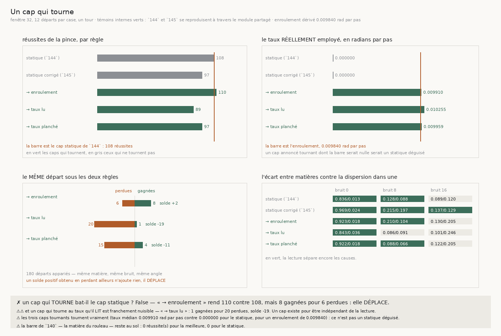

# 147 — Un cap peut tourner à un taux qu'il connaît, jamais à un taux qu'il lit

> ⭐⭐⭐⭐ **PRÉDIRE DEPUIS SA PROPRE LECTURE EST FRANCHEMENT NUISIBLE, ET C'EST MESURÉ.** Un cap qui
> tourne à la moyenne des incréments qu'il vient de lire — donc qui suit l'écrasement, ce que `146`
> réclamait — rend **89** réussites contre **108** pour le cap statique. Sur les **180** départs
> appariés, c'est **1 gagnée pour 20 perdues**. Le taux planché par l'enroulement en hérite la
> moitié : **4 gagnées pour 15 perdues**, 97 réussites. Un cap existe pour être **indépendant** de la
> lecture ; le faire prédire depuis la lecture l'y recouple.
>
> ⭐⭐⭐ **ET TOURNER À CE QU'IL CONNAÎT NE FAIT QUE DÉPLACER.** Le cap qui tourne à l'enroulement —
> `avance / rayon`, que le suiveur calcule seul — rend **110** contre **108**. ⚠⚠ Mais apparié, ce
> « +2 » est **8 gagnées pour 6 perdues** : la règle change quatorze départs et en remporte huit. Le
> mécanisme revendiqué était qu'un cap statique freine l'enroulement, donc qu'un coût **systématique**
> serait enlevé — un coût systématique enlevé ne se paie nulle part. Des pertes disent que l'effet
> n'est pas celui-là.
>
> ⭐⭐ **ET LA RAISON EST EXACTE : UN CAP NE S'ENGAGE QUE LÀ OÙ ÇA FROISSE.** Les cinq règles rendent
> **36 réussites sur 36** sur la spirale nue et **30 à 32** sur l'écrasée. La mémoire de `144` vaut
> zéro sur ces deux matières : le cap n'y agit pas, donc le faire tourner n'y change rien. Il n'agit
> que là où la lecture alterne — et là, l'enroulement n'est qu'une fraction marginale de la rotation
> qu'il combat (`146` lit **0,9688** d'excès au-dessus de l'enroulement sur ce froissement).
>
> ⚠ **Les deux témoins internes sont verts** (114 · 107 · **108** et 115 · 98 · **97**), ce qui est
> aussi la preuve que le module partagé n'a rien déplacé de publié en gagnant le cap tournant.

## 1. Pourquoi ce fichier

`146` laisse une demande nommée : séparer ce qui excède l'enroulement **de façon cohérente**, qu'il
faut suivre, de ce qui l'excède **sans cohérence**, qu'il faut supprimer. Les deux ingrédients
existent — l'enroulement dit *combien* de rotation est due, la cohérence de `144` dit *si* elle
persiste — et aucune tranche ne les avait posés ensemble.

En cherchant où les poser, un fait s'est imposé qui n'avait jamais été dit : **la mémoire de `143`
retient une ORIENTATION FIXE**. À mémoire 0,8 le suiveur garde quatre cinquièmes de sa direction
précédente, donc il résiste aussi à la rotation que le tour lui **impose** — `2π` sur un tour entier.
Un cap statique ne se contente pas de lisser le froissement : il freine l'enroulement. Et l'échange
que `143` mesure — fidélité contre distance, bonnes feuilles **121 → 105**, tours bouclés
**93 → 125** — n'avait jamais été attribué à autre chose qu'à la matière.

D'où l'hypothèse de ce fichier : **cet échange est peut-être un défaut du cap.** Un cap qui tourne
au bon rythme suivrait la feuille sans la freiner.

## 2. Les trois règles, et ce qu'elles isolent

La mémoire reste exactement celle de `144` — `m = 1 − c` sur les incréments bruts. **La seule chose
qui bouge est la CIBLE du mélange** : au lieu de tirer la normale vers sa valeur précédente, on la
tire vers cette valeur **tournée** d'un taux.

| règle | le taux | ce qu'elle isole |
|---|---|---|
| **à l'enroulement** | `avance / rayon` | l'absolu seul, aucune estimation |
| **au taux lu** | la moyenne des incréments de la fenêtre | l'estimation seule |
| **au taux planché** | la moyenne, jamais moins que l'enroulement | les deux ensemble |

⚠⚠ **Ce n'est pas le piège de `144`.** Retirer la moyenne des incréments avant d'en lire la
cohérence détruit la persistance qu'on veut détecter, et `144` l'a dit avant sa mesure. Ici la
moyenne n'est retirée de **rien** : la cohérence se lit toujours sur les incréments bruts, et la
moyenne ne sert qu'à **prédire** le pas suivant. Lire et prédire ne sont pas le même usage d'une même
quantité, et la batterie l'asserte — la même suite rend une mémoire nulle **et** un taux égal à
l'enroulement.

⚠⚠ **La sonde qui vient avant toutes les autres est celle du SIGNE** : `_ecart_angulaire(n,
_tourner(n, φ))` doit rendre `φ`. Une convention inversée ferait tourner le cap à contresens — ce qui
ne ressemble pas à une faute de signe mais à « le cap tournant marche moins bien », un résultat
parfaitement plausible et faux. La batterie l'exige, et la convention inversée la fait échouer.

⭐ **Et l'énoncé qui autorise tout le reste est vérifié sur la mesure elle-même** : sur une spirale
nue et sans bruit, le taux **lu** vaut **9914** micro-radians par pas contre un enroulement
**dérivé** de **9840** — écart **74** pour une borne dérivée de **249**. La moyenne des incréments
retombe seule sur `avance / rayon`, sans qu'on le lui ait dit.

⚠⚠ **En micro-radians entiers, et c'est une garde qui l'a exigé** : arrondi en radians, cet écart
vaut `7,4e-05`, et `json.dumps` écrit un tel nombre en **notation scientifique**. Il devient alors
introuvable pour qui cherche son écriture décimale ordinaire dans le fichier de résultat — la garde
`chiffres_sans_record` comprise, qui l'a dit. Un chiffre qu'aucun lecteur ne peut retrouver dans son
propre record n'est pas publié. Si elle ne le faisait pas,
« tourner au taux lu » et « tourner à l'enroulement » ne seraient pas deux règles d'une même famille
et les comparer ne voudrait rien dire.

⚠⚠ **La borne est dérivée de l'excursion du rayon, pas choisie** : le départ est recalé sur la
feuille la plus proche — donc jusqu'à une demi-épaisseur du rayon nominal — et une marche fait un
tour entier, donc le rayon croît d'un pas de feuille de plus. Le rayon parcourt `[r − pas/2,
r + 3 pas/2]`, et l'enroulement varie d'autant.

## 3. ⭐⭐⭐⭐ La mesure



Cinq matières × trois bruits × cinq règles, douze départs par case, un tour entier.

| règle | réussites de la pince | taux médian employé (rad/pas) | bruits où elle sépare |
|---|---|---|---|
| cap statique (`144`) | **108** | 0,0 | 0 et 8 |
| cap statique corrigé (`145`) | 97 | 0,0 | 0, 8 et 16 |
| **tournant à l'enroulement** | **110** | **0,00991** | 0 et 8 |
| tournant au taux lu | **89** | **0,010255** | 0 |
| tournant au taux planché | 97 | **0,009959** | 0 et 8 |

⚠ Le taux est publié en **valeur absolue** ; son signe est celui de la marche autour de l'axe,
donc une propriété du suiveur et pas de la matière. Les trois caps tournants **tournent vraiment** :
leur taux médian n'est pas nul, là où les deux
statiques rendent exactement zéro. Sans ce chiffre, un cap annoncé tournant qui ne tournerait pas
rendrait le témoin au nombre près, et on lirait « ça ne change rien » là où rien n'aurait été essayé.

## 4. ⭐⭐⭐⭐ Le solde apparié, et c'est lui qui décide

Les départs sont identiques d'une règle à l'autre — même matière, même bruit, même angle — donc
l'appariement est exact et ne coûte aucune marche.

| règle | gagnées | perdues | solde | sur 180 départs |
|---|---|---|---|---|
| tournant à l'enroulement | **8** | **6** | **+2** | 14 départs changés |
| tournant au taux lu | 1 | **20** | **−19** | 21 changés |
| tournant au taux planché | 4 | 15 | −11 | 19 changés |

⭐⭐⭐⭐ **« 110 contre 108 » n'est pas deux réussites ajoutées.** C'est huit gagnées contre six
perdues. Un total est satisfait par un **déplacement**, et un déplacement n'est pas l'effet
revendiqué : si un cap statique freinait l'enroulement de façon systématique, le faire tourner à
l'enroulement enlèverait ce coût partout et n'en créerait nulle part.

⚠⚠ **Et la règle qui suit la lecture est franchement nuisible** : une réussite gagnée pour vingt
perdues. Le taux planché, qui n'est la lecture qu'à moitié, en perd la moitié : quatre pour quinze.
L'ordre des trois règles est net et il va dans le sens inverse de ce que j'avais posé — **plus une
règle s'appuie sur ce qu'elle lit, plus elle perd.**

## 5. ⭐⭐ Où ça se joue, et pourquoi rien ne pouvait y changer grand-chose

Réussites de la pince, matière par matière, tous bruits confondus (36 départs par matière) :

| matière | statique (`144`) | corrigé (`145`) | → enroulement | → taux lu | → taux planché |
|---|---|---|---|---|---|
| spirale nue | **36** | **36** | **36** | **36** | **36** |
| spirale écrasée | 31 | 30 | 32 | 31 | 31 |
| froissée 42,4 µm | 23 | 17 | 21 | 12 | 15 |
| écrasée et froissée 42,4 µm | 18 | 14 | 21 | 10 | 15 |
| écrasée et froissée 100 µm | **0** | **0** | **0** | **0** | **0** |

⭐⭐ **La première ligne et la dernière ne bougent pas d'un seul départ.** Sur la spirale nue les cinq
règles réussissent les trente-six départs ; sur la matière que `140` retient, aucune n'en réussit un.
Toute la différence entre les cinq règles vit sur les deux matières **froissées**.

**La raison est exacte** : la mémoire de `144` vaut **0,0000** sur la spirale nue comme sur
l'écrasée — le cap n'y agit pas du tout, donc le faire tourner n'y change rien. Un cap ne s'engage
que là où la lecture alterne. Et là, l'enroulement est marginal devant ce que le cap combat : `146`
mesure que la rotation d'un froissement de 42,4 µm excède l'enroulement de **0,9688**. Faire tourner
le cap de l'enroulement, c'est lui rendre la part de rotation la plus petite de toutes.

## 6. ⭐⭐ Ce que ça change pour le graal

**L'hypothèse est réfutée dans sa forme forte, et la réfutation est utile.** L'échange que `143`
mesure — la mémoire coûte de la fidélité — n'est **pas** un artefact d'un cap qui refuse de tourner.
Le corriger ne rend que du déplacement. Ce que la mémoire coûte, elle le coûte pour une autre raison
que l'enroulement qu'elle freine.

**Et un énoncé net sort en positif** : *un cap peut tourner à un taux qu'il CONNAÎT, jamais à un taux
qu'il LIT.* Les trois règles s'ordonnent exactement là-dessus — l'absolu seul est neutre, la lecture
seule est nuisible, le mélange est nuisible à moitié. Un cap existe pour être indépendant de la
lecture qu'il corrige ; toute règle qui le fait dépendre de cette lecture le détruit dans la mesure
exacte où elle l'y fait dépendre.

⚠ **Ce que ça ne dit pas.** Que le cap ne doive jamais tourner. La spirale nue et l'écrasée ne
départagent rien — le cap n'y est pas engagé — donc cette mesure ne parle que des matières froissées,
et seulement à la fenêtre 32 que `144` fixe. Ce qui est établi est plus étroit : **sur les matières
où un cap agit, le faire tourner à l'enroulement déplace des réussites au lieu d'en ajouter, et le
faire tourner à ce qu'il lit en détruit.**

## 7. ⚠ Ce que la mesure a corrigé d'elle-même

- ⚠⚠⚠ **Mon verdict était satisfait par un DÉPLACEMENT.** Sa première version comparait des
  totaux : plus de réussites que le témoin, donc gagné — et « 110 contre 108 » le satisfaisait. Le
  solde apparié a montré que ces deux réussites étaient huit gagnées contre six perdues. C'est
  exactement le piège que `143` a payé, quand sa barre a été franchie par une marche qui bouclait son
  tour sur une **autre** feuille. La victoire est désormais **jointe** et **exacte**, pas seuillée :
  plus de réussites **et** aucune perdue sur les départs appariés — ce que le mécanisme revendiqué
  prédit, puisqu'un coût systématique enlevé ne se paie nulle part.
- ⚠⚠ **Et ma prédiction était l'inverse du résultat.** J'attendais que le taux LU gagne, puisque
  `146` établit que l'écrasement doit être suivi. C'est la pire des cinq règles. Suivre l'écrasement
  et prédire depuis sa propre lecture sont deux choses, et seule la seconde était en jeu ici.
- ⚠⚠ **Ma borne dérivée était fausse, et la mesure l'a dit.** J'avais borné l'excursion du rayon à
  ce qu'une **fenêtre** le fait croître, en oubliant deux choses plus grandes : le recalage du départ
  sur la feuille la plus proche, et le pas de feuille qu'un **tour** entier ajoute. Sur la grille
  l'énoncé sortait donc rouge sur la grille — la borne était dérivée d'une excursion bien plus
  petite que la vraie — alors que la quantité mesurée était juste. ⚠ Le défaut était invisible dans la batterie, qui marche **un**
  départ sur un vingtième de tour : ni le recalage ni la croissance n'y ont la place de se voir.
- ⚠ **Une sonde de figure qui ne prouvait rien** : elle déplaçait un champ que la bande de conclusion
  avait cessé de lire, donc elle passait sans rien vérifier. Elle déplace maintenant un nombre que la
  bande affiche.
- **« Réussite » n'est pas réécrit** pour le comptage apparié : le prédicat joint de `_resumer_un_bras`
  est extrait en `une_reussite` et appelé par les deux. Deux écritures d'une même question divergent.
  ⚠ Et l'extraction est **prouvée neutre** : après réagrégation, les deux témoins internes retombent
  au nombre près (114 · 107 · 108 et 115 · 98 · 97).

## 8. Les registres

Faits `R4-F106` (un cap qui tourne à un taux qu'il LIT est nuisible, 1 gagnée pour 20 perdues),
`R4-F107` (tourner à l'enroulement ne fait que déplacer, 8 gagnées pour 6 perdues) et `R4-F108` (un
cap ne s'engage que là où ça froisse : 36 sur 36 sur la nue, 0 sur 36 sur la matière de `140`, pour
les cinq règles). Porte `R4-P26` : la demande de `146` reste ouverte, et le chemin du cap tournant
est fermé.

## Reproduire

```bash
uv run python src/nappe/un_cap_qui_tourne.py \
    --json docs/mesures/un_cap_qui_tourne.json   # aucune lecture distante
uv run python src/figures/figure_un_cap_qui_tourne.py \
    --json docs/mesures/un_cap_qui_tourne.json \
    --sortie docs/images/147_un_cap_qui_tourne.png
uv run python src/nappe/un_cap_qui_tourne.py --verifier            # 32
uv run python src/figures/figure_un_cap_qui_tourne.py --verifier   # 18
uv run python src/nappe/la_pince_tient_elle_la_feuille.py --verifier  # 72
```

⚠ Le précédent est lu et non recopié : `--precedent docs/mesures/lire_la_cause_sous_le_bruit.json`.
Sans lui les témoins internes sont **indécidables**, et la mesure le dit plutôt que de le supposer.

⚠ `--reagreger <json>` recalcule les résumés, le solde apparié et le verdict depuis les suivis
rangés, sans remarcher.
