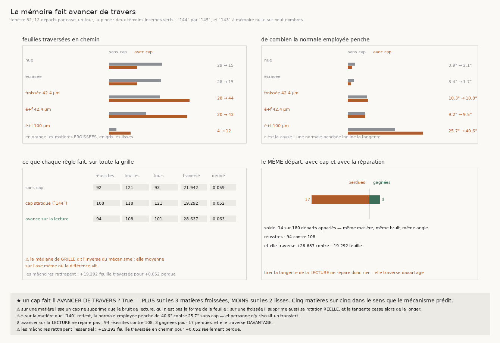

# 148 — Un cap ne sait pas distinguer le bruit de la cause, et il supprime les deux

> ⭐⭐⭐⭐ **CE QUE LA MÉMOIRE COÛTE SE VOIT ENFIN, ET C'EST UNE GRANDEUR PHYSIQUE.** Un cap mélange la
> normale, donc il incline la **tangente** le long de laquelle le suiveur avance : une part du pas
> **traverse** la feuille au lieu de la longer. Et le sens de l'effet dépend de ce que le cap
> supprime — **cinq matières sur cinq** :
>
> | matière | feuilles traversées, sans cap → avec cap | la normale penche |
> |---|---|---|
> | spirale nue | 29,118 → **15,44** (moins) | 3,946° → 2,070° |
> | spirale écrasée | 28,42 → **15,232** (moins) | 3,396° → 1,747° |
> | froissée 42,4 µm | 27,953 → **44,271** (plus) | 10,3° → 10,756° |
> | écrasée et froissée 42,4 µm | 20,408 → **42,996** (plus) | 9,157° → 9,461° |
> | écrasée et froissée 100 µm | 4,079 → **11,725** (plus) | 25,686° → **40,569°** |
>
> ⭐⭐⭐ **ET LA RAISON EST EXACTE** : sur une matière lisse, la seule chose qu'un cap supprime est le
> **bruit de lecture**, qui n'est pas la forme de la feuille — donc il fait traverser **moins**. Sur
> une matière froissée, il supprime aussi la **rotation réelle** de la feuille, et la tangente cesse
> alors de la longer — donc il fait traverser **plus**. Un cap ne sait pas distinguer les deux, et
> c'est exactement ce que `146` demandait de séparer.
>
> ⭐⭐ **LES MÂCHOIRES RATTRAPENT PRESQUE TOUT, ET C'EST CE QUI FAIT MARCHER LA PINCE** : **19,292**
> feuilles traversées en chemin pour **0,052** réellement perdue. Le raccrochage n'est pas un détail
> du mécanisme, c'est le mécanisme.
>
> ⚠⚠ **ET MON PREMIER VERDICT ÉTAIT SATISFAIT PAR UN MÉLANGE.** Il comparait la médiane de la
> **grille entière** — 21,942 sans cap contre 19,292 avec — et concluait « non ». Or les deux moitiés
> de la grille vont en sens contraire : la médiane moyenne **sur l'axe même où la différence vit**,
> ce que ce dépôt proscrit depuis longtemps. Le partage n'est pas choisi, c'est le paramètre qui
> définit la matière.

## 1. Pourquoi ce fichier

`143` mesure que la mémoire échange de la fidélité contre de la distance — bonnes feuilles
**121 → 118**, tours bouclés **93 → 121** sur cette grille — et cet échange n'avait aucune
explication. `147` a éliminé la plus évidente : ce n'est **pas** le freinage de l'enroulement,
puisque faire tourner le cap à l'enroulement ne fait que déplacer des réussites.

Il en restait une que personne n'avait regardée, et elle est purement mécanique. `suivre` tire sa
direction de marche de la normale employée (`tangente = Z × normale`). Un cap mélange cette normale,
donc il incline la tangente d'autant, et une part du pas traverse la feuille au lieu de la longer.
La pince ne s'en aperçoit pas — ses mâchoires se raccrochent au pas suivant — mais elle **paie** ce
raccrochage.

## 2. ⭐⭐ L'instrument, et ce qu'il ne coûte pas

Ce que le pas aurait traversé si les mâchoires ne se raccrochaient pas, c'est **la phase du point
visé moins celle du point courant**, en feuilles, déroulée comme partout ailleurs ici. Aucune
approximation de gradient, aucune constante.

⚠⚠ **Le suiveur ne voit jamais ces deux quantités.** La vraie normale et la vraie phase sont des
propriétés de la fixture : c'est une mesure **sur** le marcheur, pas une entrée **pour** lui. Et ni
`phase` ni `normale_locale` ne comptent une lecture — vérifié, **13 872** des deux côtés — donc
`lectures` reste exactement le nombre que les tranches précédentes publient.

⚠ Les deux diagnostics sortent en **millièmes entiers** (millidegrés, milli-feuilles) : arrondis en
degrés ou en feuilles, ils tombent sous `1e-4` sur les matières lisses, et `json.dumps` écrit alors
un tel nombre en notation scientifique — introuvable dans son propre record, comme `147` l'a appris.

## 3. ⚠ Les deux témoins internes, et le second est gratuit

| témoin | ce qu'il compare | ici | là-bas |
|---|---|---|---|
| `144` par `145` | réussites des trois bras, cap statique | 114 · 107 · **108** | 114 · 107 · **108** |
| `143`, mémoire nulle | réussites, bonnes feuilles, tours bouclés, trois bras | 96/110/111 · 90/109/95 · **92/121/93** | 96/110/111 · 90/109/95 · **92/121/93** |

Le second est apparu en regardant la mesure : la variante « sans cap » **est** le bras à mémoire
nulle que `143` publie case par case. **Neuf nombres** qui ne peuvent pas s'accorder par hasard, et
qui gardent trois compteurs que le premier témoin ne regarde même pas.

## 4. ⭐⭐⭐⭐ La mesure



Cinq matières × trois bruits × trois règles, douze départs par case, un tour entier.

| règle | réussites | bonnes feuilles | tours bouclés | penche | traverse | dérive |
|---|---|---|---|---|---|---|
| sans cap | 92 | **121** | 93 | 7,902° | 21,942 | 0,059 |
| **cap statique (`144`)** | **108** | 118 | **121** | 9,378° | 19,292 | **0,052** |
| avance sur la lecture | 94 | 108 | 101 | 9,373° | 28,637 | 0,063 |

⭐ **L'échange de `143` est là, sur cette grille** : le cap perd trois bonnes feuilles et gagne
vingt-huit tours bouclés. Et la **dérive** finale est la même à un millième près — les mâchoires
rattrapent des deux côtés.

⭐⭐ **Une mâchoire seule traverse deux fois plus qu'une pince** — **37,43** contre 19,292 avec cap,
**54,316** contre 21,942 sans. La contrainte que `142` a introduite se lit dans cette monnaie neuve,
et elle y est massive.

## 5. ⚠⚠ La réparation qui n'en est pas

Si c'est bien la tangente qui est inclinée, il suffirait de la tirer de la normale que la matière
vient de **rendre** plutôt que de la normale mélangée — ce qui sépare « ce que le cap lisse » de « où
le marcheur va », sans rien changer à ce que les mâchoires emploient. Une seule chose bouge.

**Elle ne répare pas** : **94** réussites contre 108, et appariée sur les mêmes 180 départs, **3
gagnées pour 17 perdues**. ⚠ Et elle **traverse davantage** — 28,637 contre 19,292 — c'est-à-dire
l'inverse de ce qu'elle prétend faire.

⚠⚠ **Une sonde sur un vingtième de tour disait exactement le contraire** : 820 milli-feuilles contre
1 575 pour le cap statique, soit la moitié. Sur un tour entier, c'est une fois et demie de plus. Une
sonde courte ne borne pas une marche longue, et c'est la deuxième fois en deux tranches que la même
classe de piège se paie — `147` avait dérivé une borne sur la mauvaise excursion, pour la même
raison.

## 6. ⭐⭐ Ce que ça change pour le graal

**Le coût de la mémoire a maintenant une grandeur physique et une cause.** Ce n'est pas une propriété
de la matière ni un artefact du compteur : c'est qu'un cap **ne sait pas distinguer le bruit de la
cause**, et qu'il supprime les deux. Là où il n'y a que du bruit, il aide — il fait traverser deux
fois moins. Là où il y a une cause, il supprime la forme de la feuille, et le suiveur avance de
travers.

**C'est exactement la demande que `146` a laissée**, reformulée dans une monnaie mesurable : séparer
ce qui excède l'enroulement de façon cohérente, qu'il faut suivre, de ce qui l'excède sans cohérence,
qu'il faut supprimer. `148` ajoute que le prix de ne pas savoir le faire se compte en **feuilles
traversées**, et qu'il est payé par le raccrochage des mâchoires.

⚠ **Ce que ça ne dit pas.** Que la traversée soit la cause des échecs. Les mâchoires en rattrapent
bien trop pour qu'on puisse le conclure, et la dérive finale est la même avec et sans cap. Ce qui est établi est plus étroit : **un cap fait traverser plus là où la matière
porte une cause, et moins là où il n'y a que du bruit, et c'est la même incapacité qui produit les
deux.**

## 7. ⚠ Ce que la mesure a corrigé d'elle-même

- ⚠⚠⚠ **Mon verdict comparait des médianes de GRILLE**, donc il moyennait sur l'axe où la différence
  vit — le péché que ce dépôt nomme depuis `114`. Il répondait « non » à une question dont les deux
  moitiés répondent « oui » et « non » en sens contraire. Le partage par matière n'est pas choisi
  après coup : c'est le paramètre qui **définit** la matière, et `147` avait déjà établi (`R4-F108`)
  qu'un cap ne s'engage que là où ça froisse. La conclusion est désormais **unanime ou nulle** —
  toutes les froissées d'un côté, toutes les lisses de l'autre ; une majorité serait un seuil
  déguisé. La médiane de grille est **publiée à côté**, avec le fait qu'elle dit l'inverse.
- ⚠⚠ **Une sonde sur un vingtième de tour a menti sur le signe de l'effet.** Elle montrait la
  réparation traversant moitié moins ; sur un tour entier elle traverse une fois et demie plus.
- ⚠ **Une sonde de figure qui déplaçait un champ que la bande ne lit plus** ne prouvait rien : elle
  déplace maintenant un nombre que la bande affiche.
- **« Réussite » n'est pas réécrit** pour le comptage apparié : c'est `une_reussite` du module
  partagé, et `apparie` est celui de `147`, appelé avec un filtre. Trois écritures d'une même
  question seraient trois réponses.

## 8. Les registres

Faits `R4-F109` (un cap fait traverser plus là où la matière porte une cause et moins là où il n'y a
que du bruit, cinq matières sur cinq), `R4-F110` (les mâchoires rattrapent 19,292 feuilles traversées
pour 0,052 perdue, et une mâchoire seule traverse deux fois plus qu'une pince) et `R4-F111` (tirer la
tangente de la lecture ne répare pas : 94 contre 108, 3 gagnées pour 17 perdues, et elle traverse
davantage). Porte `R4-P26` : la demande de `146` se chiffre désormais en feuilles traversées.

## Reproduire

```bash
uv run python src/nappe/la_memoire_fait_elle_avancer_de_travers.py \
    --json docs/mesures/la_memoire_fait_elle_avancer_de_travers.json   # aucune lecture distante
uv run python src/figures/figure_la_memoire_fait_elle_avancer_de_travers.py \
    --json docs/mesures/la_memoire_fait_elle_avancer_de_travers.json \
    --sortie docs/images/148_la_memoire_fait_elle_avancer_de_travers.png
uv run python src/nappe/la_memoire_fait_elle_avancer_de_travers.py --verifier            # 26
uv run python src/figures/figure_la_memoire_fait_elle_avancer_de_travers.py --verifier   # 17
uv run python src/nappe/la_pince_tient_elle_la_feuille.py --verifier                     # 72
```

⚠ Deux précédents sont lus et non recopiés : `lire_la_cause_sous_le_bruit.json` pour le témoin de
`144`, et `la_pince_garde_t_elle_son_cap.json` pour celui de `143`. Sans eux les témoins sont
**indécidables**, et la mesure le dit plutôt que de le supposer.

⚠ `--reagreger <json>` recalcule les résumés, le solde apparié et les verdicts depuis les suivis
rangés, sans remarcher.
