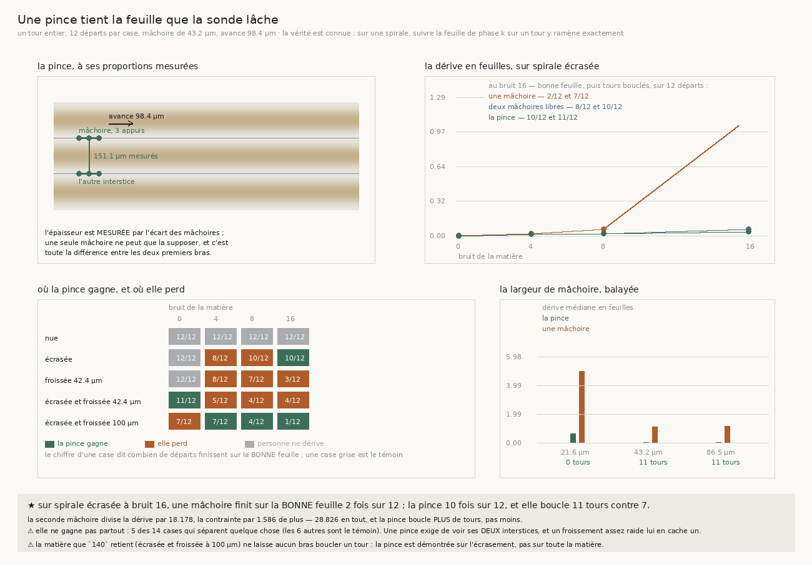
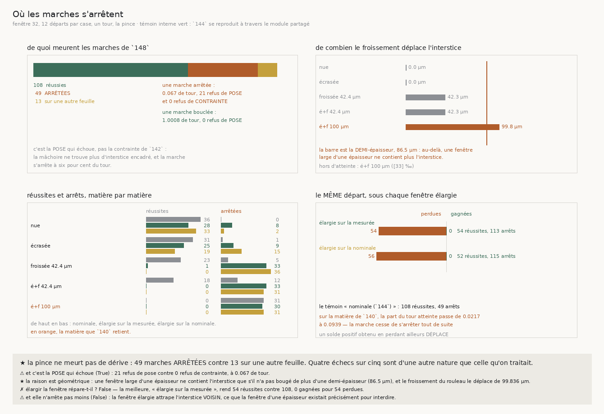
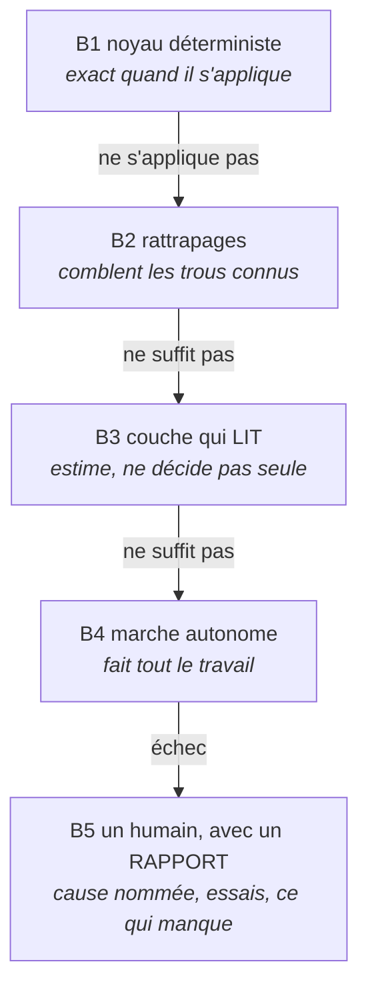

# 151 — Le pipeline adaptatif en escalade : ce que cent cinquante documents permettent d'assembler, et ses formules

> ⭐⭐⭐⭐ **LA QUESTION DE L'AUTEUR, ET C'EST LA BONNE.** Les cent cinquante documents ont été écrits
> un par un, chacun fermant une porte avec une raison mesurée. Personne n'avait demandé ce qu'ils font
> **ensemble**. La réponse tient en une forme, et c'est une forme que le dépôt a déjà nommée ailleurs :
> une **échelle d'escalade** — des couches ordonnées par **certitude décroissante**, jusqu'à un humain
> qui reçoit un **rapport**. Le dépôt a de la matière pour **les cinq barreaux**, et **quatre tiennent**.
>
> ⭐⭐⭐ **ET L'INVARIANT DE L'ÉCHELLE EST DÉJÀ LA LOI DE CE DÉPÔT.** *Un barreau a le droit de baisser
> la **prétention** du résultat, jamais la **barre**, et jamais en silence.* C'est mot pour mot ce que
> `R5-L01` (une vérification incapable d'échouer), `R4-L08` (un plafond n'est pas une valeur) et
> `R4-L15` (un vide et un accord parfait rendent le même nombre) disent chacune d'un côté différent.
> Les cent cinquante documents n'ont pas seulement produit des pièces : ils ont produit **la discipline
> qui rend une échelle honnête**, ce qui est la moitié difficile.
>
> ⭐⭐ **LA DISTANCE AU GRAAL EST UNE LONGUEUR, PAS UN ORDRE DE GRANDEUR.** Sur la fixture calibrée sur
> le rouleau (écrasement **0,2782**, froissement **100 µm**), la fenêtre de recherche d'un appui est
> trop étroite de quinze pour cent — demi-épaisseur **86,5 µm** contre un déplacement maximal de
> **99,836 µm** (`R4-F113`) — et la pose tombe à **633 ‰** à l'inclinaison que le cap impose vraiment,
> **40,569°** (`R4-F116`, `R4-F109`). Deux nombres, un mécanisme, chaque maillon mesuré.
>
> ⚠ **CE DOCUMENT NE MESURE RIEN.** Il n'ajoute **aucun fait** et **aucune porte** : tout ce qu'il
> avance est cité par son identifiant de registre. C'est un **montage**, pas une tranche.

## 1. Pourquoi ce document, et ce qu'il n'est pas

Le dépôt possède **220 faits** — dont 205 établis, 7 bornés, 5 réfutés et 3 rétractés — plus
**93 lois**, **82 portes**, **231 contradictions** et **30 antériorités**, chacun avec son producteur.
Il possède aussi **530 verbes** sous un point d'entrée unique et un lanceur de chaînes qui **observe**
ce que chaque étage écrit (`src/depot/enchainer.py`).

Ce qu'il ne possédait pas est la **phrase qui relie les six campagnes**. Chaque rapport dit ce que
*sa* campagne fait avancer ; aucun ne dit ce qu'un livrable contiendrait si on prenait tout.

⚠ **Ce document n'est pas une tranche.** Il ne produit aucun nombre, donc il n'entre au registre ni
comme fait ni comme porte. La règle du dépôt — *une mesure sans producteur est une anecdote*
(`R5-L05`) — est respectée par la négative : rien ici n'est une mesure.

## 2. Deux axes, et il faut les deux

Un déroulage a **deux dimensions de conception**, et les confondre est le piège :

| axe | la question | ce qui le gouverne |
|---|---|---|
| **horizontal** — le pipeline | *quels étages, dans quel ordre ?* | la matière : on ne marche pas avant d'avoir posé l'échelle |
| **vertical** — l'escalade | *que fait un étage qui ne sait pas répondre ?* | la certitude : on n'essaie le probable qu'après l'exact |

L'axe horizontal est **neuf étages** (§3). L'axe vertical est **cinq barreaux** (§4), et il s'applique
**dans chaque étage**. Le pipeline complet est le produit des deux — pas une file, une grille.

## 3. L'axe horizontal — les neuf étages

| | étage | ce qui le porte | état |
|---|---|---|---|
| **E0** | choisir l'objet | `R3-F01` `R4-F09` `R4-F11` `R6-F19` | ⚠ contraint |
| **E1** | lire le volume, à distance | `R1-F08` `R4-F67` | ✅ |
| **E2** | poser l'échelle | `R4-F14` `R6-F12` `R2-F19` `R1-F09` | ✅ |
| **E3** | trouver une graine | `R3-F04` `R3-F05` `R3-F07` | ✅ |
| **E4** | **marcher** | `R4-F91` `R4-F92` `R4-F97` | ⛔ **le maillon ouvert** |
| **E5** | refuser, et s'arrêter | `R4-F36` `R4-F39` `R4-F42` `R4-F73` `R4-F112` | ✅ |
| **E6** | recoudre latéralement | `R4-F52` `R4-F55` | ⚠ borné |
| **E7** | juger sans vérité terrain | `R3-F10` `R2-F16` `R2-F12` `R2-F01` | ✅ |
| **E8** | rendre, et valider par l'encre | `R1-F01` `R1-F02` `R1-F04` `R1-F12` | ✅ |
| **E9** | emballer | `R5-F06` `R5-F12` `R5-F07` | ✅ |

**Sept étages sur neuf tournent sans réserve.** `E6` est borné pour une raison mesurée, et `E4` rend
**zéro transfert sur trente-six** sur la matière calibrée sur le rouleau (`R4-F96`, `R4-F108`).

### E0 — Choisir l'objet

Dix rouleaux sur treize sont aussi lâches ou plus que le témoin lu (`R3-F01`). Mais **les treize
rouleaux du Grand Prize publient zéro rang de spire** (`R4-F09`) : il n'existe pas d'objet éligible
portant une vérité de terrain du goulot. Celle-ci n'existe que sur `PHercParis4` — 92 franchissements
dans une maille, zéro partout ailleurs (`R4-F11`) — qui n'est pas dans la liste.

⚠ **Conséquence de montage, et elle est dure.** Un déroulage se **met au point** sur `PHercParis4` puis
se **transporte** sur un rouleau sans référent. Le transport est la *rollout drift* que l'annexe A des
*Open Problems* nomme sans la chiffrer, et que `104` à `111` mesurent.

### E1 — Lire le volume, à distance

Un volume OME-Zarr se juge **par chunk**, sans le rapatrier : chunks `[109, 128, 128]`, 1,78 Mo et
1,03 s par fenêtre, ×8,35 à seize fils, sortie identique au bit (`R1-F08`).

⭐ **Et le parallélisme se pose au bon endroit.** Le lecteur lisait ses plages **en file** parce que le
pool était mappé sur les chunks (`R4-F67`) ; corrigé, un cube passe de **15,276 s** à un fil à
**0,574 s** à 64 — facteur **26,6**, valeurs identiques au bit. ⚠ Un pas coûte **2,34 s** (`R4-F69`) :
une course se chiffre avant d'être lancée.

### E2 — Poser l'échelle

| grandeur | valeur | source |
|---|---|---|
| pas inter-feuilles, `PHercParis4` | **164 µm** (transferts humains) / **182,4** (atlas) | `R4-F14` |
| demi-feuille | **82–91 µm** | `R4-F14` |
| pas sur la collection | **187 µm** médian, 35/36 rouleaux entre 160 et 210 | `R6-F12` |
| invariance en hauteur (`PHerc0172`) | **138–148 µm**, cv **1,8 %** sur 20 tranches | `R2-F19` |
| point zéro de l'instrument | **±2,4 µm** | `R1-F09` |

⭐⭐ **L'invariance de `R2-F19` est ce qui rend l'échelle transportable** : le pas ne dépend pas de la
hauteur, et déplacer le centre de 3,16 mm ne bouge l'invariant que de 1,75 %. Un pipeline pose donc son
échelle **une fois par objet**, sans centre juste. ⚠ L'écart **164 / 182,4** reste inexpliqué
(`R4-P05`), et il vaut une demi-feuille — l'ordre de ce qu'un transfert doit trancher.

### E3 — Trouver une graine

La graine choisie sur la **planéité** bat celle de voisinage, appariée sur treize rouleaux : **11 – 2**,
p 0,0225, et 11/11 sur les paires informatives, p 0,0010 (`R3-F04`).

⚠ **Mais le traceur est un tirage** (`R3-F05`) : quatorze traces d'une graine, treize propres et une à
79 croisements. Et **l'aire d'une trace est le plafond de son budget**, pas une grandeur (`R3-F07`) —
deux rouleaux **différents** rendent la même aire jusqu'à la sixième décimale, parce que c'est le
budget qui la fixe et non la matière.

⭐ **Conséquence de montage.** Une graine ne se choisit pas, elle se **tire plusieurs fois et se juge**
par `E7`. Le pipeline porte un budget de tirages, pas un espoir de déterminisme.

### E4 — Marcher : la pince

**⭐ La contrainte paie, et les deux ingrédients paient séparément.** Sur l'écrasement mesuré, une sonde
à une mâchoire finit sur la bonne feuille **2 fois sur 12** et boucle 7 tours ; la pince **10 fois sur
12** et boucle 11 tours (`R4-F91`). La seconde mâchoire divise la dérive par **18,178**, la contrainte
par **1,586** de plus, soit **28,826** en tout (`R4-F92`).

**⭐ Le cap se LIT, il ne se pose pas.** Une mémoire lue bat le meilleur réglage posé, sur les trois
bras, sans aucune constante ajustée : la pince passe de **100** à **108** réussites (`R4-F97`).

**⛔ Et c'est là que ça s'arrête.** Sur la matière que `140` retient, aucun bras ne réussit un transfert
à aucune mémoire : au mieux **1** tour bouclé et **9** bonnes feuilles, jamais ensemble (`R4-F96`) ;
**0 sur 36** pour les cinq règles de cap (`R4-F108`).

**Le mécanisme complet, maillon par maillon** — ce que les trois dernières tranches ont mesuré :

1. un cap **mélange** la normale, donc il incline la **tangente** : la normale employée passe de
   **25,686°** à **40,569°** (`R4-F109`) ;
2. une pose à cette inclinaison réussit **633 ‰** contre **917 ‰** à normale droite (`R4-F116`) ;
3. la marche meurt donc de **refus de pose** : 21 refus de pose médians contre **0** refus de
   contrainte, à **0,067** de tour (`R4-F112`) ;
4. et la fenêtre est trop étroite de quinze pour cent : **86,5 µm** contre **99,836 µm**, **33 ‰** de la
   matière hors de portée (`R4-F113`).

⚠ **Les deux réparations symétriques sont réfutées** : tirer la tangente de la lecture rend **94**
réussites contre 108 (`R4-F111`), poser sur la lecture en rend **96** (`R4-F117`). Et **élargir la
fenêtre** échoue des deux façons de la lire — **54** et **52** réussites, 113 et 115 arrêts contre 49
(`R4-F114`) — parce que la marge sature son plafond et atteint l'interstice **voisin**.

### E5 — Refuser, et s'arrêter

Un marcheur sans garde marche dans le vide. Quatre faits en font un étage :

- **un pas sur trois ne lit rien**, et pas un seul ne confirme — 178 pas aveugles sur 560 (`R4-F36`) ;
- **la cécité est absorbante** : 167 transitions aveugle → aveugle, **zéro** retour, là où une
  permutation en attend sept (`R4-F39`). Le critère d'arrêt était disponible depuis le début ;
- **les deux tiers des refus d'un pas voyant viennent de la fenêtre**, pas de la matière (`R4-F42`) ;
- **« plus rien à lire » est la surface extérieure du rouleau** : 14 arrêts sur 14 sortis, écart médian
  **0,3 mm** (`R4-F73`). Un arrêt est une **fin de traversée**, pas une panne.

⚠ Symétriquement, `R4-F59` **interdit** de s'arrêter sur un refus d'orientation : le désaccord n'est
pas absorbant, donc s'y arrêter jetterait 443 pas sur 560 dont **276 confirmés**.

### E6 — Recoudre latéralement

Deux marches voisines, parties de la même feuille à 96 µm d'écart, finissent sur deux feuilles
différentes **douze lots sur douze** (`R4-F52`). Un lien latéral le supprime : λ = 0,25 fait passer les
déchirures de 6/6 à **0/6**, à taux inchangé (`R4-F55`).

⚠⚠ **Et c'est borné, pour une raison de fond.** Le même lien **fausse un décrochement réel** : l'écart
à la vérité passe de **0,1503** sans lien à **2,5976** avec (×17,3). Le mécanisme qui recoud ne
distingue pas le bruit du décrochement, parce que les deux se présentent à lui comme un écart entre
voisines. La gâchette manquante est `R4-P26`.

### E7 — Juger une nappe sans vérité terrain

L'étage le plus complet du dépôt, et ce que le README annonce en première ligne.

- **Le test de convergence** [F25] : sans seuil et sans vérité terrain (`R3-F10`).
- **La proximité normalisée** [F26] : `shortfall` ordonne les traces par leurs croisements, rho
  **+0,769** puis **+0,840** au bon rayon (`R2-F08`, `R2-F12`), bruit 4,5 fois plus serré que la
  variante à coupure (`R2-F16`).
- **Le rayon vient de la physique** : 142,8 µm bat le meilleur rayon balayé, et fait passer `0139` de
  +0,284 à **+0,666** (`R2-F12`).
- **Au bon rayon, trois paramètres cessent de compter ensemble** (`R2-F13`) — la signature d'une mesure
  qui a trouvé son échelle.
- **`windcheck` reproduit sur nos octets** : 53/53 et 55/55 (`R2-F01`).

⚠ `R2-F10` : c'est un indicateur **continu**, pas un classifieur. Il **ordonne** ; il ne tranche pas.

### E8 — Rendre, et valider par l'encre

⚠ **L'encre est la règle graduée, pas l'ouvrage.** Cet étage vérifie qu'une surface déroulée fait du
sens, rien de plus.

- **Le détecteur lit un segment jamais vu** : AUC **0,925**, contrôle par mélange à exactement
  **0,500** (`R1-F01`).
- **Il ne fabrique pas d'encre sur du vierge** : Spearman **+0,796** sur 23 bandes (`R1-F02`).
- **Un juge calibré refuse quand il n'y a rien** : 15/16, zéro fabrication (`R1-F04`).
- **Le champ de correction ramène le pic sur la couche tracée** : **58 → 8 µm**, témoin de signe opposé
  dégradant (`R1-F12`). Bon ordre : **déplacer → ré-aplatir → rendre**.

⚠⚠ **La limite est mesurée** : au régime du prix le détecteur **ne sépare pas la feuille du vide**
(`R1-F19`) et l'accord avec la carte publiée est plat (`R1-F20`). Sur les treize rouleaux du prix
l'encre **ne peut pas** être la métrique du déroulage. Elle l'est sur `PHercParis4`, à 2,4 µm.

### E9 — Emballer

- **Injecter la matière, jamais le découpage** : cinq modules réparés, et **les nombres publiés ne
  bougent pas d'une virgule** (`R5-F06`). C'est ce qui rend un livrable testable hors ligne.
- **Une chaîne qui tourne observe ce qu'une déclaration devrait maintenir** : 6/6 étages en 2,71 s
  (`R5-F12`).
- ⚠ **Un contrôle qu'on ne lance pas est un contrôle absent** : 44 batteries que `temoins.sh` ne
  lançait pas (`R5-F07`), 39 sur 105 incapables d'échouer (`R5-F01`), 67 sur 160 n'atteignant pas le
  chemin du nombre publié (`R5-F04`). Les trois sont réparés et gardés.

## 4. ⭐⭐⭐⭐ L'axe vertical — l'échelle d'escalade

C'est ici que le dépôt a **beaucoup plus de matière qu'il n'y paraît**, parce que la plupart des
mesures dites « négatives » sont en réalité des **barreaux**, mal rangés parce que personne n'avait
posé l'échelle.

> **L'invariant, et sans lui l'échelle est une machine à mentir : un barreau baisse la PRÉTENTION du
> résultat, jamais la BARRE, et jamais en silence.**

### B1 — Le noyau déterministe : exact quand il s'applique

Ce que le dépôt possède d'**exact**, sans une seule constante ajustée. Chacun rend « vrai », ou ne rend
rien.

| mécanisme | l'énoncé exact | formule |
|---|---|---|
| même interstice | « moins d'une demi-épaisseur » | [F14] |
| même feuille | « moins d'une demi-feuille » | `R4-F14` |
| la lecture sépare | « l'écart **entre** matières dépasse la dispersion **dans** une » | `R4-F99` |
| plancher de bruit | $1/\sqrt{n}$, **calculé** et non estimé | [F17] |
| minimum au bord | refusé, jamais rendu | [F10] |
| l'orientation d'une mâchoire | la SVD d'un nuage d'appuis, **0,0000°** d'écart | [F12] |

⭐⭐ **Ce barreau tient parce qu'il REFUSE.** Un interstice au bord de la fenêtre n'est pas encadré,
donc ce n'est pas un interstice — et l'accepter faisait s'effondrer l'épaisseur et refermer la pince
sur elle-même. Refuser est honnête : c'est la pince qui dit qu'elle ne tient plus rien.

### B2 — Les rattrapages : combler les trous connus du noyau

Chacun a un trou **nommé** en amont. Aucun n'existe « au cas où » — la règle du deuxième appelant.

| rattrapage | le trou qu'il comble | son verdict mesuré |
|---|---|---|
| halvage du pas | un pas refusé par la contrainte | ✅ borné par le voxel [F14] |
| raffinement parabolique | la quantification au voxel | ✅ **0,0004 µm** pour un voxel de 2,4 |
| recentrage de la fenêtre | 63 pas voyants refusés en butée (`R4-F42`) | ✅ **exact**, invariant à $2{,}6\cdot10^{-16}$ (`R4-F49`) |
| élargissement de la fenêtre | le même trou | ⛔ **déplace le nul** de 1,2 à 2,0 σ (`R4-F49`) |
| fenêtre **locale** | l'espacement varie d'un facteur cinq | ⛔ **boucle de rétroaction**, échelle ×549 (`R4-F54`) |
| lien latéral | la nappe se déchire 12/12 (`R4-F52`) | ⚠ marche, mais **amplifie** un vrai décrochement ×17,3 (`R4-F55`) |
| pose en deux temps | la normale employée penche de 40,569° | ⭕ **jamais essayée** (§6) |

⭐⭐⭐ **Trois tiennent, deux sont réfutés, un est borné, un n'a jamais été essayé — et c'est la
valeur du barreau.** Une échelle dont aucune couche n'a jamais échoué est une échelle qu'on n'a pas
mesurée. Ici on sait **lesquelles** tiennent, et pourquoi les autres non.

### B3 — La couche qui LIT : elle estime, elle ne décide pas seule

⚠⚠ **Règle 3 de l'échelle, et le dépôt l'a payée** : *une couche intelligente se pose AU-DESSUS des
gardes, jamais à leur place.* Elle propose, les gardes déterministes valident.

| lecture | ce qu'elle estime | sa limite mesurée |
|---|---|---|
| mémoire du cap, $m = 1 - c$ | l'échelle de temps de la rotation | lit **0,0000** sans bruit, cesse de séparer à bruit 16 (`R4-F98`, `R4-F99`) |
| plancher retranché | lire un cran de bruit plus loin | ✅ étend d'un cran, ⚠ **coûte 11 réussites** (`R4-F100`, `R4-F101`) |
| pas balayé, calibré par le nul | l'espacement local | ✅ borné $[s/2,\,2s]$ [F24] |
| $\alpha$ de convergence | une feuille est-elle à portée | ⚠ **deux causes indiscernables** à $\alpha \approx 1$ (`R3-F11`) |
| `shortfall` | l'anomalie de proximité | ⚠ **ordonne**, ne tranche pas (`R2-F10`) |
| détecteur d'encre | y a-t-il de l'encre ici | ⚠ **hallucine sur du vide** (`R1-F16`), plat au régime du prix (`R1-F20`) |
| juge de lisibilité | ce rendu fait-il du sens | ✅ 15/16, ⚠ **dépend du voisin** (`R1-F05`) |

⭐⭐ **La discipline est écrite dans chaque ligne de la colonne de droite.** Le détecteur d'encre, qui
est l'outil le plus impressionnant du dépôt (AUC 0,925), y est rangé au **troisième** barreau — parce
qu'il hallucine une structure aussi assurée sur du vide que sur de la feuille. Le mettre plus bas
serait exactement la faute que l'invariant interdit.

### B4 — La marche autonome : elle fait tout le travail

C'est `E4` entier, et son compteur est **le seul chiffre qui dit où en est le projet** :

| matière | bras au meilleur réglage | réussites |
|---|---|---|
| spirale nue | les cinq règles | **36 / 36** (`R4-F108`) |
| spirale écrasée | les cinq règles | **30 à 32 / 36** (`R4-F108`) |
| froissée 42,4 µm | une mâchoire | **12 / 12** (`R4-F93`) |
| **écrasée + froissée 100 µm** — la matière du rouleau | **tous** | **0 / 36** (`R4-F96`, `R4-F108`) |

⭐ **Et le compteur est ce qui rend l'échelle saine.** *Un noyau qui recule est un problème, pas une
réussite des couches supérieures.* Ici le noyau ne recule pas : il **ne s'applique pas encore** sur une
seule matière, et on sait laquelle, et pourquoi.

### B5 — Un humain, avec un rapport

⭐⭐⭐⭐ **C'est le barreau que le dépôt a le mieux construit, et il ne le savait pas.** L'état de l'art
dépense **775 heures** par rouleau à ce barreau-là (`R6-F02`), et son rapport est vide : **aucun taux
d'erreur de traçage n'est publié**, « sheet switches » apparaît une fois (`R6-F04`).

Ici, une marche qui meurt rend :

- **sa cause nommée** — cécité, sortie du rouleau, refus de pose, butée de fenêtre (`R4-F36`,
  `R4-F73`, `R4-F112`, `R4-F42`) ;
- **où elle est morte** — 0,067 de tour, avec le rayon et l'écart à la surface extérieure ;
- **ce qui a été essayé** — 21 refus de pose contre 0 refus de contrainte, ce qui **désigne le maillon** ;
- **ce qui manque** — 86,5 µm de fenêtre contre 99,836 de déplacement.

⚠⚠ **Le mode d'échec unique qui casse une échelle entière** est le barreau qui répond `0`, `null` ou
« aucun résultat » au lieu de « je n'ai pas pu ». Le dépôt l'a payé **deux fois** et l'a réparé les deux
fois : `R4-F37` (178 pas aveugles déclarés `oriente`, parce que deux moitiés de rien rendent 0,00° de
désaccord) et `R5-F21` (la garde `planarite` existait, était documentée, était assertée — et **n'avait
aucun appelant**). C'est `R4-L15` : *un vide et un accord parfait rendent le même nombre.*

## 5. Le formulaire complet

Notation : $s$ le pas inter-feuilles, $e$ l'épaisseur mesurée, $\rho$ le rayon, $\delta$ le voxel,
$\hat{n}$ une normale, $\hat{t}$ une tangente.

### 5.1 La forme du rouleau

**[F1] La spirale, et la phase qui identifie une feuille.**

$$r(\theta) = r_0 + \frac{s\,\theta}{2\pi} \qquad\qquad \varphi(p) = \frac{u - r_0}{s} - \frac{\theta}{2\pi}$$

$u$ est la distance à l'axe, $\theta$ l'azimut. **Une feuille est une phase entière**, un interstice une
demi-phase. C'est ce qui rend « est-on encore sur la même feuille après un tour » exactement décidable
sur fixture, ce que le vrai rouleau ne peut pas offrir.

**[F2] Ce que le lecteur rend.**

$$v(p) = 100 + 40\cos\bigl(2\pi\,\varphi(p)\bigr)$$

⚠ **Une feuille est un MAXIMUM, un interstice un MINIMUM.** Les confondre inverse tout l'appareil.

**[F3] L'écrasement.** Il entre **uniquement** par des coordonnées cylindriques elliptiques de rapport
d'axes $a/b$ :

$$\text{aplatissement} = 1 - \frac{b}{a} = 0{,}2782 \qquad \frac{a}{b} = 1{,}771$$

**[F4] Le froissement.** Il s'ajoute à la **phase**, jamais à l'intensité :

$$\varphi'(q) = \varphi(q) + \frac{d(q)}{s}, \qquad d(q) = A_k \sum_k \sin\!\left(\frac{2\pi\,(q\cdot\hat{k}_k)}{\lambda} + \psi_k\right), \qquad A_k = \frac{A}{\text{ondes}}$$

**[F5] L'inclinaison qu'un enroulement autorise.** Un rouleau croise **une** feuille par tour ; une
inclinaison uniforme $\alpha$ en fait croiser

$$N(\alpha) = \frac{2\pi\rho\,\sin\alpha}{s} \qquad\Longrightarrow\qquad \alpha_{\max} = \arcsin\!\left(\frac{N\,s}{2\pi\rho}\right)$$

À $N = 1$, $\alpha_{\max}$ va de **0,0803°** à **0,4087°** — **83,3 fois** moins que les 34,06° mesurés
localement (`R4-F84`). ⭐⭐ **C'est la formule qui a réfuté l'hypothèse la plus naturelle du dépôt** :
l'obliquité locale est nécessairement un **vagabondage**, jamais une pente.

**[F6] Le penchant, et le rapport chemin/étendue.**

$$\text{penchant} = \arccos\frac{|\,\text{pas}\cdot\hat{r}\,|}{\|\text{pas}\|} \qquad\qquad \text{rapport} = \frac{\text{longueur du chemin}}{\text{étendue radiale}} \approx \frac{1}{\cos\alpha}$$

Mesuré **1,186** sur un cumul de cinquante feuilles, **1,018** en local (`R4-F76`, `R4-P28`). Les deux
mesures sont justes et ne parlent pas de la même chose.

**[F7] La cohérence du penchant** — c'est elle qui sépare les causes, pas le rapport :

$$\text{cohérence} = \frac{\bigl\|\sum_i \hat{t}_i\bigr\|}{\sum_i \|\hat{t}_i\|}$$

Écrasement seul **0,999** · froissement seul **0,3925** · rouleau **0,925** (`R4-F86`). Aucune cause
seule ne l'atteint ; **l'écrasement mesuré plus un froissement de 100 µm approche les trois grandeurs
à 5,5 %** (`R4-F87`). C'est ce couple qui définit la matière de référence.

### 5.2 Lire la matière — barreau B1

**[F8] Où chercher un interstice.** Fenêtre **centrée sur l'attente**, large d'une épaisseur :

$$t \in \left[\,a - \frac{w}{2},\; a + \frac{w}{2}\,\right], \qquad a = \frac{e}{2}, \qquad w = e + 2\,|\text{marge}|$$

⭐⭐ Les interstices sont espacés d'une épaisseur, donc un intervalle d'une épaisseur en contient
**exactement un** — tant que le déplacement reste sous la **demi-épaisseur**. C'est `R4-F113` : au-delà,
la fenêtre ne le contient plus, et c'est un **arrêt**, pas une dérive.

**[F9] Le raffinement sous-voxel.** Parabole sur les trois échantillons autour du minimum :

$$t^{*} = t_i + \frac{1}{2}\cdot\frac{v_{i-1} - v_{i+1}}{v_{i-1} - 2v_i + v_{i+1}}\cdot\delta$$

Sans lui, la position d'un appui serait quantifiée au voxel — **un soixante-dixième de pas** de bruit
ajouté à chaque pas de la marche.

**[F10] Le refus du bord.** Un minimum en $i = 0$ ou $i = n-1$ **n'est pas encadré, donc n'est pas un
interstice**. ⚠ C'est une règle, pas un seuil : elle ne porte aucune constante.

### 5.3 La pince — barreau B1

**[F11] Une mâchoire.** Appuis latéraux le long de la tangente, $n \geq 2$ (trois par défaut) :

$$\hat{t} = \frac{\hat{z} \times \hat{n}}{\|\hat{z} \times \hat{n}\|}, \qquad q_j = c + \hat{t}\,u_j, \qquad u_j \in \mathrm{linspace}(-w,\,+w,\,n)$$

$$d_j = \mathrm{interstice}(q_j,\;\sigma\hat{n}) \quad \text{[F8] et [F9]}, \qquad P_j = q_j + \sigma\,\hat{n}\,d_j$$

**[F12] L'orientation sans tenseur de structure.** La tangente est la **direction de plus grande
variance** du nuage d'appuis :

$$\hat{t}\,' = \text{première composante de } \mathrm{SVD}\bigl(P - \bar{P}\bigr), \qquad \hat{n}\,' = \hat{t}\,' \times \hat{z}, \quad \text{orientée par } \hat{n}\,'\cdot\hat{n} > 0$$

⭐⭐ C'est ici que la pince gagne son orientation **sans rien acheter** : les appuis tombent sur la
surface de l'interstice, donc la droite qui les joint *est* une tangente. Mesuré **0,0000°** d'écart à
la vraie normale, contre **25°** pour un gradient central à bruit 8, et **cent fois moins cher** qu'un
tenseur de structure (219 lectures contre 68921).

⚠ Une mâchoire de demi-largeur $w$ suit le **plan moyen** de la feuille sur $w$, jamais sa normale
ponctuelle. Sur une feuille froissée les deux diffèrent réellement.

**[F13] Deux mâchoires — l'épaisseur MESURÉE.**

$$c' = \tfrac{1}{2}\bigl(\bar{P}^{+} + \bar{P}^{-}\bigr), \qquad e = \bigl\|\bar{P}^{+} - \bar{P}^{-}\bigr\|, \qquad \hat{n} = \frac{\hat{n}^{+} + \hat{n}^{-}}{\|\hat{n}^{+} + \hat{n}^{-}\|}$$

Contre une seule mâchoire, où l'épaisseur est **supposée** :

$$c' = \bar{P}^{+} - \hat{n}\cdot\frac{e_{\text{nominale}}}{2}$$

Mesuré $e = 151{,}1$ µm pour un pas nominal de 173, sur une matière dont l'espacement local va de 125 à
221 µm (`R4-F92`).

**[F14] La contrainte — et ce n'est pas un seuil.** Les interstices sont espacés d'une épaisseur, donc
l'appariement au plus proche bascule **exactement** à un demi-pas :

$$\text{« c'est le même interstice »} \iff \|\Delta_{\text{appui}}\| < \frac{e}{2}$$

Un pas refusé est **halvé puis retenté** (`142`), jusqu'à ce que l'avance tombe sous le voxel — en
dessous, un déplacement n'est plus exprimable par le lecteur, donc la pince **s'arrête et le dit**.

### 5.4 Le cap — barreau B3

**[F15] La cohérence des incréments de rotation**, sur une fenêtre de $n$ derniers pas :

$$c = \frac{\left|\sum_{i} \delta_i\right|}{\sum_{i} |\delta_i|}$$

⭐⭐⭐ **C'est une échelle de temps lue sur le signe.** Un écrasement fait tourner la normale
**lentement et toujours dans le même sens** (période : un demi-tour), donc $c \approx 1$. Un froissement
la fait **alterner** en quelques pas, donc $c \to 0$.

**[F16] La mémoire, sans aucune constante ajustée :**

$$m = 1 - c, \qquad m \leq 1 - \frac{1}{n}$$

⭐⭐⭐ C'est l'énoncé de `144` : ce qui tourne franchement est **lisible** et le cap ne sert à rien ;
ce qui alterne ne l'est pas et le cap doit tenir. ⚠ **La borne est dérivée** : on ne peut pas revendiquer une mémoire plus longue
que ce qu'on vient de mesurer, et $m = 1$ figerait l'orientation.

⚠⚠ **Erreur réfutée, gardée écrite** : retirer la moyenne des incréments avant de calculer $c$ donne à
l'écrasement la mémoire **maximale**, l'inverse exact de ce que la règle veut dire. L'enroulement se
**garde** — un cap ne doit pas combattre une rotation franche.

**[F17] Le plancher de bruit, exact et sans paramètre.** Pour $n$ incréments indépendants de moyenne
nulle et d'écart-type $\sigma$ :

$$\mathbb{E}\left|\sum_i \delta_i\right| = \sigma\sqrt{\frac{2n}{\pi}}, \qquad \mathbb{E}\left[\sum_i |\delta_i|\right] = n\,\sigma\sqrt{\frac{2}{\pi}} \qquad\Longrightarrow\qquad \mathbb{E}\bigl[c \mid \text{bruit pur}\bigr] = \frac{1}{\sqrt{n}}$$

et la lecture corrigée :

$$c' = \max\left(0,\; \frac{c - 1/\sqrt{n}}{1 - 1/\sqrt{n}}\right)$$

Elle vaut **zéro** sur du bruit pur et **un** sur une rotation parfaite. Mesuré **0,1407** pour un
plancher de 0,1250 (`R4-F100`). ⚠⚠ **Et elle se paie** : la pince tombe de **108** à **97** réussites
(`R4-F101`) — lire plus loin et marcher mieux ne sont pas le même réglage.

**[F18] Le mélange.** Le cap n'est pas une contrainte, c'est une moyenne exponentielle :

$$\hat{n}_t = \mathrm{normalize}\bigl(m\,\hat{n}_{t-1} + (1-m)\,\hat{n}_{\text{lue}}\bigr)$$

⚠⚠ **Et c'est par là que tout l'étage `E4` échoue** : le mélange incline la **tangente** le long de
laquelle on avance, donc une part du pas **traverse** la feuille au lieu de la longer (`R4-F109`).

**[F19] L'enroulement — la seule référence absolue qu'un suiveur possède.** Il la calcule seul :

$$\omega = \frac{\text{avance}}{\text{rayon}} \quad \text{(radians par pas)}, \qquad m = 1 - \min\!\left(\frac{\omega}{\langle|\delta|\rangle},\,1\right)$$

⚠ **Elle ne supplée pas** : 39 réussites contre 108 (`R4-F104`), parce que l'écrasement **excède**
l'enroulement et que c'est pourtant la forme qu'il faut suivre (`R4-F105`).

**[F20] Les blocs.** Sommer les incréments par paquets de $k$ : un bruit indépendant y croît comme
$\sqrt{k}$, une cause cohérente comme $k$. ⚠ **Mais le piège se referme à la période de la cause** : un
froissement de période $p$ pas s'**annule** dans un bloc de $p$ — ici $393{,}6 / 98{,}4 = 4$ — et la
règle lirait « persistant » sur une matière froissée (`R4-F102`).

### 5.5 Les critères qui n'ont pas de seuil — barreaux B1 et B3

**[F21] Le gabarit.** Le profil attendu entre une cellule et le point situé un pas plus loin :

$$g_k(t) = \pm\cos(2\pi k t), \quad \text{centré puis normalisé}$$

$+$ si la cellule est **sur** une feuille (brillant-sombre-brillant), $-$ si elle est dans un
**interstice**. ⚠ Comme `98` l'établit, « zéro interstice » n'est **pas exprimable** : un segment qui
reste sur la même feuille est plat, donc de norme nulle après centrage — c'est le cas *sans accord*,
déjà couvert par le modèle nul.

**[F22] Le score, et sa calibration par candidat.**

$$\hat{v} = \frac{v - \bar{v}}{\|v - \bar{v}\|}, \qquad \mathrm{s} = \max\bigl(\langle \hat{v},\,g_{\text{sur}}\rangle,\; \langle \hat{v},\,g_{\text{dans}}\rangle\bigr), \qquad z = \frac{\mathrm{s} - \mu_L}{\sigma_L}$$

⭐⭐ $\mu_L$ et $\sigma_L$ sont le **nul de cette longueur-là**, tirés de bruit blanc rééchantillonné
comme la mesure. Sans ça un candidat court part avec 0,07 d'avance et les candidats ne sont pas
comparables.

**[F23] La barre** — le nul du **meilleur de $N$ candidats**, pas le nul d'un test :

$$\text{barre} = \max_L\; p_{99}\bigl(z_{\text{nul}}(L)\bigr)$$

⚠ Comparer un maximum sur 62 essais au nul d'un seul essai est l'erreur classique, et elle est nommée.

**[F24] Le balayage, borné par la physique.**

$$L \in \left[\frac{s}{2},\; 2s\right], \qquad k = 1 \text{ fixé}$$

En deçà on retrouve la feuille de départ, au-delà on saute la voisine. ⚠ `99` lève la dégénérescence
en fixant $k = 1$ : un segment de $2p$ traversé par deux interstices est **indiscernable** d'un segment
de $p$ traversé par un. ⚠⚠ Et la fenêtre exclut de **vrais** pas aux deux bouts — espacement impliqué
**80,7 µm** au bout court, **380,2 µm** au bout long (`R4-F45`).

**[F25] Le test de convergence** — juger une trace sans seuil et sans vérité terrain :

$$\alpha = \frac{\log(\text{croissance de l'écart})}{\log(\text{élargissement de la fenêtre})}$$

$\alpha \approx 0$ : la surface converge, il y a une feuille à portée. $\alpha \approx 1$ : l'écart
**suit la fenêtre**, donc rien n'est là (`R3-F10`). ⚠ **Une pente a deux appuis** (`R3-F12`) : un appui
au bord du balayage est une **borne** du balayage, pas une mesure — 39 verdicts sont tombés là-dessus.
⚠ Et $\alpha \approx 1$ a **deux causes indiscernables** : le pic qui recule, et le pic qui n'existe
pas (`R3-F11`).

### 5.6 Juger une nappe — barreau B3

**[F26] La proximité normalisée, sans coupure.**

$$\text{ratio}(x) = \frac{d_{\text{partie non adjacente la plus proche}}(x)}{d_{\text{espacement local typique}}(x)}, \qquad \text{shortfall} = \bigl\langle \max(0,\,1 - \text{ratio})\bigr\rangle$$

⭐ Le rapport vaut 1 quand une cellule est à l'espacement typique de son voisinage, donc « anormalement
proche » se lit directement comme un déficit sous 1. Toute la queue basse participe, pondérée par son
écart — **aucune prise pour ajuster après avoir vu** (`R2-F16`).

**[F27] Le rayon de recherche vient de la physique** : $142{,}8$ µm — le pas mesuré ailleurs et avant —
et il **bat le meilleur rayon balayé** (`R2-F12`). ⚠ Un paramètre en voxels a une valeur physique par
campagne (`R2-L04`) : 80 vx à 9,362 µm trouvait la spire **voisine**.

**[F28] Le champ d'enroulement** — le prédicat d'**identité**, pas de présence :

$$w(p) = \text{indice de spire interpolé entre les deux spires qui encadrent le rayon de } p$$

⚠⚠ **Validé à spire EXCLUE**, sinon la mesure est vide : un champ construit sur toutes les spires
assigne évidemment $k$ à la spire $k$. ⚠⚠⚠ **Et le témoin négatif est construit** : une surface
fabriquée à partir du référent lui-même — spire $k$ d'un côté, $k+3$ de l'autre, en fondu sur l'angle —
parfaitement lisse et traversant trois feuilles par construction. Sans elle, « l'écart d'indice le long
d'une spire est petit » serait satisfait par un champ **constant**.

⚠ Il sépare sur `0139`, **pas** sur `0172` (`R4-F04`), et la cause est un **trou de matière** entre
330° et 360° — trouvée **en regardant**, pas par les quatre statistiques testées avant (`R4-F05`).

### 5.7 L'encre, la règle graduée — barreau B3

**[F29] L'aire sous la courbe, et son contrôle.** AUC sur un segment jamais vu, avec le **contrôle par
mélange** qui garde la distribution et détruit la structure : il doit rendre **exactement 0,500**
(`R1-F01`). ⚠ Nécessaire et **faible** (`R1-L03`).

**[F30] La non-hallucination, par bandes.**

$$\rho_{\text{Spearman}}\bigl(\text{densité prédite},\; \text{densité étiquetée}\bigr) = +0{,}796$$

C'est la forme correcte du contrôle, parce qu'elle interroge les bandes **vides** (`R1-F02`).

**[F31] Le nombre de Fresnel** — ce qui sépare un scan de repérage d'un scan de production :

$$F = \frac{a^{2}}{\lambda D}$$

Les treize rouleaux du prix sont à $F = 0{,}39$, soit **53 %** du régime de production ($F = 0{,}73$) ;
atteindre $F = 0{,}73$ à 9,362 µm demanderait $D = 4{,}3$ m (`R6-F08`). ⭐ **C'est la formule qui
explique pourquoi pousser le détecteur ne sert à rien sur ces objets.**

**[F32] Le juge calibré.** Note `LISIBILITE` sur 0–6, température 0, **témoin vierge dans l'image**,
clé à part. Vierge 0–1, texte 3–6, sans chevauchement (`R1-F04`). ⚠ La lecture d'un panneau **dépend de
son voisin**, même à température zéro (`R1-F05`) — donc les panneaux se jugent isolés.

### 5.8 La statistique de décision — elle gouverne TOUS les barreaux

**[F33] L'écart apparié.** Ne jamais comparer des médianes quand les cas varient plus que les méthodes :

$$\Delta = \text{médiane}_i\,(a_i - b_i), \qquad \text{IC par retrait d'un cas}$$

Mesuré : une différence de médianes donnait $+5{,}6$ µm de gain là où l'écart apparié donne
$-1{,}2$ µm, IC $[-5{,}2;\,+2{,}5]$ enjambant zéro. ⚠ **Un écart dont le signe ne survit pas au retrait
d'un cas quelconque n'est pas une amélioration.**

**[F34] La réussite est JOINTE.**

$$\text{réussite} \iff \text{boucler le tour} \;\wedge\; \text{revenir sur la même feuille}$$

⚠ Une pince qui refuse tout ne dérive jamais — et ne va nulle part.

**[F35] La victoire est JOINTE.** Depuis `147` :

$$\text{victoire} \iff \bigl(\text{plus de réussites}\bigr) \;\wedge\; \bigl(\text{aucune perdue sur les départs appariés}\bigr)$$

⚠⚠ **Un verdict qui compare des totaux est satisfait par un DÉPLACEMENT** : « 110 contre 108 » était 8
gagnées pour 6 perdues (`R4-F107`).

**[F36] Un modèle nul par quantité rapportée** — pas seulement pour la confiance, pour **chaque** nombre
qu'une recherche rend (`R4-L05`).

**[F37] Le choix hors échantillon.** Un réglage choisi sur les mêmes cas que ceux qui le jugent ne peut
que gagner : il suffit d'en essayer soixante pour que l'un tombe bien.

## 6. Le barreau qui manque, chiffré

Une seule chose sépare cette échelle du graal :

> **les mâchoires ont besoin d'une direction qui soit DROITE et FRAÎCHE, et les deux sources
> disponibles sont épuisées.**

- le **mélange** du cap donne une direction fraîche mais **penchée** — 40,569° (`R4-F109`) ;
- la **lecture précédente** donne une direction droite mais **périmée** d'un quart de période, et la
  rendre aux mâchoires coûte 12 réussites (`R4-F117`).

| ce qui manque | mesuré | source |
|---|---|---|
| fenêtre trop étroite | 86,5 µm de demi-épaisseur contre 99,836 de déplacement, **33 ‰** hors fenêtre | `R4-F113` |
| pose à l'inclinaison réelle | **633 ‰** contre 917 ‰ à normale droite | `R4-F116` |
| élargir la fenêtre | **54** réussites contre 108, et 113 arrêts contre 49 | `R4-F114` |
| transferts sur la matière du rouleau | **0 sur 36**, pour les cinq règles de cap | `R4-F108` |

⭕ **Ce qui n'a jamais été essayé** : poser **deux fois**. Une première pose, sur la direction qu'on a —
même penchée — sert à **lire** la normale locale ; une seconde pose, sur cette normale fraîche, est
celle qu'on garde. Aucune constante : deux appels de `poser` au lieu d'un. C'est exactement un
**barreau B2** de plus, et il se justifie par un compteur qui montre ce que le barreau du dessous
laisse passer — 21 refus de pose contre 0 refus de contrainte.

## 7. Le cimetière — les formules réfutées, avec leur raison

Garder les formules fausses écrites est ce qui empêche de les repayer.

| formule | ce qu'elle prétendait | pourquoi elle est tombée |
|---|---|---|
| Archimède sur l'axe seul | un nombre d'enroulement depuis l'axe | 11,36 feuilles d'erreur contre 0,088 — la **forme** des spires vaut ×130 (`R4-F07`) |
| un seuil d'intensité | séparer les feuilles | plus gros morceau 93–100 % contre 14,1 % attendu, six seuils (`R4-F08`) |
| $2A\sin(\pi\,2w/\lambda)$ | une mâchoire large ne peut pas se poser sur du froissement | la pose réussit **917 ‰** ; la formule décrivait l'onde, pas ce qui fait échouer une pose (`R4-F115`) |
| $c$ sur les incréments **centrés** | ôter l'enroulement avant de lire la cohérence | une dérive lente a un résidu de moyenne nulle, donc l'écrasement recevait la mémoire **maximale** |
| $m$ depuis l'enroulement | une référence absolue supplée à la comparaison | 39 réussites contre 108 ; l'écrasement excède l'enroulement (`R4-F104`, `R4-F105`) |
| le cap au taux **lu** | tourner comme la matière tourne | 89 contre 108 — **1 gagnée pour 20 perdues** (`R4-F106`) |
| le cap à l'enroulement | idem, avec un taux connu | 110 contre 108, mais **8 gagnées pour 6 perdues** : un déplacement (`R4-F107`) |
| la marge lue par le suiveur | élargir la fenêtre de ce qu'on a vu | la marge **sature** son plafond et atteint l'interstice voisin (`R4-F114`) |
| la fenêtre **locale** | recentrer le pas sur l'espacement déduit | boucle de rétroaction : échelle ×549, pas de 7644,4 µm soit 44,2 feuilles (`R4-F54`) |
| `fraction_below_third` pour une **différence** | mesurer l'effet d'une réparation | le bruit de graine (35 à 229 %) dépasse l'effet (35 %) (`R2-F15`) |
| « écarter les 20 % les plus pauvres » | prédire la qualité d'un rendu | +0,381 sur Scroll 1, **ne réplique pas** ; `0139` −0,229 (`R1-F13`) |
| $\sigma$ comme prédicteur de lisibilité | juger un rendu par sa dispersion | $\sigma$ 4ᵉ sur 6, Holm 0,739 (`R1-F18`) |
| 116 keV comme anomalie d'énergie | notre témoin battait le publié | 116 keV **est** dans la fenêtre optimale publiée à 8 µm (`R6-F14`) |

## 8. Ce que le livrable contiendrait aujourd'hui

Une image Docker montée sur ce dépôt, **honnêtement décrite**, ferait ceci — et chaque ligne nomme son
barreau :

1. **prendre un objet et un point de départ** (B1), choisis par planéité, tirés plusieurs fois ;
2. **lire le volume à distance** (B1), par chunk, 26,6× de parallélisme utile ;
3. **poser son échelle** (B1) depuis le pas invariant, sans avoir besoin d'un centre juste ;
4. **marcher** (B4) en tenant une **épaisseur** plutôt qu'un point, avec un cap qu'elle **lit** (B3) ;
5. **rattraper** (B2) — halvage, raffinement sous-voxel, recentrage — en **comptant** chaque rattrapage ;
6. **s'arrêter pour une raison** (B5) et la **nommer** : cécité, sortie du rouleau, refus de pose ;
7. **juger sa propre nappe** (B3) sans vérité terrain — convergence, proximité normalisée, champ
   d'enroulement à spire exclue ;
8. **rendre**, corriger le placement (58 → 8 µm), et **valider par l'encre** (B3) sur un objet à 2,4 µm ;
9. **refuser de publier** (B1) ce que son juge n'accepte pas.

⚠ **Ce qu'elle ne ferait pas** : boucler un tour complet sur la matière calibrée sur le rouleau. Elle
s'arrêterait à **0,067 de tour** — et elle **dirait pourquoi**, ce que l'état de l'art ne fait pas :
aucun taux d'erreur de traçage n'est publié (`R6-F04`).

⭐ **Et cette honnêteté est elle-même soumissible.** Les Progress Prizes paient explicitement les
**résultats négatifs**, et Miller & Müller ont été payés 1 000 $ pour un First Letters **échoué et
publié**. La matière de R1, R2, R3 et R5 est déjà de cette forme.

## 9. Ce qui reste, dans l'ordre

1. **La pose en deux temps** (§6) — le barreau B2 que les mesures n'ont pas fermé.
2. **`R4-P26`** : existe-t-il une quantité **locale** qui distingue la feuille $n$ de la feuille $n+1$ ?
   Si oui, le lien latéral de `E6` sait quand se relâcher, et `R4-P25` se referme.
3. **`134` — le vrillage** — explicitement pas clos.
4. **Le transport `PHercParis4` → un rouleau du prix**, forme finale du problème (`E0`).

---

⚠ **Ce document ne publie aucun nombre qui lui soit propre.** Chaque valeur est celle de son fait,
recalculable par le producteur que `REGISTRE_faits.tsv` nomme. La forme de l'échelle vient du skill
`concevoir-avant-coder` (`~/LplCraftSkills`), §8 — *pipeline adaptatif : option, mode, télémétrie*, et
son échelle d'escalade.
