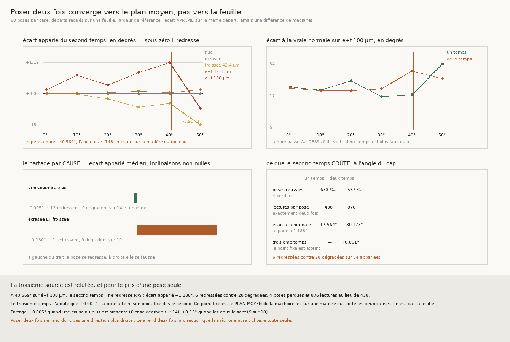

# 152 — Poser deux fois converge vers le plan moyen de la mâchoire, pas vers la feuille

> ⭐⭐⭐⭐ **LA TROISIÈME SOURCE EST RÉFUTÉE, ET POUR LE PRIX D'UNE POSE SEULE.** `150` laissait la
> demande précise : il faut aux mâchoires une direction **droite et fraîche**, et les deux sources
> mesurées sont épuisées — le mélange du cap penche de **40,569°**, la lecture précédente date d'un
> quart de période. La troisième n'avait jamais été essayée : **poser deux fois**, la première pour
> lire la normale ici et maintenant, la seconde pour s'y tenir. À l'angle que `148` mesure sur la
> matière du rouleau, l'écart apparié du second temps vaut **+1,188°** — il **dégrade** — avec
> **6 redressées contre 28 dégradées** sur 34 appariées.
>
> ⭐⭐⭐ **ET LE MÉCANISME EST NOMMÉ, PARCE QU'UN TROISIÈME TEMPS A ÉTÉ POSÉ.** Il n'ajoute que
> **+0,001°**. La pose atteint donc son **point fixe dès le second temps** — et ce point fixe est le
> **plan moyen** de la mâchoire sur sa largeur, jamais la normale ponctuelle de la feuille. Poser
> deux fois ne rend pas une direction plus droite : cela rend **deux fois** la direction que la
> mâchoire aurait choisie toute seule.
>
> ⭐⭐ **LE PARTAGE QUI PORTE L'ÉNONCÉ, ET IL N'EST PAS CELUI QU'ON ATTENDAIT.** Quand la matière
> porte **une cause au plus**, le second temps redresse : **0 case sur 14** ne dégrade, écart
> apparié médian **−0,005°**. Quand elle porte les **deux ensemble**, il dégrade : **9 cases sur 10**,
> médiane **+0,130°**. ⚠⚠ Et ce n'est **pas l'inclinaison** : sur la matière du rouleau il dégrade
> déjà à **normale droite** (+0,147° à 0°). La panne n'a rien à voir avec le cap.
>
> ⚠⚠⚠ **ET LA PREMIÈRE CHOSE À DIRE EST UN THÉORÈME, PAS UNE MESURE.** Le second temps n'a lieu que
> si le premier a rendu quelque chose : `P(deux temps) ≤ P(un temps)` **par construction**. Aller
> « mesurer » sur une grille qu'une pose en deux temps pose moins souvent aurait été payer une
> grille pour retrouver une conjonction. C'est pourquoi la question posée n'est pas un taux de pose
> mais la **justesse** de la normale rendue.

## 1. Pourquoi ce fichier

`149` établit que la pince meurt d'**arrêt** et que c'est la **pose** qui échoue : 21 refus de pose
médians contre 0 refus de contrainte, à six pour cent du tour. `150` établit **pourquoi** : ce n'est
pas la largeur de la mâchoire — réfutée, 850 à 1000 ‰ à toutes les largeurs — c'est l'**inclinaison**
de la normale le long de laquelle elle cherche, et à l'angle que `148` mesure vraiment la pose ne
rend plus que 633 ‰ contre 917.

`150` ferme donc les deux sources de direction disponibles et laisse une demande, pas une réponse :

> il faut aux mâchoires une direction **droite** et **fraîche**.

- le **mélange** du cap est frais et **penché** — c'est lui qui produit les 40,569° ;
- la **lecture précédente** est droite et **périmée** d'un quart de période — 96 réussites contre 108,
  3 gagnées pour 15 perdues.

Une troisième source existe et n'emprunte ni l'une ni l'autre : **poser une première fois pour LIRE,
poser une seconde fois sur ce qu'on vient de lire**. Aucune constante n'entre — c'est deux appels de
`poser` au lieu d'un.

⭐⭐ **Et la mesure ne marche pas, elle pose.** `150` a montré qu'une pose se teste seule, à un départ
recalé exactement sur une feuille, pour quelques lectures — mille fois moins cher qu'une grille de
marches. La question se pose donc à la pose **avant** de payer quoi que ce soit, et c'est cette
discipline qui rend ce document possible : **aucune grille n'a été payée.**

## 2. ⚠⚠⚠ Ce qui se dit avant de mesurer

Le second temps n'a lieu que si le premier a rendu un état. Sa réussite est donc une **conjonction**,
et il en découle, sans aucune mesure :

$$P(\text{deux temps}) \le P(\text{un temps})$$

Une pose en deux temps **ne peut pas** poser plus souvent qu'une pose simple. Mesurer cela serait
mesurer un théorème — et sur une grille, ce serait payer des heures de lecture pour le retrouver. Ce
que le second temps peut acheter n'est donc pas un **taux** : c'est la **justesse** de la normale
rendue, qui décide de la pose **suivante**.

C'est cette justesse que ce fichier mesure, et le contrôle est dans la batterie du module partagé :
donner à la pose en deux temps une graine que la pose simple refuse doit rendre un refus, jamais une
réussite.

## 3. ⚠⚠ Ce que le niveau de l'erreur ne peut pas dire, et ce que la paire dit

Une mâchoire de demi-largeur `w` suit le **plan moyen** de la feuille sur `w`, jamais sa normale
ponctuelle. `le_prix_dune_normale` le dit dans sa propre docstring et ne se mesure, pour cette
raison, que sur une spirale **sans** froissement. Sur une matière froissée, l'écart à la normale
ponctuelle contient donc un biais qu'**aucune** pose ne peut enlever — et c'est pourquoi le niveau
lu sur la matière du rouleau est de l'ordre de vingt degrés, ce qui n'est pas une panne.

⭐⭐⭐ **Mais ce biais est le MÊME aux deux temps** : c'est la même mâchoire, au même point, sur la
même matière. Seule la différence **appariée sur le même départ** est lisible, et c'est elle qui
porte le verdict. Le niveau est publié pour être lu, jamais pour décider.

C'est la règle que ce dépôt a écrite ailleurs — *une différence de médianes mêle la variabilité des
cas à celle des méthodes*, et ici la variabilité d'un départ à l'autre dépasse de loin ce que le
second temps déplace.

⚠ Un **troisième** temps est posé, et il ne coûte rien à la mesure : il ne propose aucun bras à trois
temps, il dit si la pose est une **itération qui converge** ou une **correction à un coup**. Deux
points ne distinguent pas les deux ; trois, oui. ⚠⚠ Et il se lit **apparié** lui aussi : la médiane à
trois temps porte sur les poses qui ont survécu à trois temps, celle à deux temps sur celles qui ont
survécu à deux, et leur différence mêlerait un effet à un changement de population.

## 4. ⭐⭐⭐⭐ La mesure

Soixante poses par case, départs recalés sur une feuille, largeur de référence. Écart apparié du
second temps, en degrés — **négatif = il redresse** :

| matière | 0° | 10° | 20° | 30° | **40°** | 50° |
|---|---|---|---|---|---|---|
| spirale nue | +0,000 | −0,001 | −0,002 | −0,003 | −0,006 | — |
| spirale écrasée | −0,000 | −0,000 | −0,001 | −0,005 | −0,005 | −0,005 |
| froissée 42,4 µm | −0,003 | −0,016 | −0,190 | −0,517 | −0,373 | **−5,904** |
| écrasée et froissée 42,4 µm | **+0,007** | **+0,004** | **+0,043** | **+0,100** | **+0,040** | **+0,159** |
| **écrasée et froissée 100 µm** | **+0,147** | **+0,698** | **+0,322** | **+0,802** | **+1,188** | −0,573 |

⚠ La case vide est un **refus**, pas un zéro : sur la spirale nue à cinquante degrés aucune pose ne
se pose, et publier « 0,000 » y ferait lire une pose parfaite là où il n'y en a eu aucune.

## 5. ⭐⭐⭐⭐ La case décisive

À l'angle que `148` mesure réellement sur la matière du rouleau — **40,569°**, mesuré ici à 40,0° :

| | un temps | deux temps | trois temps |
|---|---|---|---|
| écart à la vraie normale | 17,564° | 30,173° | 16,466° |
| poses réussies | **633 ‰** | **567 ‰** | — |
| lectures par pose | **438** | **876** | — |

⚠⚠ **Les trois niveaux portent sur trois populations différentes** et ne se soustraient pas. Ce qui
décide est apparié :

- écart apparié du **second** temps : **+1,188°** — **6 redressées contre 28 dégradées** sur 34 ;
- écart apparié du **troisième** temps : **+0,001°**.

⭐⭐⭐ **Et c'est le second nombre qui nomme le mécanisme.** Un troisième temps qui ne déplace plus
rien dit que la pose a atteint un **point fixe**, et qu'elle l'a atteint dès le second. Ce point fixe
est ce vers quoi une mâchoire converge quand on la relance sur sa propre sortie : le **plan moyen**
sur sa largeur. Sur une matière lisse, plan moyen et normale ponctuelle coïncident, donc itérer
redresse. Sur une matière qui porte les deux causes, ils ne coïncident pas — et itérer **s'installe**
dans l'écart au lieu de le réduire.

## 6. ⭐⭐⭐ Le partage par cause, et ce qu'il réfute au passage

La médiane sur les cinq matières moyennerait sur l'axe où la différence vit. Le paramètre qui
**définit** la matière est le couple (écrasement, froissement), et les deux ensemble ne se lisent pas
comme chacun seul :

| groupe | écart apparié médian | cases qui redressent | cases qui dégradent |
|---|---|---|---|
| une cause au plus | **−0,005°** | 13 | **0** sur 14 — unanime |
| **écrasée ET froissée** | **+0,130°** | 1 | **9** sur 10 |

⚠⚠ **Et voici ce que ce partage réfute** : l'hypothèse naturelle était que le second temps échoue
*parce que la graine est penchée*. Elle est fausse — sur la matière du rouleau il dégrade déjà à
**normale droite**, +0,147° à zéro degré, avec 20 redressées contre 31 dégradées. L'inclinaison du
cap n'a **rien à voir** avec cette panne-là ; c'est la géométrie de la mâchoire face à une matière qui
porte les deux causes.

⚠ L'unanimité se lit « **aucune case ne dégrade** » et non « toutes redressent » : un écart exactement
nul n'est ni l'un ni l'autre, et le compter comme une dégradation ferait tomber l'unanimité d'un
groupe qui n'a jamais dégradé.

## 7. Le prix, et pourquoi il achève la question

Même si le second temps avait redressé, il faudrait le payer :

- **4 poses perdues** à l'angle du cap — 633 ‰ tombent à 567 ‰, par la conjonction du §2 ;
- **11 poses perdues** au total sur les cinq matières à la plus forte inclinaison ;
- **876 lectures au lieu de 438**, exactement deux fois, et `R4-F69` chiffre un pas de marche à
  2,34 s sur la vraie matière.

Doubler le budget de lecture d'une marche pour une normale **plus fausse** ne demande pas d'arbitrage.

## 8. Ce que ça ferme, et ce que ça laisse

⭐⭐ **Les trois sources de direction sont maintenant toutes mesurées, et aucune ne convient** :

| source | ce qu'elle donne | mesurée par | verdict |
|---|---|---|---|
| le mélange du cap | fraîche, **penchée** de 40,569° | `148`, `150` | pose à 633 ‰ |
| la lecture précédente | droite, **périmée** d'un quart de période | `150` | 96 contre 108 |
| **poser deux fois** | le **point fixe de la mâchoire**, pas la feuille | **`152`** | **+1,188° apparié** |

⚠⚠ **Et la demande change de forme.** Elle n'est plus « où trouver une direction droite et fraîche » :
les trois endroits où en chercher une sont épuisés. Elle devient — **qu'est-ce qui rendrait le plan
moyen d'une mâchoire égal à la normale de la feuille sur une matière qui porte les deux causes ?**
C'est une question sur la **géométrie de la mâchoire**, pas sur la direction qu'on lui donne, et
`150` a déjà réfuté la réponse la plus évidente : la largeur n'y change rien.

⚠ Ce que `134` (le vrillage) demandait n'est toujours pas clos.

## 9. Ce que la batterie garde

Le module partagé passe de 72 à **78** contrôles, celui de `152` en porte **26**, la figure **11**.
⚠ Et les quatre derniers sont là parce que `le_chemin_du_nombre_publie` a signalé que `mesurer`,
`reagreger` et `afficher` — la moitié qui **publie** — étaient hors de portée de la batterie. La
matière leur est **injectée**, jamais le découpage, et les nombres publiés ne bougent pas.

Quatre sondes ont été écrites contre ce fichier lui-même et **trois ont mordu du premier coup** :

1. ⚠⚠ **une sonde qui ne mordait pas, remplacée.** Le contrôle « le second temps repart du **même**
   centre » était d'abord posé sur une spirale **nue** à un départ recalé — or le centre trouvé y
   **est** le départ, donc repartir de l'un ou de l'autre ne change rien et la sonde passait au vert
   avec le code cassé. Elle est désormais posée sur la matière froissée, où les deux choix donnent
   des poses distantes de **30,4 µm**, et elle vérifie d'abord que **les deux choix diffèrent
   vraiment** — sans quoi elle ne prouverait toujours rien ;
2. le troisième temps **apparié** : la fixture porte une différence de médianes de **+0,1** et une
   paire de **−0,4**, de signes opposés, et le verdict doit suivre la paire ;
3. le partage par cause **dit non** quand les deux groupes vont dans le même sens ;
4. le verdict **dit non** quand le second temps dégrade, et compte les poses perdues.

⚠ Et le compte de contrôles est **dérivé**, jamais écrit à la main : la première version annonçait
14 contrôles pour 17 réels.
