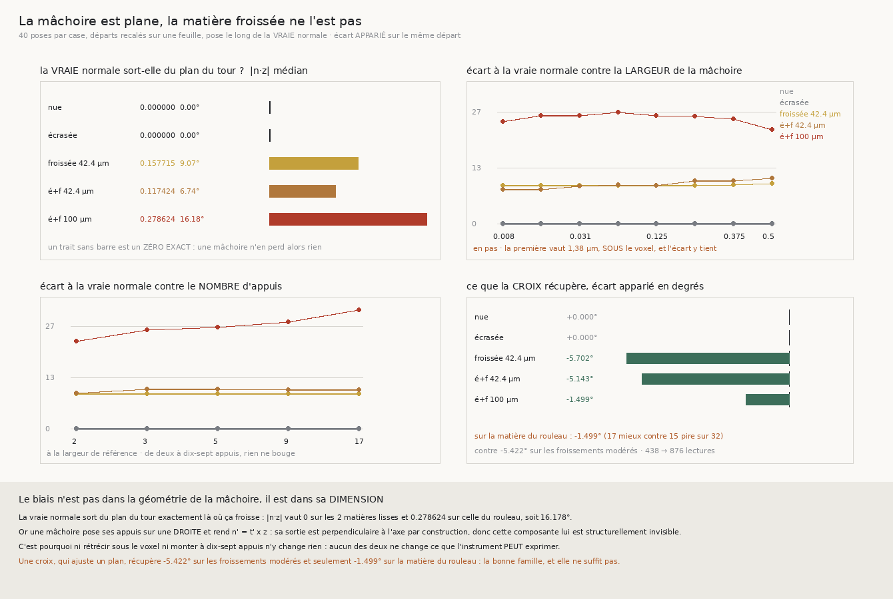

# 153 — La mâchoire est un instrument plan, et la matière froissée ne l'est pas

> ⭐⭐⭐⭐ **LA CAUSE EST STRUCTURELLE, ET ELLE SE LIT SUR UN ZÉRO EXACT.** `152` laissait la question
> ouverte : qu'est-ce qui rendrait le plan moyen d'une mâchoire égal à la normale de la feuille ?
> La réponse est **rien de ce qui se règle** — parce que la vraie normale d'une feuille **froissée**
> sort du plan du tour, et qu'une mâchoire pose ses appuis le long de `t = z × n` puis rend
> `n' = t' × z`, donc une sortie **toujours** perpendiculaire à l'axe. Mesuré : `|n·z|` vaut
> **exactement 0,0** sur les deux matières lisses et **0,278624** sur celle du rouleau, soit
> **16,178°** hors plan en médiane et **51,995°** au pire.
>
> ⭐⭐⭐ **ET LES DEUX RÉGLAGES QUI RESTAIENT SONT RÉFUTÉS, AVEC LEUR PIÈGE.** La largeur descend à
> **1,38 µm** — **sous le voxel** — et l'écart ne tombe pas : **24,295°** contre 22,325° à 86,5 µm.
> Le nombre d'appuis monte à **dix-sept** et l'écart **empire** : **22,624° → 30,845°**, pour
> **2482** lectures au lieu de 292. Aucun des deux ne change ce que l'instrument **peut exprimer**.
>
> ⭐⭐ **LE REMÈDE QUE ÇA DÉSIGNE EST MESURÉ ICI AUSSI, ET IL A UNE BORNE.** Une mâchoire en
> **croix** — deux barres d'appuis, donc un nuage qui n'est plus colinéaire, donc un **plan** au lieu
> d'une droite — récupère **−5,702°** et **−5,143°** sur les froissements modérés, et **−1,499°**
> seulement sur la matière du rouleau, où elle fait **17 mieux contre 15 pire**. La bonne famille,
> et elle ne suffit pas.
>
> ⚠⚠ **ET LA MESURE RÉFUTE MA PROPRE DÉRIVATION AU PASSAGE.** J'avais prédit que le biais serait une
> **atténuation** en `sin(kw)/kw` : trois appuis équidistants rendent la sécante d'une sinusoïde, et
> le rapport sécante/tangente vaut exactement le sinus cardinal. La forme est juste — le biais décroît
> bien avec la largeur — et le **niveau** est faux : à largeur quasi nulle `sinc` prédit 0,995 et la
> matière rend 0,807. Une formule peut capturer une tendance et rater ce qui compte.

## 1. Pourquoi ce fichier

`152` ferme la troisième et dernière source de direction, et la demande change de forme. Elle n'est
plus « où trouver une direction droite et fraîche » — les trois endroits sont épuisés — mais :

> qu'est-ce qui rendrait le **plan moyen** d'une mâchoire égal à la **normale de la feuille**, sur une
> matière qui porte les deux causes ?

`150` avait déjà réfuté la réponse la plus évidente, la **largeur**, mais seulement par le taux de
pose. Restaient trois réglages plausibles : le **nombre** et la répartition des appuis, la **façon
d'ajuster** le nuage, et l'**orientation** de la mâchoire. Ce fichier les prend tous les trois.

⭐⭐ **Et il ne marche pas, il pose** — la discipline de `150` et `152` : un départ recalé exactement
sur une feuille, la pose faite le long de la **vraie** normale, quarante départs par case. Ce qu'on
isole est le biais de l'**instrument**, pas celui de la direction qu'on lui donne.

## 2. ⚠⚠ Ce que j'avais prédit, et pourquoi c'est faux

Trois appuis équidistants en `u ∈ {−w, 0, +w}` rendent une pente de moindres carrés qui vaut
exactement `(d(w) − d(−w))/2w` — le point central ne contribue pas. Sur un froissement
`d(u) = A\sin(ku + \psi)` :

$$\text{pente lue} = \frac{A\sin(kw+\psi) - A\sin(-kw+\psi)}{2w} = A\cos\psi\,\frac{\sin kw}{w},
\qquad \text{pente vraie} = A\,k\cos\psi$$

$$\Longrightarrow\qquad \frac{\text{pente lue}}{\text{pente vraie}} = \frac{\sin(kw)}{kw},
\qquad k = \frac{2\pi}{\lambda}$$

Le sinus cardinal, sans aucune constante ajustée : `λ` est une constante de la fixture et `w` est
choisi. La prédiction est donc que le biais **s'évanouit** quand la mâchoire rétrécit.

⚠ **Elle est fausse, et la mesure le dit d'une ligne** : à `w = 0,008` pas — **1,38 µm**, soit moins
d'un voxel — `sinc` prédit une atténuation de **0,5 %**, et la matière rend **24,295°** d'écart sur la
matière du rouleau, contre 22,325° à la plus grande largeur. Le biais ne vient donc pas de ce qu'une
mâchoire **moyenne** sur sa largeur.

⭐ Ce que la formule capture quand même est la **pente** : sur la spirale froissée à 42,4 µm, l'écart
monte bien de 9,15° à 9,64° quand la largeur passe de 0,008 à 0,5 pas. La forme est juste, le niveau
est ailleurs.

## 3. ⭐⭐⭐⭐ La cause, et elle se lit sur un zéro exact



Composante axiale de la **vraie** normale, mesurée analytiquement — donc sans une seule lecture :

| matière | `\|n·z\|` médian | p90 | max | hors plan médian | au pire |
|---|---|---|---|---|---|
| spirale nue | **0,0** | 0,0 | **0,0** | **0,0°** | 0,0° |
| spirale écrasée | **0,0** | 0,0 | **0,0** | **0,0°** | 0,0° |
| froissée 42,4 µm | 0,157715 | 0,2556 | 0,3226 | **9,074°** | 18,819° |
| écrasée et froissée 42,4 µm | 0,117424 | 0,233 | 0,3087 | **6,743°** | 17,978° |
| **écrasée et froissée 100 µm** | **0,278624** | 0,5663 | **0,788** | **16,178°** | **51,995°** |

⭐⭐⭐⭐ **Le partage est exactement celui du froissement**, et il est net : **zéro exact** sur les deux
matières lisses — y compris l'écrasée, dont la normale penche pourtant de 22,9° sur le rayon — et non
nul sur les trois froissées.

Or `une_machoire` fait, dans cet ordre :

```
tan = cross(Z, n)          # les appuis sont posés sur une DROITE, perpendiculaire à l'axe
tangente = SVD(P - P̄)[0]   # la direction de plus grande variance du nuage
nn = cross(tangente, Z)    # ← la normale rendue est perpendiculaire à l'axe, TOUJOURS
```

Donc `n'·z = 0` **par construction**, et la batterie du module partagé le vérifie sur la sortie
plutôt que sur l'intention : au même départ d'une matière froissée, le segment rend une composante
axiale **exactement nulle** et la croix une composante non nulle, pendant que la vraie normale en
porte une. ⚠ Ces trois nombres-là sont ceux d'une **sonde**, pas d'un producteur, donc ils ne sont
pas publiés ici : ce que le registre porte est la mesure sur quarante départs du tableau ci-dessus.

⚠⚠ **Et les deux énoncés ne se réparent pas de la même façon.** « La mâchoire estime mal » appelle un
meilleur estimateur ; « la mâchoire ne peut pas exprimer ce qu'il y aurait à estimer » appelle un
autre instrument. Un seul des deux est vrai, et c'est le second.

## 4. ⭐⭐⭐ Les deux réglages qui restaient, réfutés

Écart à la vraie normale sur la matière du rouleau, quarante poses par case :

| largeur (pas) | 0,008 | 0,016 | 0,031 | 0,0625 | 0,125 | 0,25 | 0,375 | 0,5 |
|---|---|---|---|---|---|---|---|---|
| en µm | **1,38** | 2,77 | 5,36 | 10,81 | 21,62 | 43,25 | 64,88 | 86,5 |
| écart | **24,295°** | 25,686° | 25,686° | 26,571° | 25,75° | 25,562° | 24,883° | **22,325°** |

| appuis | 2 | 3 | 5 | 9 | 17 |
|---|---|---|---|---|---|
| écart | **22,624°** | 25,562° | 26,246° | 27,761° | **30,845°** |
| lectures | 292 | 438 | 730 | 1314 | **2482** |

⚠ **Le balayage porte son piège dans les deux sens.** Si le biais venait de ce qu'une mâchoire moyenne
sur sa largeur, l'écart à **1,38 µm** serait nul, pas seulement plus petit — et il vaut 24,295°. Si
le biais venait d'un échantillonnage trop pauvre, dix-sept appuis le feraient tomber — et il **monte**
de huit degrés pour **huit fois** le prix.

⭐ Et le contrôle est dans le même tableau : sur la spirale nue l'écart vaut **0,00°** à toutes les
largeurs et à tous les nombres d'appuis, sur l'écrasée **0,01°**. L'instrument n'est pas mauvais — il
est **plan**.

## 5. ⭐⭐ Le remède, et sa borne

Une mâchoire en **croix** pose ses appuis sur **deux** barres, `t` et `n × t`. Son nuage n'est plus
colinéaire, donc il porte un **plan** et non une droite, et la normale devient la **plus petite**
direction de sa décomposition — celle qu'aucun appui ne porte. ⚠ Un seul ingrédient change : fenêtre,
refus du bord, épaisseur mesurée et centre restent ceux de `142`.

| matière | segment | croix | apparié | mieux | pire | appariées |
|---|---|---|---|---|---|---|
| spirale nue | 0,0° | 0,0° | **+0,0°** | 5 | 4 | 40 |
| spirale écrasée | 0,005° | 0,005° | **+0,0°** | 5 | 29 | 38 |
| froissée 42,4 µm | 9,122° | **3,725°** | **−5,702°** | **38** | 2 | 40 |
| écrasée et froissée 42,4 µm | 10,226° | **3,990°** | **−5,143°** | **30** | 4 | 34 |
| **écrasée et froissée 100 µm** | 25,562° | 25,659° | **−1,499°** | **17** | **15** | 32 |

⭐⭐⭐ **Sur les froissements modérés la croix divise l'écart par deux et demi**, et elle le fait
presque partout : 38 départs sur 40, puis 30 sur 34. Leur gain apparié médian vaut **−5,422°**.

⚠⚠ **Sur la matière du rouleau elle ne répare presque rien, et le compte le dit mieux que la
médiane** : **17 mieux contre 15 pire**, ce qu'un tirage à pile ou face rendrait. La médiane appariée
de −1,499° est donc portée par une moitié des départs, et la médiane des **écarts** ne bouge pas du
tout (25,562° → 25,659°) — c'est exactement pourquoi ce dépôt compte apparié.

⚠ **Et la croix se paie** : **876** lectures au lieu de 438, exactement deux barres. Sur les deux
matières lisses elle ne change rien, ce qui est le contrôle — il n'y a rien à récupérer là où la vraie
normale ne sort pas du plan.

⚠ Sur la spirale écrasée, 5 mieux contre 29 pire pour un écart apparié de **+0,0°** : les écarts y
sont de l'ordre de 0,005°, donc ces trente-quatre départs départagent du bruit numérique et rien
d'autre. Le compte est publié, il ne conclut rien.

## 6. Ce que ça ferme, et ce que ça laisse

⭐⭐ **La famille entière est close.** Les quatre réponses plausibles à « qu'est-ce qui rendrait le
plan moyen égal à la normale » sont maintenant mesurées :

| piste | verdict | mesure |
|---|---|---|
| la **largeur** | réfutée par `150`, puis ici | 24,295° à 1,38 µm |
| le **nombre d'appuis** | réfuté | 22,624° → 30,845° de 2 à 17 |
| la **façon d'ajuster** | sans objet | la sortie est contrainte avant l'ajustement |
| l'**orientation** | la bonne famille, insuffisante | −5,4° médian, **−1,5°** sur le rouleau |

⭐⭐⭐⭐ **Et la question suivante est nommée par la mesure, pas par une hypothèse** : la croix récupère
la moitié du hors-plan là où il vaut 6 à 9°, et presque rien là où il vaut 16° avec des pointes à
52°. Ce n'est donc pas la **dimension** de l'instrument qui manque encore — elle est réparée — c'est
que **sur la matière du rouleau la feuille tourne trop vite pour qu'un plan ajusté sur deux barres la
suive**. La grandeur à mesurer ensuite est celle-là : sur quelle longueur la normale reste-t-elle
constante à la précision que la pose demande ?

⚠⚠ **Et ceci rejoint `134`, qui n'est toujours pas clos.** Une composante axiale de la normale **est**
un vrillage, et `R4-F79` mesure déjà sur le vrai rouleau que le penchant du marcheur est **plus axial
qu'azimutal** — part axiale 0,334 contre 0,193. Le vrillage n'est donc pas une curiosité de la
fixture : c'est la même quantité, vue de l'autre bout.

## 7. Ce que la batterie garde

Le module partagé passe de 78 à **84** contrôles, celui de `153` en porte **18**, la figure **11**.

⚠⚠ **Une sonde de `152` avait montré la voie et celle-ci l'applique** : l'énoncé structurel se
vérifie sur la **sortie** de l'instrument, jamais sur son intention. Au même départ d'une matière
froissée, le segment rend une composante axiale **exactement nulle**, la croix en rend une non nulle,
et la vraie normale en porte une — trois lignes de batterie qui se lisent ensemble. ⚠ Leurs valeurs
sont celles d'une **sonde à un départ** et ne sont donc pas publiées : un chiffre dont le calcul
n'est pas celui d'un producteur est une anecdote, et le tableau du §3 porte la mesure. Le contrôle
qui rend ces trois lignes lisibles est le quatrième : sur une matière lisse la croix **n'invente
aucune** composante axiale. Sans lui, « la croix récupère l'axe » serait satisfait par une croix qui
mesure son propre bruit.

⚠ La sonde a été vérifiée **en cassant le code** : remplacer la plus petite direction du nuage par
`t' × z` fait tomber le contrôle à `|n'·z| = 0,000000`, donc il peut échouer.

⚠ Trois sondes de verdict, une par énoncé : une matière lisse qui sortirait du plan, un
rétrécissement qui sauverait vraiment, une croix qui dégraderait — les trois font dire **non** au
jugement.
