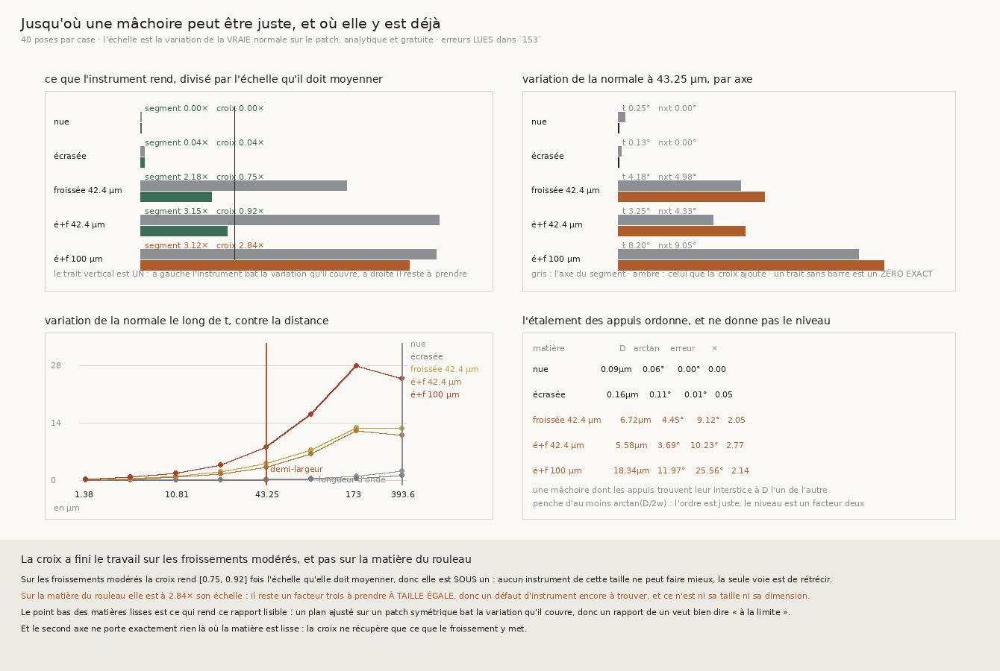

# 154 — Jusqu'où une mâchoire peut être juste, et où elle y est déjà

> ⭐⭐⭐⭐ **LA CROIX A FINI LE TRAVAIL SUR LES FROISSEMENTS MODÉRÉS, ET PAS SUR LA MATIÈRE DU
> ROULEAU.** `153` mesurait la borne de la croix sans l'expliquer. En comparant ce que l'instrument
> rend à l'**échelle** de ce qu'il doit moyenner — la variation de la vraie normale sur son propre
> patch, analytique et gratuite — la borne devient un partage net : la croix rend **0,75×** et
> **0,92×** son échelle sur les deux froissements modérés, donc elle **bat la variation qu'elle
> couvre**, et **2,84×** sur la matière du rouleau.
>
> ⭐⭐⭐ **ET ÇA CHANGE CE QU'ON CHERCHE.** Sur les matières modérées, aucun instrument de cette
> taille ne peut faire mieux : la seule voie restante est de **rétrécir**. Sur celle du rouleau il
> reste un **facteur trois à taille égale**, donc un défaut d'instrument encore à trouver — et ce
> n'est **ni sa taille ni sa dimension**, puisque les deux sont déjà mesurées et réparées.
>
> ⭐⭐ **LE SECOND AXE PORTE EXACTEMENT ZÉRO LÀ OÙ LA MATIÈRE EST LISSE**, et davantage que le
> premier là où elle froisse : **4,983°** contre 4,184°, **4,328°** contre 3,247°, **9,047°** contre
> 8,196°. C'est le contrôle de `153` vu de l'autre bout — la croix ne peut récupérer que ce que le
> froissement met sur cet axe.
>
> ⚠⚠ **ET UNE TROISIÈME FORMULE ENTRE AU CIMETIÈRE À MOITIÉ.** Une mâchoire dont les appuis
> trouvent leur interstice à `D` l'un de l'autre penche d'au moins `arctan(D/2w)` — c'est de la
> géométrie. Elle rend **4,446°**, **3,689°** et **11,968°** là où la mesure donne 9,122°, 10,226° et
> 25,562° : l'**ordre** est juste, le **niveau** est faux d'un facteur remarquablement stable —
> **2,05**, **2,77**, **2,14**.

## 1. Pourquoi ce fichier

`153` mesure que la croix récupère **−5,702°** et **−5,143°** sur les froissements modérés et
**−1,499°** seulement sur la matière du rouleau. La borne était donc mesurée, et pas expliquée : on
ne savait pas si la croix **échoue** là-bas ou si elle **a fini** et que la matière demande
davantage.

⭐⭐⭐ **La différence n'est pas académique, elle décide de la suite.** Si l'instrument a fini, la
seule voie est de changer sa **taille** ; s'il lui reste un facteur, il y a encore un **défaut** à
trouver, et le chercher ailleurs serait perdre du temps.

## 2. ⭐⭐⭐ L'échelle, et ce qu'elle est vraiment

Une mâchoire ajuste une surface sur un patch de largeur `2w`. La normale y varie, et cette variation
se lit **analytiquement** par `normale_locale` — donc sans une seule lecture et sans erreur
d'estimation.

$$V(w) = \text{médiane}\ \angle\bigl(\hat{n}(p),\ \hat{n}(p + w\,\hat{u})\bigr)$$

mesurée séparément sur les deux axes d'une mâchoire : `t̂ = ẑ × n̂`, que le segment visite, et
`n̂ × t̂`, que seule la croix visite.

⚠⚠ **Ce que ce rapport est, et ce qu'il n'est pas.** Ce n'est **pas** une borne inférieure : pour un
patch **symétrique** d'une surface lisse, le plan des moindres carrés a la normale du centre au
premier ordre, donc un instrument peut être **plus juste** que la variation qu'il couvre. C'est une
**échelle** — l'ordre de grandeur qu'il doit moyenner.

⭐⭐⭐ **Et c'est le point bas des matières lisses qui rend ce rapport lisible.** Sur la spirale nue
l'instrument rend **0,0×** son échelle, sur l'écrasée **0,04×** : il bat massivement la variation
qu'il couvre, exactement comme l'argument du premier ordre le prédit. Sans ce point bas, « un
rapport de un veut dire à la limite » n'aurait rien contre quoi se lire.

## 3. ⭐⭐⭐⭐ La mesure

Quarante poses par case, à la demi-largeur de référence de **43,25 µm**. Les erreurs sont **lues**
dans la mesure de `153`, jamais recalculées :

| matière | var. le long de `t̂` | var. le long de `n̂ × t̂` | segment | croix | **segment/échelle** | **croix/échelle** |
|---|---|---|---|---|---|---|
| spirale nue | 0,248° | **0,0°** | 0,0° | 0,0° | **0,0** | **0,0** |
| spirale écrasée | 0,127° | **0,0°** | 0,005° | 0,005° | **0,04** | **0,04** |
| froissée 42,4 µm | 4,184° | **4,983°** | 9,122° | 3,725° | 2,18 | **0,75** |
| écrasée et froissée 42,4 µm | 3,247° | **4,328°** | 10,226° | 3,99° | 3,15 | **0,92** |
| **écrasée et froissée 100 µm** | 8,196° | **9,047°** | 25,562° | 25,659° | 3,12 | **2,84** |

⭐⭐⭐⭐ **Le partage est net et il tient sur les deux moitiés.** Le **segment** est à **2,18×**,
**3,15×** et **3,12×** son échelle sur les trois froissées — donc il lui reste partout un facteur
trois. La **croix** descend à **0,75×** et **0,92×** sur les deux modérées — elle passe **sous un**,
comme sur les lisses — et reste à **2,84×** sur celle du rouleau.

⚠ L'échelle de la croix est la **plus grande** des deux variations, parce que son patch a deux
directions : ce n'est pas un réglage, c'est ce que « la variation sur le patch » veut dire quand le
patch n'est plus une droite.

⚠ Un rapport ne se calcule pas contre une échelle nulle. Aucune matière de la grille ne rend zéro le
long de `t̂` — la spirale courbe, donc sa normale tourne même sans froissement — mais la sonde en
fabrique une pour vérifier que le cas est **dit** plutôt que rendu infini.

## 4. ⭐⭐ Le second axe, et le contrôle de `153` vu de l'autre bout

| matière | le long de `t̂` | le long de `n̂ × t̂` |
|---|---|---|
| spirale nue | 0,248° | **0,0°** |
| spirale écrasée | 0,127° | **0,0°** |
| froissée 42,4 µm | 4,184° | **4,983°** |
| écrasée et froissée 42,4 µm | 3,247° | **4,328°** |
| écrasée et froissée 100 µm | 8,196° | **9,047°** |

⭐⭐ **Zéro exact sur les deux matières lisses, et plus que le premier axe sur les trois froissées.**
`153` mesurait que la croix ne récupère rien là où la normale ne sort pas du plan ; ici on voit
**pourquoi** : sur cet axe-là il n'y a littéralement rien à mesurer. Et là où il y a quelque chose,
il y en a **davantage** que sur l'axe que le segment visite — ce qui est la raison pour laquelle une
mâchoire en segment est le mauvais instrument et non un instrument mal réglé.

## 5. ⚠⚠ L'étalement des appuis : l'ordre est juste, le niveau est faux

Une mâchoire dont les appuis extrêmes trouvent leur interstice à `D` l'un de l'autre penche d'au
moins

$$\theta_{\min} = \arctan\!\left(\frac{D}{2w}\right)$$

C'est de la géométrie, pas un modèle. Mesuré à la demi-largeur de référence :

| matière | étalement `D` | `arctan(D/2w)` | erreur mesurée | rapport |
|---|---|---|---|---|
| spirale nue | **0,093 µm** | 0,061° | 0,0° | 0,0 |
| spirale écrasée | 0,161 µm | 0,106° | 0,005° | 0,05 |
| froissée 42,4 µm | 6,725 µm | **4,446°** | 9,122° | **2,05** |
| écrasée et froissée 42,4 µm | 5,577 µm | **3,689°** | 10,226° | **2,77** |
| **écrasée et froissée 100 µm** | **18,335 µm** | **11,968°** | 25,562° | **2,14** |

⭐ **L'ordre est parfaitement respecté** — y compris le presque-zéro des deux matières lisses, où les
appuis trouvent leur interstice à **0,093 µm** l'un de l'autre, soit un vingt-sixième de voxel.

⚠⚠ **Et le niveau est faux d'un facteur stable : 2,05, 2,77, 2,14.** La formule suppose que les deux
profondeurs extrêmes sont portées par les deux appuis **extrêmes** — ce qui n'est vrai que parfois :
avec trois appuis, l'étalement peut se jouer entre le **centre** et un bord, donc sur `w` et non
`2w`, ce qui doublerait l'angle. C'est la **troisième** formule géométrique de cette campagne à
capturer un ordre et rater ce qui compte, après `2A·sin(π·2w/λ)` de `150` et `sin(kw)/kw` de `153`.
⚠ Elle est donc publiée comme un **ordonnateur**, jamais comme une prédiction de niveau.

## 6. Ce que ça ferme, et ce que ça laisse

⭐⭐⭐⭐ **La question change encore de forme, et c'est la troisième fois en trois tranches** — mais
cette fois elle se **réduit** au lieu de se déplacer :

| matière | ce qu'il reste à prendre à taille égale | la voie |
|---|---|---|
| nue, écrasée | **rien** — 0,0× et 0,04× | l'instrument y est exact |
| froissée 42,4 µm | **rien** — 0,75× | **rétrécir**, ou accepter 3,725° |
| écrasée et froissée 42,4 µm | **rien** — 0,92× | **rétrécir**, ou accepter 3,99° |
| **écrasée et froissée 100 µm** | **un facteur 2,84** | un **défaut** encore à trouver |

⚠⚠ **Et « rétrécir » n'est pas gratuit** : `153` mesure que l'erreur ne tombe **pas** quand la
largeur descend sous le voxel sur la matière du rouleau, et `R4-F113` que la fenêtre de recherche y
est déjà trop étroite de quinze pour cent. Les deux contraintes tirent en sens opposé, et la tranche
qui les départagera devra les mesurer **ensemble**.

⚠ Ce que `134` (le vrillage) demandait n'est toujours pas clos, et `153` l'a rejoint : la variation
le long de `n̂ × t̂` **est** la quantité qu'un vrillage porte.

## 7. Ce que la batterie garde

Le module de `154` porte **17** contrôles, la figure **11**. Le module partagé est **inchangé** —
cette tranche n'ajoute aucun instrument, elle en **mesure l'échelle**.

⚠⚠ **Un de mes contrôles était faux, et c'est la mesure qui l'a dit.** J'avais asserté que sur une
matière lisse le rapport n'est **pas** calculé, « parce que la variation y est nulle » — or elle ne
l'est pas : **la spirale courbe**, donc sa normale tourne le long de `t̂` même sans froissement,
0,248° et 0,127° à la demi-largeur. Le contrôle est devenu ce qu'il aurait dû être dès le départ : sur
une matière lisse l'instrument est **très en dessous** de son échelle, et c'est ce point bas qui
rend tout le reste du tableau lisible.

⚠⚠⚠ **Et j'avais écrit un contrôle incapable d'échouer**, qui testait `True if … else None is None`.
Il est **retiré**, pas réparé : un contrôle qui ne peut pas échouer occupe la place d'un vrai.

⚠ Trois sondes de verdict, chacune fait dire **non** au jugement : un second axe qui porterait
quelque chose sur une matière lisse, une croix devenue juste sur la matière du rouleau, et une
échelle nulle contre laquelle aucun rapport ne se calcule.
