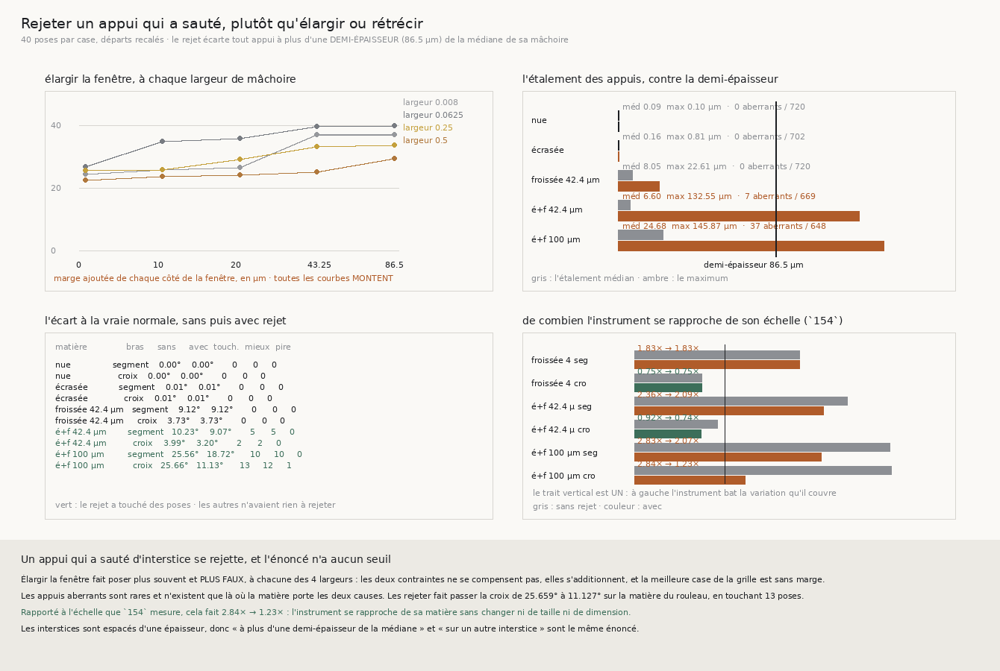

# 155 — Rejeter un appui qui a sauté d'interstice, plutôt qu'élargir ou rétrécir

> ⭐⭐⭐⭐ **LE PREMIER GAIN QUI RAPPROCHE L'INSTRUMENT DE SA MATIÈRE.** `154` laisse un facteur
> **2,84×** à prendre sur la matière du rouleau, **à taille égale**. Le rejet des appuis aberrants le
> ramène à **1,23×** : la croix passe de **25,659°** à **11,127°**, sur **13** poses touchées dont
> **12 mieux** et **1 pire**. Et l'énoncé du rejet n'a **aucun seuil** — les interstices sont espacés
> d'une épaisseur, donc « à plus d'une **demi**-épaisseur de la médiane de sa mâchoire » et « sur un
> **autre** interstice » sont le MÊME énoncé.
>
> ⭐⭐⭐ **ET LES DEUX VOIES QUI SE CONTREDISAIENT SONT DÉPARTAGÉES, ENSEMBLE POUR LA PREMIÈRE FOIS.**
> Élargir la fenêtre fait **poser plus souvent et plus faux**, à **chacune** des quatre largeurs — de
> **22,325°** à **29,287°** à la plus grande, de **24,295°** à **36,768°** à la plus petite — et sur
> les **cinq** matières la meilleure case de la grille est **sans marge**. Les deux contraintes ne se
> compensent pas : elles s'additionnent.
>
> ⭐⭐ **LES ABERRANTS SONT RARES ET N'EXISTENT QUE SOUS LES DEUX CAUSES** : **0** sur 720, 702 et
> 720 appuis sur les trois matières les plus simples, **7** sur 669 et **37** sur 648 sur les deux
> qui portent l'écrasement ET le froissement. Le p90 de l'étalement y vaut **108,367 µm**, soit plus
> d'une demi-épaisseur : une mâchoire sur dix a ses appuis répartis sur **deux** interstices.
>
> ⚠⚠ **ET DEUX DÉFAUTS DE MES PROPRES MESURES, TROUVÉS ET CORRIGÉS.** Mon recensement ne regardait
> qu'**une** mâchoire sur quatre, donc il annonçait « zéro aberrant » à côté de « six poses
> touchées » ; et mon compteur de poses touchées comparait deux normales à **1e-9**, une tolérance
> **sous** la reproductibilité de la décomposition sur un tableau recopié — il comptait du bruit
> numérique.

## 1. Pourquoi ce fichier

`154` mesure qu'il reste un **facteur 2,84** à prendre sur la matière du rouleau à taille égale, donc
un défaut d'instrument qui n'est **ni sa taille ni sa dimension**. Deux voies s'offraient, et elles
se contredisaient :

- **rétrécir** — `154` montre que c'est la seule voie restante sur les froissements modérés, mais
  `R4-F121` mesure que sur la matière du rouleau l'erreur ne tombe **pas** quand la largeur descend
  sous le voxel ;
- **élargir la fenêtre** — `R4-F113` mesure qu'elle y est trop étroite de quinze pour cent, mais
  `R4-F114` qu'élargir échoue sur une marche.

⭐⭐ **Elles n'avaient jamais été bougées ENSEMBLE**, et l'hypothèse qui les réconcilierait était
plausible : une mâchoire **étroite** peut se permettre une fenêtre **large**, ses appuis étant
proches, leurs interstices le sont aussi. La grille entière ne coûte que des poses.

## 2. ⭐⭐⭐ Les deux contraintes s'additionnent

Erreur à la vraie normale sur la matière du rouleau, quarante poses par case — et le nombre de poses
réussies à côté, parce que « elle se pose plus souvent » et « elle est plus juste » sont deux
énoncés :

| largeur (pas) | marge 0 | 10 µm | 20 µm | 43,25 µm | 86,5 µm |
|---|---|---|---|---|---|
| 0,008 | **24,295°** / 38 | 25,686° / 38 | 26,513° / 38 | 36,885° / 40 | **36,768°** / 39 |
| 0,0625 | **26,571°** / 37 | 34,568° / 37 | 35,537° / 37 | 39,344° / 37 | **39,77°** / 39 |
| 0,25 | **25,562°** / 32 | 25,709° / 34 | 28,921° / 37 | 32,954° / 36 | **33,389°** / 39 |
| 0,5 | **22,325°** / 30 | 23,585° / 33 | 24,051° / 35 | 24,96° / 35 | **29,287°** / 39 |

⭐⭐⭐ **Toutes les colonnes montent, à toutes les largeurs**, et le nombre de poses monte avec elles
— de **30** à **39** à la plus grande largeur. Élargir la fenêtre **achète** des poses et les **paie**
en justesse : c'est le mécanisme de saturation que `R4-F114` mesurait sur une marche, vu ici à pose
seule et sans payer de grille.

⚠ Sur les **cinq** matières, la meilleure case de la grille est **sans marge**, et le nombre de
largeurs où élargir paierait vaut **0 sur 4** partout. L'hypothèse qui les réconciliait est donc
réfutée : il n'existe aucune combinaison où la fenêtre large compense la mâchoire étroite.

## 3. ⭐⭐ Ce qu'il y a à rejeter

Étalement des appuis d'une mâchoire — la différence entre la plus grande et la plus petite des
profondeurs auxquelles ils trouvent leur interstice — et le compte des appuis à plus d'une
**demi-épaisseur** (86,5 µm) de la médiane de leur mâchoire :

| matière | étalement médian | p90 | max | aberrants |
|---|---|---|---|---|
| spirale nue | 0,093 µm | 0,095 µm | 0,095 µm | **0** / 720 |
| spirale écrasée | 0,164 µm | 0,64 µm | 0,814 µm | **0** / 702 |
| froissée 42,4 µm | 8,055 µm | 14,688 µm | 22,606 µm | **0** / 720 |
| écrasée et froissée 42,4 µm | 6,597 µm | 24,12 µm | **132,553 µm** | **7** / 669 |
| **écrasée et froissée 100 µm** | 24,682 µm | **108,367 µm** | **145,871 µm** | **37** / 648 |

⭐⭐ **Les aberrants n'existent que là où la matière porte les DEUX causes.** Un froissement de
42,4 µm seul en produit **zéro** sur 720 appuis ; le même froissement sur une spirale **écrasée** en
produit sept, et le froissement de 100 µm trente-sept.

⚠⚠ **Et le p90 dit ce qu'aucune médiane ne dit** : sur la matière du rouleau il vaut **108,367 µm**,
soit plus d'une demi-épaisseur. Une mâchoire sur dix a donc ses appuis répartis sur **deux**
interstices, et la droite qu'elle ajuste traverse la feuille au lieu de la longer.

⚠ **Le périmètre du recensement est celui du rejet**, et ma première version ne l'était pas : elle ne
regardait que la mâchoire du **haut**, en **segment**, alors que le rejet s'applique aux **deux**
mâchoires et aux **deux** formes. Elle annonçait « zéro aberrant » à côté de « six poses touchées »
sur une même matière — deux populations, qui se lisent comme une contradiction. Le recensement couvre
maintenant les quatre mâchoires que le rejet voit.

## 4. ⭐⭐⭐⭐ Ce que le rejet répare

⚠⚠⚠ **Le résumé est un COMPTE, pas une médiane appariée.** La population est **bimodale** : la grande
majorité des poses n'a aucun appui aberrant et rend un écart exactement nul, une minorité est
fortement améliorée. Une médiane appariée y vaut zéro et ne dirait rien.

| matière | bras | sans rejet | avec rejet | touchées | mieux | pire | effet sur les touchées | × échelle |
|---|---|---|---|---|---|---|---|---|
| spirale nue | segment | 0,0° | 0,0° | **0** | 0 | 0 | — | 0,0 → 0,0 |
| spirale nue | croix | 0,0° | 0,0° | **0** | 0 | 0 | — | 0,0 → 0,0 |
| spirale écrasée | segment | 0,005° | 0,005° | **0** | 0 | 0 | — | 0,04 → 0,04 |
| spirale écrasée | croix | 0,005° | 0,005° | **0** | 0 | 0 | — | 0,04 → 0,04 |
| froissée 42,4 µm | segment | 9,122° | 9,122° | **0** | 0 | 0 | — | 1,83 → 1,83 |
| froissée 42,4 µm | croix | 3,725° | 3,725° | **0** | 0 | 0 | — | 0,75 → 0,75 |
| écrasée et froissée 42,4 µm | segment | 10,226° | **9,067°** | 5 | **5** | 0 | **−23,93°** | 2,36 → 2,09 |
| écrasée et froissée 42,4 µm | croix | 3,99° | **3,202°** | 2 | **2** | 0 | **−30,024°** | 0,92 → **0,74** |
| écrasée et froissée 100 µm | segment | 25,562° | **18,72°** | 10 | **10** | 0 | **−18,029°** | 2,83 → 2,07 |
| **écrasée et froissée 100 µm** | **croix** | **25,659°** | **11,127°** | **13** | **12** | **1** | **−19,942°** | **2,84 → 1,23** |

⭐⭐⭐⭐ **Sur la matière du rouleau, la croix avec rejet passe à 1,23× son échelle** — l'échelle de
`154` y vaut **9,047°**, et l'instrument s'en approche sans changer ni de taille ni de dimension.
C'est le premier gain depuis `142` qui **rapproche l'instrument de sa matière** au lieu de déplacer
des réussites.

⚠ **Et il n'est pas gratuit : une pose sur treize est rendue PIRE.** Le verdict « le rejet ne dégrade
jamais une pose touchée » est donc **faux**, et il est publié comme tel. Douze mieux contre une pire
est un gain, pas une garantie.

⚠ Les quatre lignes à **zéro touchée** sont le contrôle : là où le recensement ne trouve aucun
aberrant, le rejet ne tire pas, et l'erreur est **identique au chiffre près**. Une règle qui aurait
bougé quelque chose là aurait mesuré son propre bruit.

## 5. ⚠⚠⚠ Deux défauts de mes mesures, et ce qu'ils apprennent

**Le premier : un recensement plus étroit que la règle qu'il recense.** Ma première version ne
comptait que la mâchoire du haut en segment — **une** des quatre que le rejet examine — donc elle
rendait « 0 aberrant » sur une matière où le rejet touchait six poses. Les deux chiffres étaient
justes et portaient sur deux populations. ⚠ **Un recensement qui ne recense pas ce que la règle
rejette ne peut pas décider si elle a de quoi tirer.**

**Le second, et il est plus instructif : une tolérance sous le bruit de l'outil.** Je comptais une
pose comme « touchée » quand le rejet déplaçait la normale de plus de **1e-9**. Or sur un masque
tout-vrai, `P[garde]` rend un tableau **recopié**, et la décomposition d'une copie ne rend pas les
mêmes derniers bits que celle de l'original. Le compteur mesurait donc du **bruit numérique** : dix
poses « touchées » sur la spirale écrasée, pour **zéro mieux et zéro pire** — exactement la signature
d'un effet qui n'existe pas.

⭐⭐⭐ **Le remède n'est pas une tolérance plus grande, c'est de supprimer la tolérance.** Une mâchoire
publie désormais **combien** d'appuis elle a rejetés, et « cette pose a été touchée » se lit
exactement sur ce compte. Après correction, les trois matières sans aberrant rendent **zéro** pose
touchée au lieu de dix, six et treize.

⚠ C'est le péché capital du dépôt sous un costume neuf : **un seuil choisi**, ici choisi si petit
qu'il paraissait ne rien choisir.

## 6. Ce que ça ferme, et ce que ça laisse

⭐⭐ **La quatrième et dernière piste de `153` est la bonne**, et les quatre sont maintenant mesurées :

| piste | verdict |
|---|---|
| la **largeur** | réfutée (`150`, `R4-F121`) |
| le **nombre d'appuis** | réfuté (`R4-F121`) |
| l'**orientation** | la croix, bonne famille, bornée (`R4-F122`) |
| **rejeter les aberrants** | ⭐ **elle paie** — 2,84× → 1,23× |

⚠⚠ **Et la question suivante est une conséquence directe de cette tranche.** Rien de tout ceci n'a
encore été payé sur une **marche** : `poser(..., en_croix=True, rejeter=True)` existe et `suivre` ne
le passe toujours pas. La barre reste **108** réussites et **49** arrêts, avec la victoire **jointe**
de `147`. C'est la première fois depuis `142` qu'une grille vaut son prix, parce que c'est la
première fois qu'un changement d'instrument rapproche la pose de son échelle.

⚠ Ce que `134` (le vrillage) demandait n'est toujours pas clos.

## 7. Ce que la batterie garde

Le module partagé passe de 84 à **91** contrôles, celui de `155` en porte **18**, la figure **11**.

⚠⚠ **Deux fixtures de batterie ont dû être DIMENSIONNÉES sur l'effet**, et c'est une leçon à part.
Ma première version tournait sur dix et douze poses : les deux médianes de la grille y tombaient
**égales**, et le recensement y trouvait **zéro** aberrant. Ni l'un ni l'autre n'était un contre-
exemple — c'est qu'une médiane sur dix valeurs ne sépare pas deux degrés, et qu'un aberrant qui vaut
cinq pour cent des appuis peut légitimement manquer sur trente-six. ⚠ **C'est « une sonde courte ne
borne pas une mesure longue » appliqué à une batterie**, et le remède est de la rendre assez longue,
jamais de choisir la case qui raconte.

⚠⚠⚠ **Et la sonde qui compte porte sur la MÉDIANE contre la MOYENNE.** Sur trois appuis dont un est
à 100 µm, la médiane vaut 0 et l'écarte ; la moyenne vaut 33,3 et le **garde** — l'aberrant aurait
emporté la référence qui devait le juger. C'est « toute quantité que la correction enfle elle-même
est impropre à décider de cette correction », payé deux fois dans `149`, et la médiane y échappe.
Vérifié en cassant le code : remplacer la médiane par la moyenne fait tomber deux contrôles.

⚠ Trois sondes de verdict, chacune fait dire **non** au jugement : une case où élargir paierait, une
matière lisse qui porterait des aberrants, un rejet qui dégraderait une pose touchée.
