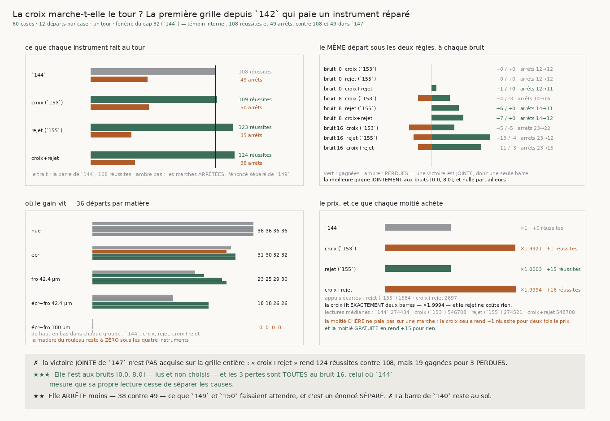

# 156 — La croix marche-t-elle le tour ? La première grille depuis `142` qui paie un instrument réparé

> ⭐⭐⭐⭐ **LA MOITIÉ CHÈRE DE LA RÉPARATION NE PAIE PAS SUR UNE MARCHE, ET LA MOITIÉ GRATUITE PAIE
> PRESQUE TOUT.** La **croix** coûte exactement **deux barres d'appuis** — **×1,9921** de lectures —
> et rend **+1** réussite (109 contre 108), avec **9 gagnées pour 8 perdues** : un pur déplacement.
> Le **rejet** coûte **×1,0003** — 274521 lectures médianes contre 274434 — et rend **+15**
> (123 contre 108), avec **19 gagnées pour 4 perdues**. Les deux ensemble rendent **124** et
> **19 gagnées pour 3 perdues**, pour **×1,9994**. C'est le plus gros mouvement de réussites depuis
> `142`, et il vient de la ligne qui ne coûte rien.
>
> ⚠⚠ **ET LA VICTOIRE JOINTE DE `147` N'EST PAS ACQUISE SUR LA GRILLE ENTIÈRE** — trois réussites
> sont **perdues** sur 180 départs appariés, donc la barre de `144` tient. ⭐⭐⭐ **Mais elle est
> acquise aux bruits 0 et 8**, et c'est **lu** et non choisi : à bruit 0 la croix et le rejet gagnent
> **+1 pour 0 perdue**, à bruit 8 **+7 pour 0** (et le rejet seul **+6 pour 0**) ; les **trois**
> pertes sont **toutes** au bruit **16** — celui où `144` mesure que sa propre lecture cesse de
> séparer les causes.
>
> ⭐⭐ **L'ATTENTE DE `149` ET `150` EST CONFIRMÉE POUR LE REJET ET RÉFUTÉE POUR LA CROIX.** Elle
> était écrite avant la mesure : une pose plus juste doit **arrêter moins**. Le rejet fait tomber les
> arrêts de **49 à 35** ; la croix seule les fait **monter à 50**, et ajoutée au rejet elle les
> ramonte de 35 à **38**. Une mâchoire en croix a besoin de **deux** barres de matière pour se poser,
> donc elle refuse plus souvent — les poses manquées au départ passent de **10 à 11**.
>
> ⚠⚠ **ET CE QUE `155` NE POUVAIT PAS VOIR : LE REJET TRAVAILLE SURTOUT CONTRE LE BRUIT DE LECTURE.**
> `155` recense les appuis aberrants sur des matières **sans bruit** et conclut qu'ils demandent les
> **deux** causes physiques. Sur une grille bruitée le partage est net : à bruit 0 le rejet seul ne
> change **rien** (+0/−0), à bruit 8 il rend **+6/−0** et à bruit 16 **+13/−4**. Une lecture bruitée
> pose un appui sur l'interstice voisin exactement comme un froissement, et l'énoncé du rejet ne
> demande pas **quelle** cause l'y a mis.
>
> ✗ **La barre de `140` reste au sol** : **zéro** transfert pour la pince sur la matière du rouleau,
> sous les quatre instruments, avec **31** arrêts inchangés. Une seule chose y bouge et elle est
> bornée : **une** mâchoire seule munie du rejet y réussit **1** départ sur 36, à bruit 16.

## 1. Pourquoi cette grille, et pourquoi maintenant

Toutes les grilles depuis `142` ont payé un **réglage** — une mémoire (`143`), une lecture de cause
(`144`, `145`), un cap qui tourne (`147`), une fenêtre élargie (`149`) — et toutes ont **déplacé**
des réussites. Trois tranches viennent de changer autre chose :

- `153` établit que la mâchoire en segment **ne peut pas exprimer** une normale sortie du plan du
  tour, ce que la matière du rouleau impose et elle seule (`R4-F120`) ;
- `154` mesure de combien il reste à prendre, en divisant l'erreur par l'**échelle** de la matière —
  la croix est à **2,84×** sur celle du rouleau (`R4-F123`) ;
- `155` trouve ce qui le prend : rejeter les appuis tombés sur un **autre** interstice ramène la
  croix à **1,23×** (`R4-F128`).

C'est la première fois qu'un changement d'instrument **rapproche la pose de son échelle** au lieu de
déplacer des réussites, donc la première fois depuis `142` qu'une grille vaut son prix.

⚠⚠ **Et `poser(..., en_croix=True, rejeter=True)` existait depuis `155` sans que `suivre` le passe.**
Cette tranche commence donc par la plomberie : `suivre`, `les_trois_bras` et `une_case` acceptent les
deux mots, et `suivre` publie `appuis_rejetes`, le compte exact des appuis écartés sur les poses
qu'elle **garde**.

## 2. L'attente, dite avant la mesure

`149` mesure que la pince ne meurt pas de dérive mais d'**arrêt** — **49** marches arrêtées contre
**13** qui bouclent sur une autre feuille — et que c'est la **pose** qui échoue : vingt et un refus
de pose contre zéro refus de contrainte. `150` mesure que cette pose tombe à **633 ‰** à l'angle où
le cap incline la normale.

⭐ **Une pose plus juste devrait donc arrêter moins.** C'est l'énoncé que cette grille peut confirmer
ou réfuter, et il est **séparé** de la victoire : une marche peut cesser de s'arrêter et finir sur la
mauvaise feuille.

## 3. ⭐⭐⭐ Ce que chaque instrument fait au tour



Quinze cases par instrument (cinq matières × trois bruits), douze départs, un tour, au meilleur
réglage de cap de `144` — mémoire **lue**, fenêtre **32**. Le bras est la **pince** :

| instrument | réussites | arrêts | pose refusée au départ | appuis écartés | lectures médianes |
|---|---|---|---|---|---|
| la pince de `144` | **108** | **49** | 10 | 0 | **274434** |
| la croix (`153`) | **109** | **50** | 11 | 0 | **546708** |
| le rejet (`155`) | **123** | **35** | 10 | **1584** | **274521** |
| la croix et le rejet | **124** | **38** | 11 | **2697** | **548700** |

⭐⭐⭐⭐ **Le prix et ce qu'il achète sont inversés.** La croix multiplie les lectures par **1,9921** et
rend **une** réussite ; le rejet les multiplie par **1,0003** et en rend **quinze**. Ajouter la
croix au rejet coûte **×1,9994** et rend **une** réussite de plus (124 contre 123) — en **arrêtant trois
fois de plus** (38 contre 35).

⚠ Le compte d'appuis écartés est un **compte**, jamais une comparaison de normales : `155` a payé
qu'une tolérance de 1e-9 tombe **sous** la reproductibilité de la décomposition sur un tableau
recopié, donc qu'elle compte du bruit numérique comme un effet.

## 4. ⭐⭐⭐⭐ La victoire est jointe aux bruits 0 et 8, et nulle part ailleurs

Un solde ne dit pas ce qu'il a coûté : depuis `147` une victoire est **jointe** — plus de réussites
**et** aucune perdue sur les départs **appariés**. Sur les 180 départs de la grille :

| instrument | gagnées | perdues | solde |
|---|---|---|---|
| la croix (`153`) | 9 | **8** | +1 |
| le rejet (`155`) | 19 | **4** | +15 |
| la croix et le rejet | 19 | **3** | +16 |

⚠⚠ **Aucun des trois ne remplit la condition jointe**, donc la barre de `144` tient. Mais l'appariement
refait **à chaque niveau de bruit** montre où la condition casse, et ce découpage n'est pas choisi :

| bruit | la croix | le rejet | la croix et le rejet |
|---|---|---|---|
| 0 | +0 / −0, arrêts 12 → 12 | +0 / −0, arrêts 12 → 12 | **+1 / −0**, arrêts 12 → **11** |
| 8 | +4 / **−3**, arrêts 14 → **16** | **+6 / −0**, arrêts 14 → **11** | **+7 / −0**, arrêts 14 → **12** |
| 16 | +5 / **−5**, arrêts 23 → 22 | +13 / **−4**, arrêts 23 → **12** | +11 / **−3**, arrêts 23 → **15** |

⭐⭐⭐ **Les trois pertes de la croix et du rejet sont TOUTES au bruit 16**, et aux bruits 0 et 8 la
victoire est **jointe** — la croix et le rejet gagnent **+1** puis **+7** réussites sans en
perdre une seule.

⚠ Ce bruit 16 est celui où `144` mesure que sa **propre** lecture cesse de séparer les causes —
écart entre matières **0,0891** contre une dispersion dans une matière de **0,1197**. Les deux faits
sont **co-localisés** et publiés comme tels : cette tranche mesure où les pertes tombent, elle ne
démontre pas que la lecture du cap en est la cause.

## 5. ⭐⭐ Où le gain vit, matière par matière

Trente-six départs par matière, tous bruits confondus, pour la pince :

| matière | `144` | croix | rejet | croix + rejet |
|---|---|---|---|---|
| spirale nue | 36 | 36 | 36 | 36 |
| spirale écrasée | 31 | 30 | 32 | 32 |
| spirale froissée 42,4 µm | 23 | 25 | **29** | **30** |
| spirale écrasée et froissée 42,4 µm | 18 | 18 | **26** | **26** |
| spirale écrasée et froissée 100 µm (celle du rouleau) | **0** | **0** | **0** | **0** |

⭐⭐⭐ **Le gain est entier sur les deux matières froissées modérées** — de **23** à **29** et de
**18** à **26** pour le rejet seul — c'est-à-dire exactement là où `154` mesure que la croix descend **sous** son échelle (0,75× et
0,92×) et où un instrument a donc quelque chose à gagner. Sur la spirale **nue** rien ne bouge, et
c'est la garde : un instrument qui aurait gagné là aurait gagné sur du bruit.

✗ **Et la matière du rouleau ne bouge pas d'un départ pour la pince**, avec **31** arrêts sous les
quatre instruments. `R4-F113` en a donné la raison structurelle : la fenêtre y est trop étroite de
quinze pour cent, et aucun de ces deux changements ne touche la fenêtre.

⚠ Une seule chose y bouge, et elle est **bornée** : **une** mâchoire seule munie du rejet y réussit
**1** départ sur 36, à bruit 16, en écartant **1163** appuis. Un départ sur trente-six n'est pas un
résultat ; c'est le premier non-zéro de la campagne sur cette matière, et il est noté comme tel.

## 6. ⚠⚠ Ce que `155` ne pouvait pas voir

`155` recense les appuis aberrants sur des matières **sans bruit** et établit qu'ils demandent les
**deux** causes physiques (`R4-F127`). Une marche, elle, lit un volume **bruité**. Le tableau du §4
tranche : à bruit 0 le rejet seul ne change **rien** (+0 / −0 sur 60 départs), à bruit 8 il rend
**+6 / −0**, à bruit 16 **+13 / −4**.

⭐⭐ **Une lecture bruitée pose un appui sur l'interstice voisin exactement comme un froissement**, et
l'énoncé du rejet — « à plus d'une **demi**-épaisseur de la médiane de sa mâchoire » — ne demande pas
**quelle** cause l'y a mis. C'est ce qui explique qu'une règle recensée comme rare sur cinq matières
propres soit, sur une grille bruitée, la seule des quatre pistes de `153` qui déplace la marche.

## 7. ⚠⚠⚠ Deux sondes de ma batterie ne mordaient pas

**La première ne mordait pas sur les PAS.** J'avais écrit que `en_croix` traverse `suivre` parce que
la marche diffère. En cassant le code — retirer `en_croix` de la pose **du pas** seulement — la
batterie est restée **verte** : la pose de **départ** l'avait encore, et elle change tout ce qui
suit. Un suiveur qui aurait posé la croix au départ puis le segment à chaque pas serait passé sans un
mot. Ce qui isole le pas est son **prix**, et il est exact : une marche bornée à zéro pas contre une
bornée à un donne un rapport de **deux** pour la pose comme pour le pas. La sonde échoue désormais
quand on casse l'un **ou** l'autre.

**La seconde ne mordait pas sur les ARRÊTS.** Mon témoin interne comparait réussites et arrêts, mais
la fixture rendait les deux d'accord, donc retirer la comparaison des arrêts laissait la batterie
verte. Il fallait un record qui reproduise les **réussites** en s'arrêtant un nombre de fois
**différent**.

⚠⚠ **Et une fixture entière était dimensionnée trop court.** À bruit nul la pince ne franchit **pas**
le premier pas sur la matière du rouleau : une marche qui ne marche pas n'écarte aucun appui, donc
toute sonde du rejet y passait au vert pour la raison exactement **inverse** de celle qu'elle
annonçait. C'est le piège de `155`, repayé.

⚠ **Enfin, un attendu écrit à la main était faux** : mon comptage mental disait « +1 / −1 » là où la
fixture dit « +2 / −1 ». C'est l'attendu qui avait tort, et il se **dérive** désormais des fixtures
par `une_reussite`.

## 8. Le témoin interne

Ajouter deux mots à `suivre` ne doit rien déplacer quand ils sont faux. Le témoin frais est
**remesuré** plutôt que recopié, et il reproduit `147` exactement : **114** réussites pour une
mâchoire, **107** pour deux mâchoires libres, **108** pour la pince, **49** arrêts — et **0** appui
écarté quand le rejet est éteint, ce qui prouve que le mot fait quelque chose plutôt que d'être passé
et ignoré.

## 9. Ce que cette tranche laisse

⭐⭐⭐⭐ **La demande change de place, et elle est étroite.** Les trois pertes sont au bruit 16, donc la
question n'est plus « comment poser plus juste » mais « pourquoi une pose plus juste perd-elle trois
départs là où la lecture du cap ne sépare plus rien ». C'est la première fois de la campagne qu'un
gain et une perte sont **séparés par un paramètre mesuré** plutôt que mélangés dans un total.

⚠ **Et la croix est un chemin fermé pour la marche**, ce qu'aucune tranche ne pouvait dire avant :
elle double le prix, arrête davantage, et n'achète qu'une réussite. `153` et `154` restent vrais —
elle **est** le bon instrument pour la justesse d'une pose isolée — mais sur un tour la justesse
qu'elle achète ne se transforme pas en transferts.

⚠ Ce que `134` (**le vrillage**) demandait n'est toujours pas clos, et `153`/`154` le rejoignent : la
variation le long de `n × t` **est** la quantité qu'un vrillage porte, et `R4-F79` mesure sur le vrai
rouleau que le penchant est plus **axial** qu'azimutal (0,334 contre 0,193).

## 10. Reproduire

```
uv run python src/nappe/la_croix_marche_t_elle_le_tour.py \
    --json docs/mesures/la_croix_marche_t_elle_le_tour.json
uv run python src/figures/figure_la_croix_marche_t_elle_le_tour.py \
    --json docs/mesures/la_croix_marche_t_elle_le_tour.json \
    --sortie docs/images/156_la_croix_marche_t_elle_le_tour.png
uv run python src/nappe/la_croix_marche_t_elle_le_tour.py --verifier
uv run python src/figures/figure_la_croix_marche_t_elle_le_tour.py --verifier
```

Zéro lecture distante : la grille tourne entièrement sur les matières fabriquées de `140`.
