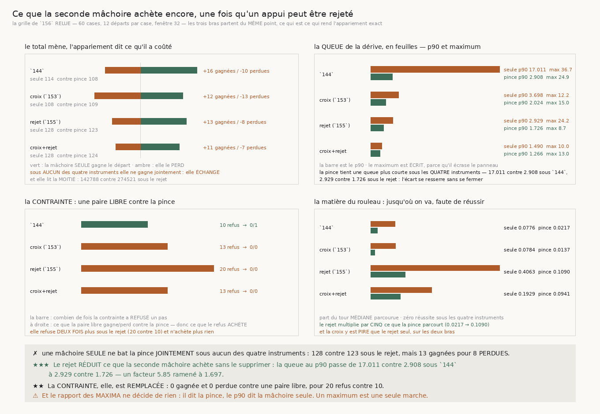

# 157 — Ce que la seconde mâchoire achète encore, une fois qu'un appui peut être rejeté

> ⭐⭐⭐⭐ **LE TOTAL MENAIT, L'APPARIEMENT DIT CE QU'IL A COÛTÉ.** `156` publie que la mâchoire SEULE
> munie du rejet rend **128** réussites pour **20** arrêts, contre **123** et **35** pour la pince —
> le plus haut compte de la campagne. Apparié départ par départ, ce total en avance de cinq est payé
> de **huit** départs perdus : **13 gagnées pour 8 perdues**. Et sous **aucun** des quatre
> instruments la mâchoire seule ne bat la pince **jointement** — 16/10, 12/13, 13/8, 11/7. Elle
> **échange**, elle n'ajoute pas.
>
> ⭐⭐⭐ **LE REJET RÉDUIT CE QUE LA SECONDE MÂCHOIRE ACHÈTE, SANS LE SUPPRIMER.** `142` avait
> décomposé la pince : la seconde mâchoire divise la dérive par **18,178** parce qu'elle MESURE
> l'épaisseur, le refus de changer d'interstice la divise par **1,586** de plus. Reposée sur la
> **queue** de la dérive, la première moitié vaut **5,85** sous `144` — p90 de **17,011** feuilles
> contre **2,908** — et **1,697** sous le rejet — **2,929** contre **1,726**. L'écart se resserre
> d'un facteur trois et ne se ferme pas.
>
> ⭐⭐ **LA SECONDE MOITIÉ, ELLE, EST REMPLACÉE.** La contrainte n'achète plus rien : **0** gagnée et
> **0** perdue contre une paire LIBRE sous les trois instruments réparés, alors qu'elle refuse
> **deux fois plus souvent** — **20** refus contre **10**. Elle n'achetait déjà qu'**une** réussite
> sous `144`. C'est le motif de `143`, où un cap suffisant faisait tomber le refus de 297 à zéro :
> un mécanisme suffisant rend l'autre redondant.
>
> ⭐⭐⭐⭐ **ET SUR LA MATIÈRE DU ROULEAU, LE MUR A RECULÉ D'UN FACTEUR CINQ.** Zéro réussite reste
> zéro sous les quatre instruments, mais la part du tour médiane parcourue passe de **0,0217** à
> **0,109** pour la pince et de **0,0776** à **0,4063** pour la mâchoire seule. Un compte de
> réussites nul ne dit pas si le mur a bougé ; la part du tour le dit, et c'est la première fois
> depuis `142` qu'elle bouge là-bas.
>
> ⚠⚠⚠ **ET UNE DE MES CONCLUSIONS A ÉTÉ RÉFUTÉE PAR SA PROPRE VÉRIFICATION.** J'avais lu dans le
> rapport des **maxima** que le rejet profite au bras qui MESURE (×2,864 contre ×1,513) et j'allais
> en faire un mécanisme. Le **p90** dit l'inverse (×5,808 contre ×1,685). Un maximum est **une seule
> marche** : le rapport des queues maximales ne décide de rien, et c'est le p90 — ajouté exprès
> comme compagnon — qui l'a montré.

## 1. Pourquoi ce fichier, et pourquoi il ne remarche rien

`156` paie une grille de soixante cases et en publie le verdict pour la **pince**. Les trois bras y
sont pourtant mesurés **sur le même départ** — c'est `les_trois_bras` qui l'impose, exactement pour
que la comparaison soit lisible — et le tableau des bras contredit le verdict qu'on en tire :

| instrument | une mâchoire | deux mâchoires libres | la pince |
|---|---|---|---|
| la pince de `144` | **114** / 52 arrêts | 107 / 48 | 108 / 49 |
| la croix (`153`) | 108 / 49 | 109 / 49 | 109 / 50 |
| le rejet (`155`) | **128** / **20** | 123 / 35 | 123 / 35 |
| la croix et le rejet | **128** / 26 | 124 / 37 | 124 / 38 |

⚠ `apparie` de `147` ne sait pas trancher : il compare le **même bras** sous deux règles. Ce fichier
ajoute l'appariement **entre bras**, à règle fixe, et ne remarche rien — il relit la grille payée.

## 2. ⭐⭐⭐⭐ Un total en avance n'est pas une victoire



Le MÊME départ sous deux **bras**, la règle restant fixe :

| instrument | seule contre pince | gagnées | perdues | jointe ? |
|---|---|---|---|---|
| la pince de `144` | 114 contre 108 | 16 | **10** | non |
| la croix (`153`) | 108 contre 109 | 12 | **13** | non |
| le rejet (`155`) | 128 contre 123 | 13 | **8** | non |
| la croix et le rejet | 128 contre 124 | 11 | **7** | non |

⚠⚠ **Un départ où le bras ne se pose pas compte comme un échec**, jamais comme une donnée absente :
refuser de se poser est une façon de rater un transfert, et le sauter ferait passer un bras qui
refuse beaucoup pour un bras qui réussit souvent.

⚠ Et la mâchoire seule lit la **moitié** : **142788** lectures médianes contre **274521** pour la
pince sous le rejet. C'est le seul point où elle gagne sans rien perdre, et il ne porte pas sur les
transferts.

## 3. ⭐⭐⭐ Ce que la seconde mâchoire achète encore

`142` mesure que la seconde mâchoire divise la dérive par **18,178** parce qu'elle **mesure**
l'épaisseur là où une seule ne peut que la supposer. Reposée sur la **queue** :

| instrument | p90 seule | p90 pince | rapport | max seule | max pince | médiane seule | médiane pince |
|---|---|---|---|---|---|---|---|
| la pince de `144` | **17,011** | **2,908** | **5,85** | 36,685 | 24,898 | 0,0904 | 0,0515 |
| la croix (`153`) | 3,698 | 2,024 | **1,827** | 12,182 | 14,968 | 0,0918 | 0,0483 |
| le rejet (`155`) | **2,929** | **1,726** | **1,697** | 24,24 | 8,694 | 0,0808 | 0,0358 |
| la croix et le rejet | 1,49 | 1,266 | **1,177** | 10,034 | 12,963 | 0,0739 | 0,0362 |

⭐⭐⭐ **La pince tient une queue plus courte sous les quatre instruments**, au p90 comme à la
médiane — mais le rapport tombe de **5,85** à **1,697** avec le rejet et à **1,177** avec la croix
et le rejet. Ce que la seconde mâchoire achetait, un instrument qui écarte ses appuis aberrants
l'achète presque aussi bien.

⚠⚠ **Presque, et le mot compte** : à **1,697**, la queue de la mâchoire seule dépasse encore celle
de la pince de moitié en plus, et ce n'est pas une queue en feuilles de rien du tout — **2,929**
feuilles au p90, contre **1,726**.

## 4. ⚠⚠⚠ Le rapport des maxima ne décide de rien

J'avais d'abord lu à QUI le rejet profite dans le rapport des **queues maximales**, et j'allais en
tirer un mécanisme — un appui aberrant corrompt une épaisseur **mesurée**, donc le bras qui mesure
devrait en tirer plus. Les deux statistiques se contredisent :

| | rejet, mâchoire seule | rejet, pince |
|---|---|---|
| queue **maximale** de `144` divisée par | **1,513** | **2,864** |
| queue au **p90** de `144` divisée par | **5,808** | **1,685** |

Le maximum dit la pince, le p90 dit la mâchoire seule. ⚠⚠ **Un maximum est une seule marche sur cent
soixante-dix** : un verdict bâti dessus repose sur un départ. Le p90 a été ajouté **exprès** comme
compagnon, et c'est lui qui a réfuté la conclusion. Le rapport des maxima est donc publié et **ne
porte aucun énoncé**.

## 5. ⭐⭐ La contrainte, elle, est remplacée

La seconde moitié de la décomposition de `142` — le refus de changer d'interstice — se lit contre
une paire **libre**, qui a la seconde mâchoire et pas le refus :

| instrument | refus | marches qui refusent | la paire libre gagne | elle perd |
|---|---|---|---|---|
| la pince de `144` | 10 | 8 | 0 | **1** |
| la croix (`153`) | 13 | 9 | 0 | 0 |
| le rejet (`155`) | **20** | 11 | 0 | 0 |
| la croix et le rejet | 13 | 9 | 0 | 0 |

⭐⭐ **Elle refuse deux fois plus sous le rejet et n'achète plus rien.** Elle n'achetait déjà
qu'**une** réussite sous `144`. C'est exactement le motif de `143`, où la mémoire du cap faisait
tomber le refus de la pince de **297** à zéro : un mécanisme suffisant en amont rend redondant celui
qui existait pour rattraper en aval. Ici le rejet ne supprime pas le refus — il le rend **sans
effet**.

## 6. ⭐⭐⭐⭐ Le mur de la matière du rouleau a reculé

Zéro réussite reste zéro. Mais un compte nul ne dit pas si le mur a bougé, et la part du tour
médiane parcourue le dit :

| instrument | une mâchoire | la pince |
|---|---|---|
| la pince de `144` | 0,0776 | **0,0217** |
| la croix (`153`) | 0,0784 | **0,0137** |
| le rejet (`155`) | **0,4063** | **0,109** |
| la croix et le rejet | 0,1929 | 0,0941 |

⭐⭐⭐ **Le rejet multiplie par cinq ce que la pince parcourt** sur la matière où personne n'a jamais
bouclé un tour, et par plus de cinq ce que la mâchoire seule parcourt. C'est le premier mouvement
depuis `142` sur cette matière.

⚠ **Et la croix y est pire que le rejet seul, sur les deux bras** — 0,0941 contre 0,109 pour la
pince, 0,1929 contre 0,4063 pour la mâchoire seule. Troisième mesure de suite qui va contre elle,
après le prix et l'arrêt de `156`.

## 7. Les sondes, et une fixture que j'avais écrite au jugé

Six sondes vérifiées en cassant le code : la clé d'appariement porte la **matière** (sans elle, deux
cases au même angle se confondent), la victoire est **jointe**, la dérive est prise en **valeur
absolue**, « elle refuse » n'est pas « elle achète », la matière du rouleau est **filtrée**, et un
départ où le bras ne se pose pas est **perdu** et non sauté.

⚠⚠ **Et une fixture écrite au jugé m'a fait signaler un achat qui n'existait pas** : j'avais mis en
face de la pince une liste dont une marche dérive de deux feuilles — donc **pas** une réussite au
sens de `une_reussite` — et la contrainte « achetait » un départ que ma fixture lui avait donné. La
fixture se **dérive** du prédicat, elle ne s'écrit pas de tête.

⚠ Une sonde qui **lève** est moins bonne qu'une sonde qui rend faux : elle arrête la batterie et
cache les contrôles suivants. Le détail se lit en `.get`.

## 8. Ce que cette tranche laisse

⭐⭐⭐ **La décomposition de `142` est repesée, et elle a bougé de façon dissymétrique** : la
contrainte est remplacée, la seconde mâchoire ne l'est pas. Un instrument à **une** mâchoire coûte
la moitié des lectures ; ce qui l'empêche encore de remplacer la pince est une queue de dérive
moitié plus longue, pas un compte de réussites.

⚠⚠ Et la demande que `156` laissait est intacte : les trois pertes de la pince sont toutes au bruit
où la lecture du cap ne sépare plus rien. Cette tranche ne l'a pas touchée.

⚠ Ce que `134` (**le vrillage**) demandait n'est toujours pas clos, et `153`/`154` le rejoignent :
la variation le long de `n × t` **est** la quantité qu'un vrillage porte, et `R4-F79` mesure sur le
vrai rouleau que le penchant est plus **axial** qu'azimutal (0,334 contre 0,193).

## 9. Reproduire

```
uv run python src/nappe/ce_que_la_seconde_machoire_achete_encore.py \
    --json docs/mesures/ce_que_la_seconde_machoire_achete_encore.json
uv run python src/figures/figure_ce_que_la_seconde_machoire_achete_encore.py \
    --json docs/mesures/ce_que_la_seconde_machoire_achete_encore.json \
    --sortie docs/images/157_ce_que_la_seconde_machoire_achete_encore.png
uv run python src/nappe/ce_que_la_seconde_machoire_achete_encore.py --verifier
uv run python src/figures/figure_ce_que_la_seconde_machoire_achete_encore.py --verifier
```

Zéro lecture distante, et zéro marche : cette tranche relit la grille que `156` a payée.
