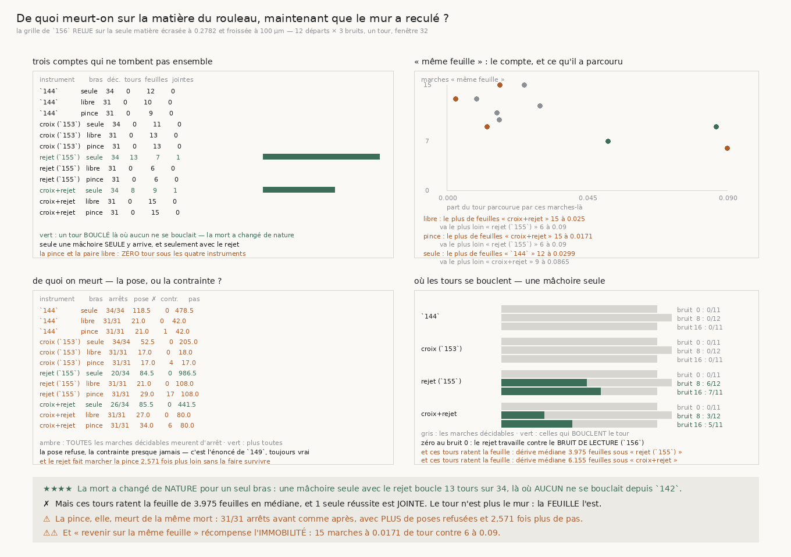

# 158 — De quoi meurt-on sur la matière du rouleau, maintenant que le mur a reculé ?

> ⭐⭐⭐⭐ **LA MORT A CHANGÉ DE NATURE POUR UN SEUL BRAS, ET C'EST LE PREMIER TOUR BOUCLÉ DE LA
> CAMPAGNE SUR CETTE MATIÈRE.** Une mâchoire **seule** munie du rejet y boucle **13** tours sur
> **34**, et **8** avec la croix, là où **aucun** ne se bouclait depuis `142`. La pince et la paire
> libre en bouclent **zéro** sous les quatre instruments.
>
> ✗ **Mais ces tours ratent la feuille.** Leur dérive médiane vaut **3,975** feuilles sous le rejet
> (entre **0,214** et **12,309**) et **6,155** sous la croix et le rejet. **Une** seule réussite est
> JOINTE. Le tour n'est plus le mur : **la feuille l'est**, et c'est très exactement la question que
> le graal pose.
>
> ⚠ **La pince, elle, meurt de la même mort** : **31** arrêts sur **31** avant comme après, avec
> **davantage** de poses refusées (médiane **21,0** → **29,0**) tout en marchant **2,571** fois plus
> loin. Le rejet y achète de la **distance**, pas de la survie.
>
> ⚠⚠ **ET « REVENIR SUR LA MÊME FEUILLE » RÉCOMPENSE L'IMMOBILITÉ SUR CETTE MATIÈRE.** Pour la
> pince, l'instrument qui en compte le plus est la croix et le rejet — **15** marches, à **0,0171**
> de tour — et celui dont les marches vont le plus loin n'en compte que **6**, à **0,09**. Sous la
> croix seule, les **13** marches de la pince « sur la bonne feuille » ont parcouru **0,0029** de
> tour : trois millièmes. Elles sont sur la bonne feuille parce qu'elles **n'en sont pas parties**.

## 1. Pourquoi ce fichier

`157` mesure que le rejet multiplie par cinq la part du tour parcourue sur la matière que `140`
retient — celle sur laquelle personne n'a jamais réussi un transfert depuis `142` — à **zéro**
réussite inchangé. Un mur qui recule sans tomber pose une question que ni `156` ni `157` n'ont
posée : **de quoi meurt-on maintenant ?**

C'est le patron de `149`, qui avait compté les échecs sur les marches que `148` rangeait, appliqué à
la seule matière qui compte — la spirale **écrasée à 0,2782** et **froissée à 100 µm**, celle que
`140` retient comme celle du rouleau, sur ses **12** départs et ses trois bruits. ⚠⚠ **Il ne
remarche rien** : tout est dans le record de `156`.

⭐⭐ **Et il sépare deux énoncés que `une_reussite` joint à dessein.** « Boucler le tour » et
« revenir sur la même feuille » sont la même réussite pour le prédicat du dépôt, et c'est juste —
`143` a payé qu'on les compte à part. Mais pour une **autopsie** il faut les regarder séparément,
parce qu'ils ne tombent pas ensemble.

## 2. ⭐⭐⭐⭐ Trois comptes qui ne tombent pas ensemble



| instrument | bras | décidables | tours bouclés | mêmes feuilles | réussites jointes | part du tour de ces mêmes feuilles |
|---|---|---|---|---|---|---|
| `144` | une mâchoire | 34 | 0 | 12 | 0 | **0,0299** |
| `144` | paire libre | 31 | 0 | 10 | 0 | **0,0169** |
| `144` | la pince | 31 | 0 | 9 | 0 | **0,0129** |
| croix (`153`) | une mâchoire | 34 | 0 | 11 | 0 | **0,0162** |
| croix (`153`) | paire libre | 31 | 0 | 13 | 0 | **0,0096** |
| croix (`153`) | la pince | 31 | 0 | 13 | 0 | **0,0029** |
| rejet (`155`) | une mâchoire | 34 | **13** | 7 | 1 | **0,0518** |
| rejet (`155`) | paire libre | 31 | 0 | 6 | 0 | **0,09** |
| rejet (`155`) | la pince | 31 | 0 | 6 | 0 | **0,09** |
| croix + rejet | une mâchoire | 34 | **8** | 9 | 1 | **0,0865** |
| croix + rejet | paire libre | 31 | 0 | 15 | 0 | **0,025** |
| croix + rejet | la pince | 31 | 0 | 15 | 0 | **0,0171** |

⭐⭐⭐⭐ **Le rejet est la seule chose qui ait jamais bouclé un tour ici**, et seulement pour le bras
qui ne mesure pas son épaisseur. La croix seule n'en boucle aucun ; la pince et la paire libre n'en
bouclent aucun sous **aucun** instrument.

## 3. ⚠⚠ Le compte de feuilles récompense l'immobilité

La colonne de droite du tableau ci-dessus est celle qui rend les autres lisibles. `_resumer_un_bras`
prévient depuis `142` qu'« une pince qui refuse tout ne dérive jamais et ne va nulle part » ; sur
cette matière, l'avertissement est la description exacte de ce qui se passe :

| bras | le plus de « mêmes feuilles » | sa part du tour | va le plus loin | sa part |
|---|---|---|---|---|
| paire libre | croix + rejet, **15** | **0,025** | rejet (`155`), **6** | **0,09** |
| la pince | croix + rejet, **15** | **0,0171** | rejet (`155`), **6** | **0,09** |
| une mâchoire | `144`, **12** | **0,0299** | croix + rejet, **9** | **0,0865** |

⭐⭐⭐ **Pour les trois bras, l'instrument qui compte le plus de « mêmes feuilles » n'est jamais celui
dont ces marches-là vont le plus loin.** Et l'égalité se tranche **dans le sens qui rend la
revendication plus dure** — à feuilles égales, c'est l'instrument qui va le plus loin qui est nommé —
sans quoi le départage fabriquerait la conclusion mesurée.

## 4. ⭐⭐ Ces tours ratent la feuille

- sous **rejet (`155`)** : dérive médiane **3,975** feuilles, entre **0,214** et **12,309**
- sous **croix + rejet** : dérive médiane **6,155** feuilles, entre **0,074** et **10,034**

⚠ Une seule des vingt et une marches qui bouclent un tour revient à moins d'une demi-feuille. Le
compte de réussites **jointes** de `156` — **0** pour la pince, **1** pour la mâchoire seule — était
exact ; ce qu'il ne disait pas, c'est que l'échec a changé de bord.

## 5. ⚠ De quoi on meurt

| instrument | bras | arrêts | poses refusées (méd.) | refus de contrainte | pas médian | ×  |
|---|---|---|---|---|---|---|
| `144` | une mâchoire | 34 / 34 | 118,5 | 0 | 478,5 | 1,0 |
| `144` | paire libre | 31 / 31 | 21,0 | 0 | 42,0 | 1,0 |
| `144` | la pince | 31 / 31 | 21,0 | 1 | 42,0 | 1,0 |
| croix (`153`) | une mâchoire | 34 / 34 | 52,5 | 0 | 205,0 | 0,428 |
| croix (`153`) | paire libre | 31 / 31 | 17,0 | 0 | 18,0 | 0,429 |
| croix (`153`) | la pince | 31 / 31 | 17,0 | 4 | 17,0 | 0,405 |
| rejet (`155`) | une mâchoire | 20 / 34 | 84,5 | 0 | 986,5 | 2,062 |
| rejet (`155`) | paire libre | 31 / 31 | 21,0 | 0 | 108,0 | 2,571 |
| rejet (`155`) | la pince | 31 / 31 | 29,0 | 17 | 108,0 | 2,571 |
| croix + rejet | une mâchoire | 26 / 34 | 85,5 | 0 | 441,5 | 0,923 |
| croix + rejet | paire libre | 31 / 31 | 27,0 | 0 | 80,0 | 1,905 |
| croix + rejet | la pince | 31 / 31 | 34,0 | 6 | 80,0 | 1,905 |

⚠⚠ **La pince meurt de la même mort avant et après** : toutes ses marches décidables s'arrêtent, et
le rejet la fait marcher **2,571** fois plus loin en lui faisant refuser **davantage** de poses
(médiane **21,0** → **29,0**). C'est l'énoncé de `149`, toujours vrai : c'est la **pose** qui échoue,
la contrainte presque jamais — **1** refus de contrainte sous `144` contre **21,0** poses refusées en
médiane par marche.

⚠ **Et la croix RACCOURCIT les marches ici** : pas médians **×0,405** pour la pince, **×0,428** pour
une mâchoire seule. Quatrième mesure de suite qui va contre elle, après le prix, l'arrêt (`156`) et
la part du tour (`157`).

## 6. ⭐⭐ Où les tours se bouclent — le bruit, encore

| instrument | bruit 0 | bruit 8 | bruit 16 |
|---|---|---|---|
| `144` | **0** / 11 | **0** / 12 | **0** / 11 |
| croix (`153`) | **0** / 11 | **0** / 12 | **0** / 11 |
| rejet (`155`) | **0** / 11 | **6** / 12 | **7** / 11 |
| croix + rejet | **0** / 11 | **3** / 12 | **5** / 11 |

⭐⭐⭐ **Zéro au bruit 0.** Les vingt et un tours bouclés sont tous aux bruits 8 et 16, ce qui recoupe
exactement ce que `156` mesure : le rejet travaille surtout contre le **bruit de lecture**. Une
lecture bruitée pose un appui sur l'interstice voisin comme un froissement le fait, et l'énoncé du
rejet ne demande pas **quelle** cause l'y a mis.

## 7. Les sondes

Huit sondes vérifiées en cassant le code : la part du tour est prise sur les marches « même feuille »
et non sur toutes, la demi-feuille est une borne **stricte**, boucler le tour n'est pas réussir, la
dérive des tours bouclés n'est pas celle de toutes les marches, aller **plus loin** et mourir de la
même chose n'est pas un changement de nature, une autre matière n'entre pas dans l'autopsie, et
l'égalité de feuilles se tranche vers l'instrument qui va le plus loin.

⚠ **Un interligne posé redevient faux au douzième bras** : les deux tableaux de la figure dérivent
désormais leur interligne de la place disponible, ce que le dépôt avait déjà payé une fois.

## 8. Ce que cette tranche laisse

⭐⭐⭐⭐ **La question du graal se déplace d'un cran sur la matière qui la bloque.** Elle était « comment
faire le tour » ; elle devient « comment le faire **sans perdre la feuille** », et elle ne se pose que
pour le bras qui ne mesure pas son épaisseur. `157` a mesuré ce que la seconde mâchoire achète encore
— un rapport de queue de **1,697** — et cette tranche dit **où** cet achat manque : sur les treize
tours qu'une mâchoire seule boucle et rate.

⚠⚠ Et l'obstacle de la pince n'a pas bougé : `R4-F113` en donne la raison structurelle — la fenêtre y
est trop étroite de quinze pour cent — et ni la croix ni le rejet ne touchent la fenêtre.

⚠ Ce que `134` (**le vrillage**) demandait n'est toujours pas clos, et `153`/`154` le rejoignent : la
variation le long de `n × t` **est** la quantité qu'un vrillage porte, et `R4-F79` mesure sur le vrai
rouleau que le penchant est plus **axial** qu'azimutal (0,334 contre 0,193).

## 9. Reproduire

```
uv run python src/nappe/de_quoi_meurt_on_sur_la_matiere_du_rouleau.py \
    --json docs/mesures/de_quoi_meurt_on_sur_la_matiere_du_rouleau.json
uv run python src/figures/figure_de_quoi_meurt_on_sur_la_matiere_du_rouleau.py \
    --json docs/mesures/de_quoi_meurt_on_sur_la_matiere_du_rouleau.json \
    --sortie docs/images/158_de_quoi_meurt_on_sur_la_matiere_du_rouleau.png
uv run python src/nappe/de_quoi_meurt_on_sur_la_matiere_du_rouleau.py --verifier
uv run python src/figures/figure_de_quoi_meurt_on_sur_la_matiere_du_rouleau.py --verifier
```

Zéro lecture distante, et zéro marche : cette tranche relit la grille que `156` a payée.
