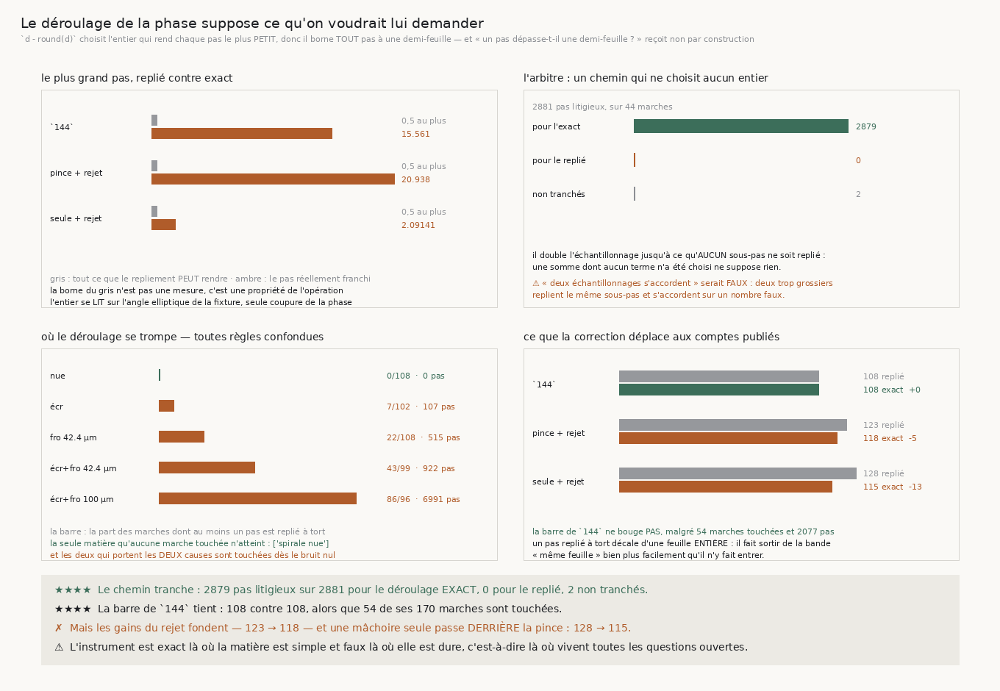

# 159 — Le déroulage de la phase suppose ce qu'on voudrait lui demander

> ⚠⚠⚠ **LA QUESTION DE `158` A REÇU UNE RÉPONSE FABRIQUÉE PAR L'INSTRUMENT.** `158` demandait si les
> quatre feuilles que treize marches perdent sont un **fluage** ou des **sauts**. La série de phases
> de `suivre` répond « zéro saut », et elle ne peut pas répondre autre chose : son déroulage fait
> `d - round(d)`, donc il **borne tout pas à une demi-feuille par construction**. Demander à cette
> série si un pas dépasse la demi-feuille, c'est demander à une règle graduée jusqu'à cinquante
> centimètres si quelque chose dépasse cinquante centimètres. Sa propre docstring le disait comme
> une **hypothèse**.
>
> ⭐⭐⭐⭐ **ET L'ENTIER SE LIT, IL NE SE DEVINE PAS.** La phase vaut
> `(u - r0)/pas + froissement/pas - theta/2pi` : sa **seule** coupure est en `theta`, et le pas
> angulaire d'une marche vaut l'avance sur le rayon — un centième de radian, sans aucune ambiguïté.
> ⚠⚠ Il faut l'angle que la **fixture** emploie : sur une section écrasée `cylindriques` rend un
> angle **elliptique**, et prendre l'angle circulaire du compteur de tour serait faux exactement sur
> la matière qui compte.
>
> ⭐⭐⭐ **UN ARBITRE TRANCHE, PAS UN RAISONNEMENT.** Trois raisonnements se sont contredits ici. Le
> chemin entre deux centres, échantillonné jusqu'à ce qu'**aucun sous-pas ne soit replié**, ne
> choisit aucun entier : **2879** pas litigieux sur **2881** lui donnent
> raison, **0** au repliement, **2** ne sont pas tranchés.
>
> ⭐⭐⭐⭐ **LA BARRE DE `144` NE BOUGE PAS** — **108** contre **108** — alors que **54** de ses **170**
> marches sont touchées et que **2077** de ses pas sont repliés à tort. Un pas replié à tort décale
> d'une feuille **entière** : il fait **sortir** de la bande « même feuille » bien plus facilement
> qu'il n'y fait entrer, et les marches touchées de `144` ne réussissaient déjà pas.
>
> ✗ **Mais les gains du rejet fondent et un total se retourne** : la pince passe de **123** à
> **118**, et une mâchoire seule de **128** à **115**, donc **derrière** la pince. Le total que
> `157` mettait en avant est retiré ; son verdict **joint**, lui, en sort renforcé.

## 1. Pourquoi ce fichier

`158` laisse une question exacte et la série de phases y répond « zéro saut » — le plus grand pas y
vaut **0,5000**, **0,4998**, **0,4996**… c'est-à-dire la borne de l'opération et non une mesure de la
matière.

⚠⚠⚠ **C'est le péché capital du dépôt sous un nouveau costume** : une vérification satisfaite par sa
propre construction. J'allais publier « fluage pur » en quatre étoiles.

## 2. ⭐⭐⭐⭐ Ce que le repliement peut rendre, et ce qu'un pas franchit



| règle | décidables | marches touchées | pas repliés à tort | plus grand pas réel |
|---|---|---|---|---|
| `144` | 170 | **54** | **2077** | **15,560977** |
| la pince + rejet | 170 | **49** | **1094** | **20,937993** |
| une mâchoire + rejet | 173 | **55** | **5364** | **2,091411** |

Le repliement ne peut **rien** annoncer au-delà de **0,5**. Le pas réellement franchi atteint
**20,937993** feuilles pour la pince munie du rejet.
⚠ Ce n'est pas l'avance qui borne un pas — elle vaut un quart de longueur d'onde — mais le
**recentrage** des mâchoires, qui peut déplacer le centre bien plus loin.

## 3. ⭐⭐⭐ L'arbitre, et pourquoi son premier critère était faux

Le chemin entre deux centres est échantillonné, et chaque sous-pas assez court change la phase de
bien moins d'une demi-feuille : son entier est alors **sans choix**. La somme ne suppose rien.

⚠⚠⚠ **Mon premier critère était « deux échantillonnages successifs s'accordent », et il est FAUX** :
deux échantillonnages trop grossiers replient le **même** sous-pas, rendent deux fois le **même
nombre faux**, et se déclarent d'accord. Un arbitre qui se vérifie par son propre accord a le défaut
exact de l'instrument qu'il juge. Payé sur quatre vrais pas, tous dans une même marche, dont les
parties fractionnaires coïncidaient au millionième et dont seul l'**entier** différait — de 4, 14, 6
et 1.

⭐⭐⭐⭐ **Le critère honnête n'a ni constante ni accord** : doubler jusqu'à ce qu'**aucun sous-pas
n'ait eu besoin d'être replié**. Le plafond est **déclaré**, son atteinte est **rendue**, et un pas
que l'arbitre n'a pas tranché ne compte **ni pour l'un ni pour l'autre** — les **2** de
cette mesure sont publiés comme tels.

Verdict : **2879** pour le déroulage exact, **0** pour le replié,
**2** non tranchés, sur **44** marches arbitrées.

## 4. ⭐⭐ Jusqu'où le défaut porte

| matière | marches touchées | sur | pas repliés à tort |
|---|---|---|---|
| spirale nue | **0** | 108 | **0** |
| spirale écrasée | 7 | 102 | 107 |
| spirale froissée 42.4 µm | 22 | 108 | 515 |
| spirale écrasée et froissée 42.4 µm | 43 | 99 | 922 |
| spirale écrasée et froissée 100 µm | **86** | 96 | **6991** |

⭐⭐⭐ **L'instrument est exact là où la matière est simple et faux là où elle est dure** : zéro
marche touchée sur la spirale **nue**, sous les trois règles et les trois bruits, et **86** des
**96** marches décidables sur la matière du rouleau. Le compte croît avec la difficulté sans
exception.

⚠ Et les **deux** matières qui portent les **deux** causes sont touchées **dès le bruit nul** — donc
le défaut n'est pas une affaire de bruit de lecture, contrairement au rejet de `155`.

## 5. ⭐⭐⭐⭐ Ce que la correction déplace, et ce qu'elle ne déplace pas

| règle | réussites (déroulage replié) | réussites (exact) | écart |
|---|---|---|---|
| `144` | 108 | **108** | **+0** |
| la pince + rejet | 123 | **118** | **-5** |
| une mâchoire + rejet | 128 | **115** | **-13** |

⭐⭐⭐⭐ **La barre de la campagne tient.** Cinquante-quatre marches de `144` sont touchées, 2077 de
ses pas sont repliés à tort, et **aucune** ne change de verdict. La raison est structurelle : un pas
replié à tort décale la dérive d'une feuille **entière**, ce qui fait **sortir** de la bande « même
feuille » bien plus facilement qu'il n'y fait entrer — et les marches touchées de `144` échouaient
déjà.

⚠⚠ **Ce qui bouge, ce sont les gains du rejet** : **123 → 118** pour la pince, donc un gain qui
reste positif et perd un tiers. Et **128 → 115** pour une mâchoire seule, qui passe ainsi **derrière**
la pince (118) là où le déroulage replié la donnait gagnante.

⚠ **Ce que cela retire à `157`** : le total avancé de la mâchoire seule. ⭐ **Ce que cela lui
ajoute** : son verdict **joint** — elle ne bat pas la pince — était juste, et il l'est désormais
même en total. Le fait que j'avais mis en titre était le total ; le fait qui tient était le verdict.

## 6. Les sondes

Huit sondes vérifiées en cassant le code, dont celle qui garde le critère de l'arbitre : un segment
de douze feuilles échantillonné à **8** et à **16** sous-pas donne **deux fois −4,000000** pendant
que le pas vaut −12, et **seul le compte de replis les dénonce**.

⚠ La batterie du module partagé passe de **91** à **98** : le déroulage exact et l'arbitre étaient du
code neuf sans un seul contrôle, ce qui n'aurait pas dû sortir ainsi.

⚠⚠ Et une de mes sondes m'a repris : j'avais écrit qu'à huit sous-échantillons l'arbitre se
tromperait encore. Faux — huit suffisent pour un pas de 1,6 feuille. La sonde honnête montre **où**
le sous-échantillonnage replie encore, et elle se dérive du cas plutôt que d'un nombre posé.

## 7. Ce que cette tranche laisse

⚠⚠ **La question de `158` reste entière** : les quatre feuilles sont-elles un fluage ou des sauts ?
L'instrument pour y répondre existe maintenant — `derouler_exactement` — mais la réponse demande sa
propre tranche, et elle ne se lira pas sur les nombres déjà publiés.

⚠ **Et rien n'est remplacé** : `derive_en_feuilles` reste le nombre de toutes les tranches
antérieures, et l'exact est publié **à côté**. Deux réponses à une question ne valent que si l'une
des deux est **dite** comme la mesure de l'autre.

⚠ Ce que `134` (**le vrillage**) demandait n'est toujours pas clos.

## 8. Reproduire

```
uv run python src/nappe/le_deroulage_suppose_ce_quon_lui_demande.py \
    --json docs/mesures/le_deroulage_suppose_ce_quon_lui_demande.json
uv run python src/figures/figure_le_deroulage_suppose_ce_quon_lui_demande.py \
    --json docs/mesures/le_deroulage_suppose_ce_quon_lui_demande.json \
    --sortie docs/images/159_le_deroulage_suppose_ce_quon_lui_demande.png
uv run python src/nappe/le_deroulage_suppose_ce_quon_lui_demande.py --verifier
uv run python src/figures/figure_le_deroulage_suppose_ce_quon_lui_demande.py --verifier
```

Zéro lecture distante : la phase et l'angle de la fixture sont **analytiques** et ne coûtent aucune
lecture de voxel.
