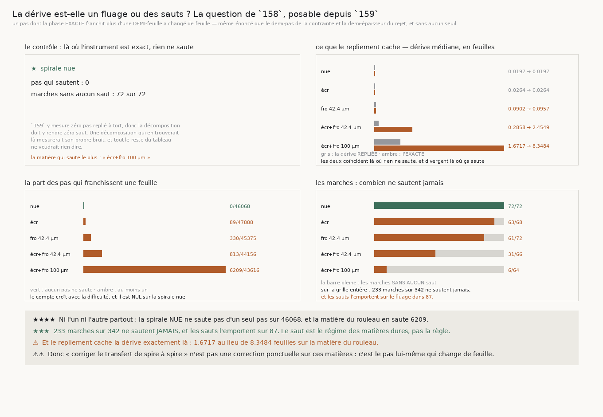

# 160 — La dérive est-elle un fluage ou des sauts ?

> ⭐⭐⭐⭐ **NI L'UN NI L'AUTRE PARTOUT : LE SAUT EST LE RÉGIME DES MATIÈRES DURES, PAS LA RÈGLE.** Sur
> les **342** marches décidables de la grille, **233** ne
> franchissent **aucune** feuille en un pas, et les sauts l'emportent sur le fluage dans
> **87**. Le compte de pas qui sautent croît avec la difficulté
> sans exception : **0**, **89**, **330**, **813**, **6209**.
>
> ⭐⭐⭐ **ET LE CONTRÔLE TIENT EXACTEMENT.** Sur la spirale **nue**, **0** pas
> saute sur **46068**, et **72** marches sur
> **72** n'en font aucun. `159` y mesure zéro pas replié à tort ; une décomposition
> qui aurait trouvé des sauts là mesurerait son propre bruit, et tout le reste du tableau ne
> voudrait rien dire.
>
> ⚠⚠ **LE REPLIEMENT CACHE LA DÉRIVE EXACTEMENT LÀ OÙ ÇA SAUTE.** Les deux dérives **coïncident** sur
> les deux matières simples (**0,0197** et **0,0264**) et divergent sur les deux qui portent les deux
> causes : **0,2858 → 2,4549** et **1,6717 → 8,3484**.
>
> ⚠⚠⚠ **ET CE QUE CELA DIT DU GRAAL EST DUR.** « Corriger le transfert de spire à spire » suppose un
> transfert qu'on peut rattraper. Sur ces matières, c'est **le pas lui-même** qui change de feuille,
> une fois sur sept sur celle du rouleau. Ce n'est pas une correction ponctuelle qui manque.

## 1. Pourquoi ce fichier

`158` demandait si les feuilles qu'une marche perd en bouclant son tour sont un **fluage** régulier ou
des **sauts** discrets, parce que les deux ne demandent pas la même suite : des sauts, quelque chose
peut les attraper ; un fluage, aucune correction locale ne le pourra. `158` a reçu « zéro saut » d'un
instrument incapable d'en voir, et `159` a montré pourquoi — le déroulage **borne tout pas à une
demi-feuille par construction**.

⭐⭐ **L'énoncé n'a aucun seuil** : les feuilles sont espacées d'une épaisseur, donc « ce pas a franchi
plus d'une **demi**-feuille » et « ce pas a changé de feuille » sont le même énoncé, celui du demi-pas
de la contrainte de `142` et de la demi-épaisseur du rejet de `155`. Et la décomposition est
**exacte** : `dérive exacte = somme des sauts + somme du fluage`, terme à terme.

## 2. ⭐⭐⭐⭐ La réponse, matière par matière



| matière | marches décidables | pas qui sautent | marches sans aucun saut | dérive repliée | dérive exacte |
|---|---|---|---|---|---|
| spirale nue | 72 | **0** / 46068 | **72** | 0,0197 | **0,0197** |
| spirale écrasée | 68 | 89 / 47888 | 63 | 0,0264 | **0,0264** |
| spirale froissée 42.4 µm | 72 | 330 / 45375 | 61 | 0,0902 | **0,0957** |
| spirale écrasée et froissée 42.4 µm | 66 | 813 / 44156 | 31 | 0,2858 | **2,4549** |
| spirale écrasée et froissée 100 µm | 64 | **6209** / 43616 | **6** | 1,6717 | **8,3484** |

⭐⭐⭐ **Le compte croît avec la difficulté sans une exception**, et il est **nul** sur la spirale nue.
⚠ Les deux matières simples ont une dérive repliée **égale** à l'exacte — le repliement n'y cache
rien, parce qu'il n'y a rien à cacher.

## 3. ⚠⚠ Ce que cela dit du graal

La question du dépôt est : *qu'est-ce qui remplace l'humain qui corrige le transfert de spire à
spire ?* Elle suppose un transfert **rattrapable**. Sur la matière du rouleau, **6209**
pas sur **43616** changent de feuille, et **6**
marches seulement sur **64** n'en font aucun.

⚠⚠⚠ **Ce n'est donc pas une correction ponctuelle qui manque là-bas** : le pas lui-même traverse. Un
correcteur devrait intervenir une fois sur sept, ce qui n'est plus une correction mais une seconde
façon de marcher.

⚠ **Et là où la matière est simple, il n'y a rien à corriger** : zéro saut sur 46068 pas.

## 4. Les sondes

Six sondes vérifiées en cassant le code : la décomposition est exacte terme à terme, la borne de la
demi-feuille est **stricte**, la part des pas qui sautent se calcule **par marche** puis se médiane,
« les sauts l'emportent » est un **compte de marches**, le contrôle de la spirale nue **tombe** dès
qu'un pas y saute, et une marche sans aucun pas est **sautée et comptée**.

⚠⚠ **Une sonde ne mordait pas**, et c'est la fixture qui était en cause : avec **deux** marches, un
compte de marches et une comparaison de **totaux** rendent tous deux 1. Il en fallait une troisième
pour que le compte vaille 2 là où la comparaison ne peut rendre que 0 ou 1.

⚠ **Et corriger cette fixture en a cassé une autre**, dont l'attendu était écrit en dur. Il se dérive
désormais de la fixture.

⚠⚠⚠ **Enfin, la mesure a levé la première fois**, et pour une raison qui était un vrai défaut : une
marche qui ne franchit **aucun pas** n'a pas de décomposition, et mon résumé la lisait comme une
donnée absente plutôt que comme une marche à sauter. Cela arrive exactement sur la matière du rouleau
à bruit nul, où la pince ne passe pas son premier pas.

## 5. Ce que cette tranche laisse

⭐⭐ **La question de `158` est close** : les deux, et le partage suit la matière. ⚠ Ce qu'elle ouvre
est plus dur — sur les matières qui portent les deux causes, un marcheur ne dérive pas, il **change
de feuille à chaque septième pas**. La demande n'est plus « corriger un transfert » mais « marcher
sans en changer », et aucune des tranches de `142` à `159` ne l'a posée sous cette forme.

⚠ Ce que `134` (**le vrillage**) demandait n'est toujours pas clos.

## 6. Reproduire

```
uv run python src/nappe/le_fluage_ou_les_sauts.py \
    --json docs/mesures/le_fluage_ou_les_sauts.json
uv run python src/figures/figure_le_fluage_ou_les_sauts.py \
    --json docs/mesures/le_fluage_ou_les_sauts.json \
    --sortie docs/images/160_le_fluage_ou_les_sauts.png
uv run python src/nappe/le_fluage_ou_les_sauts.py --verifier
uv run python src/figures/figure_le_fluage_ou_les_sauts.py --verifier
```

Zéro lecture distante : la phase et l'angle de la fixture sont **analytiques**.
