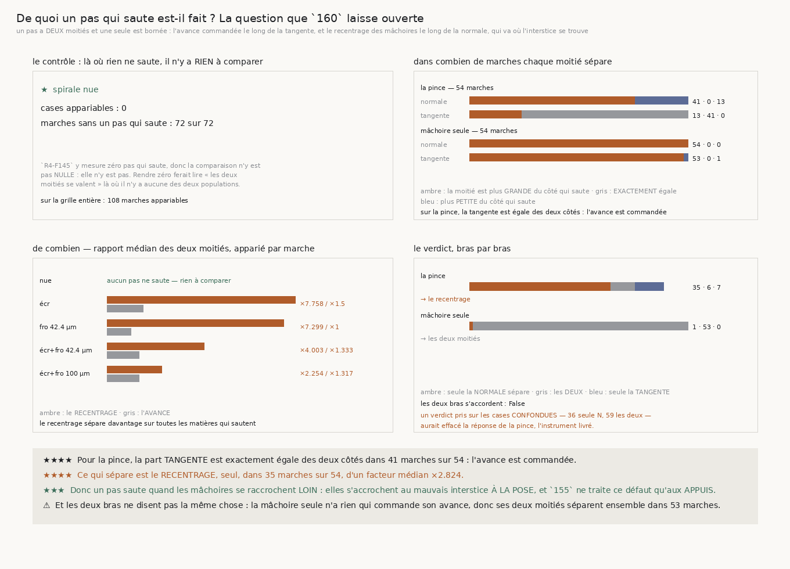

# 161 — De quoi un pas qui saute est-il fait ?

> ⭐⭐⭐⭐ **POUR LA PINCE, C'EST LE RECENTRAGE, ET SEULEMENT LUI.** Sur les **54** marches
> appariables du bras livré, la projection du pas sur la **tangente** est **exactement égale** des
> deux côtés dans **41** d'entre elles — l'avance est commandée, donc elle vaut la même chose que le
> pas saute ou non. Ce qui sépare est le **recentrage** : il est plus grand du côté qui saute dans
> **41** marches, et il le fait **seul** dans **35**, d'un facteur médian **×2,824**.
>
> ⭐⭐⭐⭐ **DONC LA MÂCHOIRE S'ACCROCHE AU MAUVAIS INTERSTICE À LA POSE.** Un pas saute quand les
> mâchoires se raccrochent **loin**, pas quand elles avancent trop. `155` ne traite ce défaut qu'au
> niveau des **appuis** — rejeter un appui aberrant — et jamais au niveau de la **pose entière**.
> C'est une piste neuve et nommée.
>
> ⚠⚠ **ET LES DEUX BRAS NE DISENT PAS LA MÊME CHOSE.** La mâchoire seule n'a rien qui commande son
> avance : ses deux moitiés séparent **ensemble** dans **53** marches sur **54**, et le recentrage
> n'y sépare seul que **1** fois. Un verdict pris sur les cases confondues répondait « les deux
> moitiés » — porté entièrement par ce second bras — et **effaçait la réponse de la pince**.
>
> ⭐⭐⭐ **LE CONTRÔLE TIENT, ET IL EST VIDE.** Sur la spirale **nue**, **0** case est appariable et
> **72** marches sur **72** n'ont aucun pas qui saute. La comparaison n'y est pas **nulle** : elle
> n'y est pas. Rendre zéro ferait lire « les deux moitiés se valent » là où il n'existe aucune des
> deux populations.

## 1. Pourquoi ce fichier

`160` mesure **que** des pas sautent et **où** — deux matières dures, un pas sur sept sur celle du
rouleau — jamais **de quoi** ce saut est fait. Or un pas a deux moitiés et **une seule est bornée** :

- l'**avance** commandée vaut au plus `avance_um`, un quart de longueur d'onde, soit 98,4 µm ;
- le **recentrage** des mâchoires va où l'interstice se trouve et n'est borné par rien — `159` mesure
  un déplacement de centre jusqu'à 219,79 µm et un pas de phase jusqu'à 20,937993 feuilles.

La question exacte est donc : **la part tangente ou la part normale fait-elle sauter ?** Si c'est la
seconde, le défaut est à la **pose**, pas dans la marche.

⚠⚠ **Les deux nombres sont des projections, pas « l'avance » et « le recentrage ».** Seule l'avance
*commandée* est bornée ; la projection du pas sur la tangente ne l'est pas, parce que le recentrage a
sa propre composante le long de cette direction. **Mesure à l'appui** : sur les pas qui sautent,
la mâchoire seule rend **149,914 µm** de projection tangentielle là où l'avance commandée en vaut
98,4. Les nommer « avance » aurait fait lire un dépassement impossible et envoyé chercher un bug qui
n'existe pas. Les champs s'appellent
`sur_la_tangente_um_des_pas_…` et `sur_la_normale_um_des_pas_…`, et la docstring dit pourquoi.

## 2. ⚠⚠ L'énoncé n'a aucun seuil, et la comparaison est appariée

Ce qui est compté est : **« la part normale d'un pas qui saute est plus grande que celle d'un pas
ordinaire »**. C'est une comparaison exacte entre deux nombres que **la même marche** produit.
Aucune fraction de feuille, aucun multiple d'épaisseur, aucun nombre choisi.

⚠⚠ **L'appariement est interne à la marche.** Les deux populations viennent du même suiveur, sur la
même matière, au même bruit. Une médiane globale moyennerait sur l'axe où la différence vit —
`160` mesure 233 marches sur 342 sans aucun saut, donc la population est bimodale par construction.

⚠⚠ **Un écart exactement nul n'est ni une séparation ni son contraire**, et ce n'est pas une
précaution d'écriture : c'est le fait central du côté de la pince. Les compter comme « ne sépare
pas » les mêlerait aux cas où la tangente est franchement plus **petite** du côté qui saute, qui
disent autre chose.

## 3. ⭐⭐⭐⭐ La réponse, bras par bras



| bras | marches appariables | la normale sépare | la tangente sépare | tangente **exactement égale** | seule la normale | les deux | facteur médian du recentrage |
|---|---|---|---|---|---|---|---|
| la pince de `144` | 54 | **41** | 13 | **41** | **35** | 6 | **×2,824** |
| une mâchoire avec rejet | 54 | **54** | 53 | 0 | 1 | **53** | **×5,364** |

Le facteur médian de l'**avance** est de **×1,0** pour la pince et de **×1,646** pour la mâchoire
seule : sur le bras livré, la tangente ne porte **rien**.

⭐⭐⭐⭐ **Et la distribution le dit en microns, sans aucun rapport ni aucun seuil.** Ce sont des
médianes de médianes — chaque terme est déjà la médiane d'une marche — donc elles résument la
distribution et ne se soustraient jamais l'une de l'autre :

| bras | tangente, pas qui **sautent** | tangente, pas **ordinaires** | normale, pas qui **sautent** | normale, pas **ordinaires** |
|---|---|---|---|---|
| la pince de `144` | **98,4** | **98,4** | **39,789** | **9,925** |
| une mâchoire avec rejet | **149,914** | 95,169 | **59,856** | 11,158 |
| la grille entière | 98,4 | 95,686 | **56,364** | 10,408 |

⭐⭐⭐⭐ **Sur la pince, la projection tangentielle vaut exactement 98,4 µm des deux côtés — c'est
l'avance commandée, au micron près, que le pas saute ou non.** Elle ne peut donc rien expliquer. La
projection normale, elle, passe de **9,925** à **39,789 µm** : c'est là, et seulement là, que les
deux populations diffèrent.

⚠ Et c'est la mâchoire seule qui montre pourquoi ces quantités ne s'appellent pas « avance » et
« recentrage » : elle rend **149,914 µm** sur la tangente, soit davantage que l'avance commandée
tout entière. Seule l'avance *commandée* est bornée ; la **projection** du pas sur la tangente ne
l'est pas, parce que le recentrage a sa propre composante le long de cette direction.

⚠ La normale est plus **petite** du côté qui saute dans **13** marches de la pince et dans **0** de
la mâchoire seule. Ces marches sont comptées et publiées ; elles ne sont pas retirées du total.

## 4. Matière par matière

| matière | marches appariables | la normale sépare | tangente exactement égale | seule la normale | ×recentrage | ×avance |
|---|---|---|---|---|---|---|
| spirale nue | **0** | — | — | — | — | — |
| spirale écrasée | 5 | 5 | 3 | 3 | **×7,758** | ×1,5 |
| spirale froissée 42.4 µm | 11 | 11 | 10 | 10 | **×7,299** | ×1,0 |
| spirale écrasée et froissée 42.4 µm | 35 | 32 | 8 | 9 | **×4,003** | ×1,333 |
| spirale écrasée et froissée 100 µm | 57 | 47 | 20 | 14 | **×2,254** | ×1,317 |

Sur la grille entière : **108** marches appariables, **235** marches sans un seul pas qui saute, sur
**343** décidables. Le recentrage sépare **seul** dans **36** marches, l'avance seule dans **7**, et
les deux ensemble dans **59**.

⚠ Le facteur du recentrage **décroît** quand la matière durcit — ×7,758 puis ×7,299 puis ×4,003 puis
×2,254. Ce n'est pas un affaiblissement de l'effet : c'est que sur les matières dures les pas
ordinaires recentrent déjà beaucoup, donc le rapport se resserre pendant que le compte de sauts
explose. Les deux quantités ne répondent pas à la même question et il ne faut pas les lire l'une
pour l'autre.

## 5. ⚠⚠⚠ Le défaut que la mesure a trouvé dans cette tranche même

Mon premier verdict était **global**, pris sur les cases confondues. Il répondait « les deux
moitiés » — un mot porté **entièrement** par la mâchoire seule — et effaçait la réponse de la pince,
qui est l'instrument livré. C'est le péché du dépôt, moyenner sur l'axe où la différence vit,
**remonté d'un étage** : non plus dans une statistique, mais dans le verdict.

Le verdict est désormais **par bras**, et le désaccord des deux bras est publié comme tel. Les
comptes de `tout` restent : une somme de comptes est honnête, c'est le **mot unique** qui ne l'était
pas.

⚠⚠ **Et ma fixture de batterie ne reproduisait pas l'effondrement.** Aux proportions inventées, la
sonde passait au vert. Elle est maintenant dimensionnée sur les comptes réels de la grille — 41
contre 13 pour la pince, 54 contre 53 pour la mâchoire seule — et les attendus sont **dérivés** de
la fixture, jamais écrits en dur.

## 6. Un trou dans une garde partagée, fermé

Une clé de `_les_deux_moities_du_pas` s'appelait `pas_qui_sautent`, qui est **déjà** la clé de
`_le_deroulage_exact` dans le même dictionnaire : la seconde gagnait **en silence**. Les deux valeurs
coïncidaient par construction, donc rien n'avait l'air faux. Renommée `effectif_des_pas_…`.

⚠⚠⚠ Et `textes_hors_cadre` ne regardait **que le bord droit** : une légende posée trop bas
traversait le trait du cadre sans que rien ne le dise. Seul l'œil le voyait, et seulement si
quelqu'un regardait — c'est la figure de cette tranche qui l'a montré. La portée du correctif a été
**mesurée avant d'être écrite** : toutes les figures du dépôt ont été passées sous la garde neuve,
et **une seule** la franchissait, celle de `158`. La garde regarde désormais les deux bords et **nomme** lequel a été franchi ; la figure de
`158` a vu son interligne et la hauteur de son graphe **dérivés** du nombre de bras, au lieu d'être
posés.

## 7. Les sondes

Huit sondes, chacune vérifiée **en cassant le code** :

| ce qu'on casse | ce qui tombe |
|---|---|
| la population vide rend zéro au lieu de se taire | 2 contrôles |
| l'appariement devient une médiane globale | 1 |
| une égalité compte comme une séparation | 2 |
| « seule la normale » n'exige plus que la tangente ne sépare pas | 1 |
| le contrôle de la spirale nue ne regarde plus rien | 1 |
| le verdict redevient global | 3 |
| un groupe vide reçoit un verdict par défaut | 1 |
| « les deux bras s'accordent » est câblé à vrai | 1 |

La deuxième est celle qui compte : la fixture porte deux marches où la normale sépare **chacune chez
elle**, et dont la médiane globale rend pourtant le côté qui saute **plus petit**. Une médiane globale
ne peut rendre qu'un seul verdict là où l'appariement en rend deux, et c'est cette impossibilité que
la sonde met en échec. ⚠ Les valeurs de cette fixture ne sont pas reproduites ici : un chiffre venu
d'une sonde de batterie n'a pas de producteur, donc il n'est pas publiable.

## 8. Ce que cette tranche laisse

- **La pose entière n'est toujours pas traitée.** `155` rejette un **appui** aberrant ; rien ne
  rejette une **pose** qui s'est raccrochée au mauvais interstice. C'est la piste que cette tranche
  ouvre et ne referme pas.
- **Les trois pertes du bruit 16 de `156`** restent une anecdote sans grille ciblée.
- **`134` (le vrillage)** n'est toujours pas clos : `R4-F79` mesure sur le vrai rouleau que le
  penchant est plus **axial** qu'azimutal, 0,334 contre 0,193.

## 9. Reproduire

```
uv run python src/nappe/de_quoi_un_pas_qui_saute_est_il_fait.py --verifier
uv run python src/nappe/de_quoi_un_pas_qui_saute_est_il_fait.py \
    --json docs/mesures/de_quoi_un_pas_qui_saute_est_il_fait.json
uv run python src/figures/figure_de_quoi_un_pas_qui_saute_est_il_fait.py --verifier
```
