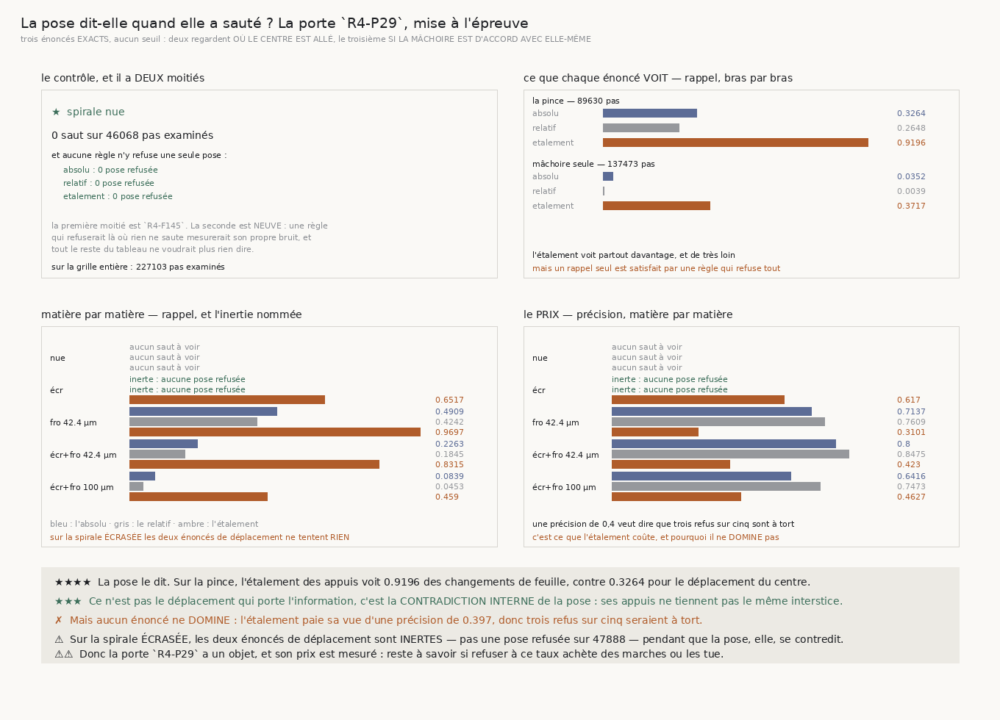

# 162 — La pose dit-elle quand elle a sauté ?

> ⭐⭐⭐⭐ **OUI, ET CE N'EST PAS LE DÉPLACEMENT QUI LE DIT.** Sur la pince de `144`, l'énoncé qui
> regarde si les appuis d'une mâchoire **tiennent le même interstice** voit **0,9196** des
> changements de feuille, là où celui qui regarde **où le centre est allé** en voit **0,3264**. Ce
> n'est pas une amélioration de réglage : ce sont deux quantités différentes, et une seule porte
> l'information.
>
> ⭐⭐⭐⭐ **LA PORTE `R4-P29` A DONC UN OBJET.** `161` concluait que les mâchoires s'accrochent au
> mauvais interstice **à la pose** ; cette tranche mesure que la pose **le dit**, par sa propre
> contradiction interne, et qu'un marcheur possède déjà ce nombre.
>
> ✗ **MAIS AUCUN ÉNONCÉ NE DOMINE, SUR AUCUN DES DEUX BRAS.** L'étalement paie sa vue d'une
> précision de **0,397** sur la pince : trois refus sur cinq seraient à tort. La victoire jointe
> que le dépôt exige depuis `147` n'est pas acquise, et la mesure le **dit** au lieu d'élire le
> moins mauvais.
>
> ⚠⚠ **ET SUR LA SPIRALE ÉCRASÉE, LES DEUX ÉNONCÉS DE DÉPLACEMENT SONT INERTES** : pas une pose
> refusée sur **47888** pas, alors que **89** pas y changent de feuille. Le centre n'y franchit
> jamais une demi-épaisseur. La pose, elle, se contredit sur **0,6517** des sauts — et c'est la
> seule matière où un énoncé **domine**.
>
> ⭐⭐⭐ **LE CONTRÔLE TIENT, ET IL A DEUX MOITIÉS.** Sur la spirale nue, **0** saut sur **46068**
> pas, et **aucune** des trois règles n'y refuse une seule pose. La première moitié est `R4-F145` ;
> la seconde est neuve, et c'est elle qui empêche une règle de mesurer son propre bruit.

## 1. Pourquoi ce fichier

`161` établit que sur la pince ce qui fait sauter un pas est le **recentrage** et non l'avance : les
mâchoires se raccrochent loin, donc elles se sont accrochées au **mauvais interstice à la pose**.
`155` ne traite ce défaut qu'au niveau des **appuis**, en rejetant un appui aberrant, jamais au
niveau de la **pose entière**. La porte `R4-P29` demande s'il existe un énoncé **exact**, sans
seuil, qui refuse une pose. Ce fichier en met **trois** à l'épreuve.

## 2. ⚠⚠ Les trois énoncés, et aucun n'est un seuil choisi

| énoncé | ce qu'il regarde | d'où il vient |
|---|---|---|
| **absolu** | le centre a bougé de plus d'une **demi-épaisseur nominale** le long de la normale | l'énoncé de `142`, `155` et `160` contre le nominal |
| **relatif** | ... de plus d'une demi-épaisseur **au-delà de la médiane** des pas de cette marche | l'énoncé de `155` pour un appui aberrant |
| **étalement** | les appuis d'une mâchoire **ne tiennent pas le même interstice** | le même énoncé, appliqué à la mâchoire **entière** |

⚠⚠ **Les deux premiers regardent où le centre est allé, le troisième si la mâchoire est d'accord
avec elle-même.** Ce sont deux axes indépendants, donc deux chances différentes de voir — et c'est
la raison d'éprouver les trois plutôt que d'en choisir un d'avance.

⚠⚠ **Les trois bornes sont strictes**, comme la demi-feuille de `160` : un étalement d'exactement
une demi-épaisseur n'a pas changé d'interstice.

## 3. ⚠⚠⚠ Le verdict est une domination JOINTE, jamais un rappel seul

Un énoncé qui refuserait **toutes** les poses aurait un rappel parfait et ne vaudrait rien ; un
énoncé qui n'en refuse **aucune** a une précision indéfinie et ne vaut rien non plus. Un énoncé ne
l'emporte donc que s'il a **à la fois** un meilleur rappel et une meilleure précision. Les deux
dégénérescences sont ainsi inéligibles **par construction**, et non par une garde ajoutée après coup.

⚠⚠⚠ **Un énoncé inerte est nommé, jamais silencieusement écarté.** Il n'a pas de précision à
défendre, donc il ne domine rien et rien ne le domine — et laissé dans la comparaison il **bloque
toute domination**, ce qui rend le verdict incapable d'être positif. La batterie a attrapé ce défaut
au premier passage.

## 4. ⭐⭐⭐⭐ La réponse, bras par bras



| bras | pas examinés | sauts | absolu | relatif | **étalement** |
|---|---|---|---|---|---|
| la pince de `144` | 89630 | 2077 | r **0,3264** · p 0,7077 | r 0,2648 · p 0,7682 | r **0,9196** · p **0,397** |
| une mâchoire avec rejet | 137473 | 5364 | r 0,0352 · p 0,6077 | r 0,0039 · p 1,0 | r **0,3717** · p 0,4897 |

**Aucun dominant sur aucun des deux bras.** Le meilleur rappel est l'étalement partout, et il le
paie à chaque fois.

⚠ La mâchoire seule voit beaucoup moins (**0,3717** contre 0,9196) : son rejet d'appuis de `155`
supprime précisément les appuis aberrants, donc l'étalement qui reste est déjà nettoyé. La règle est
en partie aveuglée par un correctif qui agit avant elle.

## 5. Matière par matière, et l'inertie

| matière | pas | sauts | absolu | relatif | **étalement** |
|---|---|---|---|---|---|
| spirale nue | 46068 | **0** | — | — | — |
| spirale écrasée | 47888 | 89 | **inerte** | **inerte** | r **0,6517** · p 0,617 |
| spirale froissée 42.4 µm | 45375 | 330 | r 0,4909 · p 0,7137 | r 0,4242 · p 0,7609 | r **0,9697** · p 0,3101 |
| spirale écrasée et froissée 42.4 µm | 44156 | 813 | r 0,2263 · p 0,8 | r 0,1845 · p 0,8475 | r **0,8315** · p 0,423 |
| spirale écrasée et froissée 100 µm | 43616 | 6209 | r 0,0839 · p 0,6416 | r 0,0453 · p 0,7473 | r **0,459** · p 0,4627 |

⭐⭐⭐⭐ **La spirale écrasée est le cas qui tranche.** Le centre n'y franchit **jamais** une
demi-épaisseur, donc les deux énoncés de déplacement ne refusent **pas une seule pose** — ils n'ont
pas raté les 89 sauts, ils n'ont **rien tenté**. La pose, elle, se contredit sur deux tiers d'entre
eux. C'est la seule matière où un énoncé **domine**, et c'est l'étalement.

⚠ Sur la grille entière, **227103** pas examinés et **7441** changements de feuille.

## 6. Ce que la mesure a corrigé dans cette tranche même

- ⚠⚠⚠ **Un verdict incapable d'être positif.** Exiger qu'un énoncé domine *tous* les autres rendait
  toute domination impossible dès qu'un énoncé était inerte. Les inertes sont désormais **nommés**
  et écartés : une abstention n'est pas une égalité.
- ⚠⚠⚠ **Une sonde qui ne mordait pas a révélé un trou réel.** Elle frappait la fonction
  d'agrégation, dont **rien** n'assertait qu'elle recalcule les taux depuis les comptes plutôt que
  de moyenner des taux — alors que c'est elle qui produit les chiffres publiés ici. Une garde qui ne
  couvre pas le producteur du chiffre publié ne protège rien.
- ⚠⚠⚠ **La figure écrivait deux nombres pour une mesure**, `0.920` dans son tableau et `0.9196`
  dans sa bande, parce qu'elle ré-arrondissait ce que le producteur avait déjà arrondi. Seul le
  second est retrouvable par `verifier_chiffres`. Trouvé à l'œil, pas par la batterie.

## 7. Les sondes

Huit sondes sur le module, chacune vérifiée **en cassant le code** : le contrôle qui cesse de
regarder les refus ; la domination réduite au rappel ; un énoncé inerte redevenu concurrent ; un
rappel de groupe moyenné au lieu d'être recalculé ; un taux indéfini rendu à zéro ; l'étalement qui
se met à regarder le déplacement ; sa borne qui cesse d'être stricte ; une pose sans étalement
lisible comptée comme un refus. Plus, sur la figure, le ré-arrondi des décimales du producteur.

## 8. Ce que cette tranche laisse

- **Le prix n'est pas encore payé.** On sait que la pose dit qu'elle a sauté, et à quel taux ; on ne
  sait **pas** si refuser à ce taux achète des marches ou les tue. C'est une victoire **jointe** à
  mesurer — plus de réussites et aucune perdue sur des départs appariés — et c'est la tranche
  suivante.
- **La mâchoire seule est aveuglée par `155`.** Son rejet d'appuis retire ce que l'étalement
  regarderait. Mesurer l'étalement **avant** le rejet est une question à part.
- **`134` (le vrillage)** n'est toujours pas clos : `R4-F79` mesure sur le vrai rouleau que le
  penchant est plus **axial** qu'azimutal, 0,334 contre 0,193.

## 9. Reproduire

```
uv run python src/nappe/la_pose_dit_elle_quand_elle_a_saute.py --verifier
uv run python src/nappe/la_pose_dit_elle_quand_elle_a_saute.py \
    --json docs/mesures/la_pose_dit_elle_quand_elle_a_saute.json
uv run python src/figures/figure_la_pose_dit_elle_quand_elle_a_saute.py --verifier
```
