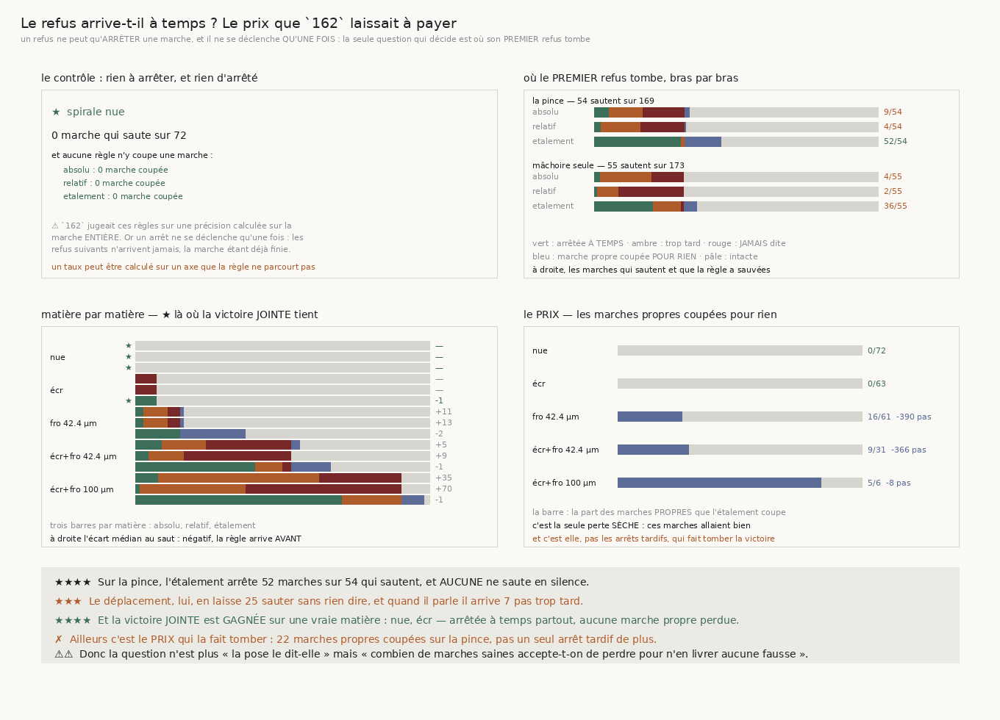

# 163 — Le refus arrive-t-il à temps ?

> ⭐⭐⭐⭐ **OUI, ET IL N'EST JAMAIS MUET.** Sur la pince de `144`, le premier refus de l'étalement
> arrête **52** des **54** marches qui changent de feuille **avant ou sur** le pas fautif, avec
> **zéro** panne silencieuse et un écart médian de **−2** pas. Les deux énoncés de déplacement, eux,
> laissent **25** et **26** marches sauter **sans rien dire**, et quand ils parlent ils arrivent
> **+7** et **+23** pas trop tard.
>
> ⭐⭐⭐⭐ **ET LA VICTOIRE JOINTE EST GAGNÉE SUR UNE VRAIE MATIÈRE.** Sur la spirale **écrasée** :
> **5** marches arrêtées à temps, **0** trop tard, **0** muette, **0** marche propre perdue. Les
> deux autres énoncés y sont muets sur les **5** sauts. C'est la première fois de la campagne qu'une
> règle d'arrêt tient la victoire jointe sur autre chose que le contrôle.
>
> ✗ **AILLEURS, C'EST LE PRIX QUI LA FAIT TOMBER, PAS LES ARRÊTS TARDIFS.** Sur la pince, **22**
> marches propres sont coupées pour rien, perdant une médiane de **353** pas. Sur la spirale
> froissée à 42,4 µm, l'étalement est **parfait** du côté des sauts — 11 à temps, 0 tard, 0 muette —
> et coupe pourtant **16** marches saines.
>
> ⚠⚠⚠ **ET CETTE TRANCHE CORRIGE LA LECTURE DE `162`.** La précision de **0,397** y était calculée
> sur la marche **entière**. Or un refus ne peut qu'**arrêter** : il ne se déclenche qu'**une
> fois**, donc les refus suivants **n'arrivent jamais**. Un taux peut être calculé sur un axe que
> la règle ne parcourt pas.

## 1. Pourquoi ce fichier

`162` établit que la pose dit qu'elle a sauté — l'étalement de ses appuis voit **0,9196** des
changements de feuille — et conclut qu'aucun énoncé ne domine, parce que la précision tombe à
**0,397**. Mais un refus ne **rallonge** jamais une marche : il l'arrête, et une seule fois. La
précision de `162` compte donc tous les refus d'une marche entière, dont la quasi-totalité
n'arriverait jamais dans un marcheur qui s'arrête au premier.

⚠⚠⚠ **C'est le cousin de « moyenner sur l'axe où la différence vit »** : ici, compter sur un axe que
rien ne traverse. La seule question qui décide d'une règle d'arrêt est **où son premier refus
tombe**.

## 2. ⚠⚠ Cinq cas, exhaustifs et exclusifs, sans aucun seuil

Pour une marche et une règle, on compare deux indices que la fixture et le marcheur produisent
**séparément** : le premier pas qui change de feuille, et le premier refus.

| cas | ce qu'il veut dire |
|---|---|
| **à temps** | le refus tombe au plus tard **sur** le pas qui saute : tout ce qui est livré est propre |
| **trop tard** | il tombe après : la marche a déjà livré du faux |
| **jamais** | la marche saute et rien ne le dit : la panne **silencieuse** |
| **arrêtée pour rien** | la marche ne sautait pas et le refus la coupe : la seule perte **sèche** |
| **intacte** | elle ne sautait pas et rien ne l'arrête |

⚠⚠ **L'inégalité est LARGE, et c'est le sens qui rend la revendication plus dure** : un refus
tombant exactement sur le pas qui saute arrête **avant** que ce pas ne soit livré. Au sens strict,
un arrêt parfaitement placé aurait été compté « trop tard ».

⚠⚠ **La victoire est JOINTE**, comme depuis `147`, et elle a **trois** moitiés : aucun arrêt tardif,
aucune panne silencieuse, aucune marche propre perdue. Chacune prise seule est satisfaite par une
règle inutile — celle qui ne se déclenche **jamais** ne perd aucune marche propre.

## 3. ⭐⭐⭐⭐ La réponse, bras par bras



| bras | énoncé | à temps | trop tard | **jamais** | pour rien | écart médian |
|---|---|---|---|---|---|---|
| la pince de `144` (54 sautent sur 169) | absolu | 9 | 20 | **25** | 3 | **+7** |
| | relatif | 4 | 24 | **26** | 1 | **+23** |
| | **étalement** | **52** | 2 | **0** | 22 | **-2** |
| une mâchoire avec rejet (55 sautent sur 173) | absolu | 4 | 31 | **20** | 0 | **+35** |
| | relatif | 2 | 13 | **40** | 0 | **+157** |
| | **étalement** | **36** | 17 | 2 | 8 | **0** |

⭐⭐ **Le fait qui sépare les deux axes est la panne silencieuse.** Une règle qui arrive trop tard a
au moins parlé ; une règle muette laisse le marcheur livrer du faux en croyant tout aller bien. Le
déplacement se tait 25 et 26 fois sur la pince, l'étalement **jamais**.

⚠ La mâchoire seule reste plus faible, comme `162` l'annonçait : le rejet d'appuis de `155` agit
**avant** et retire précisément ce que l'étalement regarderait.

## 4. Matière par matière — et où la victoire tient

| matière | marches qui sautent | étalement : à temps · tard · jamais · pour rien | écart | pas perdus (médiane) |
|---|---|---|---|---|
| spirale nue | 0 sur 72 | 0 · 0 · 0 · 0 | — | — |
| **spirale écrasée** | 5 sur 68 | **5 · 0 · 0 · 0** | **-1** | — |
| spirale froissée 42.4 µm | 11 sur 72 | **11 · 0 · 0** · 16 | **-2** | 390 |
| spirale écrasée et froissée 42.4 µm | 35 sur 66 | 27 · 6 · 2 · 9 | **-1** | 366 |
| spirale écrasée et froissée 100 µm | 58 sur 64 | 45 · 13 · 0 · 5 | **-1** | 8 |

**Où la victoire jointe tient** : l'absolu et le relatif sur la **spirale nue** seulement ;
l'étalement sur la **spirale nue et la spirale écrasée**.

⭐⭐⭐⭐ **La spirale écrasée est le premier gain réel de la campagne sur ce terrain.** Les deux
énoncés de déplacement y sont **muets sur les cinq sauts** — `162` mesurait déjà qu'ils n'y refusent
pas une seule pose — pendant que l'étalement les attrape tous les cinq, un pas avant, sans couper
une seule marche saine.

⚠ **L'écart médian est négatif sur toutes les matières qui sautent** : −1 ou −2. La pose se
contredit **avant** de changer de feuille, pas pendant. C'est ce qui fait d'elle un avertissement et
non un constat.

## 5. ⚠ Ce que cette tranche laisse, et c'est une question de politique

Sur la spirale froissée à 42,4 µm, l'étalement est **parfait** du côté des sauts et coupe pourtant
**16** marches saines sur 61. La question n'est donc plus « la pose le dit-elle » — elle le dit —
mais **« combien de marches saines accepte-t-on de perdre pour n'en livrer aucune fausse »**. C'est
un arbitrage, pas une mesure, et il appartient à ce qu'on veut faire du déroulage : une sortie courte
et sûre, ou longue et douteuse.

⚠⚠ Et il reste un écart non expliqué : l'étalement coupe **16** marches saines sur la froissée à
42,4 µm mais seulement **5** sur celle du rouleau, qui est pourtant plus dure. Rien dans cette
tranche ne dit pourquoi.

## 6. Les sondes

Sept sondes, chacune vérifiée **en cassant le code** : « à temps » devenu une inégalité stricte ; un
refus absent traité comme un refus au pas zéro ; la victoire qui oublie les marches propres perdues ;
celle qui oublie les pannes silencieuses ; les pas perdus comptés aussi sur une marche qui saute ; le
contrôle qui cesse de regarder les marches coupées ; et un premier refus absent publié comme zéro.

⚠⚠⚠ **Et une sonde a révélé un vrai défaut en butant sur son ancre** : le prédicat de victoire était
écrit **deux fois**, dans le résumé d'une case et dans le cumul d'un groupe. Deux calculs d'un même
prédicat sont deux occasions de diverger. Le symptôme — une ancre qui apparaît deux fois — **était**
le défaut. Il est dit une seule fois désormais.

## 7. Reproduire

```
uv run python src/nappe/le_refus_arrive_t_il_a_temps.py --verifier
uv run python src/nappe/le_refus_arrive_t_il_a_temps.py \
    --json docs/mesures/le_refus_arrive_t_il_a_temps.json
uv run python src/figures/figure_le_refus_arrive_t_il_a_temps.py --verifier
```
