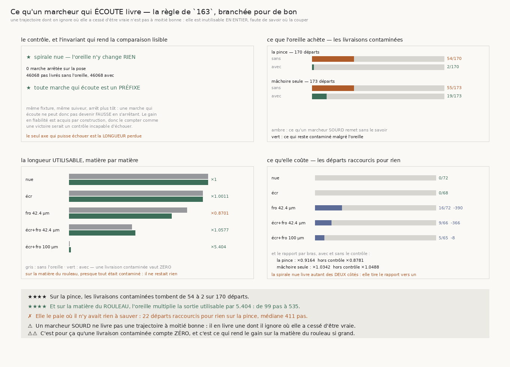

# 164 — Ce qu'un marcheur qui écoute livre

> ⭐⭐⭐⭐ **SUR LA MATIÈRE DU ROULEAU, L'OREILLE MULTIPLIE LA SORTIE UTILISABLE PAR 5,404** — de
> **99** pas à **535**. Parce que sans elle, **58** livraisons sur **65** sont contaminées, et une
> trajectoire dont on ignore où elle a cessé d'être vraie ne vaut **rien** : rien ne dit où la
> couper.
>
> ⭐⭐⭐⭐ **ET LE COÛT Y EST DE HUIT PAS.** Cinq départs sont raccourcis pour rien, d'une médiane de
> **8** pas. Le gain n'est donc pas un arbitrage sur cette matière : il est presque gratuit.
>
> ⭐⭐⭐ **SUR LA PINCE, LES LIVRAISONS CONTAMINÉES TOMBENT DE 54 À 2** sur 170 départs. Sur toute la
> grille, de **109** à **21** sur **343**.
>
> ✗ **MAIS LA LONGUEUR TOTALE EN PÂTIT LÀ OÙ IL N'Y AVAIT RIEN À SAUVER** : **22** départs
> raccourcis pour rien sur la pince, médiane **353** pas, et le rapport y tombe à **×0,8781** hors
> contrôle. C'est la spirale froissée à 42,4 µm qui paie — **16** marches saines coupées, ×**0,8701**.
>
> ⭐⭐⭐ **LE CONTRÔLE ET L'INVARIANT TIENNENT.** Sur la spirale nue l'oreille ne change **rien** :
> **0** marche arrêtée, **46068** pas livrés des deux côtés. Et **toute marche qui écoute est un
> préfixe** de celle qui n'écoute pas.

## 1. Pourquoi ce fichier

`162` mesure que la pose **dit** quand elle a sauté, `163` que son premier refus tombe un à deux pas
**avant** le saut. Les deux mesurent la règle sur des marches qui **n'écoutent pas** : elles lisent
des tableaux enregistrés. Ici la marche **s'arrête** dessus, pour la première fois — `suivre` prend
un paramètre `refuser_la_pose` — et la question devient celle du livrable.

⚠⚠⚠ **Et c'est la question du graal sous sa forme utile.** Un marcheur qui n'écoute pas remet une
trajectoire dont il ignore où elle a cessé d'être vraie : `163` en mesure **25** qui sautent sans que
rien ne le dise, sur la seule pince. Une telle trajectoire n'est pas à moitié bonne, elle est
**inutilisable en entier**. Un marcheur qui écoute en remet une plus courte, et **sûre**.

## 2. ⚠⚠ Deux lectures de la longueur, et il faut les deux

La longueur **brute** compte tous les pas livrés. La longueur **utilisable** ne compte que ceux d'une
livraison dont **rien ne dit** qu'elle a sauté. La seconde répond à la question ; la première empêche
de croire que l'arrêt est gratuit.

⚠⚠ **« Fiable » ne veut pas dire « vraie », il veut dire que rien ne dit le contraire.** C'est
exactement ce dont un livrable dispose : la fixture sait si la marche a sauté, le marcheur non. La
distinction est publiée séparément pour qu'on ne confonde jamais ce qu'on sait avec ce qu'il saurait.

## 3. ⚠⚠⚠ Un gain acquis par construction n'est pas une victoire

Une marche qui écoute est un **préfixe** de la même marche qui n'écoute pas — même fixture, même
suiveur, arrêt plus tôt. Elle ne peut donc **jamais** devenir fausse en s'arrêtant : le gain en
fiabilité est acquis par construction, et le compter comme une victoire serait un contrôle
**incapable d'échouer**. Ce qui peut échouer, et qu'il faut donc compter, c'est la **longueur perdue**
sur les départs qui allaient bien.

⚠⚠ L'invariant est **asserté** plutôt que supposé : s'il tombe, l'arrêt a changé la marche au lieu de
la couper, et toute la comparaison serait à refaire.

## 4. ⭐⭐⭐⭐ Ce que l'oreille achète



| matière | contaminées **sans** | contaminées **avec** | utiles sans | utiles avec | **×** | raccourcis pour rien |
|---|---|---|---|---|---|---|
| spirale nue | 0 / 72 | 0 / 72 | 46068 | 46068 | **1,0** | 0 |
| spirale écrasée | 5 / 68 | **0** / 68 | 44356 | 44406 | 1,0011 | **0** |
| spirale froissée 42.4 µm | 11 / 72 | **0** / 72 | 39151 | 34064 | **0,8701** | 16 (médiane 390) |
| spirale écrasée et froissée 42.4 µm | 35 / 66 | 8 / 66 | 20798 | 21999 | 1,0577 | 9 (médiane 366) |
| **spirale écrasée et froissée 100 µm** | 58 / 65 | 13 / 65 | **99** | **535** | **5,404** | 5 (médiane **8**) |

⭐⭐⭐⭐ **La matière du rouleau est le cas qui tranche, et c'est celle qui compte.** Sans l'oreille il
ne reste **99** pas exploitables sur toute la grille de cette matière ; avec elle, **535**. Le coût y
est de **8** pas médians sur cinq départs — négligeable devant ce qu'il rachète.

⚠ **Sur la spirale écrasée, le gain est pur** : **5** livraisons contaminées deviennent **0**, et
**aucune** marche saine n'est coupée. C'est exactement ce que `163` annonçait — la victoire jointe y
était déjà gagnée.

| bras | contaminées | utiles | **×** | **× hors contrôle** | raccourcis |
|---|---|---|---|---|---|
| la pince de `144` | 54 → **2** / 170 | 72546 → 66480 | 0,9164 | **0,8781** | 22 (médiane 353) |
| une mâchoire avec rejet | 55 → 19 / 173 | 77926 → 80592 | 1,0342 | **1,0488** | 8 (médiane 202) |

## 5. ⚠⚠⚠ Un rapport qui contient son propre contrôle est tiré vers un

La spirale nue livre **46068** pas **identiques des deux côtés** — c'est tout l'objet du contrôle —
donc elle pèse au numérateur **et** au dénominateur sans jamais pouvoir les séparer. Un rapport par
bras qui l'inclut mesure surtout la taille du contrôle : il passe de **0,9164** à **0,8781** une fois
celui-ci retiré.

⚠⚠ Le contrôle n'est pas **retiré de la mesure** — il reste publié, et c'est lui qui autorise à lire
le reste. Ce qui est retiré, c'est sa contribution à un **rapport** qu'il ne peut que diluer.

## 6. Ce que la construction a corrigé

- ⚠⚠⚠ **La figure affichait une médiane sous le mauvais titre.** Le panneau du coût montrait
  « écr : 0/68 **−596** » : zéro marche coupée pour rien, et pourtant 596 pas perdus. La médiane
  portait sur **tous** les arrêts, y compris ceux qui **sauvaient** la marche — or ce qu'une marche
  sauvée abandonne n'est pas une perte. Deux médianes désormais, pour deux questions. Trouvé à
  l'œil, pas par la batterie.
- ⚠⚠⚠ **La seconde moitié du contrôle n'était jamais décisive** : sa fixture déclarait *aussi* un
  arrêt sur la pose, donc la première moitié suffisait. Il fallait un cas où la longueur change
  **sans qu'aucun arrêt ne soit déclaré** — ce qui voudrait dire que l'oreille a changé la marche
  autrement qu'en la coupant.
- ⚠⚠⚠ **La batterie ne vérifiait jamais sur données réelles que la règle arrête.** Le seul contrôle
  réel portait sur la spirale nue, où rien ne se déclenche : **débrancher l'arrêt n'y changeait
  rien**, et la sonde par cassure passait au vert.

## 7. Les sondes

Huit sondes, chacune vérifiée **en cassant le code** : la longueur utilisable qui compte les
livraisons contaminées ; une livraison arrêtée trop tard comptée utilisable ; l'invariant de préfixe
câblé à vrai ; le contrôle qui cesse de comparer les longueurs ; le rapport qui moyenne des rapports
de cases ; l'arrêt deviné au lieu d'être lu dans la raison ; la règle qui cesse d'arrêter ; et le
rapport hors contrôle qui ré-inclut le contrôle.

⚠ Une sonde a **levé** au lieu de rendre faux — sa fixture n'avait aucun pas utilisable sans
l'oreille, donc le rapport n'existait pas. C'est le piège de `157`, payé une fois de plus dans la
même journée : lire avec `.get()`, et dimensionner la fixture pour que la quantité comparée existe.

## 8. Ce que cette tranche laisse

- **L'arbitrage est tranché sur la matière qui compte, pas ailleurs.** Sur le rouleau le gain est
  ×5,404 pour 8 pas ; sur la froissée à 42,4 µm il coûte 13 % de longueur pour 11 livraisons
  sauvées. Ce n'est pas la même décision.
- **Le marcheur s'arrête, il ne se reprend pas.** Une pose refusée pourrait être **rejouée**
  ailleurs plutôt que d'arrêter la marche. Rien ici ne l'essaie.
- **`134` (le vrillage)** n'est toujours pas clos.

## 9. Reproduire

```
uv run python src/nappe/ce_quun_marcheur_qui_ecoute_livre.py --verifier
uv run python src/nappe/ce_quun_marcheur_qui_ecoute_livre.py \
    --json docs/mesures/ce_quun_marcheur_qui_ecoute_livre.json
uv run python src/figures/figure_ce_quun_marcheur_qui_ecoute_livre.py --verifier
```
