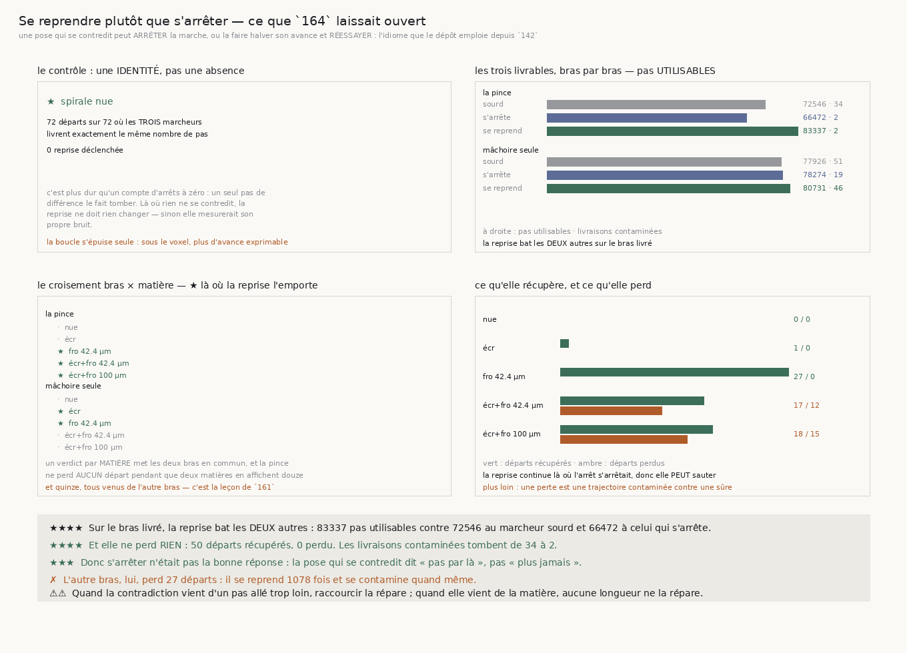

# 165 — Se reprendre plutôt que s'arrêter

> ⭐⭐⭐⭐ **S'ARRÊTER N'ÉTAIT PAS LA BONNE RÉPONSE.** Sur le bras livré, un marcheur qui **halve son
> avance et réessaie** livre **83337** pas utilisables, contre **72546** au marcheur sourd et
> **66472** à celui qui s'arrête. Il bat donc les **deux** autres, et il ne perd **rien** : **50**
> départs récupérés, **0** perdu, et les livraisons contaminées tombent de **34** à **2**.
>
> ⭐⭐⭐⭐ **LA POSE QUI SE CONTREDIT DIT « PAS PAR LÀ », PAS « PLUS JAMAIS ».** Sur les trois matières
> qui se contredisent, la reprise bat à la fois le sourd et l'arrêt sans perdre un seul départ : sur
> la matière du rouleau, **44** pas utilisables deviennent **382**.
>
> ✗ **L'AUTRE BRAS PERD.** La mâchoire seule se reprend **1078** fois, perd **27** départs et reste
> contaminée **46** fois contre 19 en s'arrêtant. Ce n'est pas la même décision selon l'instrument.
>
> ⚠⚠ **ET UN VERDICT PAR MATIÈRE MET LES DEUX BRAS EN COMMUN.** La pince ne perd **aucun** départ
> pendant que deux matières en affichent **douze** et **quinze**, tous venus de l'autre bras. Le
> croisement bras × matière est donc publié — c'est la leçon de `161`, et sans lui la victoire de la
> pince sur la matière du rouleau serait **invisible**.
>
> ⭐⭐⭐ **LE CONTRÔLE EST UNE IDENTITÉ.** Sur la spirale nue, **72** départs sur **72** où les
> **trois** marcheurs livrent exactement le même nombre de pas, et **0** reprise. C'est plus dur
> qu'un compte d'arrêts à zéro : un seul pas de différence le fait tomber.

## 1. Pourquoi ce fichier

`164` mesure qu'un marcheur qui **s'arrête** sur une pose qui se contredit livre cinq fois plus
d'utilisable sur la matière du rouleau — mais il **s'arrête**, et il paie **22** départs raccourcis
pour rien sur la pince. Or ce dépôt a déjà son idiome pour une pose qui ne va pas : **halver l'avance
et réessayer**, ce que la contrainte de `142` fait depuis toujours.

L'hypothèse est que les mâchoires s'accrochent au mauvais interstice **parce que le pas est allé trop
loin** ; un pas plus court atterrirait dans le bon.

⚠⚠ **La boucle s'épuise d'elle-même** : `suivre` abandonne quand l'avance tombe sous le voxel — en
dessous, le lecteur ne peut plus exprimer le déplacement. La reprise ne peut donc pas tourner sans
fin, et le compte des reprises **épuisées** est publié à part.

## 2. ⚠⚠⚠ La reprise peut perdre, et c'est ce qui rend la victoire mesurable

Elle continue là où l'arrêt s'était arrêté, donc elle peut sauter plus loin : `162` mesure un rappel
de **0,9196**, pas de 1. Une reprise qui livre une trajectoire **contaminée** là où l'arrêt en livrait
une courte et **sûre** est une perte.

⚠⚠ **La victoire est donc jointe** : récupérer au moins un départ **et** n'en perdre aucun. Chaque
moitié prise seule est satisfaite par un marcheur **inutile** — celui qui ne se reprend jamais ne
perd aucun départ.

## 3. ⭐⭐⭐⭐ La réponse



| bras | sourd | s'arrête | **se reprend** | récupérés | **perdus** |
|---|---|---|---|---|---|
| la pince de `144` | 72546 · 34 | 66472 · 2 | **83337 · 2** | **50** | **0** |
| une mâchoire avec rejet | 77926 · 51 | 78274 · 19 | 80731 · 46 | 13 | **27** |

*(pas utilisables · livraisons contaminées)*

## 4. Le croisement bras × matière

| la pince de `144` | sourd | s'arrête | **se reprend** | récup / perd | reprises (épuisées) |
|---|---|---|---|---|---|
| spirale nue | 22796 · 0 | 22796 · 0 | 22796 · 0 | 0 / 0 | 0 |
| spirale écrasée | 20488 · 0 | 20488 · 0 | 20488 · 0 | 0 / 0 | 0 |
| **spirale froissée 42.4 µm** | 16397 · 10 | 12958 · 0 | **22218 · 0** | 20 / **0** | 119 (3) |
| **spirale écrasée et froissée 42.4 µm** | 12821 · 6 | 10095 · 0 | **17453 · 0** | 15 / **0** | 71 (0) |
| **spirale écrasée et froissée 100 µm** | 44 · 18 | 135 · 2 | **382 · 2** | 15 / **0** | 221 (21) |

⭐⭐⭐⭐ **Sur les trois matières qui se contredisent, la reprise bat le sourd ET l'arrêt, sans perdre
un seul départ.** Sur celle du rouleau elle multiplie par plus de huit ce que le marcheur sourd
livrait d'exploitable.

| une mâchoire avec rejet | sourd | s'arrête | **se reprend** | récup / perd | reprises (épuisées) |
|---|---|---|---|---|---|
| spirale nue | 23272 · 0 | 23272 · 0 | 23272 · 0 | 0 / 0 | 0 |
| spirale écrasée | 23868 · 1 | 23918 · 0 | **24506 · 0** | 1 / 0 | 1 (0) |
| spirale froissée 42.4 µm | 22754 · 1 | 21106 · 0 | **23407 · 0** | 7 / 0 | 9 (0) |
| spirale écrasée et froissée 42.4 µm | 7977 · 22 | 9795 · 8 | 9482 · 20 | 2 / **12** | 114 (0) |
| spirale écrasée et froissée 100 µm | 55 · 27 | 183 · 11 | 64 · 26 | 3 / **15** | 954 (27) |

⚠ **La mâchoire seule se reprend quatre fois plus et perd quand même.** Sur la matière du rouleau
elle halve **954** fois, s'épuise **27** fois, et livre **64** pas utilisables là où s'arrêter en
livrait **183**. Le rejet d'appuis de `155` lui retire déjà ce que l'étalement regarderait — `162`
le mesurait — donc sa reprise tire sur un signal appauvri.

## 5. ⚠⚠ Ce que cela dit de la nature du défaut

Quand la contradiction vient d'un **pas allé trop loin**, raccourcir la répare : c'est le cas des
deux matières froissées à 42,4 µm, où la reprise ramène la contamination à **zéro** tout en dépassant
le marcheur sourd. Quand elle vient de **la matière elle-même**, aucune longueur de pas ne la répare :
sur celle du rouleau la pince s'épuise **21** fois et la mâchoire seule **27**.

⭐⭐ C'est une distinction neuve, et elle est mesurée plutôt que supposée : le même énoncé, appliqué au
même endroit, guérit sur une matière et s'épuise sur l'autre.

## 6. Les sondes

Six sondes, chacune vérifiée **en cassant le code** : une livraison contaminée qui vaut ses pas au
lieu de zéro ; la victoire qui oublie les départs perdus ; celle qui se contente de n'avoir rien
perdu ; le contrôle qui se contente de compter les reprises à zéro ; une reprise épuisée confondue
avec une marche qui bute sur la matière ; et la reprise qui cesse de halver.

⚠⚠⚠ **Trois contrôles ne mordaient pas, et les trois répétaient des trous que `164` m'avait déjà
appris.** Une moitié de contrôle jamais décisive, parce que sa fixture déclarait aussi une reprise.
Une batterie qui ne vérifiait **jamais sur données réelles** que la reprise s'exécute — la spirale nue
ne déclenchant rien, débrancher le halving n'y changeait rien. Et un contrôle qui ne **séparait pas**
une reprise qui halve d'une reprise qui se contente d'accepter : les deux livrent 905 pas sur la
matière moyenne. Il a fallu la matière du rouleau, où la reprise s'épuise, pour que la différence se
voie.

## 7. Ce que cette tranche laisse

- **La reprise est bornée par le voxel, pas par le bon sens.** Elle halve jusqu'à ne plus pouvoir
  exprimer son avance. Rien ne dit qu'un autre nombre de reprises serait meilleur, et le chercher
  serait choisir un seuil.
- **Une pose refusée est réessayée au MÊME endroit, plus court.** Elle pourrait l'être **ailleurs**
  — une autre direction, une autre normale. Rien ici ne l'essaie.
- **`134` (le vrillage)** n'est toujours pas clos.

## 8. Reproduire

```
uv run python src/nappe/se_reprendre_plutot_que_sarreter.py --verifier
uv run python src/nappe/se_reprendre_plutot_que_sarreter.py \
    --json docs/mesures/se_reprendre_plutot_que_sarreter.json
uv run python src/figures/figure_se_reprendre_plutot_que_sarreter.py --verifier
```
