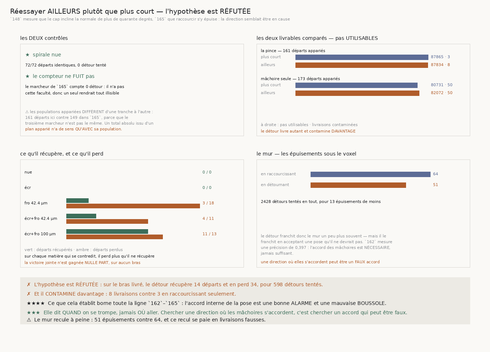

# 166 — Réessayer ailleurs plutôt que plus court

> ✗ **L'HYPOTHÈSE EST RÉFUTÉE.** Sur le bras livré, réessayer le long de l'autre normale récupère
> **14** départs et en **perd 34**, pour **598** détours tentés. Et il **contamine davantage** :
> **8** livraisons contre **3** en raccourcissant seulement. La victoire jointe n'est gagnée **nulle
> part**, sur aucun bras et sur aucune matière.
>
> ⭐⭐⭐⭐ **ET CE QUE CELA ÉTABLIT BORNE TOUTE LA LIGNE `162`–`165` : l'accord interne de la pose est
> une bonne ALARME et une mauvaise BOUSSOLE.** Elle dit **quand** on se trompe, jamais **où** aller.
> Chercher une direction où les mâchoires s'accordent, c'est chercher un accord qui peut être
> **faux** — `162` mesure une précision de **0,397**, donc l'accord est nécessaire et jamais
> suffisant.
>
> ⚠ **Le mur recule à peine, et ce recul se paie** : **51** épuisements en détournant contre **64**
> en raccourcissant. Le détour franchit donc le mur un peu plus souvent — en acceptant une pose
> qu'il ne devrait pas.
>
> ⭐⭐⭐ **LES DEUX CONTRÔLES TIENNENT.** Sur la spirale nue, **72** départs sur **72** identiques et
> **0** détour tenté. Et le marcheur de `165` compte **0** détour : il n'a pas cette faculté, donc
> un seul rendrait toute la comparaison illisible.

## 1. Pourquoi ce fichier, et deux faits établis le désignaient

`165` mesure que raccourcir le pas répare une pose qui se contredit **quand la contradiction vient
d'un pas allé trop loin**, et qu'elle **s'épuise** sur la matière du rouleau. Or `148` mesure que le
cap y incline la normale de plus de quarante degrés : la mâchoire cherche son interstice **de
travers**, et aucune longueur de pas ne corrige une **direction**.

⭐⭐⭐ **L'autre direction n'est pas choisie, elle est déjà là.** `suivre` connaît deux normales : celle
que le **cap** a décidée, et la dernière que la **matière** a rendue. Le mode `pose_sur_la_lecture`
emploie la seconde en permanence ; ici on emploie celle que le mode **n'emploie pas**, et seulement
quand la pose se contredit. Deux directions exactes, **aucun angle choisi**.

⚠⚠ **L'ordre est délibéré** : d'abord l'autre direction **au même pas**, seulement ensuite
raccourcir. Raccourcir d'abord jetterait de la longueur pour un défaut qui n'en vient pas.

## 2. ⭐⭐⭐⭐ La réponse, et elle est négative



| bras | départs appariés | sourd | plus court | **ailleurs** | récupérés | **perdus** | détours |
|---|---|---|---|---|---|---|---|
| la pince de `144` | 161 | 72546 · 46 | 87865 · **3** | 87834 · **8** | 14 | **34** | 598 |
| une mâchoire avec rejet | 173 | 77926 · 55 | 80731 · 50 | 82072 · 50 | 4 | **8** | 1830 |

*(pas utilisables · livraisons contaminées)*

| matière | récupérés / perdus | détours |
|---|---|---|
| spirale nue | 0 / 0 | **0** |
| spirale écrasée | 0 / 0 | 5 |
| spirale froissée 42.4 µm | 3 / **18** | 108 |
| spirale écrasée et froissée 42.4 µm | 4 / **11** | 201 |
| spirale écrasée et froissée 100 µm | 11 / **13** | 2114 |

Sur **chaque** matière qui se contredit, le détour perd plus qu'il ne récupère.

## 3. ⚠⚠ Le mur recule à peine, et le recul se paie

| | épuisements sous le voxel |
|---|---|
| en raccourcissant | **64** |
| en détournant | **51** |

**2428** détours tentés pour **13** épuisements de moins. Et le détour franchit ce mur en acceptant
une pose que le raccourcissement refusait — d'où les livraisons contaminées qui montent.

⭐⭐ **C'est le mécanisme, et il découle d'un fait déjà mesuré.** `162` publie une précision de
**0,397** : l'accord des mâchoires est **nécessaire** et jamais **suffisant**. Une direction où elles
s'accordent peut donc être un **faux accord**, et le détour le cherche précisément.

## 4. ⚠⚠⚠ Un piège de lecture qu'il faut nommer

Le même marcheur — celui qui raccourcit — livre **87865** pas utilisables ici et **83337** dans
`165`. Ce n'est pas une contradiction : les **populations appariées diffèrent**, **161** départs ici
contre **149** là-bas, parce que le troisième marcheur n'est pas le même et qu'un départ n'est
apparié que si les **trois** marcheurs sont décidables.

⚠⚠ **Un total absolu issu d'un plan apparié n'a de sens qu'avec sa population.** Les deux tranches
sont chacune valides — leurs comparaisons portent sur leurs propres départs — mais leurs totaux ne
se comparent pas entre eux. La population est donc écrite à côté de chaque total, et la figure la
porte aussi.

⚠ On le voit dans le compte du marcheur **sourd** : **72546** pas utilisables des deux côtés, mais
**46** livraisons contaminées ici contre **34** dans `165`. Les douze départs supplémentaires sont
tous contaminés, donc ils valent **zéro** et ne déplacent pas le total.

## 5. Les sondes

Huit sondes, sept vérifiées **en cassant le code** : la comparaison faite contre le sourd au lieu de
`165` ; la victoire qui oublie les départs perdus ; celle qui se contente de n'avoir rien perdu ; le
contrôle qui cesse de regarder les détours tentés ; celui qui cesse de regarder les départs
identiques ; le compteur de détours qui fuit vers l'autre marcheur ; et le détour qui emploie la même
normale que le mode.

⚠⚠⚠ **Et la huitième est déclarée NON ATTRAPABLE, avec sa raison.** Elle fait halver le détour en
plus de le détourner. J'avais écrit contre elle un contrôle nommé « le détour garde le **même** pas »
qui comparait les raccourcissements — et la **mesure** a montré que la cassure rend ce compte plus
**bas** encore (11 → 5 sain, 11 → **0** cassé), donc l'assertion passait des **deux** côtés. Son
libellé revendiquait ce qu'elle ne prouvait pas.

⚠⚠ **La limite est nommée plutôt que contournée** : une batterie de bout en bout **ne peut pas**
distinguer un détour pris à pleine avance d'un détour pris à demi-avance, parce que les deux
produisent des marches également plausibles — seule la comparaison de **deux versions du code** les
sépare, et une batterie n'en a qu'une. Le contrôle asserte donc ce qui est réellement observable : un
détour **épargne** des raccourcissements.

## 6. Ce que cette tranche laisse

- **La direction n'est pas le levier**, c'est mesuré. Il reste que sur la matière du rouleau la
  reprise s'épuise **51** à **64** fois : il existe une contradiction que ni la longueur ni la
  direction ne répare, et rien ne dit encore ce qu'elle est.
- **L'alarme n'est pas une boussole**, et aucune tranche n'a cherché de boussole ailleurs.
- **`134` (le vrillage)** n'est toujours pas clos.

## 7. Reproduire

```
uv run python src/nappe/reessayer_ailleurs_plutot_que_plus_court.py --verifier
uv run python src/nappe/reessayer_ailleurs_plutot_que_plus_court.py \
    --json docs/mesures/reessayer_ailleurs_plutot_que_plus_court.json
uv run python src/figures/figure_reessayer_ailleurs_plutot_que_plus_court.py --verifier
```
