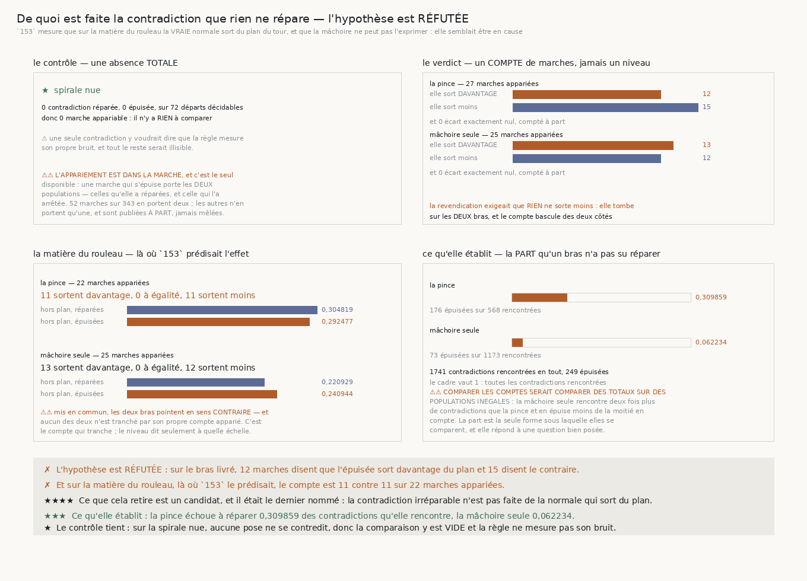

# 167 — De quoi est faite la contradiction que rien ne répare

> ✗ **L'HYPOTHÈSE EST RÉFUTÉE.** Sur le bras livré, **12** marches appariées disent que la
> contradiction irréparable sort davantage du plan du tour et **15** disent le contraire, sur
> **27**. Sur la mâchoire seule, **13** contre **12**, sur **25**. La victoire jointe n'est gagnée
> **nulle part**, sur aucun bras et sur aucune matière.
>
> ✗ **Et elle est réfutée là précisément où `153` la prédisait.** Sur la matière du rouleau, la
> pince rend **11** marches contre **11**, à égalité exacte sur **22** appariées ; la mâchoire seule
> **13** contre **12** sur **25**. C'est aussi près d'un tirage à pile ou face que l'arithmétique le
> permet.
>
> ⭐⭐⭐⭐ **CE QUE CELA RETIRE EST UN CANDIDAT, ET IL ÉTAIT LE DERNIER NOMMÉ.** `166` s'était terminée
> sur « il existe une contradiction que ni la longueur ni la direction ne répare, et rien ne dit
> encore ce qu'elle est ». La seule chose que la campagne avait à lui proposer était le fait de
> `153` : sur la matière du rouleau la **vraie** normale sort du plan du tour, et `une_machoire`
> rend une normale dont la composante axiale est **nulle par construction**. Ce n'est pas ça.
>
> ⭐⭐⭐ **CE QU'ELLE ÉTABLIT TOUT DE MÊME**, et c'est mesuré pour la première fois : la pince échoue
> à réparer **0,309859** des contradictions qu'elle rencontre, la mâchoire seule **0,062234**, sur
> **1741** contradictions rencontrées en tout.
>
> ⭐ **LE CONTRÔLE TIENT, ET IL EST VIDE.** Sur la spirale nue, **0** contradiction réparée, **0**
> épuisée, **0** marche appariable sur **72** départs décidables. Il n'y a rien à y comparer, et le
> dire est la bonne réponse.

## 1. Pourquoi ce fichier, et un fait vieux de quatorze tranches le désignait

`165` mesure que raccourcir le pas répare une pose qui se contredit, et qu'elle **s'épuise** sur la
matière du rouleau. `166` mesure que réessayer dans l'autre direction ne la répare pas non plus, et
contamine davantage. Il restait donc, nommé et non caractérisé, un objet : la contradiction que ni
la longueur ni la direction ne réparent.

⭐⭐⭐⭐ **La campagne avait exactement un candidat, et il est ancien.** `153` (`R4-F120`) mesure que
sur la matière du rouleau la vraie normale locale sort du plan du tour — $|n \cdot z| = 0{,}278624$,
soit **16,178°** hors plan — tandis que `une_machoire` construit sa normale comme
$n' = t' \times z$, dont la composante axiale est **nulle par construction**. La mâchoire ne peut
donc pas *exprimer* ce qu'il lui faudrait estimer. L'hypothèse s'écrivait d'elle-même : la
contradiction qu'on ne répare pas est celle où la matière demande une direction que l'instrument
n'a pas.

## 2. Comment la question se pose sans être truquée

⚠⚠ **La quantité est ANALYTIQUE et gratuite.** `vol.normale_locale` est une fonction de la fixture,
pas une lecture : ce que la matière *sait* est comparé à ce que le marcheur *fait*, sans dépenser
une seule lecture pour le savoir. Un marcheur qui pourrait interroger cette quantité ne serait pas
un marcheur.

⚠⚠⚠ **L'appariement est DANS la marche, et c'est le seul disponible.** Une marche qui s'épuise
porte les **deux** populations : les contradictions qu'elle a réparées en chemin, et celle qui l'a
arrêtée. C'est la forme que `161` a rendue obligatoire — comparer une marche qui s'épuise à une
marche qui n'a rien rencontré comparerait deux trajectoires et non deux contradictions.

⚠⚠ **Les marches qui ne portent qu'une population ne s'apparient pas**, et ce qu'elles disent est
publié **à part**, nommé comme non apparié, jamais mêlé au compte. Sur **343** départs décidables,
**52** portent les deux.

⚠ **Un écart exactement nul est une troisième réponse**, comptée à part : il n'est ni une séparation
ni son contraire. Sur toute la grille, il ne s'en produit **aucun**.

## 3. ⭐⭐⭐⭐ La réponse, et elle est négative



| bras | marches appariées | sort davantage | à égalité | **sort moins** |
|---|---|---|---|---|
| la pince de `144` | 27 | 12 | 0 | **15** |
| une mâchoire avec rejet | 25 | 13 | 0 | **12** |

La revendication exigeait que **rien** ne sorte moins — c'est la forme d'une victoire jointe, et une
seule marche contraire suffit à la faire tomber. Ici le compte bascule des deux côtés, sur les deux
bras.

| matière | marches appariées | sort davantage / égal / moins |
|---|---|---|
| spirale nue | — | *rien à apparier* |
| spirale écrasée | — | *rien à apparier* |
| spirale froissée 42.4 µm | 3 | 0 / 0 / **3** |
| spirale écrasée et froissée 42.4 µm | 2 | 1 / 0 / **1** |
| spirale écrasée et froissée 100 µm | 47 | 24 / 0 / **23** |

⚠ Les deux matières intermédiaires ne portent que **3** et **2** marches appariées : elles ne disent
rien, et le module ne leur fait rien dire.

## 4. ⭐⭐⭐⭐ Sur la matière du rouleau, là où `153` le prédisait

C'est la seule matière qui porte assez de marches appariées pour trancher, et c'est aussi celle dont
`153` mesure la normale hors plan. Le croisement bras × matière :

| bras | marches appariées | + / = / − | hors plan, réparées | hors plan, épuisées |
|---|---|---|---|---|
| la pince de `144` | 22 | **11 / 0 / 11** | 0,304819 | 0,292477 |
| une mâchoire avec rejet | 25 | 13 / 0 / 12 | 0,220929 | 0,240944 |

**Onze contre onze.** Et les deux niveaux sont voisins, à un centième près sur la pince.

⚠⚠ **Le niveau et le compte doivent être lus dans cet ordre, et pas l'inverse.** Mis en commun sur
les bras entiers, les deux médianes pointent en sens **contraire** d'un bras à l'autre — la pince
rend **0,248538** réparées contre **0,125963** épuisées, la mâchoire seule **0,220929** contre
**0,240944**. Une lecture qui s'arrêterait là conclurait deux choses opposées selon le bras choisi.
Le compte apparié, lui, ne tranche ni l'un ni l'autre : c'est **lui** qui porte l'énoncé, et le
niveau dit seulement à quelle échelle.

⭐ C'est le piège que le dépôt nomme depuis `161` — **moyenner sur l'axe où vit la différence** — et
la parade est la même : apparier dans la marche, compter des marches.

## 5. ⭐⭐⭐ Ce que la tranche établit tout de même

En mesurant la population à laquelle la question s'adresse, la grille livre un chiffre que personne
n'avait produit : **la part des contradictions qu'un bras rencontre et n'arrive pas à réparer**.

| bras | rencontrées | épuisées | **part épuisée** |
|---|---|---|---|
| la pince de `144` | 568 | 176 | **0,309859** |
| une mâchoire avec rejet | 1173 | 73 | **0,062234** |
| tout | 1741 | 249 | 0,143021 |

⚠⚠ **Comparer les comptes serait comparer des totaux sur des populations inégales**, ce que `166`
(`R4-F162`) a déjà payé une fois. La mâchoire seule rencontre **deux fois plus** de contradictions
que la pince et en épuise **moins de la moitié** en compte : lue brute, cette ligne dirait qu'elle
répare mieux. La part est la seule forme sous laquelle les deux bras se comparent, et elle répond à
une question bien posée — *ce bras ayant rencontré une contradiction, combien de fois n'a-t-il pas
su la réparer ?*

⭐ La réponse est que la pince en épuise **cinq fois** la part. Ses contradictions sont donc plus
dures, ce qui est cohérent avec `161` : sur la pince, le défaut est **à la pose**.

## 6. Les sondes

⚠ Dix sondes, toutes vérifiées **en cassant le code**, et jamais pendant une mesure.

Sept l'avaient été à la conception du module : le tampon vidé sans condition ; le hors-plan pris
sur la normale de la mâchoire au lieu de la vraie ; une seule population suffisant à apparier ; un
écart exactement nul compté comme « sort moins » ; la victoire ignorant les marches qui la
contredisent ; la victoire gagnée sans rien à apparier ; et le contrôle cessant de regarder les
contradictions.

Trois s'ajoutent avec la part : la part prise sur les **marches** au lieu des contradictions
rencontrées (2 échecs) ; une part **nulle** au lieu d'une absence quand rien n'a été rencontré
(1 échec) ; et une marche appariée qui **disparaît** de la partition (5 échecs).

⚠⚠⚠ **Et un contrôle de la batterie a été RETIRÉ parce qu'il encodait la conclusion.** Il assertait
que sur la matière du rouleau « l'épuisée sort davantage du plan », et il **passait** — sur la
seule case de quatre départs qu'il exerçait. Une batterie qui affirme la direction que la grille
doit trancher n'est pas un contrôle, c'est la réponse écrite dans l'instrument. Il est remplacé par
l'invariant qu'il devait réellement tenir : la comparaison est **rendue**, et la partition des
marches appariées est **complète**.

## 7. ⚠⚠ Ce que l'œil a trouvé et que la batterie ne voyait pas

La figure a été **regardée** avant d'être publiée, et elle portait un défaut qu'aucun contrôle de
texte ne pouvait attraper : dans le panneau de la matière du rouleau, les deux barres de la pince
**débordaient de leur graphe et recouvraient leurs propres nombres**. L'échelle était dérivée des
valeurs **par bras**, alors que les valeurs dessinées sont celles du **croisement**, plus grandes.

⚠ Les textes étaient à leur place, dans leur cadre, et illisibles. `textes_hors_cadre` et
`textes_qui_se_recouvrent` sont aveugles à ça, parce que ce n'est pas un texte qui sort : c'est un
rectangle. La figure enregistre désormais chaque barre avec le bord droit de son graphe, et un
contrôle refuse qu'une seule dépasse — vérifié en reprenant l'échelle sur la mauvaise population,
qui le fait échouer sur les deux barres exactes.

## 8. Ce que cette tranche laisse

- **Le candidat de `153` est retiré**, mesuré. La contradiction irréparable n'est pas faite de la
  normale qui sort du plan du tour, et aucune autre tranche n'en a nommé une autre.
- **`R4-P29` se resserre d'un cran de plus** : après l'alarme qui n'est pas une boussole, la
  direction qui n'est pas le levier, voici la géométrie hors plan qui n'est pas la cause.
- ⚠ **Ce qui reste ouvert est intact** : il existe une contradiction que rien ne répare, elle coûte
  **0,309859** des contradictions rencontrées sur le bras livré, et rien ne dit de quoi elle est
  faite.
- **`134` (le vrillage)** n'est toujours pas clos.

## 9. Reproduire

```
uv run python src/nappe/la_contradiction_que_rien_ne_repare.py --verifier
uv run python src/nappe/la_contradiction_que_rien_ne_repare.py \
    --json docs/mesures/la_contradiction_que_rien_ne_repare.json
uv run python src/figures/figure_la_contradiction_que_rien_ne_repare.py --verifier
```
