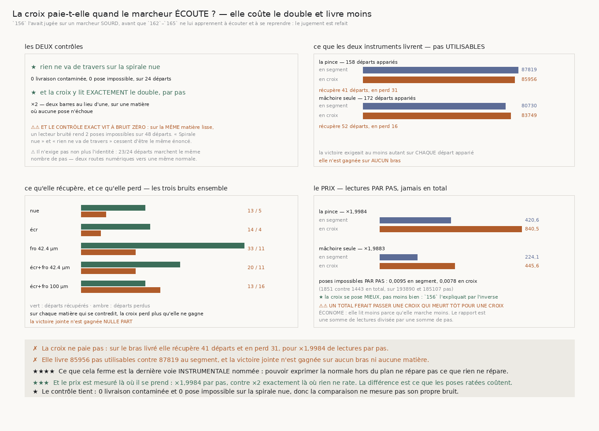

# 168 — La croix paie-t-elle quand le marcheur écoute ?

> ✗ **NON, ET ELLE COÛTE LE DOUBLE.** Sur le bras livré, la mâchoire en croix livre **85 956** pas
> utilisables contre **87 819** au segment, récupère **41** départs et en **perd 31**, pour
> **×1,9984** de lectures par pas. La victoire jointe n'est gagnée sur **aucun** bras et sur
> **aucune** matière.
>
> ✗ **Et elle est pire là précisément où elle devait aider.** Sur la matière du rouleau — celle dont
> `153` mesure que la vraie normale sort du plan du tour — elle livre **355** pas contre **525**,
> récupère **13** départs et en **perd 16**, et son surcoût monte à **×2,4121**, le seul qui dépasse
> le double.
>
> ⭐⭐⭐⭐ **CE QUE CELA FERME EST LA DERNIÈRE VOIE INSTRUMENTALE NOMMÉE.** `167` a réfuté par
> l'**observation** que la contradiction irréparable soit faite de la normale hors plan, avec un
> instrument qui ne peut pas l'exprimer. Ceci est le test **interventionnel** : on donne
> l'instrument qui peut l'exprimer, et il ne répare pas davantage.
>
> ⭐⭐⭐ **ET UNE EXPLICATION DU DÉPÔT EST RÉFUTÉE.** `156` écrivait qu'une mâchoire en croix
> « a besoin de deux barres de matière pour se poser, donc elle refuse plus souvent ». Mesuré par
> pas : **0,0078** pose impossible en croix contre **0,0095** en segment. Elle se pose **mieux**.
>
> ⚠⚠ **ET LE CONTRÔLE DU DÉPÔT SE RESSERRE** : sur la spirale nue, un lecteur bruité rend **2**
> poses impossibles sur **48** départs. « Spirale nue » et « rien ne va de travers » cessent d'être
> le même énoncé dès que le lecteur bruite ; le contrôle exact vit à **bruit zéro**.

## 1. Pourquoi ce fichier, et il répare une date

`156` a mesuré la mâchoire en croix sur une grille et l'a jugée : elle coûte **×1,9921** de lectures
et rend **+1** réussite, un pur déplacement. Ce jugement était juste — et il portait sur un marcheur
**sourd**. Il n'écoutait pas la pose, ne la refusait pas, ne se reprenait pas : tout cela est arrivé
entre `162` et `165`. Personne n'avait mesuré la croix avec le marcheur que la campagne livre.

⭐⭐⭐ **Et il y avait une raison précise de redemander.** `153` (`R4-F120`) mesure que sur la matière
du rouleau la vraie normale sort du plan du tour et que `une_machoire` rend $n' = t' \times z$, dont
la composante axiale est **nulle par construction**. La croix pose ses appuis sur **deux** barres,
donc son nuage porte un **plan** et sa normale peut sortir du tour. `167` a réfuté que la
contradiction irréparable soit faite de cette composante, mais il l'a réfuté par l'**observation**.
Ceci est l'**intervention**.

⚠⚠ **Deux marcheurs, le même énoncé, deux instruments.** Les deux écoutent et se reprennent — le
marcheur de `165`. Ils ne diffèrent que par la mâchoire. Aucun autre drapeau ne bouge.

## 2. ⭐⭐⭐⭐ La réponse, et elle est négative



| bras | départs appariés | en segment | **en croix** | récupère | **perd** | lectures/pas | surcoût |
|---|---|---|---|---|---|---|---|
| la pince de `144` | 158 | 87819 | **85956** | 41 | **31** | 420,597 / 840,506 | **×1,9984** |
| une mâchoire avec rejet | 172 | 80730 | **83749** | 52 | **16** | 224,112 / 445,595 | **×1,9883** |

⚠⚠ **Sur la mâchoire seule, un total dirait que la croix gagne** — 83749 contre 80730. La victoire
est **jointe** et elle refuse : **16** départs y livrent moins. Un instrument qui gagne en moyenne
en perdant seize départs n'est pas un instrument qu'on livre, et c'est exactement ce qu'un total
cache.

| matière | appariés | en segment | en croix | récupère / **perd** | surcoût |
|---|---|---|---|---|---|
| spirale nue | 72 | 46068 | 46079 | 13 / 5 | ×2,0007 |
| spirale écrasée | 66 | 46791 | 45974 | 14 / 4 | ×2,0011 |
| spirale froissée 42.4 µm | 72 | 45625 | 46192 | 33 / **11** | ×2,0072 |
| spirale écrasée et froissée 42.4 µm | 63 | 29540 | 31105 | 20 / **11** | ×1,9858 |
| spirale écrasée et froissée 100 µm | 57 | **525** | **355** | 13 / **16** | **×2,4121** |

⭐ **La dernière ligne est celle qui compte** : c'est la matière du rouleau, celle où `153` situait le
défaut structurel, et c'est la seule où la croix perd plus qu'elle ne récupère **et** où son surcoût
dépasse le double.

## 3. ⭐⭐⭐ Une explication du dépôt est réfutée

`156` expliquait le déplacement de la croix ainsi : *« Une mâchoire en croix a besoin de deux barres
de matière pour se poser, donc elle refuse plus souvent. »* C'était plausible, et c'est faux avec un
marcheur qui écoute.

| | poses impossibles | pas marchés | **par pas** |
|---|---|---|---|
| en segment | 1851 | 193890 | **0,0095** |
| en croix | 1443 | 185107 | **0,0078** |

⚠⚠ **Et le total seul aurait suffi à le croire**, dans le mauvais sens comme dans le bon : 1443
contre 1851 se lit « la croix se pose mieux », mais elle marche aussi **moins**. C'est la part qui
tranche, et elle dit la même chose : la croix se pose **mieux**, de près d'un cinquième.

⭐ Ce qui déplace la croix n'est donc pas qu'elle rate ses poses. C'est qu'elle en réussit d'autres,
avec une normale différente, et que ces poses-là ne mènent pas plus loin.

## 4. ⚠⚠ Le contrôle du dépôt se resserre

Le premier jet de cette tranche contrôlait sur « la spirale nue », comme toute la chaîne depuis
`142`. La grille l'a refusé : **2** poses impossibles et un surcoût de **×2,001**, là où j'attendais
zéro et exactement deux.

⭐⭐⭐⭐ **Ce n'est pas un défaut de l'instrument, c'est un défaut de l'énoncé.** La ligne « spirale
nue » agrège les **trois** bruits, et à bruit 8 ou 16 une lecture bruitée empêche une pose de trouver
son interstice — sur une matière parfaitement lisse. *« Spirale nue »* et *« rien ne va de travers »*
cessent d'être le même énoncé dès que le lecteur bruite.

| spirale nue | départs appariés | poses impossibles | surcoût |
|---|---|---|---|
| à bruit 0 | 24 | **0** | **×2,0** |
| sous un lecteur bruité | 48 | **2** | ×2,001 |

⚠ À bruit zéro les deux contrôles sont **exacts** : aucune livraison contaminée, aucune pose
impossible, et la croix lit **exactement** le double — deux barres au lieu d'une, sur une matière où
aucune pose n'échoue. Aucun seuil n'entre dans l'un ni dans l'autre.

## 5. ⚠⚠ Un contrôle qui exigeait l'impossible

Ma première version exigeait en plus que les deux marcheurs livrent **exactement** la même chose sur
la spirale nue. La mesure l'a refusée, et elle avait raison : **23** départs sur **24** y marchent le
même nombre de pas, le vingt-quatrième diffère d'**un** pas sur **633**, les deux bouclant proprement
le tour.

⭐ Les deux mâchoires atteignent la même normale par deux routes **numériques** différentes —
$t' \times z$ pour le segment, la plus petite direction d'une décomposition pour la croix — donc
elles ne peuvent pas s'accorder au dernier bit, et six cents pas suffisent à déplacer d'un cran le
pas qui ferme le tour. **Un contrôle qui exige l'impossible n'est pas un contrôle**, c'est un échec
garanti. Le compte des départs identiques est désormais publié **à côté**, comme une mesure et non
comme un verdict.

## 6. ⚠⚠⚠ Le même piège, deux fois dans la même tranche

**Le coût se prend par pas, jamais en total.** Une croix qui meurt plus tôt lit moins **en tout**,
donc un total ferait passer une marche écourtée pour une marche économe — c'est `R4-F162`, comparer
des totaux sur des populations inégales. Le rapport publié est une somme de lectures divisée par une
somme de pas, sur les **mêmes** départs appariés.

Et la seconde fois, dans la même grille : **les poses impossibles aussi**. 1443 contre 1851 est un
total sur 185107 pas contre 193890. Ici la normalisation ne renverse pas le classement — les deux
populations sont à 4,5 % près — mais rien ne le garantissait, et c'est la part qui est publiée.

## 7. Les sondes

⚠ Quatre sondes, toutes vérifiées **en cassant le code**, et jamais pendant une mesure : le coût
pris en **total** et non par pas (2 échecs) ; la victoire jointe qui **ignore les pertes**
(1 échec) ; le contrôle qui **cesse de regarder** la contamination (1 échec) ; et un départ
**apparié** alors qu'un seul marcheur y est décidable (1 échec).

⚠⚠ La batterie vérifie aussi sur **données réelles** que les deux instruments tournent, et que la
croix y coûte davantage par pas — ce qui est sa définition. Sans ce contrôle elle ne vérifierait
jamais que la croix se pose, le trou que `164`, `165` et `166` ont payé chacun leur tour.

## 8. Ce que cette tranche laisse

- **La voie instrumentale est close.** Ni l'observation (`167`) ni l'intervention (`168`) ne
  rattachent la contradiction irréparable à la normale hors plan. Aucune tranche n'en nomme une
  autre.
- **`R4-P29` se resserre d'un cran de plus**, et cette fois par un **prix** : l'instrument qui
  pouvait exprimer ce qui manquait coûte le double et livre moins.
- ⚠ **Ce qui reste ouvert est intact** : `167` mesure que la pince échoue à réparer **0,309859** des
  contradictions qu'elle rencontre, et rien ne dit de quoi elles sont faites.
- **`134` (le vrillage)** n'est toujours pas clos.

## 9. Reproduire

```
uv run python src/nappe/la_croix_paie_t_elle_quand_on_ecoute.py --verifier
uv run python src/nappe/la_croix_paie_t_elle_quand_on_ecoute.py \
    --json docs/mesures/la_croix_paie_t_elle_quand_on_ecoute.json
uv run python src/figures/figure_la_croix_paie_t_elle_quand_on_ecoute.py --verifier
```
