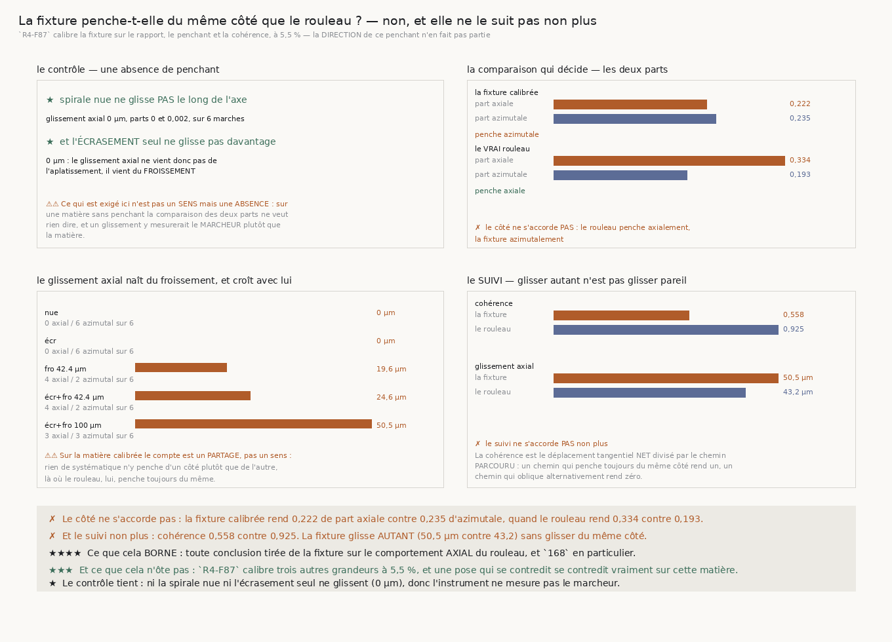

# 169 — La fixture penche-t-elle du même côté que le rouleau ?

> ✗ **NON, ET ELLE NE LE SUIT PAS NON PLUS.** Sur la matière que `R4-F87` a calibrée, la fixture rend
> **0,222** de part axiale contre **0,235** d'azimutale — elle penche **azimutalement** — quand le
> vrai rouleau rend **0,334** contre **0,193**, c'est-à-dire **axialement**. Et le compte des marches
> est **3 contre 3** : rien de systématique n'y penche d'un côté plutôt que de l'autre.
>
> ✗ **Et sa cohérence vaut 0,558 contre 0,925.** Le rouleau penche toujours du même côté ; la fixture
> oblique alternativement.
>
> ⚠⚠ **Elle glisse pourtant AUTANT** : **50,5 µm** par pas le long de l'axe contre **43,2 µm** sur le
> rouleau. Glisser autant n'est pas glisser pareil, et c'est exactement la distinction que la
> cohérence existe pour mesurer.
>
> ⭐⭐⭐⭐ **CE QUE CELA BORNE** : toute conclusion tirée de la fixture sur le comportement **axial** du
> rouleau, et **`168`** en particulier — la mâchoire en croix y a été réfutée sur une matière qui ne
> penche pas axialement, donc sur une matière qui n'a pas le défaut pour lequel la croix existe.
>
> ⭐⭐⭐ **ET CE QUE CELA N'ÔTE PAS** : `R4-F87` calibre trois autres grandeurs à **5,5 %**, et une pose
> qui se contredit se contredit vraiment sur cette matière. La chaîne `161`–`167` mesure ce qu'un
> marcheur fait d'une pose qui se contredit, et cette propriété-là est bien là.
>
> ⭐ **LE CONTRÔLE TIENT, ET IL EN PORTE DEUX.** Ni la spirale nue ni l'**écrasement seul** ne
> glissent le long de l'axe : **0 µm** dans les deux cas. Le glissement axial ne vient donc pas de
> l'aplatissement, il vient du **froissement**, et il croît avec lui — **19,6**, **24,6**, **50,5 µm**.

## 1. Pourquoi ce fichier, et un fait établi le désignait

`R4-F87` établit que l'écrasement mesuré **plus** un froissement approche le rouleau à **5,5 %** sur
**trois** grandeurs : le **rapport** des axes, le **penchant** et la **cohérence**. C'est cette
matière-là que la chaîne `161`–`168` emploie.

⭐⭐⭐⭐ **La direction du penchant n'est pas dans ces trois grandeurs.** Or `R4-F79` mesure sur le vrai
rouleau que le penchant est plus **axial** qu'azimutal — **0,334** contre **0,193** — et que le
marcheur glisse de **43,2 µm** le long de la longueur du rouleau à chaque pas. Personne n'avait
vérifié que la fixture penche du même côté, et la mesure existait déjà : `penchant()`, la fonction
qui a produit `R4-F79`, publie exactement ces deux parts.

⚠ Le bras fixture de ce module publie une **cohérence** et un **angle**, jamais la décomposition.
C'est l'artefact stocké lui-même qui l'a confirmé.

## 2. Comment la comparaison est faite sans être truquée

⚠⚠ **Le même instrument et le même marcheur, deux matières.** La décomposition est `penchant()`,
celle de `R4-F79`, et le marcheur est `marcher`, celui de `100` — jamais `suivre`. Employer un autre
marcheur comparerait deux instruments en croyant comparer deux matières.

⚠⚠⚠ **Les chiffres du vrai rouleau sont RELUS, jamais recalculés.** Ils sont publiés et leur course
coûte des heures ; le module les relit dans la mesure stockée et **refuse de conclure** si elle est
absente. Une comparaison dont un côté manque n'est pas une comparaison à moitié faite, c'est une
affirmation sur une seule matière déguisée en comparaison.

⚠⚠ **Deux questions, deux énoncés exacts, aucun seuil.** Le **côté** : la part axiale dépasse-t-elle
l'azimutale ? C'est le mot pour mot de `R4-F79`, et il se compte sur les cases. Le **suivi** : la
cohérence, c'est-à-dire le déplacement tangentiel **net** divisé par le chemin tangentiel
**parcouru**.

## 3. ⭐⭐⭐⭐ La réponse, et elle est négative deux fois



| | part axiale | part azimutale | penche | glissement axial | cohérence |
|---|---|---|---|---|---|
| la fixture calibrée | 0,222 | **0,235** | **azimutalement** | 50,5 µm | **0,558** |
| le VRAI rouleau | **0,334** | 0,193 | **axialement** | 43,2 µm | **0,925** |

⚠ **Et ce n'est pas une question de peu** : sur la fixture, le compte des marches est **3 axial
contre 3 azimutal** sur six. Le rouleau, lui, a un sens.

| matière | marches | axial | azimutal | glissement axial | cohérence | axial / azimutal |
|---|---|---|---|---|---|---|
| spirale nue | 6 | 0,0 | 0,002 | **0,0 µm** | 1,0 | 0 / 6 |
| spirale écrasée | 6 | 0,0 | 0,009 | **0,0 µm** | 1,0 | 0 / 6 |
| spirale froissée 42.4 µm | 6 | 0,117 | 0,084 | 19,6 µm | 0,627 | 4 / 2 |
| spirale écrasée et froissée 42.4 µm | 6 | 0,116 | 0,126 | 24,6 µm | 0,659 | 4 / 2 |
| spirale écrasée et froissée 100 µm | 6 | 0,222 | 0,235 | **50,5 µm** | 0,558 | 3 / 3 |

## 4. ⭐⭐⭐ Le glissement axial vient du froissement, pas de l'écrasement

C'est le second contrôle, et il est exact : l'**écrasement seul** rend **0,0 µm** de glissement
axial, exactement comme la spirale nue. Aplatir une spirale ne fait donc pas glisser le marcheur le
long de l'axe — c'est le froissement qui le fait, et la quantité croît avec son amplitude :
**19,6**, **24,6**, **50,5 µm**.

⚠ Sur la spirale nue et sur l'écrasée les deux parts valent quasiment zéro, donc les six marches y
comptent « azimutalement » par un résidu de deux et neuf millièmes. **Ce compte ne veut rien dire là
où il n'y a pas de penchant**, et c'est pourquoi le contrôle exige une **absence de glissement** et
non un sens.

## 5. ⚠⚠ Ce que ce fait borne, et ce qu'il n'ôte pas

**Il borne `168`.** La mâchoire en croix existe pour exprimer une normale qui sort du plan du tour,
et `168` la réfute — sur une matière dont le penchant n'est **pas** axial. La réfutation reste vraie
de cette matière ; elle ne s'étend pas au rouleau.

**Il borne la lecture axiale de toute la chaîne.** `167` mesure le hors-plan des contradictions sur
cette même matière ; le fait qu'il n'y sépare rien est cohérent avec une matière qui ne penche pas
axialement de façon systématique.

⭐ **Il n'ôte pas la chaîne.** `R4-F87` calibre trois autres grandeurs à **5,5 %**, et surtout la
propriété que `161`–`167` exploitent est ailleurs : une pose qui se contredit se contredit vraiment
sur cette matière, et un marcheur qui l'écoute y livre cinq fois plus (`R4-F157`). Ce qui est borné
est la lecture **axiale**, pas la lecture de la **contradiction**.

## 6. Les sondes

⚠ Cinq sondes, toutes vérifiées **en cassant le code** : le nombre du **rouleau** affiché sous
l'étiquette **fixture** ; l'énoncé qui **moyenne** au lieu de compter ; le côté et le suivi
**confondus** en un seul verdict ; et conclure **sans** la course du rouleau.

⚠⚠⚠ **Et la cinquième est le défaut que ce module a eu.** `afficher` imprimait la part du **rouleau**
sous l'étiquette **fixture**, et la batterie passait **des deux côtés** — aucun contrôle n'attrape un
nombre juste sous un mauvais nom. Ce qui l'attrape n'est pas de relire le code : c'est de changer la
valeur de la fixture et d'**exiger que la sortie change**. Le contrôle existe maintenant, dans le
module et dans la figure.

## 7. Ce que cette tranche laisse

- **`R4-P27` se resserre** : elle disait « un bruit que les fixtures ne savent pas fabriquer ». Ce
  n'est pas seulement le virage qui manque, c'est le **sens** du penchant et sa **cohérence**.
- ⚠ **`134` (le vrillage) se rouvre avec une raison mesurée** : le rouleau glisse le long de son axe
  de façon **suivie**, et aucune fixture du dépôt ne fabrique ce suivi.
- ⚠ **Ce qui reste ouvert ailleurs est intact** : `167` mesure que la pince échoue à réparer
  **0,309859** des contradictions qu'elle rencontre, et rien ne dit de quoi elles sont faites.

## 8. Reproduire

```
uv run python src/nappe/la_fixture_penche_t_elle_du_meme_cote.py --verifier
uv run python src/nappe/la_fixture_penche_t_elle_du_meme_cote.py \
    --json docs/mesures/la_fixture_penche_t_elle_du_meme_cote.json
uv run python src/figures/figure_la_fixture_penche_t_elle_du_meme_cote.py --verifier
```
