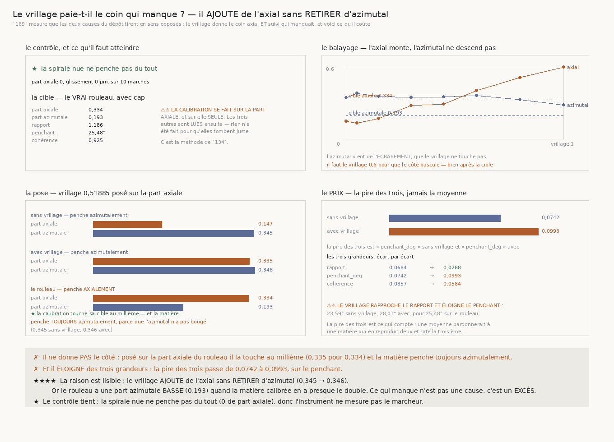

# 170 — Le vrillage paie-t-il le coin qui manque ?

> ✗ **NON, SUR LES DEUX MOITIÉS.** Posé par bissection sur la part axiale du rouleau, le vrillage la
> touche **au millième** — **0,335** pour **0,334** — et la matière penche **toujours
> azimutalement**. Et il **éloigne** des trois grandeurs que `R4-F87` calibre : la pire des trois
> passe de **0,0742** à **0,0993**.
>
> ⭐⭐⭐⭐ **LA RAISON EST LISIBLE, ET ELLE RETOURNE LA QUESTION.** Le vrillage **ajoute** de l'axial
> sans **retirer** d'azimutal : **0,345** sans vrillage, **0,346** avec. Or le vrai rouleau a une
> part azimutale **BASSE** — **0,193** — quand la matière calibrée en a **presque le double**. Ce
> qui manque à la fixture n'est donc pas une cause absente, c'est un **excès** d'une cause qu'elle
> a déjà.
>
> ⭐⭐⭐ **LE COIN EXISTE POURTANT, ET IL EST CONSTRUCTIBLE.** `VolumeFabriqueEnSpiraleVrillee` rend
> exactement ce que `169` cherchait : la part axiale de sa normale garde son **signe partout**, là
> où celle du froissement en change. Ce n'est pas la fixture qui manque — c'est qu'elle ne répare
> pas ce qu'on croyait.
>
> ⚠⚠ **ET IL FAUT UN VRILLAGE DE 0,6 POUR QUE LE CÔTÉ BASCULE**, bien au-delà de la cible : à ce
> réglage le penchant atteint **31,40°** pour **25,48°** sur le rouleau, et le rapport **1,1909**.
>
> ⭐ **LE CONTRÔLE TIENT ET IL EST VIDE** : sur la spirale nue, part axiale **0,0** et glissement
> **0,0 µm** sur **10** marches.

## 1. Pourquoi ce fichier, et `169` l'a déterminé

`169` mesure que les deux causes du dépôt **tirent en sens opposés** : l'**écrasement** penche
azimutalement (**0,0** d'axial contre **0,343**) et suit parfaitement (**0,999**) ; le
**froissement** penche axialement (**14** marches sur 20) et ne suit pas (**0,453**). Le vrai
rouleau demande un penchant **axial ET suivi**, et aucun mélange des deux ne le donne.

⭐⭐⭐⭐ **Le coin manquant a une cause physique, pas un paramètre de plus.** Un rouleau enroulé bien
droit a des sections identiques le long de son axe ; un rouleau **enroulé de travers** — comme un
ruban qui dérive pendant qu'on le bobine — a des sections qui tournent lentement. Sa feuille est un
**hélicoïde**, et sa normale sort du plan du tour d'une quantité **constante**, toujours du même
côté. C'est exactement ce qu'un froissement ne fait pas.

⚠ La classe reste un **rouleau** : le terme ajouté ne dépend que de `z`, donc à `z` fixe un tour
fait croître la phase d'exactement une feuille. Le vrillage ne change pas **combien** de feuilles on
traverse en tournant, il change **où** se trouve la feuille quand on se déplace le long de l'axe.

## 2. Comment la question est posée sans être truquée

⚠⚠⚠ **On calibre sur une grandeur SANS regarder celle qu'on demande** — la méthode de `134`. Le
vrillage est posé par **bissection** sur la part **axiale** du rouleau ; le rapport, le penchant et
la cohérence sont **lus ensuite**, et rien n'a été fait pour qu'ils tombent juste.

⚠⚠ **Et la distance est la PIRE des trois écarts, jamais leur moyenne** — la forme de `R4-F87`. Une
moyenne pardonnerait à une matière qui reproduit deux grandeurs et rate la troisième.

⚠⚠ **Le bracket de la bissection est LU sur l'échelle balayée, jamais supposé.** La part axiale
**n'est pas monotone** en le vrillage tant que le froissement domine — il vaut **treize fois** un
vrillage de cinq centièmes — donc une bissection posée sur un intervalle supposé monotone rendrait
un nombre sans le dire. Si la cible n'est encadrée par aucun couple, la tranche le **dit**.

⚠ **Un seul instrument des deux côtés**, et les quatre grandeurs du rouleau sont **relues** dans les
mesures stockées, jamais recalculées.

## 3. ⭐⭐⭐⭐ La réponse, et elle est négative deux fois



| | part axiale | part azimutale | penche | rapport | penchant | cohérence | pire écart |
|---|---|---|---|---|---|---|---|
| sans vrillage | 0,147 | **0,345** | azimutalement | 1,1049 | 23,59° | 0,958 | **0,0742** |
| **vrillage 0,51885** | **0,335** | **0,346** | **azimutalement** | 1,1519 | 28,01° | 0,979 | **0,0993** |
| le vrai rouleau | 0,334 | **0,193** | **axialement** | 1,186 | 25,48° | 0,925 | — |

⭐ **La calibration touche sa cible au millième** — et le côté ne bascule pas, parce que l'azimutal
n'a pas bougé d'un millième non plus.

| écart au rouleau | sans vrillage | avec vrillage |
|---|---|---|
| rapport | 0,0684 | **0,0288** |
| penchant | **0,0742** | **0,0993** |
| cohérence | 0,0357 | 0,0584 |

⚠ **Le vrillage rapproche le rapport et éloigne les deux autres.** C'est exactement le cas qu'une
moyenne pardonnerait, et que la pire des trois refuse.

## 4. ⭐⭐⭐⭐ Le balayage, et ce qu'il montre

| vrillage | axial | azimutal | penche | cohérence | rapport | penchant | marches axiales |
|---|---|---|---|---|---|---|---|
| 0,0 | 0,147 | 0,345 | azimutalement | 0,958 | 1,1049 | 23,59° | 2 / 10 |
| 0,05 | 0,132 | 0,381 | azimutalement | 0,962 | 1,118 | 25,02° | 2 / 10 |
| 0,15 | 0,171 | 0,358 | azimutalement | 0,948 | 1,1123 | 25,26° | 2 / 10 |
| 0,3 | 0,28 | 0,349 | azimutalement | 0,974 | 1,1349 | 27,44° | 2 / 10 |
| 0,45 | 0,293 | 0,351 | azimutalement | 0,972 | 1,1559 | 28,56° | 3 / 10 |
| **0,6** | **0,407** | 0,365 | **axialement** | 0,986 | 1,1909 | **31,40°** | 7 / 10 |
| 0,8 | 0,514 | 0,328 | axialement | 0,99 | 1,2726 | 37,25° | 9 / 10 |
| 1,0 | 0,603 | 0,286 | axialement | 0,99 | 1,3753 | 42,17° | 10 / 10 |

⚠⚠ **L'azimutal ne descend qu'à partir de 0,6**, et à ce moment-là le penchant a déjà dépassé de
six degrés celui du rouleau. Il n'existe aucun réglage où les deux parts tombent ensemble sur celles
du rouleau.

⚠ **La part axiale n'est pas monotone au début** — 0,147 puis 0,132 puis 0,171 — parce que le
froissement domine tant que le vrillage est petit. C'est ce qui oblige à lire le bracket plutôt qu'à
le supposer.

## 5. ⭐⭐⭐⭐ Ce que cela retourne

La question posée depuis `169` était : *quelle cause manque-t-il pour faire un penchant axial et
suivi ?* Le vrillage la fabrique, et il ne rapproche pas la fixture du rouleau.

⭐ **Parce que le problème n'est pas dans l'axial, il est dans l'azimutal.** Le rouleau rend
**0,193** de part azimutale ; la matière calibrée en rend **0,345**, presque le double, et cela vient
de l'**écrasement**, que le vrillage ne touche pas. Aucune cause **ajoutée** ne peut corriger un
**excès**.

⚠⚠ Et cet excès n'est pas un défaut de calibration évident : l'écrasement de **0,2782** vient du
rapport des axes **1,77** que `90` mesure sur le vrai rouleau. Ce qui est en cause est donc l'**effet
de cet écrasement sur la marche**, pas la quantité d'écrasement elle-même.

## 6. Les sondes

⚠ Quatre sondes, toutes vérifiées **en cassant le code** : la distance prise en **moyenne** au lieu
de la pire des trois (2 échecs) ; le bracket **supposé** au lieu d'être lu (1) ; le verdict qui
oublie la moitié du **prix** (1) ; et le vrillage **crédité** de ce que la matière faisait déjà (1).

⚠⚠ La batterie vérifie aussi **sur données réelles** que la matière calibrée marche, que le
marcheur y part **sur** une feuille — borne dérivée du voxel, la leçon de `169` — et qu'un vrillage
franc déplace réellement la part axiale.

## 7. Ce que cette tranche laisse

- **`R4-P27` se retourne** : ce qui manque aux fixtures n'est pas une cause absente, c'est un
  **excès** de l'écrasement sur la part azimutale de la marche.
- ⚠ **`134` reste ouverte**, mais sa question change : il ne s'agit plus de trouver de quoi faire
  pencher axialement — on sait — mais de comprendre pourquoi un écrasement calibré sur le vrai
  rapport des axes fait marcher **deux fois trop** azimutalement.
- ⚠ **Ce qui reste ouvert ailleurs est intact** : `167` mesure que la pince échoue à réparer
  **0,309859** des contradictions qu'elle rencontre, et rien ne dit de quoi elles sont faites.

## 8. Reproduire

```
uv run python src/nappe/le_vrillage_paie_t_il_le_coin_qui_manque.py --verifier
uv run python src/nappe/le_vrillage_paie_t_il_le_coin_qui_manque.py \
    --json docs/mesures/le_vrillage_paie_t_il_le_coin_qui_manque.json
uv run python src/figures/figure_le_vrillage_paie_t_il_le_coin_qui_manque.py --verifier
```
