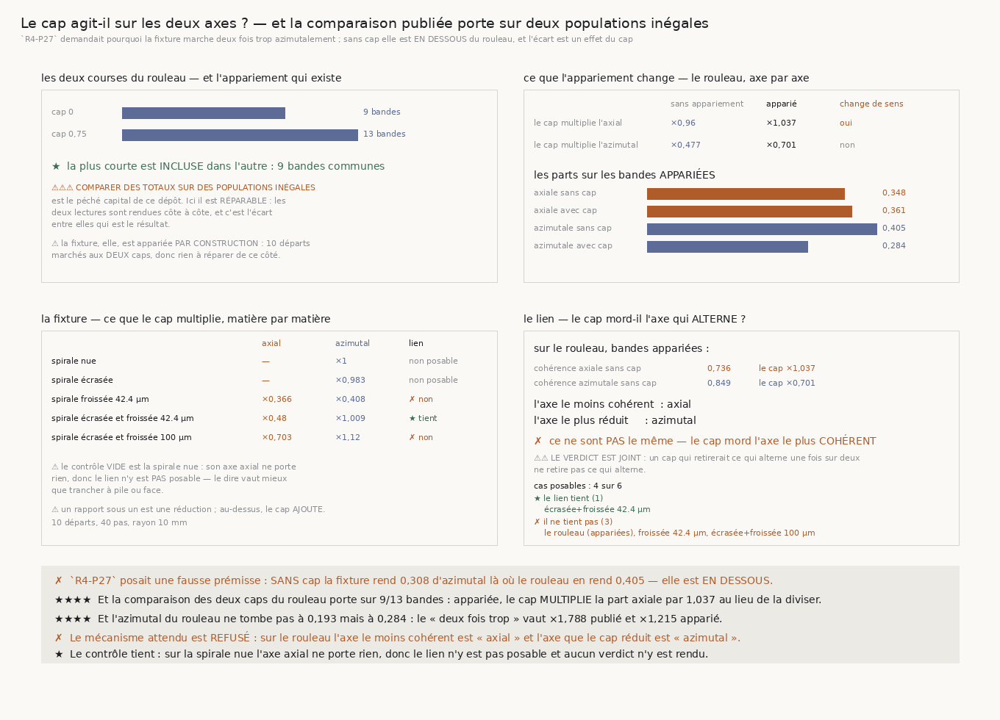

# 171 — Le cap agit-il sur les deux axes ?

> ⭐⭐⭐⭐ **`R4-P27` POSAIT UNE FAUSSE PRÉMISSE, ET DEUX NOMBRES DÉJÀ PUBLIÉS LE DISAIENT.** Elle
> demandait pourquoi la fixture calibrée marche **deux fois trop azimutalement**. **Sans cap, elle
> marche MOINS** : **0,308** contre **0,405** sur le rouleau, soit **×0,76**. L'écart n'existe
> qu'**avec** le cap, et il ne dit alors rien de l'écrasement — il dit que le cap ne fait pas la
> même chose aux deux matières.
>
> ⭐⭐⭐⭐ **ET LA COMPARAISON DES DEUX CAPS DU ROULEAU PORTE SUR DEUX POPULATIONS INÉGALES** : la
> course sans cap a **9** bandes, celle avec cap en a **13**. Le défaut est **réparable** — les
> neuf sont **incluses** dans les treize — et la réparation change la réponse : appariée, le cap
> **MULTIPLIE** la part axiale par **1,037** au lieu de la diviser par **0,96**, et la part
> azimutale ne tombe pas à **0,193** mais à **0,284**.
>
> ⭐⭐⭐⭐ **LE « DEUX FOIS TROP » VAUT DONC ×1,788 DANS LA LECTURE PUBLIÉE ET ×1,215 APPARIÉ.**
> Plus de la moitié de l'écart que `R4-P27` demandait d'expliquer est un artefact de population.
>
> ✗ **ET LE MÉCANISME QU'ON ATTENDRAIT D'UNE MÉMOIRE DE CAP EST RÉFUTÉ.** Une mémoire de cap ne
> devrait pouvoir retirer que ce qui **alterne**, donc mordre l'axe le **moins** cohérent. Sur le
> rouleau apparié, l'axe le moins cohérent sans cap est l'**axial** (**0,736** contre **0,849**) et
> l'axe que le cap réduit est l'**azimutal**. Sur **4** cas posables le lien tient **une** fois.
>
> ⭐ **LE CONTRÔLE TIENT ET IL EST VIDE** : sur la spirale nue l'axe axial ne porte rien, donc le
> lien n'y est **pas posable** et aucun verdict n'y est rendu.

## 1. Pourquoi ce fichier, et il vient d'une contradiction entre deux nombres publiés

`170` a laissé `R4-P27` sous cette forme : *pourquoi un écrasement calibré sur le vrai rapport des
axes (**1,77**, mesuré par `90`) fait-il marcher **deux fois trop** azimutalement ?* Le rapport est
lu entre **0,345** sur la fixture et **0,193** sur le rouleau, tous deux au cap **0,75**.

⚠⚠ Or `169` publie aussi les deux nombres **sans** cap, et ils disent le contraire : **0,308** pour
la fixture, **0,405** pour le rouleau. La fixture est **en dessous**. Une matière qui marcherait
structurellement trop azimutalement le ferait aux deux caps ; celle-ci ne le fait qu'à un seul.

⭐⭐⭐⭐ **Donc l'objet à expliquer n'est pas l'écrasement, c'est le cap.** Et la première chose à
vérifier d'un effet de cap est la population sur laquelle il est mesuré.

## 2. ⚠⚠⚠ Deux populations inégales, et le défaut est réparable

Les deux courses du rouleau sont deux fichiers distincts : `la_re_course_large.json` au cap **0,0**
et `la_course_a_cap.json` au cap **0,75**. Elles ne portent pas le même nombre de bandes.

| | bandes |
|---|---:|
| cap **0,0** | **9** |
| cap **0,75** | **13** |
| communes | **9** |

⭐ **Les neuf sont INCLUSES dans les treize**, donc l'appariement existe. C'est ce qui sépare ce cas
d'un défaut fatal : là où deux populations se recouvrent partiellement il faudrait jeter des bandes
des deux côtés, ici il suffit de lire la plus longue sur la plus courte.

⚠⚠ **Les deux lectures sont rendues côte à côte, jamais une seule.** Publier la seule appariée
effacerait le défaut au lieu de le montrer ; publier la seule non appariée le reconduirait. C'est
l'écart entre elles qui est le résultat.

⚠ **La fixture, elle, est appariée par construction** : `lenquete` marche **chacun** de ses **10**
départs aux **deux** caps. Le défaut n'existe donc que du côté du rouleau, et c'est exactement
pourquoi il n'avait aucune raison d'être vu depuis la fixture.



## 3. ⭐⭐⭐⭐ Ce que l'appariement change

| le cap multiplie | sans appariement | apparié | change de sens |
|---|---:|---:|---|
| la part **axiale** | **×0,96** | **×1,037** | **oui** |
| la part **azimutale** | **×0,477** | **×0,701** | non |

Les parts elles-mêmes, sur les bandes appariées :

| | sans cap | avec cap |
|---|---:|---:|
| part axiale | **0,348** | **0,361** |
| part azimutale | **0,405** | **0,284** |

⚠⚠ **Le verdict de `169` survit, sa marge non.** `169` déclare que le rouleau penche
**axialement** au cap 0,75 — **0,334** contre **0,193**. Apparié, c'est **0,361** contre **0,284** :
toujours axial, mais l'écart entre les deux parts passe de **0,141** à **0,077** — la marge du
verdict fond de moitié.

⭐⭐⭐⭐ **Et l'écart que `R4-P27` demandait d'expliquer est presque de moitié plus petit.**

| part azimutale, matière du rouleau contre rouleau | fixture | rouleau | rapport |
|---|---:|---:|---:|
| sans cap, toutes les bandes | **0,308** | **0,405** | **×0,76** |
| avec cap, toutes les bandes | **0,345** | **0,193** | **×1,788** |
| avec cap, bandes appariées | **0,345** | **0,284** | **×1,215** |

## 4. ⭐⭐⭐⭐ La cohérence moyenne sur l'axe où la différence vit

`penchant()` publiait **une** cohérence : la norme du déplacement tangentiel **net** divisée par le
chemin tangentiel **parcouru**. C'est la norme d'une **somme de vecteurs**, donc une marche dont la
part axiale tient son signe et dont l'azimutale alterne rend le **même nombre** que son miroir. Or
c'est exactement l'axe sur lequel deux matières peuvent différer.

⭐ `coherence_dun_axe` pose la même idée sur **un** axe : le déplacement **net** de cet axe divisé
par le chemin **parcouru** sur ce même axe. Les deux nombres sont rendus **à côté** de la cohérence
tangentielle, jamais à sa place.

⚠⚠ **La part azimutale se somme en SCALAIRE, jamais en vecteur.** Le vecteur azimutal tourne avec la
marche : additionner des vecteurs replierait la rotation du repère dans la réponse, et un chemin qui
dérive toujours dans le même sens autour du rouleau paraîtrait alterner.

⚠⚠ **Un axe qui ne porte rien n'a pas de cohérence** — ni un, ni zéro. La borne se **dérive** :
l'axe ne porte rien quand son chemin parcouru tombe sous ce qu'**un voxel** exprime, soit **2,4 µm**.
En dessous, `None` est rendu et l'appelant doit refuser de conclure. C'est ce qui rend le contrôle de
la spirale nue **vide** plutôt que faux.

## 5. ✗ Le mécanisme attendu, et il est réfuté

Une mémoire de cap lisse la direction du marcheur sur les pas passés. Elle ne peut donc retirer que
ce qui **alterne** : un penchant qui ne change jamais de signe survit à toute moyenne. La prédiction
est ordinale et sans aucun seuil — **l'axe le moins cohérent sans cap doit être celui que le cap
réduit le plus**.

| cas | cohérence axiale | cohérence azimutale | le cap ×axial | le cap ×azimutal | le lien |
|---|---:|---:|---:|---:|---|
| le rouleau, bandes appariées | **0,736** | **0,849** | **×1,037** | **×0,701** | ✗ |
| spirale froissée 42,4 µm | **0,816** | **0,149** | **×0,366** | **×0,408** | ✗ |
| spirale écrasée et froissée 42,4 µm | **0,442** | **1,0** | **×0,48** | **×1,009** | ★ |
| spirale écrasée et froissée 100 µm | **0,887** | **0,808** | **×0,703** | **×1,12** | ✗ |

Sur **4** cas posables, le lien tient **une** fois.

⚠⚠ **Le verdict est JOINT** : un cap qui retirerait ce qui alterne une fois sur deux ne retire pas
ce qui alterne. Une majorité ne suffit pas, et c'est la forme que ce dépôt emploie depuis `165`.

⚠ **Deux matières sur cinq ne sont pas posables**, et pour la bonne raison : la spirale nue et la
spirale écrasée n'ont **aucun** chemin axial — `169` mesurait déjà **0 marche sur 20** penchant
axialement sur l'écrasée. Un axe muet ne se remplace pas par un zéro.

⭐ **Sur le rouleau, le cap rend les DEUX axes plus cohérents** — axiale **0,736 → 0,999**, azimutale
**0,849 → 1,0** — pendant qu'il ne réduit que l'azimutal. Il ne filtre donc pas une alternance : il
rend la marche plus droite et lui retire de l'azimut.

## 6. Les sondes

Toutes vérifiées **en cassant le code**, et toutes mordent.

Dans `penchant()`, quatre :
- un axe muet rendant **0,0** au lieu de `None` → **3** contrôles tombent ;
- la borne abaissée à zéro → **`ZeroDivisionError`**, donc le garde était bien ce qui évitait la
  division par un chemin nul ;
- la part azimutale sommée en **valeur absolue** → **2** contrôles tombent ;
- les deux axes partageant le même accumulateur → **2** contrôles tombent.

⚠⚠ **Et une de mes propres assertions a été réfutée par sa sonde.** J'avais écrit que deux marches
**miroir** rendent la **même** cohérence tangentielle, en dérivant une tolérance d'un arc. Faux : le
miroir n'est pas exact, parce que l'axe qui alterne est le **z fixe** dans une marche et le repère
azimutal **qui tourne** dans l'autre. L'assertion a été remplacée par une comparaison d'**écarts**, qui ne suppose aucune symétrie — la cohérence
tangentielle sépare les deux marches **moins** que chacun des deux axes.

Dans `171`, cinq :
- un axe muet remplacé par **0,0** → **2** contrôles tombent ;
- le lien cherchant l'axe le **plus** cohérent → **4** contrôles tombent ;
- le verdict passé à la **majorité** au lieu du joint → **1** contrôle tombe ;
- les deux lectures du rouleau prenant **toutes** les bandes → le contrôle de l'appariement
  tombe, parce que les deux rapports deviennent identiques ;
- un rapport sur zéro rendant l'**infini** → **1** contrôle tombe.

⚠⚠ **Et la figure a payé un défaut que seule l'œil pouvait voir** : la liste des cas où le lien ne
tient pas était **tronquée** à soixante-quatorze caractères, perdait sa troisième matière et
laissait une virgule pendante. Aucun contrôle de texte ne voit ça — la ligne coupée tient
parfaitement dans son cadre. Le contrôle ajouté exige désormais que **chaque** cas nommé par le
verdict soit écrit **en entier**.

## 7. Ce que cette tranche laisse

- ⭐⭐⭐⭐ **`R4-P27` se referme sur sa prémisse** : il n'y a pas de « deux fois trop » à expliquer.
  Sans cap la fixture marche **moins** azimutalement que le rouleau (**×0,76**), et avec cap l'écart
  vaut **×1,215** une fois les populations appariées, non **×1,788**.
- ⭐ **Ce qui reste à expliquer est plus petit et mieux posé** : pourquoi le cap **retire** de
  l'azimut au rouleau (**×0,701**) et lui en **ajoute** à la matière calibrée (**×1,12**), alors
  qu'il rend les deux plus droites.
- ✗ **Le mécanisme « une mémoire de cap retire ce qui alterne » est réfuté** sur les cas posables,
  donc il ne faut pas s'appuyer dessus pour choisir un cap.
- ⚠ **Les mesures publiées qui comparent les deux courses du rouleau portent toutes la même
  inégalité de population.** Celles de `169` sont republiées ici sous les deux lectures ; les
  autres ne sont pas relues par cette tranche.
- ⚠ **Ce qui reste ouvert ailleurs est intact** : `167` mesure que la pince échoue à réparer
  **0,309859** des contradictions qu'elle rencontre, et rien ne dit de quoi elles sont faites.

## 8. Reproduire

```
uv run python src/nappe/le_cap_agit_il_sur_les_deux_axes.py --verifier
uv run python src/nappe/le_cap_agit_il_sur_les_deux_axes.py \
    --json docs/mesures/le_cap_agit_il_sur_les_deux_axes.json
uv run python src/figures/figure_le_cap_agit_il_sur_les_deux_axes.py --verifier
```
