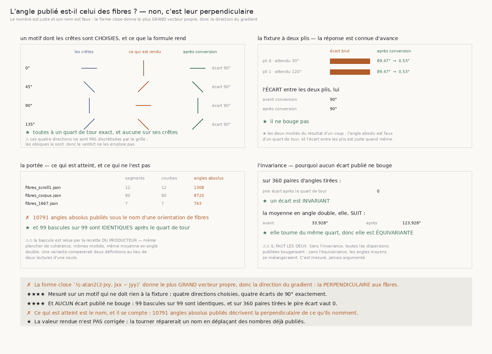

# 172 — L'angle publié est-il celui des fibres ?

> ✗ **NON. C'EST LEUR PERPENDICULAIRE.** Sur un motif dont les crêtes sont **choisies** à 0, 45, 90
> et 135 degrés, `orientation_profile` rend exactement **90°** de plus, aux quatre directions. La
> forme close `½·atan2(2·Jxy, Jxx − Jyy)` donne le **plus grand** vecteur propre du tenseur de
> structure, c'est-à-dire la direction du **gradient** — donc la perpendiculaire à la texture, et
> non la texture.
>
> ⚠⚠⚠ **ET L'EN-TÊTE DU PRODUCTEUR DIT L'INVERSE.** `fiber_orientation.py` écrivait que la formule
> donne « la direction le long de laquelle l'image varie le **MOINS** ». C'est le péché que ce dépôt
> nomme depuis `169` : **un nombre juste sous un mauvais nom**, et il est publié.
>
> ⭐⭐⭐⭐ **MAIS AUCUN ÉCART PUBLIÉ NE BOUGE, ET C'EST MESURÉ.** Sur les **99** courbes des trois
> campagnes stockées, la bascule en profondeur relue par la recette **du producteur** est
> **identique** avant et après le quart de tour : **99 sur 99**. Et sur **360** paires d'angles
> tirées, le pire écart après rotation vaut **0**. Un écart est **invariant**, une moyenne en angle
> double est **équivariante**.
>
> ✗ **CE QUI EST ATTEINT SE COMPTE : 10791 angles absolus** sont publiés sous le nom d'une
> orientation de fibres et décrivent sa perpendiculaire.
>
> ⭐ **LA VALEUR RENDUE N'EST PAS CORRIGÉE, DÉLIBÉRÉMENT** : la tourner réparerait un **nom** en
> déplaçant des **nombres** déjà publiés. La conversion est nommée une fois,
> `direction_des_fibres_deg`, et l'en-tête cesse de mentir.

## 1. Pourquoi ce fichier, et il vient d'une sonde avant une tranche

La boucle allait construire l'alarme des fibres — *l'orientation bascule-t-elle de ~90° au
franchissement d'une feuille et pas à l'intérieur ?* Avant de bâtir dessus, j'ai posé le tenseur de
structure sur un motif dont la direction des crêtes était **choisie**. Il a rendu un angle à un
**quart de tour** de la réponse.

⚠⚠ Une alarme qui lit une orientation absolue et la compare à un axe se serait donc trompée d'axe,
en silence, dès la première ligne.

## 2. Comment la question est posée sans être truquée

⚠⚠⚠ **Le motif ne doit RIEN à la fixture du dépôt.** Si le décalage venait de la convention d'axes
de `VolumeFabriqueAFibres`, un motif construit à part le montrerait à zéro : c'est le seul moyen de
savoir si c'est la **formule** qui décale ou le **volume** qui est monté de travers. Le motif est
une image de crêtes parallèles, construite sur la même indexation que celle dont le module dérive
ses gradients.

⚠⚠ **Les quatre directions sont choisies là où la grille ne discrétise pas.** À 0, 45, 90 et 135
degrés un réseau carré porte le motif exactement ; ailleurs il l'échantillonne, et l'écart mesuré
mêlerait la formule et le pixel. Les obliques sont mesurées **à côté**, pour que la discrétisation
soit **visible** plutôt qu'évitée : elle y vaut **88,645** à **91,355** degrés au lieu de 90.

⚠ **Contrôle obligatoire et vide** : un motif sans texture rend une cohérence **exactement nulle**,
donc aucune direction. Un instrument qui en rapporterait une mesurerait son propre bruit.



## 3. ✗ La réponse, et elle est exacte

| crêtes | angle rendu | écart | après conversion |
|---:|---:|---:|---:|
| **0°** | **90°** | **90°** | **0°** |
| **45°** | **135°** | **90°** | **45°** |
| **90°** | **180°** | **90°** | **90°** |
| **135°** | **45°** | **90°** | **135°** |

Aucune direction rendue ne tombe sur ses crêtes, et la conversion les y ramène **toutes**.

## 4. ⭐⭐⭐⭐ La fixture à deux plis porte les deux moitiés du résultat d'un coup

`VolumeFabriqueAFibres` est une pile dont chaque feuille est faite de **deux plis aux fibres
perpendiculaires** — l'énoncé de `14` §1 — et dont la direction est **choisie**, donc l'instrument
peut échouer et on voit à quoi.

| | attendu | rendu | écart | après conversion | écart |
|---|---:|---:|---:|---:|---:|
| pli 0 | **30°** | **120,53°** | **89,47°** | **30,53°** | **0,53°** |
| pli 1 | **120°** | **30,53°** | **89,47°** | **120,53°** | **0,53°** |

⭐ **Et l'écart entre les deux plis vaut 90° avant comme après.** C'est exactement ce qui fait qu'un
nom peut être faux sans qu'aucun écart publié ne bouge.

⚠ Le demi-degré résiduel est la discrétisation du bloc, pas un biais de la formule : il vaut la même
chose sur les deux plis.

⚠⚠ **Ce que la fixture ne prouve pas, et il faut l'écrire** : qu'un vrai papyrus ait cette structure
à cette échelle. Elle répond à *« si la matière l'avait, l'instrument la verrait-il »*, ce qui est
une question sur l'**instrument**. Prendre sa réponse pour une propriété du rouleau serait lire une
fixture comme une mesure.

## 5. ⭐⭐⭐⭐ La portée du défaut, comptée sur les artefacts publiés

| campagne | segments | courbes | angles absolus |
|---|---:|---:|---:|
| `fibres_scroll1.json` | 12 | 12 | **1308** |
| `fibres_corpus.json` | 80 | 80 | **8720** |
| `fibres_1667.json` | 7 | 7 | **763** |
| **total** | **99** | **99** | **10791** |

⚠⚠ **La bascule est relue par la recette DU PRODUCTEUR** — même plancher de cohérence, mêmes
moitiés, même moyenne en angle double, même écart modulo 180°. En écrire une variante ferait
comparer **deux définitions** au lieu de deux lectures d'une seule.

Résultat : **99 bascules sur 99 sont identiques** après le quart de tour.

Et sur un balayage dense de **360** paires d'angles tirées, le pire écart après rotation vaut **0** ;
la moyenne en angle double, elle, tourne **du même quart**.

⚠⚠ **Il faut les deux propriétés.** Sans l'invariance, toutes les dispersions publiées bougeraient ;
sans l'équivariance, les angles moyens se mélangeraient. Les deux sont mesurées, jamais argumentées.

## 6. ⚠ Ce qui est réparé, et ce qui ne l'est pas

- **Réparé** : l'en-tête de `fiber_orientation.py` et la docstring d'`orientation_profile` disent
  maintenant que la valeur rendue est la **perpendiculaire** ; `direction_des_fibres_deg` nomme la
  conversion **une fois**, là où quelqu'un en a besoin.
- **Pas touché** : la valeur rendue. La tourner déplacerait les **10791** angles déjà publiés pour
  réparer un nom, ce qui est exactement l'inverse du remède.
- ⚠⚠ **Pas touché non plus** : `14_direction_des_fibres.md`, qui est dans `docs/archive/`. Ses
  **conclusions** tiennent — la bascule en profondeur ne se voit pas, la dispersion entre voisins ne
  corrèle pas — parce que ce sont des écarts. Ce qui y est à relire est la **description** : les
  angles de son §3 décrivent la perpendiculaire des fibres, donc une orientation lue à 90–97° veut
  dire des fibres à 0–7°.

## 7. Les sondes

Cinq, toutes vérifiées **en cassant le code**, toutes mordent : la conversion rendue **identité**
(5 échecs) ; le motif modulé **le long** des crêtes au lieu d'en travers (4) — et c'est la sonde qui
prouve que le décalage n'est pas une convention de mon propre motif ; la bascule qui **ignore** le
plancher de cohérence (1) ; le verdict passé en **ou** au lieu de **et** (1) ; le verdict du motif
comparé à **zéro** au lieu du quart de tour (2).

⚠ La fixture porte ses **sept** contrôles propres dans la batterie des fixtures, qui passe de
**119** à **126** : à contraste nul elle rend **exactement** la pile de base, un voxel rend toujours
la même valeur, la matière est **constante le long** des fibres et **oscille en travers**, les deux
plis sont à 90°, un seul pli ne bascule pas, et deux feuilles indépendantes ne partagent pas leur
direction.

⚠⚠ Et la figure a repayé une règle du dépôt : `⭐` **n'est pas dans la police déployée**, il faut
`★` dans tout texte dessiné.

## 8. Ce que cette tranche laisse

- ⭐ **L'alarme des fibres reste ouverte et elle est maintenant posable sans se tromper d'axe** :
  l'outillage existe (`VolumeFabriqueAFibres` pour la réponse connue, `direction_des_fibres_deg`
  pour le nom), et la question à mesurer est celle que `14` §8 nomme — la continuité **le long
  d'une ligne**, pas la dispersion entre carrés voisins.
- ⚠⚠ **Les trois explications de `14` §3 restent non départagées** : contraste entre plis trop
  faible, fenêtre mal centrée, fenêtre plus courte qu'une épaisseur de feuille. La fixture peut
  désormais les départager ; cette tranche ne l'a pas fait.
- ⚠ **`R4-P11` n'est pas touchée** : elle porte sur le **champ de prédiction publié** de `PHerc0139`
  (niveaux 3 et 4, 19,2 et 38,4 µm par cellule), pas sur la texture d'un volume à 2,4 µm. Les deux
  objets ne sont pas à la même résolution et le dire évite de leur appliquer le même verdict.
- ⚠ **Ce qui reste ouvert ailleurs est intact** : `167` mesure que la pince échoue à réparer
  **0,309859** des contradictions qu'elle rencontre, et rien ne dit de quoi elles sont faites.

## 9. Reproduire

```
uv run python src/nappe/langle_publie_est_il_celui_des_fibres.py --verifier
uv run python src/nappe/langle_publie_est_il_celui_des_fibres.py \
    --json docs/mesures/langle_publie_est_il_celui_des_fibres.json
uv run python src/figures/figure_langle_publie_est_il_celui_des_fibres.py --verifier
```
