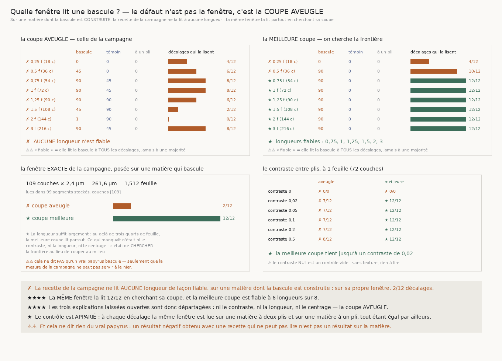

# 173 — Quelle fenêtre lit une bascule ?

> ⭐⭐⭐⭐ **LE DÉFAUT N'EST NI LE CONTRASTE, NI LA LONGUEUR, NI LE CENTRAGE : C'EST LA COUPE
> AVEUGLE.** Sur une matière dont la bascule est **construite**, la recette de `14` — couper la
> fenêtre en deux au milieu et comparer — ne la lit de façon fiable à **aucune** des huit longueurs
> essayées. Sur sa propre fenêtre, celle des campagnes, elle la lit à **2 décalages sur 12**.
>
> ⭐⭐⭐⭐ **ET LA MÊME FENÊTRE LA LIT 12/12 EN CHERCHANT SA COUPE.** La meilleure coupe est fiable à
> **six** longueurs sur huit — de **0,75** à **3** feuilles — et sur la fenêtre exacte de la
> campagne, **1,512** feuille, elle lit la bascule à **tous** les décalages.
>
> ✗ **LES TROIS EXPLICATIONS LAISSÉES OUVERTES PAR `14` §3 SONT DÉPARTAGÉES.** Le **contraste** :
> non, la meilleure coupe tient jusqu'à **0,02**, vingt-cinq fois moins que le réglage de
> référence. La **longueur** : non au-delà de **0,75** feuille, et celle de la campagne en vaut
> **1,512**. Le **centrage** : c'est là que ça se joue, mais pas comme dit — ce n'est pas que la
> fenêtre soit mal posée, c'est que la recette coupe au milieu **sans chercher**.
>
> ⭐ **LE CONTRÔLE EST APPARIÉ** : à chaque décalage, la même fenêtre est lue sur une matière à
> **deux** plis et sur une matière à **un** pli, tout étant égal par ailleurs. La bascule médiane à
> un pli vaut **0,0** partout.
>
> ⚠⚠ **ET CELA NE DIT RIEN DU VRAI PAPYRUS.** Un résultat négatif obtenu avec une recette qui ne
> peut pas lire n'est pas un résultat sur la matière. Ce qui tombe, c'est la valeur de preuve de
> `14` §3, pas la matière.

## 1. Pourquoi ce fichier, et `172` en a construit l'outil

`14` §3 mesure sur le vrai rouleau, à 2,4 µm, que l'orientation ne bascule **pas** en traversant une
feuille — elle reste entre 90 et 97° sur **109** couches — et il laisse **trois** explications
non départagées :

1. à 2,4 µm les deux plis ne se distinguent pas en contraste ;
2. la fenêtre lue (109 × 2,4 µm = **262 µm**) est mal centrée sur la feuille ;
3. à 1,129 µm la fenêtre ne fait que 123 µm, soit **moins** qu'une épaisseur de feuille.

Aucune ne peut être tranchée sur une matière dont on ignore la réponse. `172` a construit celle où
on la connaît : `VolumeFabriqueAFibres`, une pile dont chaque feuille est faite de **deux plis aux
fibres perpendiculaires** et dont la direction est **choisie**.

## 2. Comment la question est posée sans être truquée

⚠⚠ **L'énoncé est une comparaison, pas un seuil.** On lit **deux** écarts avec le **même**
estimateur, `ecart_entre_deux_tranches` — celui de `fiber_orientation.survey`, plancher de cohérence
compris :

- la **bascule**, entre les deux parts que la coupe sépare ;
- le **témoin**, entre les deux moitiés de la **première** part, donc entre deux tranches qui, sur
  une matière bien coupée, tombent **dans** le même pli.

⚠⚠⚠ **Et le contrôle est APPARIÉ.** À chaque décalage, la même fenêtre est lue sur une matière à
deux plis **et** sur une matière à un pli — même pas, même voxel, même contraste, même position. La
question n'est donc pas « la bascule est-elle grande » mais « est-elle plus grande que sur une
matière qui n'en a pas », ce qui est la forme jointe du dépôt et où aucun seuil n'entre.

⚠⚠ **Il faut les deux contrôles, et ils ne disent pas la même chose.** Le témoin demande si la
recette voit une différence là où il n'y en a pas **dans** la matière ; l'apparié demande si elle en
voit une sur une matière qui n'en a pas **du tout**. Une recette qui maximise passe le premier et
peut échouer le second.

⚠⚠ **Une longueur n'est fiable que si elle lit la bascule à TOUS les décalages.** La phase de la
fenêtre dans la feuille n'est pas connue sur données réelles — c'est exactement l'explication nº 2 —
donc une longueur qui ne marche qu'à un décalage sur deux est une loterie.



## 3. ⭐⭐⭐⭐ La réponse, longueur par longueur

Matière à deux plis, contraste 0,5, douze décalages répartis sur une feuille.

| longueur | couches | coupe **aveugle** | coupe **meilleure** |
|---:|---:|---|---|
| 0,25 feuille | 18 | 4/12 | 4/12 |
| 0,5 | 36 | 6/12 | 10/12 |
| **0,75** | 54 | 8/12 | **12/12** ★ |
| **1** | 72 | 8/12 | **12/12** ★ |
| **1,25** | 90 | 6/12 | **12/12** ★ |
| **1,5** | 108 | 2/12 | **12/12** ★ |
| **2** | 144 | 0/12 | **12/12** ★ |
| **3** | 216 | 8/12 | **12/12** ★ |

⚠ La coupe aveugle n'atteint **jamais** 12/12, et son meilleur cas — 8/12 — n'est pas meilleur que
le hasard sur une matière dont la réponse est construite.

⚠ **0,25 feuille n'est fiable pour aucune recette**, et c'est l'explication nº 3 sous sa forme
vraie : une fenêtre plus courte qu'un **pli** n'a rien à couper. Mais elle ne s'applique pas à la
campagne, dont la fenêtre en vaut six fois plus.

## 4. ⭐⭐⭐⭐ La fenêtre exacte de la campagne

**109** couches × 2,4 µm = **261,6 µm** = **1,512** feuille, lue dans **99** segments stockés qui
publient tous la même profondeur.

| recette | décalages qui lisent la bascule |
|---|---|
| coupe **aveugle** — celle de la campagne | **2 / 12** |
| coupe **meilleure** | **12 / 12** |

⭐ **La longueur suffisait largement.** Ce qui manquait était de **chercher** la frontière au lieu de
couper au milieu.

## 5. Le contraste, et jusqu'où il descend

À une feuille (72 couches) :

| contraste | aveugle | meilleure |
|---:|---|---|
| **0** | 0/0 | 0/0 |
| **0,02** | 7/12 | **12/12** ★ |
| 0,05 | 7/12 | **12/12** ★ |
| 0,1 | 7/12 | **12/12** ★ |
| 0,2 | 7/12 | **12/12** ★ |
| 0,5 | 8/12 | **12/12** ★ |

⚠ Le contraste **nul** est un contrôle vide de plus : sans texture, il n'y a pas d'orientation, donc
rien à lire — les deux recettes y rendent **0/0**, c'est-à-dire aucun décalage lisible.

⭐ L'explication nº 1 est donc écartée par un facteur **vingt-cinq** : la meilleure coupe tient à un
contraste où la coupe aveugle est déjà perdue.

## 6. Les sondes

Cinq, toutes vérifiées **en cassant le code** : la meilleure coupe qui **ne cherche pas** (1 échec) ;
une seule des deux conditions suffisant à « lire la bascule » (1) ; le témoin relisant la **même**
tranche que la bascule (4) ; le contrôle apparié relisant la **même matière** des deux côtés ; et le
contraste nul, qui doit rester muet.

⚠⚠⚠ **Et la quatrième sonde est PASSÉE au vert la première fois.** Neutraliser le contrôle
apparié — lire la matière à deux plis des deux côtés — laissait la batterie verte : c'était une
**vérification incapable d'échouer**, parce que rien n'exigeait que les deux matières soient
réellement deux. Le remède est un compte structurel,
`decalages_ou_les_deux_matieres_different`, et il ne juge rien : il dit seulement que les deux
courbes ne sont pas la même. Après correction, la sonde tombe à **0/4**.

⚠⚠ **Une borne se vérifie par sa PROPRIÉTÉ, pas par un recompte.** Ma première assertion sur le
nombre de coupes essayées recalculait l'arithmétique du code — donc une seconde définition de
« quelles coupes sont admissibles », libre d'en diverger. Elle a d'ailleurs été fausse du premier
coup. Remplacée par la règle : une coupe qui laisserait moins de quatre couches dans une tranche
n'est pas lisible, celle qui en laisse quatre l'est.

⚠⚠ **Et la figure a payé deux fois.** `⭐` n'est pas dans la police déployée — c'est la deuxième
tranche de suite qui le repaie. Et une sonde a montré que la bande lisait le **verdict** là où le
panneau lisait la **campagne** : deux chemins vers un même nombre, libres de diverger. Repliés sur
la même source.

## 7. Ce que cette tranche laisse

- ⭐⭐⭐⭐ **La bascule recto/verso n'est pas réfutée sur le vrai rouleau : elle n'y a pas été
  mesurée.** `14` §3 conclut sur une recette qui, sur une matière dont la réponse est construite,
  répond faux dix fois sur douze. Porte **`R4-P30`**.
- ⚠⚠ **La portée est précise, et elle est étroite.** Ce qui repose sur la coupe aveugle est la
  **bascule en profondeur** : `bascule_mediane_deg`, `part_bascule_sup_45`, et la corrélation
  `bascule × croisements` de `croisement_fibres.json`. Ce qui n'en dépend **pas** — le désaccord
  entre fenêtres voisines, la part au-delà de 30°, la cohérence médiane, et donc toute la campagne
  **spatiale** de `14` §8 — est intact.
- ⚠⚠ **Et rien ici ne dit qu'un vrai papyrus bascule.** La fixture répond sur l'**instrument**.
  Prendre sa réponse pour une propriété du rouleau serait lire une fixture comme une mesure, et
  c'est précisément la faute que cette tranche corrige chez une autre.
- ⚠ **Ce qui reste ouvert ailleurs est intact** : `167` mesure que la pince échoue à réparer
  **0,309859** des contradictions qu'elle rencontre, et rien ne dit de quoi elles sont faites.

## 8. Reproduire

```
uv run python src/nappe/quelle_fenetre_lit_une_bascule.py --verifier
uv run python src/nappe/quelle_fenetre_lit_une_bascule.py \
    --json docs/mesures/quelle_fenetre_lit_une_bascule.json
uv run python src/figures/figure_quelle_fenetre_lit_une_bascule.py --verifier
```
