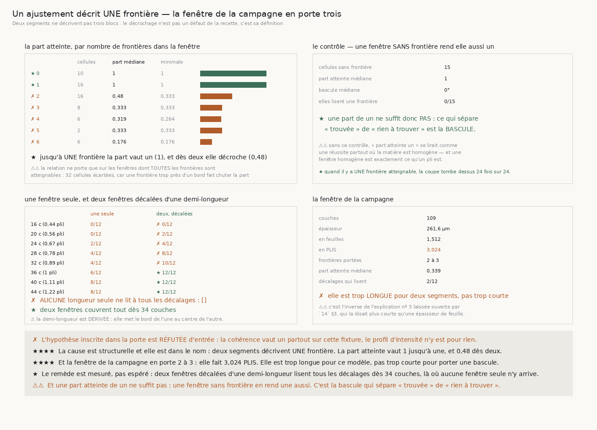

# 175 — Un ajustement décrit UNE frontière

> ✗ **L'HYPOTHÈSE INSCRITE DANS LA PORTE EST RÉFUTÉE D'ENTRÉE.** `R4-P30` supposait que le profil
> d'intensité de la feuille abaisse la cohérence près d'un interstice. La cohérence vaut **un
> partout** sur cette fixture, et **aucune** couche ne tombe sous le plancher.
>
> ⭐⭐⭐⭐ **LA CAUSE EST STRUCTURELLE ET ELLE EST DANS LE NOM.** Un ajustement en **deux** segments
> décrit **une** frontière. Restreinte aux fenêtres dont toutes les frontières sont atteignables, la
> part atteinte vaut **1** — médiane et minimum — jusqu'à **une** frontière, et elle décroche dès
> **deux** : **0,48**, puis **0,333**, puis **0,176** à six. Ce n'est pas un défaut de la recette,
> c'est sa définition.
>
> ⭐⭐⭐⭐ **ET LA FENÊTRE DE LA CAMPAGNE EN PORTE DEUX À TROIS.** **109** couches à 2,4 µm font
> **1,512** feuille, donc **3,024 PLIS**. Elle est trop **LONGUE** pour une description en deux
> segments — l'inverse exact de l'explication nº 3 que `14` §3 laissait ouverte, qui la disait plus
> courte qu'une épaisseur de feuille.
>
> ⚠⚠ **ET UNE PART ATTEINTE DE UN NE SUFFIT PAS** : une fenêtre **sans** frontière en rend une
> aussi — l'ajustement y coupe n'importe où et les deux parts sont homogènes. Ce qui sépare
> « trouvée » de « rien à trouver » est la **bascule**, qui y vaut **0°**.
>
> ⭐ **LE REMÈDE EST MESURÉ, PAS ESPÉRÉ.** Aucune fenêtre **seule** ne lit à tous les décalages ;
> **deux** fenêtres décalées d'une **demi-longueur** les couvrent toutes dès **34** couches.

## 1. Pourquoi ce fichier, et la porte se trompait de cause

`174` livre une recette réparée qui tombe exactement sur la frontière d'une marche, et `R4-P30`
demande pourquoi elle décroche à sept longueurs sur huit. La porte nommait une piste : le profil
d'intensité de la feuille — `100 + 40·cos` — module la texture, donc les couches près d'un
interstice auraient une cohérence basse et un angle bruité.

✗ **Mesuré d'entrée : la cohérence vaut 1,000 partout**, minimum compris, et **zéro** couche tombe
sous le plancher de 0,15. La piste est morte avant la première ligne de la tranche.

## 2. Comment la question est posée sans être truquée

⚠⚠ **Le nombre de frontières d'une fenêtre est lu sur la FIXTURE**, par `angle_du_pli_deg`, jamais
recalculé ici. Deux réponses à « où le pli change » seraient deux géométries, et la relation mesurée
porterait sur leur désaccord.

⚠⚠⚠ **Une frontière trop près du bord n'est pas atteignable, et la borne se DÉRIVE** : le témoin
exige quatre couches dans **chaque moitié** de **chaque part**, donc une coupe vaut au moins **8** et
au plus **couches − 8**. Une frontière hors de cet intervalle ne peut pas être trouvée, et la
compter comme un échec ferait lire une contrainte de **fenêtre** comme un défaut d'**instrument**.

⚠⚠ **La relation ne porte donc que sur les fenêtres dont TOUTES les frontières sont atteignables** —
**32** cellules sont écartées pour cette raison, et le compte est publié.



## 3. ⭐⭐⭐⭐ La relation, et elle est exacte

| frontières | cellules | part médiane | part **minimale** | coupes sur une frontière |
|---:|---:|---:|---:|---|
| **0** | 10 | **1** | **1** ★ | 0/10 |
| **1** | 16 | **1** | **1** ★ | **16/16** |
| **2** | 16 | **0,48** | 0,333 ✗ | 12/16 |
| 3 | 8 | 0,333 | 0,333 ✗ | 8/8 |
| 4 | 6 | 0,319 | 0,264 ✗ | 6/6 |
| 5 | 2 | 0,333 | 0,333 ✗ | 2/2 |
| 6 | 6 | **0,176** | 0,176 ✗ | 2/2 |

⭐ Jusqu'à une frontière la part vaut un — **médiane et minimum confondus** — et au-delà elle
décroche partout. Deux segments ne décrivent pas trois blocs.

⚠ Et quand la fenêtre porte **exactement une** frontière atteignable, la coupe tombe dessus **24
fois sur 24**.

## 4. ⚠⚠ Le contrôle : une part de un ne suffit pas

| | |
|---|---:|
| cellules sans frontière | **15** |
| part atteinte médiane | **1** |
| bascule médiane | **0°** |
| elles lisent une frontière | **0/15** |

⭐ Une fenêtre **homogène** rend elle aussi une part de un : l'ajustement y coupe n'importe où et les
deux parts sont dirigées. Sans ce contrôle, « part atteinte un » se lirait comme une réussite partout
où la matière est homogène — et une fenêtre homogène est exactement ce qu'un **pli** est.

## 5. ⭐⭐⭐⭐ La fenêtre de la campagne

| | |
|---|---:|
| couches | **109** |
| épaisseur | **261,6 µm** |
| en feuilles | **1,512** |
| **en PLIS** | **3,024** |
| frontières portées | **2 à 3** |
| part atteinte médiane | **0,339** |
| décalages qui lisent | **2/12** |

⚠⚠ **Elle est trop LONGUE pour deux segments, pas trop courte pour porter une bascule.** C'est
l'inverse de l'explication nº 3 de `14` §3.

## 6. ⭐ Le remède, mesuré

Une fenêtre **seule** ne lit à tous les décalages à **aucune** longueur : la liste des longueurs
utiles est **vide**. La raison est visible — à toute longueur, certains décalages ne portent
**aucune** frontière atteignable, parce qu'elle y tombe trop près d'un bord.

**Deux** fenêtres décalées d'une **demi-longueur** mettent ce bord au **centre** de l'autre :

| couches | en plis | une seule | deux, décalées |
|---:|---:|---|---|
| 16 | 0,444 | 0/12 | ✗ 0/12 |
| 18 | 0,499 | 0/12 | ✗ 2/12 |
| 20 | 0,555 | 0/12 | ✗ 2/12 |
| 22 | 0,61 | 2/12 | ✗ 6/12 |
| 24 | 0,666 | 2/12 | ✗ 4/12 |
| 26 | 0,721 | 2/12 | ✗ 6/12 |
| 28 | 0,777 | 4/12 | ✗ 8/12 |
| 30 | 0,832 | 4/12 | ✗ 10/12 |
| 32 | 0,888 | 4/12 | ✗ 10/12 |
| **34** | 0,943 | 6/12 | **★ 12/12** |
| **36** | 0,999 | 6/12 | **★ 12/12** |
| **38** | 1,054 | 6/12 | **★ 12/12** |
| **40** | 1,11 | 8/12 | **★ 12/12** |
| **42** | 1,165 | 8/12 | **★ 12/12** |
| **44** | 1,221 | 8/12 | **★ 12/12** |

⚠ **La demi-longueur est DÉRIVÉE, pas choisie** : c'est la seule valeur qui envoie exactement le bord
d'une fenêtre au centre de la suivante. Un autre pas laisserait une bande où aucune des deux ne peut
lire, et il faudrait alors justifier ce pas plutôt que cette bande.

## 7. Les sondes

Quatre, toutes vérifiées **en cassant le code** : les frontières recalculées ici au lieu d'être lues
sur la fixture ; « lit une frontière » sans la condition de **bascule** ; le décrochage passé en
« au moins un » au lieu de « tous » ; et la tolérance d'une couche portée à cinquante.

⚠⚠⚠ **Trois d'entre elles sont passées au VERT la première fois**, et pour la même raison à chaque
fois : la condition qu'elles couvrent **ne retirait rien** sur les cellules assertées. Une condition
qui n'écarte jamais rien est une condition que rien ne teste. Les contrôles ajoutés sont donc
**structurels** — la condition de bascule écarte réellement des cellules, une coupe à plus d'une
couche ne compte pas, et le décrochage tombe dès qu'un seul groupe tient encore un — et deux d'entre
eux ont dû être refaits parce qu'ils **recopiaient la logique du code** au lieu de l'exercer.

⚠⚠ Et la mesure a **refusé ma première formulation** : à une frontière la part valait 1 en médiane
mais **0,611** au minimum. La raison est l'atteignabilité, et l'écrire a rendu la relation exacte.

## 8. Ce que cette tranche laisse

- ⭐⭐⭐⭐ **`R4-P30` se resserre autour d'une recette concrète** : sur les **109** couches d'un
  volume de surface, découper des fenêtres d'un **pli** avec un recouvrement d'une **demi-fenêtre**,
  et lire chacune par l'ajustement en deux segments.
- ⚠⚠ **Rien n'a encore été posé sur le vrai rouleau.** Ce qui manquait n'était pas le réseau ni la
  donnée mais une recette dont le domaine de validité soit connu ; il l'est maintenant.
- ⚠ **La limite héritée de `174` tient** : une **dérive** n'est pas séparée d'une marche par un
  verdict, et le témoin reste un nombre à lire.
- ⚠ **Ce qui reste ouvert ailleurs est intact** : `167` mesure que la pince échoue à réparer
  **0,309859** des contradictions qu'elle rencontre, et rien ne dit de quoi elles sont faites.

## 9. Reproduire

```
uv run python src/nappe/un_ajustement_decrit_une_frontiere.py --verifier
uv run python src/nappe/un_ajustement_decrit_une_frontiere.py \
    --json docs/mesures/un_ajustement_decrit_une_frontiere.json
uv run python src/figures/figure_un_ajustement_decrit_une_frontiere.py --verifier
```
