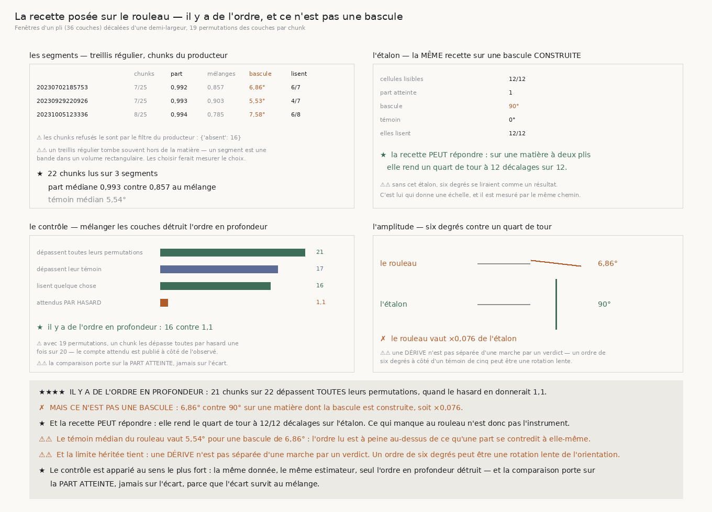

# 176 — La recette posée sur le rouleau

> ⭐⭐⭐⭐ **IL Y A DE L'ORDRE EN PROFONDEUR, ET LE MÉLANGE LE DÉTRUIT.** Sur **22** chunks lus de
> **3** segments, **21** dépassent **toutes** leurs **19** permutations, quand le hasard en donnerait
> **1,1**. La part atteinte médiane vaut **0,993** sur le rouleau contre **0,857** au mélange.
>
> ✗ **MAIS CE N'EST PAS UNE BASCULE RECTO/VERSO.** La bascule médiane du rouleau vaut **6,862°** là
> où la **même** recette rend **90,0°** sur une matière dont la bascule est construite — soit
> **×0,076**, treize fois moins. Le témoin médian vaut **5,54°**, donc la bascule le dépasse à
> peine.
>
> ⭐ **ET LA RECETTE PEUT RÉPONDRE** : sur l'étalon elle rend le quart de tour à **12** décalages
> sur **12**. Ce qui manque au rouleau n'est donc pas l'instrument.
>
> ⚠⚠ **LA LIMITE HÉRITÉE DE `174` MORD ICI ET ELLE EST DITE** : une **dérive** n'est pas séparée
> d'une marche par un verdict. Un ordre de **6,862°** à côté d'un témoin de **5,54°** peut être une
> rotation lente de l'orientation plutôt qu'une marche.
>
> ⚠⚠⚠ **ET UN DÉFAUT DE `174` A ÉTÉ TROUVÉ EN CHEMIN** : `la_paire_ajustee` publie une bascule de
> **0,0** et un témoin de **0,0**, puis affirme que la première dépasse le second — un reste de
> virgule flottante de **1e-15** tranche. Corrigé, la fenêtre de la campagne de `175` lit **0**
> décalage sur 12 et non **2**.

## 1. Pourquoi ce fichier, et c'est la première mesure sur la vraie matière

`172`–`175` ont construit une recette dont le domaine de validité est **connu** : un ajustement en
deux segments décrit **une** frontière, la fenêtre doit tenir dans un **pli**, et deux fenêtres
décalées d'une demi-largeur couvrent tous les décalages. `R4-P30` demande de la poser sur le rouleau.
C'est ce que fait cette tranche.

⚠ Les deux réglages sont **dérivés**, jamais écrits à la main : la largeur est celle d'un pli,
**36** couches pour un pas de 173 µm à 2,4 µm, et le pas est la **demi-largeur**, seule valeur qui
met le bord d'une fenêtre au centre de la suivante.

## 2. Comment la question est posée sans être truquée

⚠⚠⚠ **Le contrôle est une permutation des couches du MÊME chunk**, comparée sur la **part atteinte**
et jamais sur l'écart. `174` mesure pourquoi : l'écart **survit** au mélange — le multiensemble des
angles ne change pas — alors que l'ajustement n'y survit pas. Mélanger détruit l'ordre en profondeur
et **rien d'autre** : chaque couche garde son angle et sa cohérence.

⚠⚠ **La statistique est la meilleure fenêtre du chunk, et le mélange passe par les MÊMES fenêtres.**
C'est ce qui contrôle la multiplicité : un chunk découpé en six fenêtres a six occasions de trouver
quelque chose, et le mélange en a six aussi.

⚠ **Le compte attendu sous l'hypothèse nulle est publié à côté de l'observé** : avec **19**
permutations, un chunk les dépasse toutes par hasard une fois sur **20**.

⚠ **Les chunks viennent d'un treillis RÉGULIER**, jamais choisis, et seuls comptent ceux que la
recette du producteur retient. **16** sur **25** par segment sont refusés comme *absents* : un
segment est une bande dans un volume rectangulaire, et un treillis régulier tombe souvent hors de la
matière. Les choisir ferait mesurer le choix.



## 3. ⭐⭐⭐⭐ Ce que le rouleau rend

| segment | chunks | part | mélanges | bascule | lisent |
|---|---:|---:|---:|---:|---|
| `20230702185753` | 7/25 | **0,992** | 0,857 | **6,862°** | 6/7 |
| `20230929220926` | 7/25 | **0,993** | 0,903 | **5,532°** | 4/7 |
| `20231005123336` | 8/25 | **0,994** | 0,785 | **7,576°** | 6/8 |

| | |
|---|---:|
| chunks lus | **22** |
| dépassent toutes leurs permutations | **21** |
| dépassent leur témoin | **17** |
| lisent quelque chose | **16** |
| **attendus par hasard** | **1,1** |
| part médiane du rouleau | **0,993** |
| part médiane des permutations | **0,857** |
| témoin médian | **5,54°** |

⭐ **Il y a de l'ordre en profondeur**, et il n'est pas un artefact de la liberté de choisir une
coupe : le mélange, qui garde exactement cette liberté, ne l'a pas.

## 4. ⭐⭐⭐⭐ L'étalon, et ce qu'il dit de l'amplitude

La **même** recette, par le **même** chemin — mêmes fenêtres, mêmes permutations — sur la fixture à
deux plis dont la réponse est construite :

| | |
|---|---:|
| cellules lisibles | **12/12** |
| part atteinte | **1** |
| **bascule** | **90,0°** |
| témoin | **0,0°** |
| elles lisent | **12/12** |

| | rouleau | étalon | rapport |
|---|---:|---:|---:|
| bascule médiane | **6,862°** | **90,0°** | **×0,076** |

⚠⚠ **Sans cet étalon, six degrés se liraient comme un résultat.** C'est lui qui donne une échelle, et
il est mesuré par le même chemin — sinon on comparerait deux instruments en croyant comparer deux
matières. Aucun seuil n'entre : c'est un rapport de deux nombres mesurés.

⭐ Et il dit aussi que **la recette peut répondre** : elle rend le quart de tour partout sur une
matière qui en a un. Ce qui manque au rouleau n'est pas l'instrument.

## 5. ⚠⚠⚠ Un défaut de `174`, trouvé en chemin

`la_paire_ajustee` compare les valeurs **non arrondies**. Sur une fenêtre **homogène**, la bascule et
le témoin valent tous deux zéro, et un reste de virgule flottante de l'ordre de **1e-15** tranche en
faveur de la bascule. Le module publie alors « bascule **0,0** · témoin **0,0** · dépasse **True** » :
un booléen qui **contredit les deux nombres imprimés à côté de lui**.

⚠⚠ **La valeur n'est pas corrigée dans `174`, délibérément** : `174` et `175` publient des comptes
qui en dérivent, et les tourner réparerait un défaut en **déplaçant des mesures déjà écrites**.
C'est le précédent de `172` avec `orientation_profile`. La comparaison réparée vit ici,
`la_bascule_est_lisible`, et lit les nombres **publiés**.

⚠ **L'arrondi n'est pas un seuil ajouté** : c'est la précision que `la_paire_ajustee` publie déjà, et
comparer autre chose que ce qui est écrit est ce qui a créé le défaut.

⭐ Ce que la correction déplace, mesuré : la fenêtre de la campagne de `175` lit **0** décalage sur
**12** au lieu de **2**. `R4-F181` et `R4-F183` passent donc au statut **borné**.

⚠⚠ **Et un second défaut au passage** : choisir la meilleure fenêtre sur la seule **part atteinte**
retient une fenêtre **homogène**, puisque `175` mesure qu'une fenêtre sans frontière rend une part de
un. Le choix se fait désormais parmi celles qui **lisent** quelque chose.

## 6. Les sondes

Cinq, toutes vérifiées **en cassant le code**, toutes mordent : la comparaison réparée revenue aux
valeurs **non arrondies** (**3** échecs) ; le choix de la fenêtre ignorant celles qui lisent (**2**) ;
le mélange qui **ne mélange pas** (**1**) ; les fenêtres avançant d'une largeur **entière** au lieu
d'une demie (**1**) ; et l'amplitude comparée au rouleau lui-même au lieu de l'étalon (**1**).

⚠ La batterie asserte aussi le défaut de `174` **tel qu'il est** — bascule 0,0, témoin 0,0, dépasse
`True` — pour qu'il ne disparaisse pas en silence le jour où quelqu'un le corrige sans le dire.

## 7. Ce que cette tranche laisse

- ⭐⭐⭐⭐ **`R4-P30` est répondue** : la recette est posée, le contrôle tient, et le rouleau porte un
  ordre en profondeur qui n'a pas l'amplitude d'une bascule recto/verso.
- ⚠⚠ **Ce qui reste ouvert est ce que cet ordre EST.** Une dérive et une marche ne sont pas séparées
  par un verdict, et **6,862°** à côté d'un témoin de **5,54°** ressemble davantage à une rotation
  lente. Le séparer demanderait un troisième énoncé que cette chaîne n'a pas.
- ⚠ **Et la piste du prix reste ouverte par l'autre bout** : `14` §8 nomme la continuité **le long
  d'une ligne**, pas la bascule en profondeur. Rien ici ne l'a mesurée.
- ⚠ **Ce qui reste ouvert ailleurs est intact** : `167` mesure que la pince échoue à réparer
  **0,309859** des contradictions qu'elle rencontre, et rien ne dit de quoi elles sont faites.

## 8. Reproduire

```
uv run python src/nappe/la_recette_posee_sur_le_rouleau.py --verifier
uv run python src/nappe/la_recette_posee_sur_le_rouleau.py \
    --json docs/mesures/la_recette_posee_sur_le_rouleau.json
uv run python src/figures/figure_la_recette_posee_sur_le_rouleau.py --verifier
```
