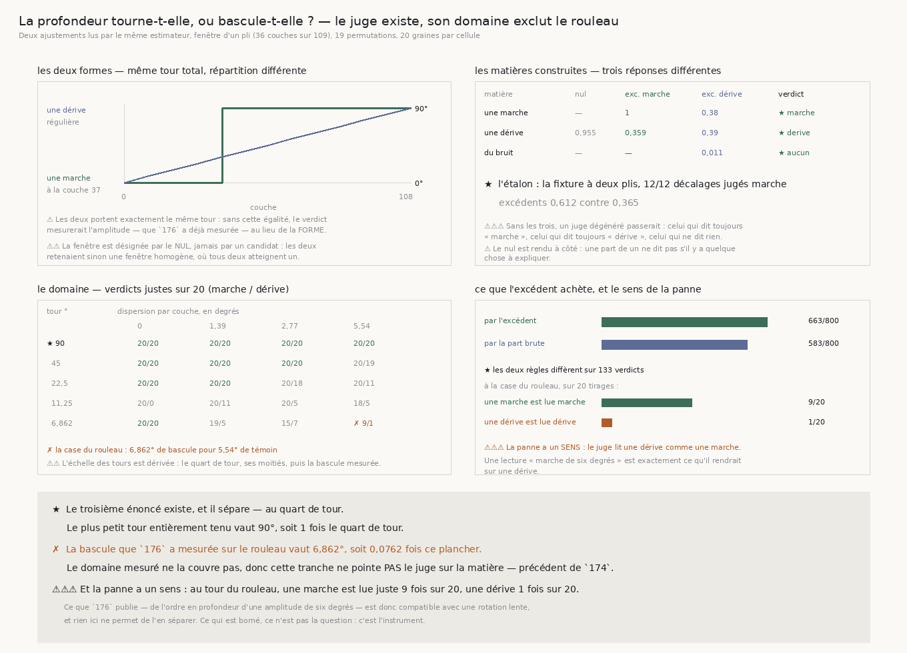

# 177 — La profondeur tourne-t-elle, ou bascule-t-elle ?

> ⭐⭐⭐⭐ **LE TROISIÈME ÉNONCÉ EXISTE, ET IL SÉPARE.** Une marche et une dérive qui portent le
> **même** tour total sont départagées sur les trois matières construites : la marche rend
> « marche », la dérive rend « dérive », le bruit ne rend rien. Sur l'étalon — la fixture à deux
> plis — **12** décalages sur **12** sont jugés marche.
>
> ✗ **MAIS SON DOMAINE EXCLUT LE ROULEAU.** Sur l'échelle des tours, la seule ligne entièrement
> tenue à toutes les dispersions est le **quart de tour**. La bascule que `176` a mesurée sur le
> rouleau vaut **6,862°**, soit **0,0762** fois ce plancher, et à cette case le juge rend la bonne
> forme **9** fois sur **20** pour une marche et **1** fois sur **20** pour une dérive.
>
> ⚠⚠⚠ **ET LA PANNE A UN SENS : IL LIT UNE DÉRIVE COMME UNE MARCHE.** Une lecture « marche de six
> degrés » est donc exactement ce que cet instrument rendrait sur une rotation lente. Ce qui est
> borné n'est pas la question de `176` : c'est l'instrument qui devait y répondre.
>
> ⚠⚠ **DONC CETTE TRANCHE NE TOUCHE PAS LE VRAI ROULEAU**, et c'est le précédent de `174` : on ne
> pointe pas sur la matière un instrument dont le contrôle vient de dire qu'il ne répond pas là.

| | |
|---|---|
| module | [`src/nappe/la_profondeur_tourne_t_elle_ou_bascule_t_elle.py`](../../src/nappe/la_profondeur_tourne_t_elle_ou_bascule_t_elle.py) |
| figure | [`src/figures/figure_la_profondeur_tourne_t_elle_ou_bascule_t_elle.py`](../../src/figures/figure_la_profondeur_tourne_t_elle_ou_bascule_t_elle.py) |
| mesure | [`docs/mesures/la_profondeur_tourne_t_elle_ou_bascule_t_elle.json`](../mesures/la_profondeur_tourne_t_elle_ou_bascule_t_elle.json) |
| témoins | module **35**, figure **18** |
| faits | `R4-F188`, `R4-F189`, `R4-F190` |
| porte | `R4-P31` |

## 1. Pourquoi ce fichier

`176` mesure deux choses sur le vrai rouleau. La première est franche : il y a de l'ordre en
profondeur, et le mélange le détruit — **21** chunks sur **22** dépassent toutes leurs permutations
quand le hasard en donnerait **1,1**. La seconde est une négation : cet ordre n'a pas l'amplitude
d'une bascule recto/verso, **6,862°** contre **90,0°** sur l'étalon.

Ce que cet ordre **est** restait ouvert, et `174` dit pourquoi. L'ajustement en deux segments ne
sépare pas une **dérive** d'une **marche** par un verdict : son témoin vaut **0,0°** sur une marche
et **43,287°** sur une dérive, mais il reste un nombre à lire. Sur le rouleau la bascule vaut
**6,862°** pour un témoin de **5,54°** — deux nombres du même ordre, et rien ne tranche.

Il faut donc un troisième énoncé.

## 2. La forme de l'énoncé, et ce qui le rend comparable

Une **marche** a une orientation constante de part et d'autre d'un point : c'est l'ajustement en
deux segments de `174`. Une **dérive** tourne régulièrement : c'est un ajustement **affine**, une
rotation par couche. Les deux rendent la même quantité — la résultante atteinte divisée par la somme
des cohérences — donc leurs valeurs se comparent sans qu'aucun seuil n'entre.

⚠⚠⚠ **Mais leurs libertés ne sont pas les mêmes, et une part brute serait truquée.** Les deux
ajustements sont des **extensions** d'un même nul, l'ajustement constant, et aucun ne peut faire
moins que lui : couper ne perd jamais, puisque $|\Sigma_a| + |\Sigma_b| \ge |\Sigma_a + \Sigma_b|$,
et l'affine contient la pente nulle. Comparer deux maximums pris sur deux libertés différentes ne
dirait que laquelle des deux est la plus large.

⭐⭐⭐⭐ **C'est la permutation qui paie la liberté, et elle le fait exactement.** Mélanger les
couches conserve chaque angle et chaque cohérence — donc conserve la liberté de chaque ajustement —
et ne détruit que l'ordre en profondeur. Et le nul est **exactement** invariant par permutation :
une somme de vecteurs ne dépend pas de l'ordre des termes. L'**excédent**, la part réelle moins la
part médiane des mélanges, ne mesure donc que ce que la profondeur explique.

⚠ La pente est une **fréquence**, donc sa résolution se dérive : en angle doublé, dé-tourner par
$\beta$ puis sommer est une transformée évaluée en $\beta$, et deux pentes qui diffèrent de moins
d'un tour réparti sur la fenêtre ne sont pas distinguables. On balaye les $m$ bins, puis on affine
par une recherche ternaire jusqu'à passer **sous** la précision publiée.

⚠⚠ **Le plancher $1/\sqrt{n}$ ne protège pas l'affine, et c'est dit plutôt que masqué.** Il est
appliqué aux deux pour que l'estimateur soit le même, mais il vaut pour **une** direction, pas pour
un maximum pris sur autant de pentes qu'il y a de couches — sur du bruit, l'affine trouve d'ailleurs
une pente de **−39,6891°** par couche et une part de **0,365**. Ce qui price cette maximisation est
la permutation, qui la subit à l'identique : au mélange, la même matière rend **0,354**, et
l'excédent tombe à **0,011**.



## 3. ⚠⚠⚠ La fenêtre est choisie par le nul, et c'est une correction

Une première version laissait **chaque ajustement** prendre sa meilleure fenêtre par la part
atteinte. La batterie a jugé « dérive » une marche construite, et la cause est celle que `175` a
déjà mesurée : une fenêtre **sans** frontière rend une part de **un**. Les deux ajustements
retenaient donc une fenêtre homogène, où tous deux atteignent un, et le verdict se décidait sur les
mélanges — c'est-à-dire sur la liberté de chacun, et plus sur la matière.

⭐ **C'est le nul qui désigne la fenêtre**, et aucun des deux candidats. Il est aveugle à la forme :
il ne sait ni ce qu'est une marche ni ce qu'est une dérive, donc choisir par lui ne favorise ni l'un
ni l'autre. Et la part qu'il atteint est basse exactement là où une seule direction ne suffit pas,
ce qui est la définition d'une fenêtre à expliquer.

## 4. ⭐⭐⭐⭐ Les trois matières construites, et l'étalon

Les deux formes portent **exactement** le même tour — un quart de tour — et ne diffèrent que par sa
répartition. Sans cette égalité, le verdict mesurerait l'amplitude, que `176` a déjà mesurée, au
lieu de la forme.

| matière | nul | excédent marche | excédent dérive | verdict |
|---|---|---|---|---|
| une marche à la couche 37 | — | **1** | 0,38 | **marche** ★ |
| une dérive de 90° sur 109 couches | 0,955 | 0,359 | **0,39** | **dérive** ★ |
| du bruit | — | — | 0,011 | **aucun** ★ |

⚠⚠⚠ **Sans les trois, un juge dégénéré passerait** : celui qui dit toujours « marche » passe la
première ligne, celui qui dit toujours « dérive » passe la deuxième, celui qui ne dit jamais rien
passe la troisième. Seules les trois ensemble les excluent, et aucune ne demande de seuil — la
réponse de chaque matière est construite.

⭐ **L'étalon** est la fixture à deux plis de `175` et `176`, lue par le même chemin : **12**
décalages sur **12** jugés marche, excédents **0,612** contre **0,365**.

## 5. ⭐⭐⭐⭐ Le domaine, et c'est le résultat de cette tranche

Un juge sans domaine n'est pas un instrument. L'échelle des tours est **dérivée** : le quart de
tour, ses moitiés tant qu'elles restent au-dessus de la bascule mesurée, puis cette bascule. Les
dispersions par couche sont le témoin du rouleau, ses moitiés, et zéro. Chaque case est tirée **20**
fois.

| tour ° | 0 | 1,385 | 2,77 | 5,54 |
|---|---|---|---|---|
| **★ 90** | 20/20 | 20/20 | 20/20 | **20/20** |
| 45 | 20/20 | 20/20 | 20/20 | 20/19 |
| 22,5 | 20/20 | 20/20 | 20/18 | 20/11 |
| 11,25 | 20/**0** | 20/11 | 20/5 | 18/5 |
| 6,862 | 20/20 | 19/5 | 15/7 | **✗ 9/1** |

*(verdicts justes sur 20, marche / dérive)*

**Le plus petit tour entièrement tenu vaut 90°**, soit **1** fois le quart de tour : rien en dessous
ne tient à toutes les dispersions. La bascule du rouleau vaut **0,0762** fois ce plancher.

⚠ **Et la panne n'est pas monotone** : à **11,25°** sans dispersion la dérive est lue juste **0**
fois sur 20, alors qu'à **6,862°** sans dispersion elle l'est **20** fois. Le tableau le dit plutôt
que de le lisser ; rien ici ne l'explique.

## 6. ⚠⚠⚠ Le sens de la panne, et pourquoi il compte plus que son taux

Un juge qui se trompe au hasard laisse une question ouverte. Celui-ci se trompe **dans un sens** :
à la case du rouleau, une marche est lue juste **9** fois sur **20** et une dérive **1** fois sur
**20**. Il lit une dérive comme une marche.

⭐ **Conséquence directe sur `176`** : une lecture « il y a de l'ordre, et c'est une marche de six
degrés » est exactement ce que cet instrument rendrait sur une **rotation lente**. La négation de
`176` — ce n'est pas une bascule recto/verso — tient ; ce qui ne tient pas, c'est d'en déduire que
la matière fait une marche.

## 7. Ce que l'excédent achète, mesuré et non supposé

La règle **brute** — comparer les parts atteintes au lieu des excédents — est portée comme contrôle
nommé, exactement comme `174` mesure côte à côte la recette réfutée et la recette réparée. Sur les
**800** verdicts du domaine :

| règle | verdicts justes |
|---|---|
| par l'excédent | **663** |
| par la part brute | **583** |

Les deux règles diffèrent sur **133** verdicts. ⚠ **Sans ce contrôle, l'excédent serait une
précaution que rien ne mesure** : sur les trois matières construites seules, les deux règles rendent
le même verdict, et une batterie qui s'y arrêterait ne pourrait pas échouer sur ce point.

## 8. Les sondes

Vert au premier coup ne prouve rien. Sept sondes ont été exécutées en cassant le code, et chacune
fait tomber la batterie :

| ce qu'on casse | ce qui tombe |
|---|---|
| le nul cesse d'être invariant par permutation | 1 |
| l'affinage ne fait rien (on garde le meilleur bin) | 3 |
| la fenêtre est choisie par le nul le **mieux** expliqué | 4 |
| la permutation ne contrôle plus rien | 2 |
| les deux formes ne portent plus le même tour | 2 |
| le verdict prend le **perdant** | 6 |
| la fenêtre désignée n'est pas celle qu'on lit | 6 |
| le verdict compare les parts brutes | 1 |
| le domaine déclare que tout tient | 1 |
| l'échelle n'encadre plus la bascule | 1 |

⚠⚠⚠ **Et deux défauts ont été trouvés par la sonde, pas par la relecture.** Le premier est la
fenêtre choisie par un candidat (§3). Le second est la sonde « le verdict compare les parts
brutes », qui est **repassée au vert** après la première correction : l'excédent n'était alors
exercé par aucune matière, et c'est ce qui a imposé de porter la règle brute comme contrôle (§7).

⚠⚠ **Un troisième a été trouvé en REGARDANT l'image** : `_fr(90, 0)` rendait « 9 », parce que le
`rstrip("0")` rognait le zéro des dizaines comme s'il était décimal. L'axe du graphe affichait donc
un angle dix fois trop petit — un nombre juste sous un mauvais nom. Aucune garde de figure ne voit
ça.

## 9. Ce que cette tranche laisse

⚠⚠⚠ **Elle ne pointe pas le juge sur la matière**, et c'est le précédent de `174`, qui avait refusé
de poser sur le rouleau une recette que son contrôle venait de réfuter. Un verdict rendu hors du
domaine mesuré n'est pas un verdict faible : c'est un nombre sans garantie sous un nom qui en promet
une.

⭐ **Ce qu'il faudrait pour répondre** est nommé par le tableau lui-même : un instrument dont le
plancher descende sous le dixième de tour, ou une matière lue à une **profondeur** telle que le tour
accumulé y dépasse le quart de tour. La seconde voie est la moins chère et elle est déjà à portée —
la fenêtre est ici d'un **pli**, parce que `175` a mesuré qu'un ajustement en deux segments ne
décrit qu'une frontière ; mais un ajustement **affine** n'a pas cette limite, et rien n'a mesuré ce
qu'il rend sur les **109** couches entières.

⚠ **Et ce que le juge ne sépare pas, même dans son domaine** : une rotation lente de la **matière**
et une rotation lente de l'**instrument** le long de la spire rendent la même courbe.

## 10. Reproduire

```
uv run python src/nappe/la_profondeur_tourne_t_elle_ou_bascule_t_elle.py --verifier
uv run python src/nappe/la_profondeur_tourne_t_elle_ou_bascule_t_elle.py \
    --json docs/mesures/la_profondeur_tourne_t_elle_ou_bascule_t_elle.json
uv run python src/figures/figure_la_profondeur_tourne_t_elle_ou_bascule_t_elle.py --verifier
```
