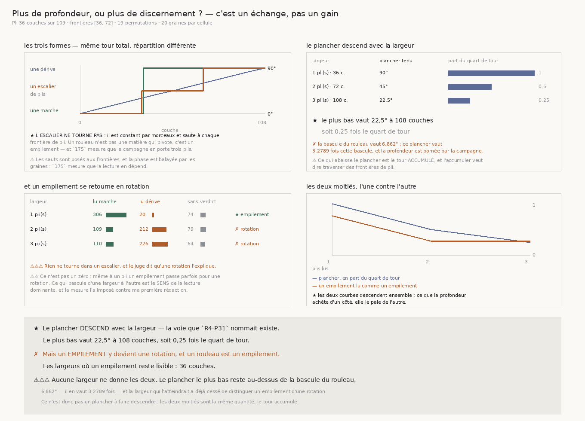

# 178 — Plus de profondeur, ou plus de discernement ?

> ⭐⭐⭐⭐ **LE PLANCHER DESCEND, ET IL DESCEND D'UN CRAN PAR PLI** : **90°** à une fenêtre d'un pli,
> **45°** à deux, **22,5°** à trois — soit **0,25** fois le quart de tour. La voie que `R4-P31`
> nommait existe.
>
> ✗ **MAIS UN EMPILEMENT Y DEVIENT UNE ROTATION, ET UN ROULEAU EST UN EMPILEMENT.** À une fenêtre
> d'un pli, un escalier de plis est lu comme un empilement **306** fois sur **400** ; à deux plis,
> il est lu comme une rotation **212** fois ; à trois, **226**. La bascule bascule au même cran que
> le plancher.
>
> ⚠⚠⚠ **AUCUNE LARGEUR NE DONNE LES DEUX.** La seule où un empilement reste lisible est **36**
> couches, et son plancher vaut **90°** là où la bascule du rouleau vaut **6,862°**.
>
> ⚠⚠ **ET UNE SECONDE BORNE TIENT MÊME SI ON ACCEPTAIT DE PERDRE LA DISTINCTION** : le plancher le
> plus bas atteignable sur ce volume vaut **3,2789** fois cette bascule. La profondeur disponible
> est bornée par la campagne elle-même.

| | |
|---|---|
| module | [`src/nappe/plus_de_profondeur_ou_plus_de_discernement.py`](../../src/nappe/plus_de_profondeur_ou_plus_de_discernement.py) |
| figure | [`src/figures/figure_plus_de_profondeur_ou_plus_de_discernement.py`](../../src/figures/figure_plus_de_profondeur_ou_plus_de_discernement.py) |
| mesure | [`docs/mesures/plus_de_profondeur_ou_plus_de_discernement.json`](../mesures/plus_de_profondeur_ou_plus_de_discernement.json) |
| témoins | module **17**, figure **18** |
| faits | `R4-F191`, `R4-F192`, `R4-F193` |
| porte | `R4-P31` resserrée |

## 1. Pourquoi ce fichier

`177` mesure que le troisième énoncé — un ajustement **affine** contre l'ajustement en deux segments
— sépare une dérive d'une marche, et que son domaine s'arrête au **quart de tour**, alors que la
bascule lue sur le rouleau vaut **0,0762** fois ce plancher.

`R4-P31` nomme la voie la moins chère pour abaisser ce plancher. La fenêtre de `176` et `177` fait
un **pli** uniquement parce qu'un ajustement en deux segments ne décrit qu'une frontière (`175`) ;
un ajustement affine n'a pas cette limite. Sur une fenêtre plus large, le tour **accumulé** est plus
grand, donc le plancher devrait descendre.

Il descend. Et il s'achète exactement là où la question se pose.

## 2. ⚠⚠⚠ Ce qui abaisse le plancher est ce qui fait perdre la distinction

Ce qui abaisse le plancher est le tour **accumulé**, et accumuler du tour veut dire **traverser des
frontières de pli**. Or un rouleau n'est pas une matière qui tourne : c'est un **empilement**, et
`175` mesure que les **109** couches de la campagne en portent **3,024 plis**.

La matière que ce juge rencontrera au fond n'est donc ni une dérive ni une marche : c'est un
**escalier** — une orientation constante par morceaux, qui saute à chaque frontière et ne tourne
jamais.

⚠⚠ **L'escalier porte le MÊME tour total** que la marche et la dérive auxquelles il est comparé, ses
sauts répartis également entre ses frontières. Sans cette égalité, le verdict mesurerait l'amplitude
au lieu de la forme, et l'amplitude est ce que `176` a déjà mesuré.

⚠ **La phase est balayée par les graines.** `175` mesure que la lecture dépend du décalage, donc
chaque tirage d'une cellule pose la première frontière à un endroit différent, étalés sur une
largeur de pli. Le balayage ne coûte rien, puisqu'il faut de toute façon plusieurs tirages.



## 3. ⚠⚠ Une frontière qui ne laisse pas de segment n'en est pas une

L'échelle des largeurs est dérivée : **un pli, deux plis, trois plis** — le pli vient du pas et du
voxel comme dans `175` et `176`, et trois plis est à un dixième près la profondeur entière du volume
de surface.

Mais la première rédaction plaçait une frontière à la couche **108** d'un volume qui en a **109**,
laissant un segment d'**une** couche. La borne se **dérive** de l'estimateur : `174` refuse une
tranche de moins de **quatre** couches, donc un saut qui ne laisse rien qu'une direction puisse lire
n'est pas une frontière. Avec cette règle, **109** couches et un pli de **36** rendent **deux**
frontières, ce qui est bien ce que « 3,024 plis » veut dire.

⚠ C'est une sonde qui l'a montré, pas une relecture : la batterie annonçait trois frontières.

## 4. ⭐⭐⭐⭐ Le tableau, et c'est l'échange

| largeur | plancher tenu | un empilement lu marche | lu dérive | sans verdict | verdict |
|---|---|---|---|---|---|
| **1 pli** — 36 couches | **90°** | **306** | 20 | 74 | ★ il reste un empilement |
| **2 plis** — 72 couches | **45°** | 109 | **212** | 79 | ✗ il devient une rotation |
| **3 plis** — 108 couches | **22,5°** | 110 | **226** | 64 | ✗ il devient une rotation |

*(400 lectures par largeur, 20 graines par cellule)*

⭐ **Le plancher descend d'un cran par pli**, et la lecture de l'empilement bascule au **même** cran.
Ce n'est pas une coïncidence : les deux moitiés sont la même quantité, le tour accumulé.

## 5. ⚠⚠ Ce n'est pas un zéro, et la mesure l'a imposé

Ma première rédaction demandait qu'à une fenêtre d'un pli un empilement ne soit **jamais** lu comme
une rotation. La sonde a répondu **1 fois sur 7**, et elle avait raison : même à un pli, un escalier
passe parfois pour une rotation.

⭐ Ce qui se mesure n'est donc pas un zéro mais le **sens de la lecture dominante**, et il bascule
d'une largeur à l'autre — **306 contre 20** à un pli, **110 contre 226** à trois. Exiger zéro aurait
été une affirmation que rien ne soutient.

## 6. ⚠⚠⚠ La seconde borne, indépendante de l'échange

Même en acceptant de perdre la distinction, le plancher le plus bas **atteignable sur ce volume**
vaut **22,5°**, soit **3,2789** fois la bascule du rouleau. La profondeur disponible est bornée par
la campagne elle-même, qui lit **109** couches.

⭐ Les deux bornes sont donc de natures différentes et aucune ne rachète l'autre : l'une dit que la
largeur qui suffirait ne distingue plus rien, l'autre que cette largeur n'existe pas dans le volume.

## 7. Les sondes

Six sondes, toutes vérifiées **en cassant le code**, toutes mordent :

| ce qu'on casse | ce qui tombe |
|---|---|
| l'escalier devient une rampe | 3 |
| l'échelle des largeurs ne part plus d'un pli | 2 |
| une largeur pleine reste une fenêtre | 1 |
| l'escalier ne porte plus le même tour | 2 |
| la borne dérivée des frontières disparaît | 2 |
| la phase ne déplace plus rien | 1 |
| les graines ne balayent plus la phase | 1 |

⚠⚠⚠ **Et la dernière est repassée au vert la première fois.** Le balayage de phase n'était exercé
par rien : les contrôles de la batterie faisaient leur propre boucle sans phase. Il a fallu exposer
les phases employées **en sortie de la fonction qui les emploie**, jamais les recalculer à côté.
C'est le piège nº 1 du dépôt, payé pour la sixième tranche de suite.

## 8. Ce que cette tranche laisse

⚠⚠⚠ **Elle ne touche toujours pas le vrai rouleau.** Le juge n'est pas devenu lisible : il a échangé
un défaut contre un autre, et pointer l'un ou l'autre sur la matière rendrait un nombre sans
garantie sous un nom qui en promet une.

⭐ **`R4-P31` se resserre au lieu de se fermer** : ce n'est plus « un plancher à faire descendre »,
puisque les deux moitiés sont la même quantité. Ce qu'il faudrait est un énoncé qui sépare un
**empilement** d'une **rotation** sans passer par le tour accumulé — donc qui lise autre chose que
l'orientation moyenne par couche.

⚠ Et la limite que `177` nomme tient : une rotation lente de la **matière** et une rotation lente de
l'**instrument** le long de la spire rendent la même courbe.

## 9. Reproduire

```
uv run python src/nappe/plus_de_profondeur_ou_plus_de_discernement.py --verifier
uv run python src/nappe/plus_de_profondeur_ou_plus_de_discernement.py \
    --json docs/mesures/plus_de_profondeur_ou_plus_de_discernement.json
uv run python src/figures/figure_plus_de_profondeur_ou_plus_de_discernement.py --verifier
```
