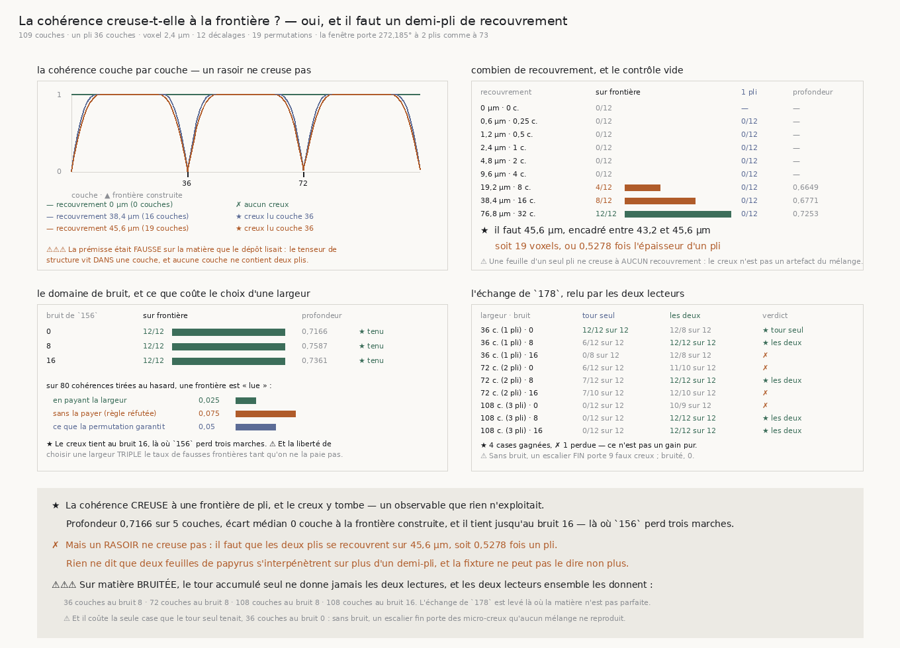

# `179` — La cohérence creuse-t-elle à la frontière ?

*Séparer un empilement d'une rotation sans passer par le tour accumulé. Et la prémisse était fausse
sur la matière que le dépôt lisait.*

## 0. Pourquoi cette tranche

`178` a réfuté la voie la moins chère par un **échange**. Le plancher du juge de `177` descend bien
d'un cran par pli lu — **90°** à 36 couches, **45°** à 72, **22,5°** à 108 — mais un **empilement**
y devient une **rotation** au même cran : un escalier de plis portant le même tour total est lu
comme un empilement **306** fois sur **400** à un pli, puis comme une rotation **212** fois à deux
et **226** à trois. Les deux moitiés sont la **même** quantité, le tour accumulé, et c'est cette
unicité qui rend l'échange inévitable : tout ce que `174`–`178` lit passe par l'orientation
**moyenne** par couche.

⭐⭐⭐⭐ Or il existe un second observable, produit par le même chemin depuis le début, et que rien
n'a exploité. `orientation_profile` rend `(angle, cohérence)` couche par couche, et toute la chaîne
ne se sert de la cohérence que comme d'un **poids**. À une frontière de pli, deux feuilles de
directions différentes se recouvrent : une couche qui contient les deux voit son tenseur de
structure s'isotropiser, donc sa cohérence **creuse**. Une rotation régulière ne creuse nulle part,
parce qu'une couche n'y contient jamais qu'une direction.

C'est l'énoncé que `R4-P31` resserrée nommait. Cette tranche le construit, mesure son domaine, et
trouve d'abord que la prémisse était fausse.

## 1. La prémisse était fausse, et c'est la première mesure

⚠⚠⚠ **Sur `VolumeFabriqueAFibres` telle qu'elle existait, la frontière est un RASOIR et la
cohérence ne creuse pas.** Le tenseur de structure est calculé **dans** le plan d'une couche —
`orientation_profile` dérive à l'intérieur d'une couche et jamais en profondeur — donc aucune
couche ne contient deux plis, et la cohérence vaut **1,0000 partout**, aux deux frontières comme
ailleurs. Mesuré avant d'écrire une ligne de lecteur, et c'est ce qui a évité d'écrire une tranche
entière sur une propriété que la matière n'avait pas.

Le creux n'existe donc qu'avec une **épaisseur de recouvrement**, et cette épaisseur est devenue un
paramètre de la fixture plutôt qu'une hypothèse tue : `VolumeFabriqueAFibres(transition_um=…)`, nul
par défaut, donc **la matière que tout le dépôt a lue jusqu'ici est inchangée** — les batteries
antérieures que ce paramètre touche restent vertes et aucune valeur publiée ne bouge.

⚠⚠ Le modèle est une **moyenne de boîte**, pas un fondu choisi : la lecture d'un point est la
moyenne de la modulation sur la tranche d'épaisseur `transition_um` centrée sur lui. C'est ce qu'un
recouvrement physique ou un flou d'instrument font, donc le paramètre a une unité et une
signification. Il est **borné** par l'épaisseur d'un pli — au-delà, une tranche contiendrait deux
frontières et la moyenne à deux termes ne serait plus la bonne — et la fixture **refuse** plutôt que
de rendre un résultat faux.

## 2. L'estimateur, et le théorème qui le contraint

La profondeur d'un creux est une **part**, donc elle se compare sans seuil :

$$\mathrm{profondeur}(k, w) = 1 - \frac{\overline{c}\,[k-\tfrac{w-1}{2},\,k+\tfrac{w-1}{2}]}
{\overline{c}\,[\text{le reste de la fenêtre}]}$$

Elle vaut zéro sur une courbe plate, tend vers un quand la cohérence s'effondre au centre, et elle
est sans unité — donc la même quantité sur une fixture dont la cohérence vaut un et sur un rouleau
où elle vaut moins.

⭐⭐⭐⭐ **Un creux d'une seule couche ne peut porter aucun excédent, et c'est un théorème.** La
profondeur du meilleur creux de largeur un vaut $1 - \min(c) / \overline{c}(\text{le reste})$ : elle
ne dépend que du **multiensemble** des cohérences, donc une permutation la laisse **exactement**
inchangée. C'est le **nul** de cet estimateur, le pendant exact de l'ajustement constant de `177`.
Une première version le laissait concourir : le maximum tombait toujours sur lui, son excédent était
nul par construction, et le lecteur n'a **rien trouvé nulle part** — y compris aux recouvrements où
la cohérence s'effondre visiblement à la frontière.

⭐⭐⭐⭐ **Ce qui distingue une frontière d'une couche faible est donc la CONTIGUÏTÉ.** Deux feuilles
qui se recouvrent creusent une **suite** de couches ; une cohérence basse isolée est du bruit. Une
moyenne sur trois couches consécutives dépend de l'ordre, donc le mélange la détruit, donc la
permutation la price. L'échelle des largeurs commence à **3** et s'arrête à **7** : `178` a dérivé
qu'une frontière doit laisser `COUCHES_MINIMALES` couches derrière elle, parce que `174` refuse une
tranche plus courte, donc un creux large de `2·minimum − 1` mange déjà tout le segment minimal des
deux côtés. Les largeurs sont impaires : une frontière est une position, pas un intervalle.

## 3. La liberté de choisir la largeur doit être payée, et on mesure ce qu'elle coûte

⚠⚠⚠ Une première version prenait la meilleure des trois largeurs **après** que chacune eut battu
ses propres mélanges : trois chances à un sur vingt au lieu d'une. Mesuré sur des cohérences tirées
au hasard, le taux de fausses frontières sortait **au double de la garantie**.

⭐⭐⭐⭐ La réparation est une **statistique de famille**, et elle est exacte. On ne compare plus
largeur par largeur mais le **maximum sur les largeurs** de l'excédent, et le même maximum est
calculé pour chaque mélange pris à son tour comme s'il était le réel — sa médiane de référence étant
alors celle des **autres** mélanges. La liberté est ainsi subie à l'identique par le réel et par
chaque mélange, donc payée.

⚠⚠ Et la règle réfutée est **portée comme contrôle nommé**, précédent de `177` : les deux taux sont
mesurés côte à côte par le code livré, parce qu'une réparation qu'aucune mesure n'exerce est une
précaution dont personne ne sait ce qu'elle achète.

| sur **80** cohérences tirées au hasard | une frontière est « lue » |
|---|---|
| en payant la largeur | **0,025** |
| sans la payer (règle réfutée) | **0,075** |
| ce que la permutation garantit | **0,05** |

⚠ Le nombre de tirages est **dérivé** : la garantie vaut $p = 1/(m+1)$, l'erreur type d'un taux
mesuré sur $n$ tirages vaut $\sqrt{p(1-p)/n}$, et on exige qu'elle tombe sous la **moitié** de la
garantie, donc $n \ge 4(1-p)/p$, arrondi au multiple supérieur de $m+1$. Sans cette contrainte un
taux mesuré ne pourrait être distingué ni de zéro ni du double, et le publier serait publier du
bruit.

## 4. Combien de recouvrement, et le contrôle vide

Le creux est lu sur la fixture à deux plis par le **même chemin que le rouleau**, à douze décalages
répartis sur une feuille. On compte les décalages où le creux tombe **sur** une frontière
construite, pas une moyenne : `173` a mesuré qu'une lecture qui ne marche qu'à un décalage sur deux
est une loterie, et la phase de la fenêtre dans la feuille n'est pas connue sur données réelles.

| recouvrement | en couches | sur frontière | profondeur | largeur | **un seul pli** |
|---|---|---|---|---|---|
| 0 µm (le rasoir) | 0 | **0/12** | — | — | — |
| 0,6 µm | 0,25 | 0/12 | — | — | 0/12 |
| 1,2 µm | 0,5 | 0/12 | — | — | 0/12 |
| 2,4 µm | 1 | 0/12 | — | — | 0/12 |
| 4,8 µm | 2 | 0/12 | — | — | 0/12 |
| 9,6 µm | 4 | 0/12 | — | — | 0/12 |
| 19,2 µm | 8 | 4/12 | 0,6649 | 3 | 0/12 |
| 38,4 µm | 16 | 8/12 | 0,6771 | 5 | 0/12 |
| 76,8 µm | 32 | **12/12** | 0,7253 | 7 | 0/12 |

⚠⚠ **Un barreau d'échelle n'est pas une borne.** L'échelle double, donc dire que le recouvrement
doit valoir ce barreau serait confondre la borne avec la résolution du balayage. On encadre entre le
dernier barreau qui échoue et le premier qui passe, puis on bissecte, avec une **tolérance dérivée**
— on s'arrête quand l'encadrement passe sous le **voxel**, parce qu'en dessous du pas
d'échantillonnage deux recouvrements ne sont pas distinguables par l'instrument.

**Le recouvrement juste suffisant vaut 45,6 µm**, encadré entre **43,2** et **45,6** µm en quatre
bissections — soit **19 voxels**, ou **0,5278 fois** l'épaisseur d'un pli. À cette borne le creux a
une profondeur de **0,7166** sur **5** couches, et son écart médian à la frontière construite est de
**0** couche.

⚠ La bissection suppose que le compte **monte** avec le recouvrement, et cette monotonie est
**mesurée** sur l'échelle entière plutôt que supposée.

⚠⚠ **Le contrôle vide** est la colonne de droite, et c'est la moitié de l'énoncé : `plis=1`, une
feuille d'un seul pli, aux **mêmes** recouvrements. Un recouvrement y est un recouvrement entre deux
plis de **même** direction, ce qui ne creuse rien — **0/12 à tous les barreaux**. Le creux n'est donc
pas un artefact de la moyenne de boîte. Le rasoir est retiré de cette colonne parce qu'il ne creuse
déjà pas à deux plis : le garder ferait passer ce contrôle pour une raison qui n'est pas la sienne.

## 5. Le domaine de bruit, et il tient là où `156` perd

`156` a déjà mesuré trois pertes au bruit 16 : la cohérence est sensible au bruit, donc le domaine
se mesure sur l'échelle de bruit de `156`, **importée et non réécrite**.

| bruit | sur frontière | profondeur | |
|---|---|---|---|
| 0 | 12/12 | 0,7166 | ★ tenu |
| 8 | 12/12 | 0,7587 | ★ tenu |
| 16 | 12/12 | 0,7361 | ★ tenu |

⭐ **Le creux tient au bruit 16.** C'est un résultat positif et inattendu : l'observable que `156`
voyait faiblir n'est pas celui-ci. Le bruit abaisse la cohérence partout, donc il ne détruit pas le
**rapport** dedans/dehors sur lequel la profondeur est bâtie.

## 6. L'échange de `178`, relu sur le chemin physique

⚠⚠⚠ **Une première version de cette mesure était une fixture complaisante**, et il faut le dire :
elle construisait un creux aux frontières d'un escalier et aucun sur une dérive. Le lecteur les
séparait alors **par construction**, et la mesure n'aurait rien dit.

⭐⭐⭐⭐ La réparation est de prendre **deux matières de la même famille qui portent le même tour
total**. Les angles des plis d'une feuille sont équirépartis sur 180°, donc `P` plis font `180/P`
degrés par frontière et une frontière tous les `pas/P` micromètres : une fenêtre de `d` micromètres
en traverse `d·P/pas` et tourne de `d·180/pas` — **le `P` s'annule**. Un escalier grossier (deux
plis) et un escalier si fin que l'instrument ne peut plus y voir de marche portent donc exactement
**272,185°** sur les 109 couches, et ne diffèrent que par la **répartition** du tour. C'est l'énoncé
de `178`, cette fois sur une matière lue par `orientation_profile` et non construite.

⚠ Le nombre de plis de la matière fine est **dérivé du pas d'échantillonnage** : un escalier n'est
lisible comme escalier que si une couche tient à l'intérieur d'un pli, donc dès que l'épaisseur d'un
pli tombe au niveau du voxel, aucune couche n'est plus strictement dedans et l'instrument ne peut
plus voir de marche. Cela donne **73** plis. ⚠⚠ Et le recouvrement du fin est la **même fraction
d'un pli** que celui du grossier, jamais la même longueur : deux matières dont les plis n'ont pas la
même épaisseur ne se comparent qu'à interpénétration relative égale.

La règle jointe est écrite une fois et ne porte aucun seuil : une frontière lue fait un
**empilement** ; sinon, ce que `177` rend fait foi.

| largeur | bruit | par le tour seul | par les deux | |
|---|---|---|---|---|
| 36 c. (1 pli) | 0 | **12/12** | 12/8 | ★ tour seul |
| 36 c. (1 pli) | 8 | 6/12 | **12/12** | ★ les deux |
| 36 c. (1 pli) | 16 | 0/8 | 12/8 | ✗ |
| 72 c. (2 plis) | 0 | 6/12 | 11/10 | ✗ |
| 72 c. (2 plis) | 8 | 7/12 | **12/12** | ★ les deux |
| 72 c. (2 plis) | 16 | 7/10 | 12/10 | ✗ |
| 108 c. (3 plis) | 0 | 0/12 | 10/9 | ✗ |
| 108 c. (3 plis) | 8 | 0/12 | **12/12** | ★ les deux |
| 108 c. (3 plis) | 16 | 0/12 | **12/12** | ★ les deux |

⭐⭐⭐⭐ **Sur matière bruitée, le tour accumulé seul ne donne JAMAIS les deux lectures, et les deux
lecteurs ensemble les donnent** — à 36, 72 et 108 couches au bruit 8, et à 108 couches au bruit 16.
L'échange de `178` est levé là où la matière n'est pas parfaite, c'est-à-dire partout où il y a une
matière.

⚠⚠⚠ **Et il coûte la seule case que le tour seul tenait**, 36 couches au bruit 0. Les deux sens sont
publiés parce que ne publier que les cases gagnées ferait lire un échange comme un gain — le
reproche exact que `178` adresse à la voie précédente. La cause est mesurée : sur une matière
**exactement** sans bruit, un escalier fin porte **9** faux creux, contre **0** dès qu'elle est
bruitée. Un escalier fin a des micro-creux à chacune de ses cent-dix frontières ; ils sont
parfaitement contigus et aucun mélange ne les reproduit, donc la permutation, qui n'a pas d'échelle,
les déclare significatifs. **La spécificité du lecteur suppose un fond incohérent.**

## 7. Ce que cette tranche ne dit pas

⚠⚠ **Le lecteur ne classe pas deux formes.** Il répond « il y a une frontière ici » ou « rien », et
une rotation comme du bruit lui rendent tous deux « rien ». C'est `177` qui sait dire qu'une matière
**tourne**. Les deux lecteurs sont complémentaires, et c'est leur lecture **jointe** qui est mise à
l'épreuve ici.

⚠⚠⚠ **Et rien ne dit que deux feuilles de papyrus s'interpénètrent sur plus d'un demi-pli.** C'est
la condition dont dépend tout ce qui précède, et la fixture ne peut pas y répondre : elle répond sur
l'**instrument** — « si la matière l'avait, le lecteur la verrait-il, et sous quelles conditions » —
et prendre sa réponse pour une propriété du rouleau serait lire une fixture comme une mesure, ce que
`172` avait déjà écrit pour cette même fixture.

⚠ La limite héritée de `177` tient et n'est pas levée : une rotation lente de la **matière** et une
rotation lente de l'**instrument** le long de la spire rendent la même courbe.

## 8. Ce qui est ouvert

`R4-P31` **se resserre encore** : l'énoncé qui sépare un empilement d'une rotation sans passer par
le tour accumulé **existe**, il tient au bruit de `156`, et il lève l'échange sur matière bruitée —
mais il est conditionné à un recouvrement de **0,5278** pli que rien n'a mesuré sur le rouleau.

`R4-P32` **s'ouvre**, et elle est concrète : la cohérence du **vrai** volume creuse-t-elle, et à
quelle profondeur ? Le chemin est le même que celui de `176` — `zarr_depth`, un treillis régulier de
chunks, le plancher de cohérence du producteur — et la question est bornée : le creux du rouleau
doit dépasser le creux de ses mélanges, et sa profondeur se compare à **0,7166**, ce que la fixture
rend à la borne. C'est un nombre à mesurer, pas un seuil à choisir.
