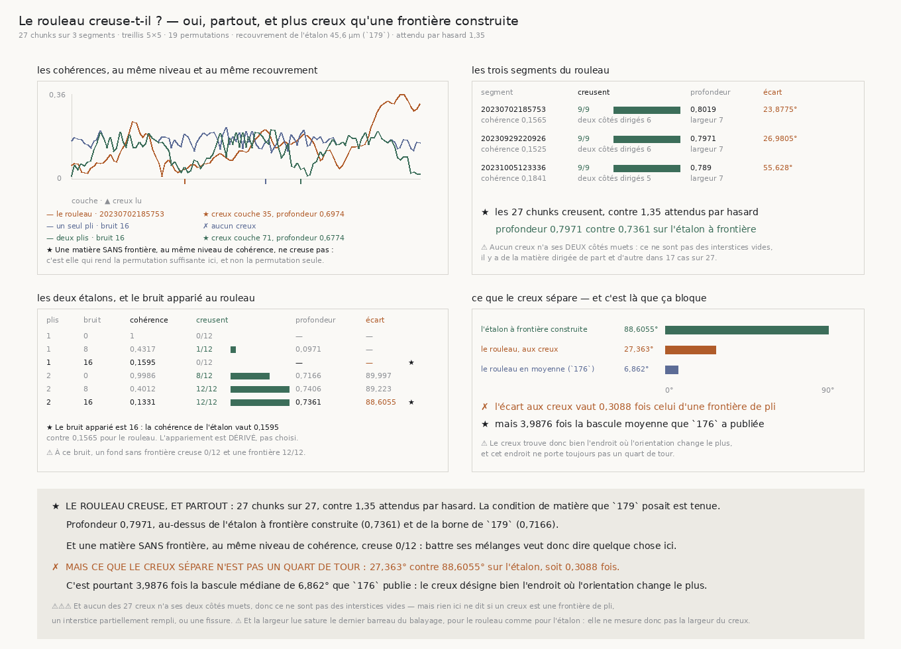

# `180` — Le rouleau creuse-t-il ?

*La condition de matière que `179` posait est tenue. Mais ce que le creux sépare n'est pas un quart
de tour.*

## 0. Pourquoi cette tranche

`179` a construit le lecteur que `R4-P31` resserrée nommait : un creux de **cohérence**, qui ne passe
pas par le tour accumulé, donc qui n'est pas soumis à l'échange que `178` a mesuré. Il tient — creux
sur la frontière construite aux douze décalages, domaine jusqu'au bruit seize de `156`, contrôle vide
muet, liberté de la largeur payée par une statistique de famille.

⚠⚠⚠ Mais il était conditionné à une propriété de la **matière** que rien n'avait mesurée : les deux
plis doivent se recouvrir sur **0,5278** fois l'épaisseur d'un pli. À recouvrement nul la cohérence
vaut 1,0000 partout et il n'y a rien à lire. `R4-P32` demande cette mesure ; c'est celle-ci.

## 1. Le piège propre à cette tranche, et il est nouveau

Sur une matière **construite**, une permutation des couches est un contrôle suffisant : elle conserve
le multiensemble et détruit l'ordre. Sur une matière **réelle**, la cohérence est **autocorrélée** —
deux couches voisines se ressemblent parce que le volume est lisse — donc n'importe quelle ondulation
bat ses mélanges, et « le creux dépasse toutes ses permutations » pourrait ne vouloir dire que « la
cohérence est lisse ».

⭐⭐⭐⭐ **La permutation est ici NÉCESSAIRE ET NON SUFFISANTE**, et ce qui la complète est un
**étalon sans frontière** lu par le même chemin : une feuille d'**un seul** pli, au même
recouvrement, au même bruit. Ce que ce matériau rend est ce qu'une matière lisse et sans frontière
peut produire toute seule, et le rouleau se compare à **lui** autant qu'au hasard.

⚠⚠ Et le bruit de comparaison est **dérivé**, pas choisi : on retient le barreau de l'échelle de
`156` dont la cohérence médiane est la plus proche de celle du rouleau. Comparer une matière dont la
cohérence vaut un à un rouleau dont elle vaut un sixième serait comparer deux régimes, pas deux
matières. L'appariement se fait sur l'étalon **sans** frontière, parce que c'est le **fond** qui doit
ressembler à celui du rouleau.

## 2. Ce que le rouleau rend

Le chemin est exactement celui de `176`, appelé et non recopié : mêmes volumes dans l'ordre du dépôt,
même treillis régulier **5 × 5**, même filtre du producteur — plancher de cohérence **0,15** et un
quart des couches texturées. Les étalons sont lus au recouvrement que `179` a encadré, **45,6** µm,
relu de sa mesure et non retapé.

| segment | chunks lus | creusent | cohérence | profondeur | largeur | deux côtés dirigés | écart |
|---|---|---|---|---|---|---|---|
| 20230702185753 | 9 / 25 | **9 / 9** | 0,1565 | 0,8019 | 7 | 6 | 23,8775° |
| 20230929220926 | 9 / 25 | **9 / 9** | 0,1525 | 0,7971 | 7 | 6 | 26,9805° |
| 20231005123336 | 9 / 25 | **9 / 9** | 0,1841 | 0,789 | 7 | 5 | 55,628° |

⭐⭐⭐⭐ **Les 27 chunks creusent, contre 1,35 attendus par hasard** avec dix-neuf permutations. La
profondeur médiane vaut **0,7971**, c'est-à-dire **au-dessus** de ce que rend l'étalon à frontière
construite (**0,7361**) et au-dessus de la borne que `179` a encadrée (**0,7166**).

## 3. Les deux étalons, et le bruit apparié

| plis | bruit | cohérence | creusent | profondeur | écart |
|---|---|---|---|---|---|
| 1 | 0 | 1 | 0/12 | — | — |
| 1 | 8 | 0,4317 | 1/12 | 0,0971 | — |
| **1** | **16** | **0,1595** | **0/12** | — | — |
| 2 | 0 | 0,9986 | 8/12 | 0,7166 | 89,997° |
| 2 | 8 | 0,4012 | 12/12 | 0,7406 | 89,223° |
| **2** | **16** | **0,1331** | **12/12** | **0,7361** | **88,6055°** |

Le bruit apparié est **16** : la cohérence de l'étalon sans frontière y vaut **0,1595** contre
**0,1565** pour le rouleau. À ce bruit, un fond sans frontière creuse **0** fois sur douze et une
frontière **12** fois sur douze.

⭐ **C'est cet écart-là qui rend la permutation suffisante ici**, et il est mesuré et non affirmé :
une matière aussi peu cohérente que le rouleau, aussi lisse, mais **sans** frontière, ne creuse pas.

## 4. Ce que le creux sépare

Un creux de cohérence dit qu'il se passe quelque chose ; il ne dit pas **quoi**. Deux causes le
produisent et elles ne sont pas la même chose : une **frontière de pli** dans une feuille, où deux
directions se recouvrent et où les deux côtés restent **dirigés** ; et l'**interstice** entre deux
feuilles, où il n'y a pas de matière, donc pas de texture, donc aucune direction d'aucun côté. `14`
§3 note déjà que l'orientation devient erratique là où la cohérence s'effondre.

On lit donc, de part et d'autre de chaque creux, si la matière est **dirigée** au sens de `174` —
résultante au-dessus de `1/√n`, borne dérivée — et l'écart entre les deux directions, en angle
doublé, donc dans [0, 90].

⭐ **Aucun des 27 creux n'a ses deux côtés muets**, et **17** sur 27 en ont deux dirigés : ce ne sont
pas des interstices vides, il y a de la matière dirigée de part et d'autre.

✗ **Mais l'écart médian aux creux vaut 27,363°**, contre **88,6055°** sur l'étalon à frontière
construite lu au même bruit — soit **0,3088** fois. Ce n'est pas un quart de tour, donc ce n'est pas
la frontière recto/verso que `14` §1 décrit.

⭐ **C'est pourtant 3,9876 fois la bascule médiane de 6,862°** que `176` publie sur le même rouleau.
Le creux désigne donc bien l'endroit où l'orientation change **le plus** : ce que `176` lisait en
moyenne sur une fenêtre, cette tranche le localise, et l'écart y est quatre fois plus grand.

## 5. Ce que cette tranche ne dit pas

⚠⚠⚠ **Rien ici ne dit de quoi une frontière est faite.** Un creux dont les deux côtés sont dirigés
et séparés de vingt-sept degrés peut être une frontière de pli dont les deux plis ne sont pas à angle
droit, un interstice partiellement rempli, ou une fissure. La question est **mesurable** et sa forme
est dérivée : une frontière de pli se répète tous les **36** couches, un interstice tous les **72**,
et `175` mesure que les 109 couches en portent **3,024 plis**. C'est l'**espacement** des creux qui
sépare les deux causes, et ce lecteur n'en rend qu'un par chunk.

⚠⚠ **La largeur lue sature le dernier barreau du balayage** — **7** pour le rouleau comme pour
l'étalon au bruit apparié. Une valeur qui bute sur la borne supérieure de son échelle n'est pas une
mesure de cette valeur : elle dit seulement que le creux est au moins aussi large. La coïncidence des
deux largeurs n'est donc pas un accord, et elle n'est pas publiée comme tel.

⚠ La profondeur du rouleau **dépasse** celle de l'étalon à frontière. Cela peut vouloir dire que le
recouvrement réel est plus épais que la borne de `179`, ou que la cause du creux est plus radicale
qu'un recouvrement de deux plis. Cette tranche ne tranche pas entre les deux.

⚠ Et la limite héritée de `177` tient, que ni `179` ni cette tranche ne lèvent : une rotation lente
de la **matière** et une rotation lente de l'**instrument** le long de la spire rendent la même
courbe.

## 6. Ce qui est ouvert

`R4-P32` **est répondue** : le rouleau creuse, partout, plus profond qu'une frontière construite, et
une matière sans frontière au même niveau ne creuse pas. La condition de matière que `179` posait est
tenue, donc la lecture jointe de `179` est utilisable sur ce rouleau.

`R4-P33` **s'ouvre**, et elle est concrète : **de quoi une frontière du rouleau est-elle faite ?**
L'écart de vingt-sept degrés n'est ni le quart de tour d'un pli, ni les six degrés que `176` lisait
en moyenne. Ce qui sépare les causes est l'**espacement** des creux — trente-six couches pour un
pli, soixante-douze pour un interstice — et la mesure demande un lecteur qui rende **plusieurs**
creux par chunk, avec la liberté correspondante payée comme `179` a payé celle de la largeur.
