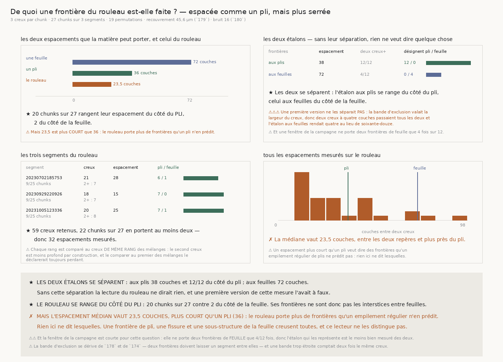

# `181` — De quoi une frontière du rouleau est-elle faite ?

*Espacée comme un pli, et pas comme un interstice. Mais plus serrée qu'un pli.*

## 0. Pourquoi cette tranche

`180` a mesuré que le rouleau **creuse**, partout, plus profond qu'une frontière construite, et
qu'une matière sans frontière au même niveau de cohérence ne creuse pas. Mais l'écart que le creux
sépare vaut **27,363°**, trois dixièmes d'un quart de tour : trois causes restaient possibles sans
qu'aucune soit écartée — une frontière de pli dont les deux plis ne sont pas à angle droit, un
interstice partiellement rempli, une fissure. Seul l'interstice **vide** était exclu, parce qu'aucun
creux n'a ses deux côtés muets.

⭐⭐⭐⭐ Ce qui sépare les causes est l'**espacement**, et il est dérivé : une frontière de pli se
répète tous les `pas/2` micromètres, un interstice entre deux feuilles tous les `pas`. À 2,4 µm cela
fait **36** couches contre **72**. Un lecteur qui ne rend qu'un creux par chunk ne peut pas trancher.

## 1. Plusieurs creux, et la liberté payée

La recherche est **séquentielle** : le creux le plus profond, puis le suivant hors de sa bande, et
ainsi de suite.

⚠⚠⚠ **La liberté d'en chercher plusieurs se paie, exactement comme `179` a payé celle de la
largeur.** Chercher un second creux après avoir retiré le premier est une seconde chance, et une
permutation appliquée creux par creux ne la price pas. Ce qui la price est de faire subir à **chaque**
mélange la **même** recherche séquentielle, et de comparer le k-ième creux réel au k-ième creux de
chaque mélange. Le mélange a alors exactement le même nombre d'occasions, au même rang.

⚠⚠ Le rang est ce qui rend la comparaison honnête : le second creux d'une courbe est **déjà** moins
profond que le premier par construction. Le comparer au **premier** creux des mélanges le déclarerait
toujours perdant ; ne le comparer à rien le déclarerait toujours gagnant.

## 2. La bande d'exclusion, et le défaut qu'elle a d'abord porté

⚠⚠⚠ **Une première version prenait la bande trop étroite** — la largeur du creux trouvé — donc deux
creux à **quatre** couches d'écart passaient tous les deux. Conséquence mesurée : l'étalon dont les
frontières sont aux **feuilles** rendait un espacement médian de **4** au lieu de 72, et se rangeait
du côté du pli 7 fois sur 12. **Le contrôle a échoué**, donc la lecture du rouleau ne voulait rien
dire, et elle n'a pas été publiée.

La règle réparée se dérive de `178` et de `174` : deux frontières ne séparent deux segments que s'il
reste `COUCHES_MINIMALES` couches **entre** elles, et `174` refuse une tranche plus courte. La bande
compte donc la demi-largeur du creux pris, le segment minimal, et la demi-largeur la plus grande de
l'échelle — la largeur du creux suivant n'étant pas connue au moment où on l'interdit.

## 3. Les deux étalons, et ils se séparent

Les deux sont de la même famille et ne diffèrent que par l'espacement de leurs frontières : `plis=2`
porte une frontière tous les demi-pas ; `plis=1` à feuilles d'angles indépendants n'en porte qu'aux
feuilles. Même recouvrement — **45,6** µm, relu de `179` — même bruit — **16**, relu de `180` — même
contraste, même lecteur.

| frontières | espacement médian | cellules à deux creux | désignent pli / feuille |
|---|---|---|---|
| aux plis | **38,0** | 12 / 12 | **12** / 0 |
| aux feuilles | **72,0** | 4 / 12 | 0 / **4** |

⭐ **Les deux se séparent**, et c'est ce contrôle qui rend la suite lisible.

⚠⚠ Et il porte une limite mesurée : une fenêtre de la campagne ne contient **deux** frontières de
feuille que **4** fois sur 12. Cent neuf couches valent **1,512** feuille, donc l'étalon qui
représente l'interstice est structurellement le moins bien mesuré des deux.

## 4. Ce que le rouleau rend

| segment | chunks | creux retenus | à deux creux ou plus | espacement médian | pli / feuille |
|---|---|---|---|---|---|
| 20230702185753 | 9 / 25 | 21 | 7 | 28,0 | 6 / 1 |
| 20230929220926 | 9 / 25 | 18 | 7 | 15,0 | 7 / 0 |
| 20231005123336 | 9 / 25 | 20 | 8 | 25,0 | 7 / 1 |

⭐⭐⭐⭐ **Le rouleau se range du côté du PLI** : **20** chunks sur 27 rangent leur espacement du côté
du pli, **2** du côté de la feuille. Ses frontières ne sont donc **pas** les interstices entre
feuilles, et la cause qui restait la plus probable après `180` est écartée.

✗ **Mais l'espacement médian vaut 23,5 couches**, plus court qu'un pli (**36**) : le rouleau porte
**plus** de frontières qu'un empilement régulier de plis n'en prédit. **59** creux retenus sur 27
chunks, dont **22** en portent au moins deux, pour **32** espacements mesurés.

## 5. Ce que cette tranche ne dit pas

⚠⚠⚠ **Rien ici ne dit lesquelles sont les frontières en trop.** Une frontière de pli, une fissure,
une sous-structure de la feuille creusent toutes la cohérence, et ce lecteur ne les distingue pas. Ce
qu'il dit est plus étroit et plus sûr : l'espacement du rouleau est du côté du pli et pas du côté de
l'interstice, et il est plus serré que le pli.

⚠⚠ La fenêtre de la campagne est **courte pour cette question**, et le tableau le dit : l'étalon aux
feuilles n'a que quatre cellules à deux creux. Une réponse « ce n'est pas un interstice » repose donc
sur le moins bien mesuré des deux étalons, ce qui la rend prudente et non définitive.

⚠ Et les limites héritées tiennent : la largeur du creux sature toujours le dernier barreau du
balayage (`180`), et une rotation lente de la matière ne se sépare toujours pas d'une rotation lente
de l'instrument (`177`).

## 6. Ce qui est ouvert

`R4-P33` **se resserre** : ce n'est pas un interstice entre feuilles, c'est espacé comme un pli, et
c'est **plus serré** qu'un pli. La question devient donc : **d'où viennent les frontières en trop ?**
Et elle a une forme dérivée — l'espacement médian vaut **23,5** couches pour un pli de **36**, soit à
peu près **deux tiers**. Une sous-structure régulière à ce pas-là serait une propriété de la feuille
que `14` §1 ne décrit pas ; un mélange de vraies frontières et de fissures ne le serait pas. Les
séparer demande de mesurer si les espacements sont **groupés** autour d'une valeur ou **étalés**, ce
que la distribution mesurée ici permet de poser mais que cette tranche ne tranche pas.
