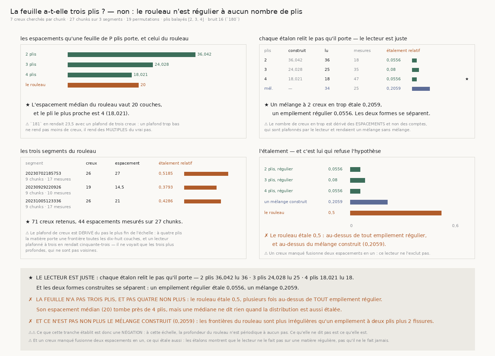

# `182` — La feuille a-t-elle trois plis ?

*Non. Et le rouleau n'est régulier à aucun nombre de plis.*

## 0. Pourquoi cette tranche

`181` a mesuré que les creux du rouleau sont espacés comme des **plis** et non comme des interstices,
mais que leur espacement médian vaut **23,5** couches pour un pli de **36**. Le rouleau porte donc
plus de frontières qu'un empilement régulier de deux plis n'en prédit.

⭐⭐⭐⭐ **Et le chiffre nomme lui-même une hypothèse concrète.** Une feuille de `P` plis porte une
frontière tous les `pas/P/voxel` couches : **36,042** à deux plis, **24,028** à trois, **18,021** à
quatre. Vingt-trois et demi tombe presque exactement sur trois. `14` §1 décrit une feuille de **deux**
plis ; si le rouleau en portait trois, l'excès mesuré par `181` cesserait d'être inexpliqué et
deviendrait une propriété de la matière.

⚠⚠⚠ **Mais une médiane ne suffit pas.** Un empilement **régulier** à trois plis et un **mélange** de
vraies frontières et de fissures peuvent rendre la même médiane : ce qui les sépare est la **forme**
de la distribution — groupée, ou étalée.

## 1. Un plafond trop bas ne rend pas moins de creux, il rend de faux espacements

⚠⚠⚠ La première version cherchait **trois** creux par chunk, et la mesure l'a réfutée sans
ambiguïté : sur la matière à **quatre** plis, qui porte une frontière toutes les **18** couches, le
lecteur rendait un espacement de **53**. Il ne voit que les trois plus profondes, qui ne sont pas
voisines, donc il mesure des **multiples** du vrai pas.

Le plafond se dérive donc du pas le plus fin de l'échelle : une fenêtre de `couches` couches porte
`couches / pas` frontières, plus une pour une fenêtre décalée. Cela donne **7**.

⚠⚠ **Et le nombre de creux surnuméraires du mélange se dérive des ESPACEMENTS, pas des comptes.** Une
première version le tirait de l'écart entre le nombre de creux du rouleau et celui d'un empilement à
deux plis — or ces deux comptes sont **plafonnés** par le lecteur, donc leur différence l'est aussi.
Elle rendait **un** seul creux en trop, et l'étalon censé représenter un mélange étalait alors
**moins** qu'un empilement régulier : le contrôle ne contrôlait rien.

⚠ Ce qui n'est pas choisi non plus dans ce mélange : la **profondeur** des creux ajoutés (**0,7971**)
et leur **largeur** (**7**) sont relues de ce que `180` a mesuré sur le rouleau. Seules leurs
positions sont tirées au hasard, et c'est exactement l'hypothèse mise à l'épreuve — une fissure n'a
pas de raison de tomber à un pas régulier.

## 2. L'étalement, et pourquoi il est rapporté à la médiane

$$\text{étalement relatif} = \frac{\mathrm{médiane}\;|x_i - \mathrm{médiane}(x)|}{\mathrm{médiane}(x)}$$

⭐ **Rapporté à la médiane, donc sans unité** : il se compare entre matières qui n'ont pas le même
pas. Un empilement régulier étale peu quel que soit son pas ; un mélange étale beaucoup.

⚠ **L'écart absolu médian et non l'écart-type** : une seule fissure très éloignée ferait exploser un
écart-type, et ce qu'on veut savoir est si la **masse** de la distribution est groupée.

## 3. Le lecteur est juste

| plis | espacement construit | espacement lu | mesures | étalement relatif |
|---|---|---|---|---|
| 2 | 36,042 | **36** | 18 | 0,0556 |
| 3 | 24,028 | **25** | 35 | 0,08 |
| 4 | 18,021 | **18** | 47 | 0,0556 |
| un mélange (2 creux en trop) | — | 34 | 25 | **0,2059** |

⭐ **Chaque étalon relit le pas qu'il porte**, et les deux formes construites **se séparent** :
régulier **0,0556**, mélangé **0,2059**. Sans cette séparation, comparer le rouleau à l'un ou à
l'autre ne voudrait rien dire.

## 4. Ce que le rouleau rend

| segment | creux retenus | espacement médian | étalement relatif |
|---|---|---|---|
| 20230702185753 | 26 | 27,0 | **0,5185** |
| 20230929220926 | 19 | 14,5 | **0,3793** |
| 20231005123336 | 26 | 21,0 | **0,4286** |

**71** creux retenus, **44** espacements mesurés sur **27** chunks. Espacement médian **20,0**,
étalement relatif **0,5**.

✗ **La feuille n'a pas trois plis, et pas quatre non plus.** L'espacement médian tombe près de quatre
plis, mais le rouleau étale **0,5** — plusieurs fois au-dessus de **tout** empilement régulier. Une
médiane ne dit rien quand la distribution est aussi étalée.

✗ **Et ce n'est pas non plus le mélange construit** (**0,2059**) : les frontières du rouleau sont
plus irrégulières qu'un empilement à deux plis plus deux fissures.

## 5. Ce que cette tranche ne dit pas

⚠⚠ **Ce qu'elle établit est une NÉGATION.** À cette échelle, la profondeur du rouleau n'est
**périodique à aucun pas**. Ce qu'elle ne dit pas est ce qu'elle **est**.

⚠ **Un creux manqué fusionne deux espacements en un**, ce qui étale aussi. Les étalons montrent que
le lecteur ne le fait pas sur une matière régulière ; ils ne montrent pas qu'il ne le fait jamais sur
une matière dont les frontières n'ont pas toutes la même profondeur.

⚠ Les limites héritées tiennent : la largeur du creux sature toujours le dernier barreau du balayage
(`180`), et une rotation lente de la matière ne se sépare toujours pas d'une rotation lente de
l'instrument (`177`).

## 6. Ce qui est ouvert

`R4-P33` **se resserre une dernière fois sur cette voie** : la question n'est plus « quel pas », elle
est de savoir si des frontières **irrégulières** peuvent encore servir de **repères** pour le
déroulage — ce que le graal demande — ou si leur irrégularité les en empêche. Un repère n'a pas
besoin d'être périodique ; il a besoin d'être **retrouvable d'une spire à la suivante**. C'est une
question sur la **correspondance latérale** des creux, et non plus sur leur espacement en profondeur.
