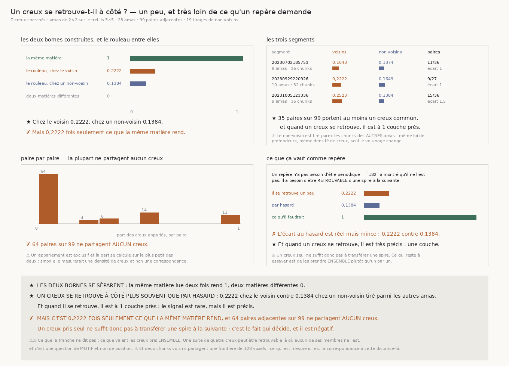

# `183` — Un creux se retrouve-t-il à côté ?

*Un peu, et très loin de ce qu'un repère demande.*

## 0. Pourquoi cette tranche

`182` a établi une négation double : à cette échelle, la profondeur du rouleau n'est **périodique à
aucun pas**, et ce n'est pas non plus un empilement régulier plus quelques fissures. Les creux
existent, ils sont profonds (`180`), ils séparent de la matière dirigée des deux côtés — mais leur
espacement est irrégulier.

⭐⭐⭐⭐ **Et c'est à ce moment que la question du graal reprend la main.** Ce qui remplace l'humain au
transfert de spire à spire est un **repère**, et un repère n'a pas besoin d'être périodique : il a
besoin d'être **retrouvable**. Un creux à la couche quarante d'un chunk vaut comme repère si le chunk
d'à côté en porte un à la couche quarante aussi.

⚠⚠⚠ C'est une question sur la correspondance **latérale**, et **rien** dans toute la chaîne
`172`–`182` ne l'a posée : tout y a été lu chunk par chunk, en profondeur.

## 1. Il faut de vrais voisins, et le contrôle est le non-voisin

⚠⚠ Le treillis de `176` sépare ses chunks de dizaines de positions : deux d'entre eux ne sont voisins
de rien, et une question latérale n'a alors **aucune paire** à mesurer. C'est exactement le défaut
que `fiber_orientation.survey` avait déjà dû réparer, et pour la même raison. On prend donc des
**amas** de deux par deux chunks **adjacents**, un par position du treillis — les positions restent
celles où toute la chaîne a lu.

⚠⚠⚠ **Le contrôle apparié est la correspondance avec un chunk qui n'est PAS voisin.** Deux chunks
quelconques portent chacun quelques creux répartis sur cent-neuf couches, donc ils en ont forcément
quelques-uns à la même profondeur par hasard : sans ce contrôle, « les voisins se correspondent » se
lirait comme un résultat alors que c'est de l'arithmétique. Le non-voisin est tiré parmi les chunks
des **autres** amas, donc il a la même loi de profondeurs et la même densité de creux — ce qui change
entre les deux mesures est le **voisinage**, et rien d'autre.

⚠⚠ **L'appariement est exclusif et la part se calcule sur le plus petit des deux.** Sans cela, un
chunk qui porte beaucoup de creux apparierait tout ce que son voisin lui présente, et la part
mesurerait une **densité** au lieu d'une correspondance.

⚠ La tolérance est dérivée du creux : une demi-largeur plus une couche, la règle que `180` emploie
déjà pour dire qu'un creux tombe sur une frontière construite.

## 2. Les deux bornes, et le défaut qu'elles ont d'abord porté

| | part appariée |
|---|---|
| la même matière, lue deux fois | **1** |
| deux matières différentes | **0** |

⚠⚠⚠ **Une première version rendait 1 des DEUX côtés.** La seconde fenêtre était décalée d'une
**demi-feuille**, ce qui remet les frontières de pli exactement aux mêmes couches : « matières
différentes » rendait alors une correspondance parfaite et le contrôle ne contrôlait rien. Un
**tiers** de pli les déplace de douze couches, trois fois la tolérance.

⚠ Les deux fenêtres « de la même matière » diffèrent par leur **bruit** — graines différentes — donc
la correspondance mesurée n'est pas une tautologie : elle dit ce que le lecteur retrouve quand la
matière est la même mais que la lecture ne l'est pas.

## 3. Ce que le rouleau rend

| segment | amas | chunks | voisins | non-voisins | paires qui se correspondent | écart |
|---|---|---|---|---|---|---|
| 20230702185753 | 9 | 36 | **0,1643** | 0,1374 | 11 / 36 | 1 |
| 20230929220926 | 10 | 32 | **0,2222** | 0,1649 | 9 / 27 | 1 |
| 20231005123336 | 9 | 36 | **0,2523** | 0,1384 | 15 / 36 | 1,5 |

⭐ **Un creux se retrouve chez le voisin plus souvent que par hasard** : **0,2222** contre
**0,1384**. Et quand il se retrouve, il est à **1** couche près — le signal est rare, mais il est
**précis**.

✗ **Mais c'est 0,2222 fois seulement ce que la même matière rend**, et **64** paires adjacentes sur
**99** ne partagent **aucun** creux.

## 4. Ce que ça vaut comme repère

Un repère n'a pas besoin d'être périodique — `182` a montré qu'il ne l'est pas. Il a besoin d'être
retrouvable d'une spire à la suivante.

⚠⚠⚠ **Un creux pris seul ne suffit donc pas à transférer une spire.** L'écart au hasard est réel, le
contrôle apparié le montre, mais il est mince, et la majorité des paires voisines ne partagent rien.

## 5. Ce que cette tranche ne dit pas

⚠⚠ **Ce que valent les creux pris ENSEMBLE.** Une suite de quatre creux peut être retrouvable là où
aucun de ses membres ne l'est : c'est une question de **motif** et non de position, et elle se
contrôle par la même permutation, appliquée cette fois à l'**ordre** des creux dans la suite.

⚠ **Et la distance mesurée est celle de deux chunks voisins**, soit une frontière de 128 voxels.
Rien ici ne dit ce que la correspondance vaut à une autre distance — ni plus près, ni plus loin.

⚠ Les limites héritées tiennent : la largeur du creux sature toujours le dernier barreau du balayage
(`180`), et une rotation lente de la matière ne se sépare toujours pas d'une rotation lente de
l'instrument (`177`).

## 6. Ce qui est ouvert

`R4-P33` **se resserre sur ce que la mesure nomme elle-même** : prendre les creux **ensemble** plutôt
qu'un par un. C'est le dernier degré de liberté que cette famille d'observables offre, et il est
contrôlable exactement comme les précédents — par une permutation, appliquée à l'**ordre** des creux
plutôt qu'à celui des couches.
