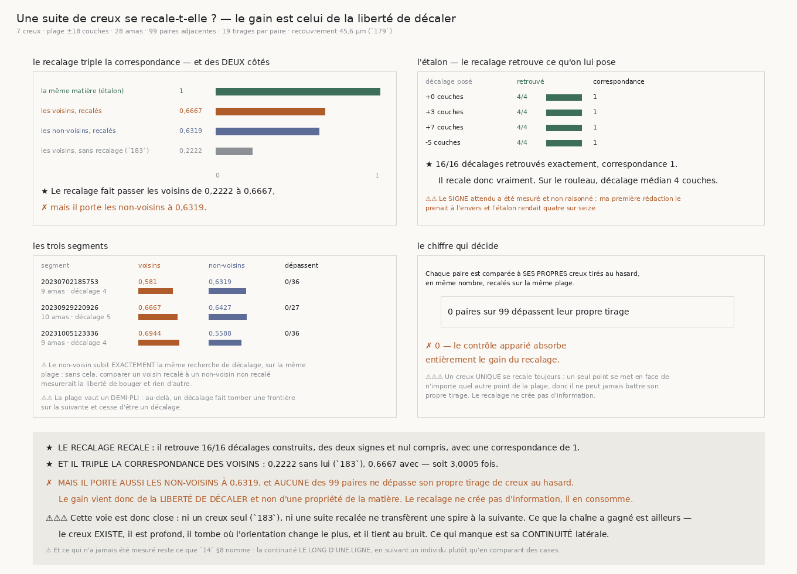

# `184` — Une suite de creux se recale-t-elle ?

*Le recalage marche. Et le gain qu'il apporte est celui de la liberté de décaler.*

## 0. Pourquoi cette tranche, et c'est la question du graal

`183` a mesuré qu'un creux pris **seul** se retrouve chez le chunk voisin plus souvent que par
hasard — **0,2222** contre **0,1384** — mais bien trop rarement pour servir de repère : soixante-
quatre paires adjacentes sur quatre-vingt-dix-neuf ne partagent aucun creux. `R4-P33` nommait ce qui
restait : prendre les creux **ensemble**.

⭐⭐⭐⭐ Et il y a une raison physique de penser que c'est ça qui manquait. Deux chunks voisins ne sont
pas à la même profondeur dans la feuille : la nappe monte et descend, donc tout l'empilement de l'un
peut être **décalé** par rapport à celui de l'autre. Un appariement position par position meurt sur un
décalage global ; un appariement qui **cherche** le décalage ne meurt pas. Et chercher ce décalage
**est** l'opération du transfert de spire à spire — c'est exactement ce que l'humain fait à la main.

## 1. La liberté de décaler se paie

⚠⚠⚠ Comme `179` a payé la largeur et `181` le rang. Le contrôle apparié — le non-voisin — subit
**exactement** la même recherche de décalage, sur la même plage, avec la même tolérance. Et chaque
paire est en plus comparée à **ses propres** creux tirés au hasard, en même nombre, recalés de la
même façon. Sans cela, « les voisins se recalent » ne dirait que « on a le droit de bouger ».

⚠⚠ **La plage est dérivée** : au-delà d'un **demi-pli**, un décalage ferait tomber une frontière sur
la suivante — il cesserait d'être un décalage pour devenir un aliasing. Elle vaut donc **±18**
couches. Le recouvrement des étalons est celui que `179` a encadré, **45,6** µm, et le bruit celui
que `180` a apparié — tous deux relus de leur mesure et non retapés.

⚠⚠⚠ **Et les égalités se tranchent par l'écart résiduel, pas par le plus petit décalage.** Une
première version faisait l'inverse : la tolérance vaut quatre couches, donc un décalage de trois est
déjà absorbé par un décalage **nul**, qui l'emportait à correspondance égale. Le recalage n'aurait
pas retrouvé un décalage construit plus petit que sa propre tolérance.

## 2. L'étalon : le recalage recale

| décalage posé | retrouvé | correspondance |
|---|---|---|
| +0 couches | **4 / 4** | 1 |
| +3 couches | **4 / 4** | 1 |
| +7 couches | **4 / 4** | 1 |
| −5 couches | **4 / 4** | 1 |

⭐ **16 sur 16**, des deux signes et nul compris.

⚠⚠⚠ **Le signe attendu a été mesuré et non raisonné.** Ma première rédaction le prenait à l'envers
et l'étalon rendait **4/16** : décaler la fenêtre vers le fond place les creux **plus haut** dedans,
donc il faut **ajouter** le décalage pour les remettre en face. C'est une sonde qui l'a dit.

## 3. Ce que le rouleau rend

| segment | voisins recalés | non-voisins recalés | dépassent leur tirage | décalage |
|---|---|---|---|---|
| 20230702185753 | 0,581 | 0,6319 | **0 / 36** | 4 |
| 20230929220926 | 0,6667 | 0,6427 | **0 / 27** | 5 |
| 20231005123336 | 0,6944 | 0,5588 | **0 / 36** | 4 |

★ **Le recalage triple la correspondance des voisins** : **0,2222** sans lui (`183`), **0,6667**
avec — soit **3,0005** fois. Le décalage médian trouvé vaut **4** couches.

✗ **Mais il porte aussi les non-voisins à 0,6319**, et **aucune** des **99** paires adjacentes ne
dépasse son propre tirage de creux au hasard.

## 4. Ce que ça veut dire

⚠⚠⚠ **Le recalage ne crée pas d'information, il en consomme.** La mesure le dit d'une façon qu'aucune
rédaction ne peut adoucir : un creux **unique** se recale **toujours** — un seul point se met en face
de n'importe quel autre point de la plage — donc il ne peut **jamais** battre son propre tirage. Ce
que le triplement mesure est la taille de la plage, pas la ressemblance des colonnes.

⭐ **La voie est donc close.** Ni un creux seul (`183`), ni une suite recalée ne transfèrent une spire
à la suivante.

## 5. Ce que la chaîne a gagné, et qui reste acquis

Le creux de cohérence **existe** sur le vrai rouleau (`180`) : vingt-sept chunks sur vingt-sept
contre 1,35 attendus par hasard, plus profond qu'une frontière construite, et une matière sans
frontière au même niveau ne creuse pas. Il tombe là où l'orientation change **le plus** — quatre fois
la bascule moyenne de `176`. Il tient jusqu'au bruit **16** de `156` (`179`). Ce n'est ni un
interstice entre feuilles (`181`), ni un empilement périodique à quelque pas que ce soit (`182`).

**Ce qui manque est sa continuité latérale**, et c'est ce que `183` et `184` viennent de mesurer et
de refuser.

## 6. Ce qui est ouvert

`R4-P33` **se ferme sur cette famille d'observables**. Ce qui n'a jamais été mesuré reste ce que
`14` §8 nomme depuis le début : la continuité **le long d'une ligne**, en **suivant un individu**
plutôt qu'en comparant des cases voisines. ⚠⚠⚠ Et l'objection de `128` tient toujours et doit être
portée avec la piste : une **fréquence** donne une **phase**, pas une **identité** — ce qui vaut est
de suivre un individu, pas de retrouver un motif.
