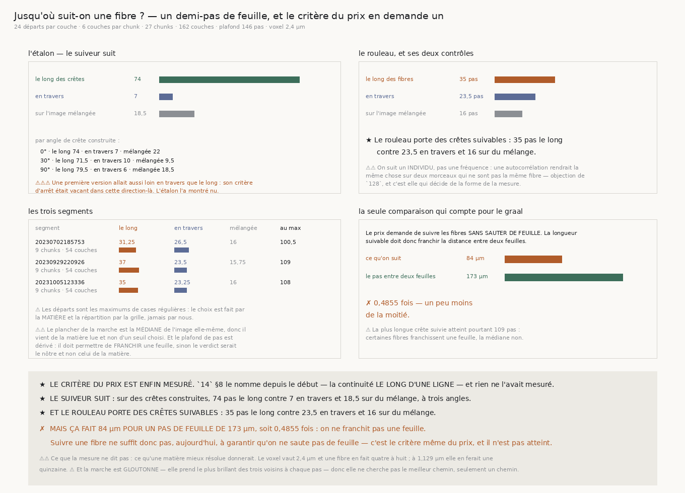

# `185` — Jusqu'où suit-on une fibre ?

*Un demi-pas de feuille. Et le critère du prix en demande un.*

## 0. Pourquoi cette tranche, et elle porte le critère du prix

Le Grand Prize fait de la continuité des fibres **le** critère visuel : *« follow horizontal papyrus
fibers... and not jumping between sheets »*. `14` §8 nomme la bonne forme depuis le début — mesurer
la continuité **le long d'une ligne**, et non la dispersion entre carrés voisins ni la bascule en
profondeur — et **rien** ne l'avait mesurée.

`184` vient de fermer la voie des creux : ni un creux seul ni une suite recalée ne transfèrent une
spire. Ce qui reste est cette piste-là.

⚠⚠⚠ **Et l'objection de `128` décide de la forme.** Une **fréquence** donne une **phase**, pas une
**identité** : un spectre ou une autocorrélation rendraient la même chose sur deux morceaux de
matière qui ne sont pas la même fibre. Ce qui vaut est de **suivre un individu** — partir d'une
crête, avancer le long d'elle, et compter jusqu'où on tient.

## 1. Le suiveur, et le critère vacant qu'il portait d'abord

Le suiveur marche d'**un** voxel, se recentre sur le plus brillant des trois voisins perpendiculaires
à ±1 voxel, et mesure la **plus longue suite de pas restés au-dessus de la médiane de l'image**.

⚠⚠⚠ **Une première version s'arrêtait sur la maximalité locale dans la perpendiculaire au
déplacement, et ce critère est VACANT en travers.** En marchant le long d'une crête, cette
perpendiculaire traverse la crête et le test veut dire quelque chose ; en marchant **en travers**,
elle court **le long** d'une crête, où tout est plat — le test est satisfait partout. L'étalon l'a
montré nu : sur des crêtes horizontales le suiveur allait **aussi loin** en travers que le long.

⚠⚠ **Le plancher vient de l'image, pas de nous** : c'est sa **médiane**. Il est donc lu sur la
matière et non choisi, et la mesure ne dépend pas du contraste.

⚠ Le plafond de pas est **dérivé** : il doit permettre de **franchir** le pas entre deux feuilles,
sinon la mesure serait bornée par le plafond et le verdict serait le nôtre.

## 2. L'étalon : le suiveur suit

| | pas médians |
|---|---|
| le long des crêtes | **74** |
| en travers | **7** |
| sur l'image mélangée | **18,5** |

Et ça tient aux trois angles construits : **0°** (74 / 7 / 22), **30°** (71,5 / 10 / 9,5), **90°**
(79,5 / 6 / 18,5).

⚠ Le mélange conserve exactement l'histogramme et détruit toute structure : ce qu'il rend est ce que
la mécanique du suiveur rapporte **toute seule**.

## 3. Ce que le rouleau rend

| segment | le long | en travers | mélangée | le long au max |
|---|---|---|---|---|
| 20230702185753 | 31,25 | 26,5 | 16,0 | 100,5 |
| 20230929220926 | **37,0** | 23,5 | 15,75 | 109,0 |
| 20231005123336 | 35,0 | 23,25 | 16,0 | 108,0 |

⭐ **Le rouleau porte des crêtes suivables** : **35,0** pas le long des fibres contre **23,5** en
travers et **16,0** sur du mélange.

⚠⚠⚠ L'angle que `orientation_profile` publie est la **perpendiculaire** aux fibres (`172`) : le
convertir n'est pas un détail, suivre l'angle brut **inverserait** exactement les deux lectures que
cette tranche compare.

## 4. La seule comparaison qui compte

Le prix demande de suivre les fibres **sans sauter de feuille**. La longueur suivable doit donc
franchir la distance entre deux feuilles.

| | |
|---|---|
| ce qu'on suit | **84,0** µm |
| le pas entre deux feuilles | **173** µm |
| rapport | **0,4855** |

✗ **On ne franchit pas une feuille.** Un peu moins de la moitié.

⚠ La plus longue crête suivie atteint pourtant **109** pas : **certaines** fibres franchissent une
feuille, la médiane non.

## 5. Ce que cette tranche ne dit pas

⚠⚠ **Ce qu'une matière mieux résolue donnerait.** Le voxel vaut **2,4** µm et une fibre en fait
quatre à huit ; à **1,129** µm elle en ferait une quinzaine.

⚠ **La marche est gloutonne** : elle prend le plus brillant des trois voisins à chaque pas, donc elle
ne cherche pas le **meilleur** chemin, seulement **un** chemin. Une longueur mesurée ainsi est une
borne **inférieure** de ce qu'un suiveur plus patient obtiendrait.

⚠ Les départs sont les maximums de cases régulières : le choix est fait par la **matière** et la
répartition par la **grille**, jamais par nous.

## 6. Ce qui est ouvert

`R4-P34` **s'ouvre**, et elle est concrète et déjà outillée : une matière mieux résolue rendrait-elle
la fibre suivable sur une feuille entière ? Les volumes à **1,129** µm existent et le dépôt les
recense. ⚠⚠ **La comparaison devra se faire en micromètres et non en pas** : un voxel deux fois plus
fin double mécaniquement le nombre de pas sans rien ajouter, et publier des pas ferait lire un
changement d'unité comme un gain.
